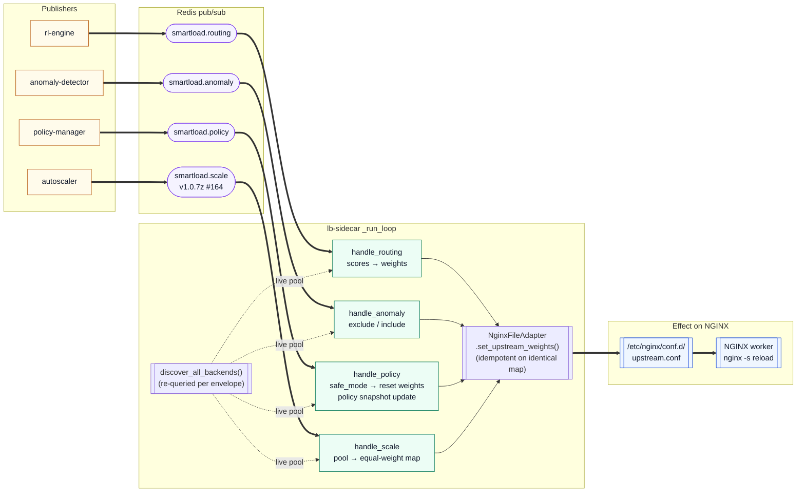
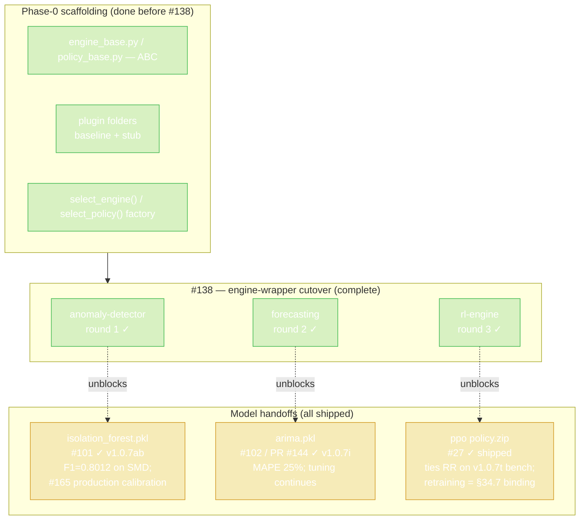
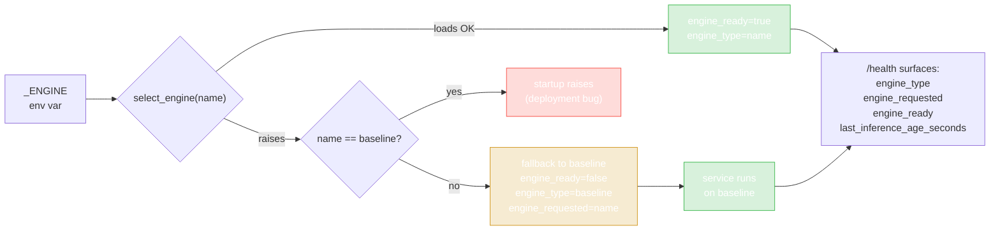
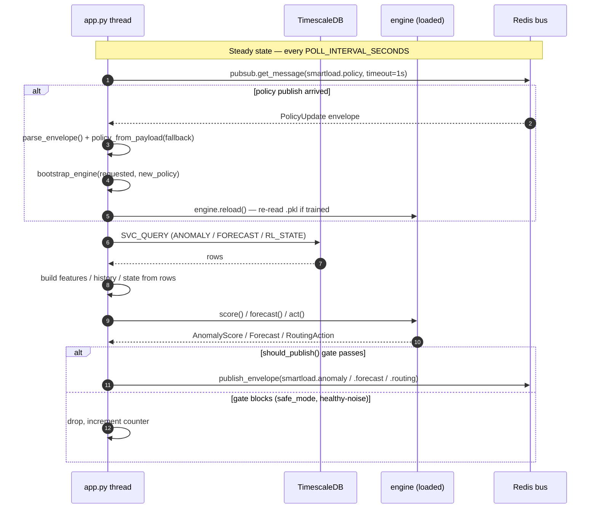
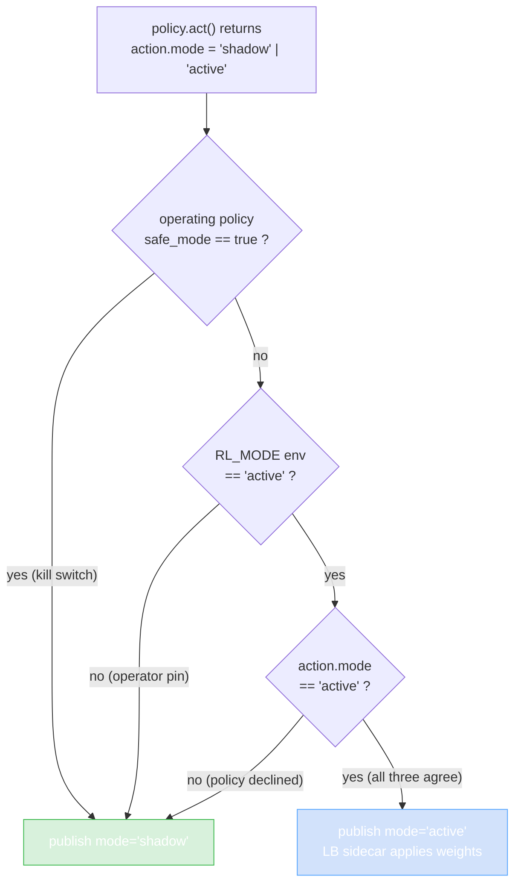
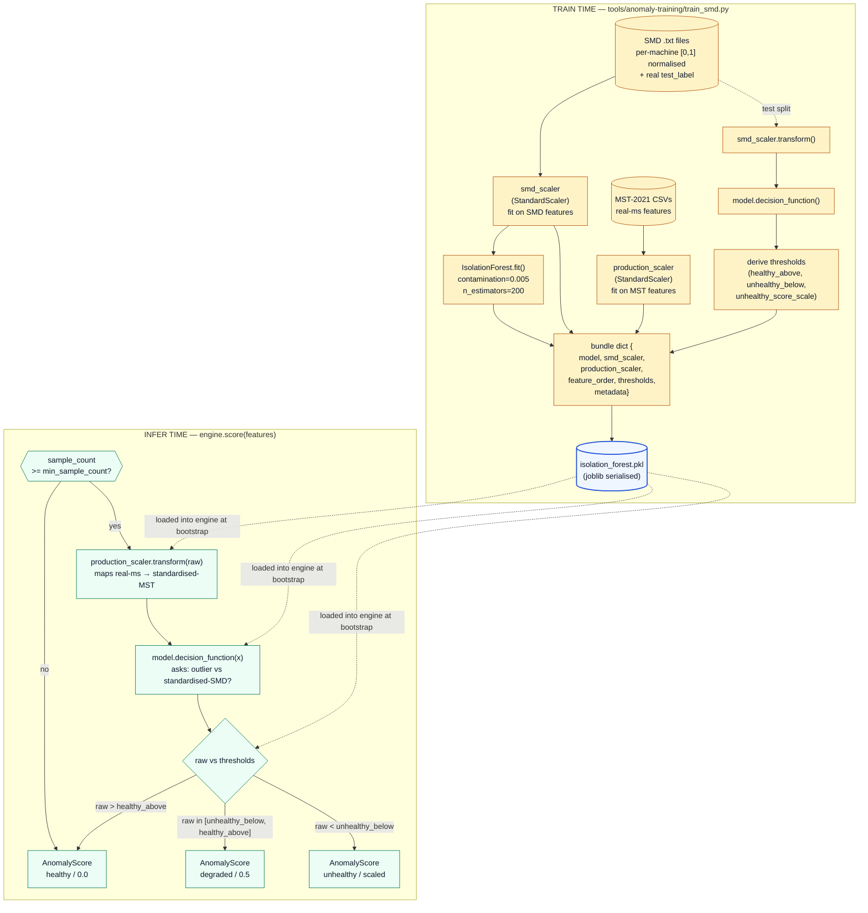

# SmartLoad — Project Walkthrough

A file-by-file tour of every service, every shared module, every infrastructure component, and the Python SDK. Each section explains what the file is, why it exists, and walks through the code with excerpts.

> Scope: `services/*`, `clients/python/*`, `infrastructure/*`. Repo-level files (root `README.md`, `docker-compose.yml`, `tests/`, `examples/`, `scripts/`, `config/`, `docs/`) are referenced where relevant but not exhaustively explained — they are mapped from the root README.

## Table of contents

- [0. How to read this document](#0-how-to-read-this-document)
- [1. System overview](#1-system-overview)
- [2. The shared layer (`services/shared/`)](#2-the-shared-layer-servicesshared)
  - [2.1 `contracts.py` — Redis envelope contracts](#21-contractspy--redis-envelope-contracts)
  - [2.2 `queries.py` — canonical SQL constants](#22-queriespy--canonical-sql-constants)
  - [2.3 `lb_adapters/` — load-balancer plugin contract](#23-lb_adapters--load-balancer-plugin-contract)
- [3. Data plane](#3-data-plane)
  - [3.1 `load-balancer` — NGINX](#31-load-balancer--nginx)
  - [3.2 `lb-otel-shipper` — log tail → OTLP](#32-lb-otel-shipper--log-tail--otlp)
  - [3.2.1 `resource-collector` — Docker stats → OTLP](#321-resource-collector--docker-stats--otlp)
  - [3.3 `telemetry` — OTLP ingest + read API](#33-telemetry--otlp-ingest--read-api)
- [4. Decision plane](#4-decision-plane)
  - [4.1 `anomaly-detector` (plugin-per-engine)](#41-anomaly-detector-plugin-per-engine)
  - [4.2 `forecasting` (plugin-per-engine)](#42-forecasting-plugin-per-engine)
  - [4.3 `rl-engine` (plugin-per-policy)](#43-rl-engine-plugin-per-policy)
  - [4.4 `autoscaler`](#44-autoscaler)
- [5. Control plane + UI](#5-control-plane--ui)
  - [5.1 `policy-manager`](#51-policy-manager)
  - [5.2 `webhook-dispatcher`](#52-webhook-dispatcher)
  - [5.3 `operator-ui/bff` (Flask)](#53-operator-uibff-flask)
  - [5.4 `operator-ui/web` (React + Vite)](#54-operator-uiweb-react--vite)
  - [5.5 `tools/demo-ui/` — developer demo harness](#55-toolsdemo-ui--developer-demo-harness)
- [6. Python SDK (`clients/python/`)](#6-python-sdk-clientspython)
- [7. Infrastructure (`infrastructure/`)](#7-infrastructure-infrastructure)

---

## 0. How to read this document

Each service section follows the same shape:

1. **What it is** — one-paragraph purpose statement.
2. **Why it exists** — the role it plays in the SmartLoad pipeline and what would break without it.
3. **Files** — a list of every file in the service.
4. **Walkthrough** — file by file, with code excerpts and explanations. Code blocks are quoted verbatim; commentary follows.

Code excerpts are **always shorter than the actual file** — the prose tells you what was elided. To read every line, open the file at the path listed.

---

## 1. System overview

### What SmartLoad is

SmartLoad is middleware that sits between client traffic and a pool of backend services. It does two things at once:

- **Routes traffic** through NGINX (the data plane).
- **Decides how to route and scale** using telemetry-driven services (the decision plane), with an operator override surface (the control plane).

### The pipeline

```
Client traffic
   │
   ▼
[load-balancer]  ── access.log ──►  [lb-otel-shipper]  ── OTLP ──►  [otel-collector]
                                                                          │
                                                                          ▼
                                                                    [telemetry]  ──► TimescaleDB
                                                                                       │
                              ┌────────────────────────────────────────────────────────┤
                              ▼                                                        ▼
                       [anomaly-detector]                                       [forecasting]
                              │                                                        │
                              │ smartload.anomaly                          smartload.forecast
                              │                                                        │
                              ▼                                                        ▼
                                              [rl-engine]    ◄── policy ──►   [autoscaler]
                                                  │                                    │
                                  smartload.routing                       smartload.scale
                                                  │                                    │
                                                  └────► (load-balancer sidecar) ◄─────┘

                                              [policy-manager]
                                                  │   ▲
                                  smartload.policy   │ POST /api/v1/policy
                                                  ▼   │
                                              [operator-ui]  ◄── operator browser
                                                  │
                                                  └── (webhook-dispatcher → customer URL)
```

### The three planes

- **Data plane** — `load-balancer`, `lb-otel-shipper`, `telemetry`. Carries actual client traffic and the telemetry derived from it.
- **Decision plane** — `anomaly-detector`, `forecasting`, `rl-engine`, `autoscaler`. Reads telemetry, publishes events, takes scaling actions.
- **Control plane** — `policy-manager`, `operator-ui`, `webhook-dispatcher`. Holds the operating policy, audits changes, and exposes them to humans and external integrators.

### Two cross-service contracts

Every interaction between services flows through one of two transport surfaces, each pinned by a machine-readable contract:

| Surface | Canonical contract | Carried by |
|---|---|---|
| HTTP REST (`/api/v1/*`) | `docs/openapi/smartload-v1.yaml` (OpenAPI 3.1) | Operator UI, SDK, external integrators |
| Redis pub/sub + SSE | `docs/asyncapi/smartload-v1.yaml` (AsyncAPI 3.0) + `docs/redis-channels.md` + `services/shared/contracts.py` | Inter-service events, operator-UI live feed |

The shared layer (`services/shared/`) is the in-tree home of both: envelope dataclasses for Redis, SQL constants for TimescaleDB reads. **Read `services/shared/` first — every service depends on it.**

---

## 2. The shared layer (`services/shared/`)

### What it is

A package of cross-service Python modules. Anything imported by more than one service belongs here.

### Why it exists

Without `shared/`, each service would duplicate the Redis envelope format and the SQL strings. That duplication would silently drift — one service expects `score: float`, another expects `score: int`, and the bus breaks on the next deploy. `shared/` is the single source of truth for both surfaces.

### Files

```
services/shared/
├── __init__.py                  # empty package marker
├── README.md                    # high-level rules
├── contracts.py                 # Redis envelopes + pub/sub helpers   (362 lines)
├── queries.py                   # canonical SQL constants             (171 lines)
├── config.py                    # typed env-var helpers + canonical URLs
├── config_loader.py             # single-file client bootstrap (smartload.yml → policy.yaml + env)
├── bootstrap.py                 # startup plumbing (path, probes, signals, liveness)
├── logging_setup.py             # structured logging + correlation IDs
├── metrics.py                   # Prometheus metric helpers
└── lb_adapters/
    ├── __init__.py              # exports LoadBalancerAdapter, AdapterState
    ├── base.py                  # abstract base class                 (52 lines)
    ├── README.md
    ├── nginx/   {__init__.py, README.md}       # placeholder for the v1 default
    ├── envoy/   {__init__.py, README.md}       # stub, NotImplementedError
    ├── haproxy/ {__init__.py, README.md}       # stub, NotImplementedError
    └── alb/     {__init__.py, README.md}       # stub, NotImplementedError
```

### 2.1 `contracts.py` — Redis envelope contracts

This is the single most important file in the repo. Every cross-service message has its shape defined here.

#### Module docstring and channels

```python
Redis channels:
  smartload.anomaly   ← AnomalyEvent          (published by anomaly-detector)
  smartload.forecast  ← ForecastResult        (published by forecasting)
  smartload.routing   ← RoutingRecommendation (published by rl-engine)
  smartload.policy    ← PolicyUpdate          (published by policy-manager)
  smartload.scale     ← ScalingEvent          (published by autoscaler)
```

Five channels, one publisher each. The publisher owns the channel.

#### Helper functions

```python
def _now_iso() -> str:
    return datetime.now(timezone.utc).isoformat()
```

Every timestamp in the system is RFC 3339 UTC produced by this one helper. Centralising the format eliminates a class of "naive datetime vs aware datetime" bugs.

```python
def _to_dict(obj: Any) -> dict:
    if is_dataclass(obj):
        return asdict(obj)
    if isinstance(obj, dict):
        return obj
    raise TypeError(...)
```

A small coercion helper used by `make_envelope`: payload may be a dataclass or a raw dict, but never anything else.

`json_encode` / `json_decode` are the **legacy flat path** — they take a dataclass and serialise it directly, without wrapping in an envelope. Kept because the existing 33-test integration suite still uses them.

#### The Envelope

```python
ENVELOPE_VERSION = 1

CHANNEL_TTL_SECONDS: dict[str, int | None] = {
    "smartload.anomaly":  30,
    "smartload.routing":  30,
    "smartload.forecast": 180,
    "smartload.scale":    None,   # actions are auditable; never expire
    "smartload.policy":   None,   # policy snapshots never expire
}
```

Each channel has a **staleness TTL**. If a subscriber receives an anomaly event older than 30 seconds it must drop it — the routing decision based on it would be stale. Forecasts get longer (180 s) because they describe the *future*. Scale events and policy snapshots never expire — they're auditable history.

```python
@dataclass
class Envelope:
    event_id:  str
    source:    str
    version:   int
    timestamp: str
    payload:   dict
```

Every message has these five fields. `event_id` enables dedup if a publisher retries. `source` identifies the publisher (kebab-case service name). `version` is the envelope version (`ENVELOPE_VERSION`), bumped only on envelope-semantics changes — additive payload changes do not bump it. `timestamp` drives staleness rejection. `payload` is the channel-specific dataclass body.

```python
def make_envelope(source: str, payload: Any) -> Envelope:
    return Envelope(
        event_id=str(uuid.uuid4()),
        source=source,
        version=ENVELOPE_VERSION,
        timestamp=_now_iso(),
        payload=_to_dict(payload),
    )

def publish_envelope(redis_client, channel: str, source: str, payload: Any) -> str:
    env = make_envelope(source=source, payload=payload)
    redis_client.publish(channel, json.dumps(asdict(env)))
    return env.event_id
```

The publisher API. Returns the `event_id` so the caller can log it for correlation with downstream consumers and the audit trail.

#### Subscriber-side: drop reasons

```python
DROP_REASON_MALFORMED_JSON       = "malformed_json"
DROP_REASON_NOT_AN_ENVELOPE      = "not_an_envelope"
DROP_REASON_NAIVE_TIMESTAMP      = "naive_timestamp"
DROP_REASON_UNPARSEABLE_TIMESTAMP = "unparseable_timestamp"
DROP_REASON_STALE                = "stale"
```

These are stable string constants that subscribers dispatch on to emit Prometheus counters. The rule from SOT §8.3: every silent drop must be observable.

```python
def _envelope_is_stale(env_timestamp: str, ttl_seconds: int | None) -> tuple[bool, str | None]:
    if ttl_seconds is None:
        return False, None
    try:
        ts = datetime.fromisoformat(env_timestamp.replace("Z", "+00:00"))
    except (ValueError, AttributeError):
        return True, DROP_REASON_UNPARSEABLE_TIMESTAMP
    if ts.tzinfo is None:
        return True, DROP_REASON_NAIVE_TIMESTAMP
    age = (datetime.now(timezone.utc) - ts).total_seconds()
    if age > ttl_seconds:
        return True, DROP_REASON_STALE
    return False, None
```

Three defensive checks before computing age:
1. **Unparseable** — the timestamp string is not ISO-8601.
2. **Naive** — it parsed, but lacks timezone info. The author chose to reject these rather than assume UTC; assuming UTC would mask a publisher bug.
3. **Stale** — older than the channel's TTL.

```python
def parse_envelope(raw, channel=None, *, on_drop=None) -> tuple[dict, dict] | None:
    ...
    if not isinstance(data, dict) or "payload" not in data or "timestamp" not in data:
        _drop(DROP_REASON_NOT_AN_ENVELOPE)
        return None
    ...
    payload = data.pop("payload")
    return payload, data
```

Returns `(payload, envelope_meta)` or `None`. The trick: it `pop`s the payload out of `data` so the returned `envelope_meta` carries everything *except* payload — that way callers can correlate by `event_id` / `source` / `version` without re-reading the full body.

The `on_drop` callback is wrapped in `try/except` — observability code must never crash the subscriber. That's a hard rule.

```python
def subscribe_envelope(pubsub, channel, callback, *, timeout=None, on_drop=None) -> None:
    msg = pubsub.get_message(ignore_subscribe_messages=True, timeout=timeout)
    if msg is None or msg.get("type") != "message":
        return
    parsed = parse_envelope(msg.get("data", b""), channel=channel, on_drop=on_drop)
    if parsed is None:
        return
    payload, meta = parsed
    callback(payload, meta)
```

A **single-tick** helper. The caller drives the polling loop — this just pulls one message and dispatches it. That keeps backpressure handling at the call site where it belongs.

#### Payload dataclasses

Five dataclasses, one per channel. Each has required fields that subscribers must rely on and optional fields that publishers may add without breaking compatibility.

```python
@dataclass
class AnomalyEvent:
    backend_id: str
    status: str        # "healthy" | "degraded" | "unhealthy"
    score: float
    timestamp: str = field(default_factory=_now_iso)
    features: dict | None = None        # debug only
    model_version: str | None = None
    # evidence behind the verdict + UI severity bucket (v1.0.7bc, all optional):
    metric: str | None = None           # signal that tripped, e.g. "latency_ms"
    observed_value: float | None = None # measured value at decision time
    threshold: float | None = None      # the boundary the value crossed
    severity: str | None = None         # "critical" | "warning" (operator-UI bucket)
```

`status` is a tri-state — "degraded" is the warning zone where the LB might down-weight but not exclude. `features` is a debug map (per-feature contributions to the score) that should never be relied on by routing logic. The four evidence/severity fields added in v1.0.7bc are all optional, so the addition is fully backward compatible — a subscriber that predates them is unaffected, and the operator-UI alerts feed falls back to the bare status when an older event carries no evidence.

```python
@dataclass
class ForecastResult:
    horizon_minutes: int
    predicted_rps: float
    confidence_lower: float
    confidence_upper: float
    timestamp: str = field(default_factory=_now_iso)
    model_id: str | None = None
```

Both confidence bounds are required, not optional. A point estimate without a confidence interval can't be acted on by the autoscaler — if the lower bound is below current capacity, no scale-out.

```python
@dataclass
class RoutingRecommendation:
    mode: str                       # "shadow" | "active"
    server_rankings: list[dict]     # [{"backend_id": str, "score": float}, ...]
    timestamp: str = field(default_factory=_now_iso)
    policy_version: int | None = None
```

`mode="shadow"` means the LB logs the recommendation but does not apply it — used during RL training and rollout. `policy_version` is the join key back to the `PolicyUpdate` snapshot the RL agent was reasoning under, so post-hoc analysis can ask "what policy was active when this decision was made?"

```python
@dataclass
class ScalingEvent:
    action: str          # "scale_out" | "scale_in"
    instance_count: int  # count AFTER the action
    reason: str
    timestamp: str = field(default_factory=_now_iso)
    forecast_event_id: str | None = None
```

`instance_count` is the resulting count *after* the action — not the delta. Auditors care about state, not change. `forecast_event_id` lets you trace a scale-out back to the forecast that triggered it.

```python
@dataclass
class PolicyUpdate:
    operating_mode: str
    safe_mode: bool
    min_backends: int
    max_backends: int
    slo_p95_latency_ms: int
    anomaly_latency_multiplier: float
    per_instance_capacity_rps: int
    autoscaler_cooldown_seconds: int
    policy_version: int
    anomaly_response: str = "auto-isolate"
    anomaly_recovery_window_seconds: int = 30
    rl_exploration_rate: float = 0.0
    rl_confidence_threshold: float = 0.6
    changed_fields: list[str] | None = None
    timestamp: str = field(default_factory=_now_iso)
```

This is the **full canonical policy snapshot** — every time policy-manager publishes, it sends *all* fields, not a delta. `policy_version` is monotonic. `changed_fields` tells subscribers what to log without forcing them to diff snapshots themselves.

### 2.2 `queries.py` — canonical SQL constants

Every TimescaleDB read query the AI services run lives here as a constant. Defining them centrally means schema changes touch one file.

#### Parameterisation rule

```
All dynamic values — including time intervals — are passed as bind
parameters, never via Python string formatting.
```

PostgreSQL caches the prepared plan only when the query *text* is stable, so f-string interpolation defeats the cache. Bind parameters keep the plan warm and prevent SQL injection by construction.

#### `ANOMALY_QUERY`

```sql
SELECT
    instance, metric_name,
    AVG(value)    AS avg_value,
    MAX(value)    AS max_value,
    STDDEV(value) AS std_value,
    COUNT(*)      AS sample_count
FROM metrics
WHERE
    time > NOW() - %s::interval
    AND service = %s
    AND metric_name = ANY(%s)
GROUP BY instance, metric_name
ORDER BY instance, metric_name;
```

Three bind parameters: window (text interval like `"60 seconds"`), service name, and a Postgres array of metric names. Aggregates are AVG/MAX/STDDEV per (instance, metric) — the anomaly engines fit on the shape of these aggregates, not raw rows.

The `service` filter is parameterised rather than hardcoded to `'load-balancer'` so the same query can interrogate backend-emitted telemetry once backends start emitting OTLP directly.

#### `FORECAST_QUERY`

```sql
SELECT
    time_bucket('1 minute', time) AS bucket,
    SUM(value)                    AS request_rate
FROM metrics
WHERE time > NOW() - %s::interval AND metric_name = 'request_count'
GROUP BY bucket
ORDER BY bucket ASC;
```

`time_bucket` is TimescaleDB's downsampling primitive. One-minute buckets give ARIMA / Prophet / moving-average enough granularity without overwhelming the model with raw per-request rows.

#### `RL_STATE_QUERY`

```sql
SELECT
    instance,
    AVG(CASE WHEN metric_name = 'request_latency_ms' THEN value END) AS latency,
    SUM(CASE WHEN metric_name = 'request_count'      THEN value END) AS request_count,
    MAX(CASE WHEN metric_name = 'error_rate'         THEN value END) AS error_rate
FROM metrics
WHERE time > NOW() - %s::interval
GROUP BY instance
ORDER BY instance;
```

A pivot: one row per backend with three columns (latency, request_count, error_rate). This is the RL agent's per-step state vector, formatted directly by SQL so Python doesn't have to reshape.

#### `BACKEND_HEALTH_QUERY` (DISTINCT ON pattern)

```sql
SELECT DISTINCT ON (backend_id)
    backend_id, status, score, time
FROM backend_health
WHERE time > NOW() - %s::interval
ORDER BY backend_id, time DESC;
```

`DISTINCT ON (backend_id) ... ORDER BY backend_id, time DESC` returns the most recent row per backend. A standard Postgres pattern that beats `MAX(time) GROUP BY` for this shape.

#### Insert statements

```sql
METRICS_INSERT           — single row into metrics
METRICS_BATCH_INSERT     — VALUES %s for execute_values
BACKEND_HEALTH_INSERT    — one row per health verdict
SCALING_EVENT_INSERT     — one row per scale-out/in
POLICY_CHANGE_INSERT     — one row per changed field per POST
```

The comment on `METRICS_BATCH_INSERT` is the key signal: above ~50 rps, switch to `psycopg2.extras.execute_values` with this template. Single-row inserts at 5000 rps would saturate the network.

#### Fallback query

```sql
OBSERVED_RPS_QUERY:
SELECT COALESCE(SUM(value), 0)::float / 60.0
FROM metrics
WHERE time > NOW() - INTERVAL '60 seconds'
  AND metric_name = 'request_count';
```

This is the **autoscaler's reactive fallback** for when the forecast stream goes stale (publisher down, Redis disconnected). It's a hardcoded 60-second window — large enough to smooth bursty single-second counts, small enough to react within one cooldown cycle.

#### Schema verification

```python
TABLE_EXISTS_QUERY = """
SELECT table_name FROM information_schema.tables
WHERE table_schema = 'public' AND table_name = ANY(%s);
"""
REQUIRED_TABLES = ["metrics", "backend_health", "scaling_events", "policy_changes"]
```

Used by integration tests on startup: hit the DB with `REQUIRED_TABLES`, and if anything's missing, fail loudly rather than 500 on the first user request.

### 2.3 `lb_adapters/` — load-balancer plugin contract

#### Why it exists

If decision-plane code called `nginx -s reload` directly, the stack would be NGINX-only. The adapter pattern decouples *what the decision plane wants* (exclude backend X, set these weights) from *how the load balancer implements it*. New LB targets (Envoy, HAProxy, ALB) drop in as new plugin folders.

#### `base.py` — the contract

```python
@dataclass
class AdapterState:
    upstream_weights: dict[str, int]
    excluded_backends: set[str]
```

The complete view of the LB's current routing config. `excluded_backends` is a set, not a list — order doesn't matter, membership does.

```python
class LoadBalancerAdapter(ABC):
    @abstractmethod
    def set_upstream_weights(self, backend_weights: dict[str, int]) -> None: ...
    @abstractmethod
    def exclude_backend(self, backend_id: str) -> None: ...
    @abstractmethod
    def include_backend(self, backend_id: str) -> None: ...
    @abstractmethod
    def current_state(self) -> AdapterState: ...
```

Four methods, three contracts every implementation must honour:

- **Idempotent** — calling `exclude_backend("b1")` twice is fine.
- **Bounded latency** — return within ~1 s under normal conditions.
- **Fail-safe** — partial failure must roll back; the LB is never in a half-applied state.

These properties are *tested* by `tests/conformance/lb_adapter/` — every adapter runs through the same suite, which is how the codebase guarantees Envoy and HAProxy will be drop-in replacements when they land.

#### NGINX adapter (`nginx/`)

Folder exists, README explains the intent, but `__init__.py` is empty in v1. The current NGINX-reload logic still lives in the load-balancer service and the planned T2.1 sidecar; the refactor that moves it behind this adapter is a deferred issue.

The shape is reserved so the import path `from services.shared.lb_adapters.nginx import NginxAdapter` is already meaningful once code lands.

#### Stub adapters (`envoy/`, `haproxy/`, `alb/`)

All three follow the same pattern:

```python
class EnvoyAdapter(LoadBalancerAdapter):
    def __init__(self, *args, **kwargs):
        raise NotImplementedError(
            "EnvoyAdapter not implemented. Open a feature request if needed."
        )

    def set_upstream_weights(self, backend_weights):  # pragma: no cover
        raise NotImplementedError
    ...
```

Same for HAProxy and ALB. The `# pragma: no cover` tells coverage tooling not to count these — they're contract markers, not real code.

The ALB README adds one detail: "Will likely depend on boto3 / aws-sdk for upstream weight adjustment via the ALB API."

### 2.4 `config_loader.py` — single-file client bootstrap (#145)

A new client should edit one file, not three. `config/smartload.yml` (copied from the committed `config/smartload.example.yml`; the client copy is gitignored) carries the integration shape in industry vocabulary — `metrics`, `loadBalancer`, `orchestrator`, `service`, `slo`, `strategy`, `backends`. `config_loader.py` is the normaliser that turns it into the two things the stack already consumes.

The module is split so the logic unit-tests without PyYAML: pure functions on plain dicts (`validate`, `to_policy`, `to_env`, `merge_policy`) plus one yaml-touching `read_file`. `validate` raises field-named `SmartLoadConfigError`s. `STRATEGY_PRIMITIVES` is the named-strategy → primitive table (round-robin/least-connections → `classical-only`; latency/forecast/anomaly-aware → `hybrid` + RL `shadow`; ai-hybrid → `hybrid` + RL `active`) — the single definition the #150 endpoint imports rather than restates. The `operating_mode` values are policy-manager's canonical enum (`classical-only`/`hybrid`/`rl-only`), not the loose `classical` shorthand the #150 issue table uses; a regression test renders every strategy through the real validator to keep them aligned.

`scripts/bootstrap-config.py` is the runnable entry point: it validates `smartload.yml`, renders `config/policy.yaml` (atomic write, byte-compatible with policy-manager's writer; **preserves the existing `policy_version`** so a re-render never rolls a live policy back), and prints the implied env (`POLL_INTERVAL_SECONDS`, `RL_MODE`). When `smartload.yml` is absent it is a no-op — the legacy `policy.yaml` + `.env` path is untouched, so adoption is opt-in. `policy.yaml` remains the canonical runtime store (live-updated over `smartload.policy`, sole-written by policy-manager); `smartload.yml` is a read-once bootstrap. Deployment topology fields are validated and accepted now but consumed by the Helm packaging work (#133); the compose-native auto-render is the tracked adoption follow-up, matching the module-first discipline of `config.py` and `bootstrap.py`.

---

## 3. Data plane

### 3.1 `load-balancer` — NGINX

#### What it is

The NGINX container that terminates client traffic at port 8080 and proxies to the `test-backend` pool. The data-plane entry point.

#### Files

```
services/load-balancer/
├── README.md
└── nginx/
    ├── Dockerfile
    └── nginx.conf
```

#### `nginx/Dockerfile`

```dockerfile
FROM nginx:1.25-alpine
COPY nginx.conf /etc/nginx/nginx.conf
EXPOSE 80
```

Three lines. Alpine base for size, custom config file, exposes port 80 (mapped to host 8080 in compose).

#### `nginx/nginx.conf`

Three concerns: log format, log sinks, upstream block.

**Log format.** A custom `smartload_json` format that emits one JSON object per request:

```nginx
log_format smartload_json escape=json
'{'
'"timestamp":"$time_iso8601",'
'"service":"nginx",'
'"client_ip":"$remote_addr",'
'"request":"$request",'
'"request_path":"$uri",'
'"status":$status,'
'"backend":"$upstream_addr",'
'"latency":$request_time,'
'"upstream_latency":"$upstream_response_time"'
'}';
```

`escape=json` is critical — without it, an embedded quote in the URL would break the JSON. The `latency` field is `$request_time` in seconds; the shipper converts to milliseconds.

**Two log sinks.**

```nginx
access_log /dev/stdout            smartload_json;
access_log /nginx-logs/access.log smartload_json;
```

The first goes to stdout for `docker logs`. The second is what `lb-otel-shipper` tails. The path `/nginx-logs/access.log` is *not* `/var/log/nginx/access.log` because the `nginx:alpine` base image symlinks `access.log` → `/dev/stdout`, which the shipper can't seek or tail.

**Static upstream block.**

```nginx
upstream backend_pool {
    server smartload-test-backend-1:8080 max_fails=3 fail_timeout=10s;
    server smartload-test-backend-2:8080 max_fails=3 fail_timeout=10s;
    server smartload-test-backend-3:8080 max_fails=3 fail_timeout=10s;
    server smartload-test-backend-4:8080 max_fails=3 fail_timeout=10s;
    server smartload-test-backend-5:8080 max_fails=3 fail_timeout=10s;
}
```

Five backend slots enumerated explicitly. The comment in the file explains why:

> Open-source NGINX doesn't round-robin across A records when `proxy_pass` uses a variable, and doesn't support the Plus-only `server ... resolve` directive for dynamic upstream membership. Enumerate the docker-compose replicas explicitly so the in-block round-robin actually distributes requests across them.

The autoscaler toggles backends 1..5 between running/stopped at runtime. NGINX keeps all 5 hostnames in its block, and `proxy_next_upstream` retries past whichever ones are currently stopped. The T2.1 sidecar (shipped 2026-05-23, refined under v1.0.7b) now overwrites this block with a regenerated one whenever RL or anomaly-detector publishes; the static seed remains as the bootstrap fallback when the sidecar hasn't yet applied a recommendation.

**Server block.**

```nginx
server {
    listen 80;

    # Static health response — NGINX itself is up if this returns.
    # Backend-pool health is reported separately by anomaly-detector.
    # Exact-match `=` so only `/health` is intercepted; `/healthz` and
    # every other path still proxies.
    location = /health {
        access_log off;
        default_type application/json;
        return 200 '{"status":"ok","service":"load-balancer"}';
    }

    location / {
        proxy_pass http://backend_pool;
        proxy_next_upstream error timeout http_502 http_503 http_504;
        proxy_set_header Host $host;
        proxy_set_header X-Real-IP $remote_addr;
    }
}
```

`proxy_next_upstream` is the *graceful failure*: if the chosen backend returns a 5xx or times out, NGINX retries the next backend instead of returning the error to the client. Without this, autoscaler-induced stops would surface as 502s.

The static `location = /health` was added 2026-05-22 to fix a long-standing operator-UI bug: without it, the BFF's health probe at `/health` fell through to the proxy, got round-robin'd to a test-backend, and returned the Express convention `{"status":"healthy"}` instead of SmartLoad's canonical `{"status":"ok"}`. The Home page rendered the load-balancer pill red as a result. The static location reports on NGINX itself; backend-pool health is a separate concern carried by `smartload.anomaly`. `access_log off;` keeps the BFF's 10-s poll from flooding the JSON log + shipper sidecar's OTLP stream.

#### The T2.1 `lb-sidecar` — four-channel dispatch + closed-loop scale (v1.0.7z)

The static `nginx.conf` above is what NGINX boots with. Everything after the first decision-plane envelope is written by the **lb-sidecar**, a Python service running alongside NGINX that subscribes to Redis pub/sub and rewrites `/etc/nginx/conf.d/upstream.conf` in place — then sends NGINX a `SIGHUP` (`nginx -s reload`) to swap the upstream block live, without dropping in-flight connections.

It subscribes to **four channels**, each handled by a pure function in `services/lb-sidecar/runloop.py`:

| Channel | Handler | What it does |
| --- | --- | --- |
| `smartload.routing` | `handle_routing` | RL/baseline policy publishes rankings + a mode (`shadow` / `active`). If `active` and `confidence ≥ rl_confidence_threshold`, convert rankings → integer NGINX weights and rewrite. |
| `smartload.anomaly` | `handle_anomaly` | Anomaly-detector publishes an excluded-backend set. Adapter renders those rows as `server backend-X:8080 down;` so NGINX skips them without removing them from the pool. **Quorum guard (v1.0.7ap):** an `unhealthy` event that would exclude the *last* active backend is refused (`action="noop"`) — an empty upstream 502s the whole pool and feeds back as more exclusions; the NGINX adapter also refuses to reload an all-excluded upstream as defence-in-depth. |
| `smartload.policy` | `handle_policy` | Policy-manager publishes config changes (e.g. `operating_mode`, thresholds). Hot-reloads runtime knobs without restart. |
| `smartload.scale` | `handle_scale` | **New in v1.0.7z (#164).** Autoscaler publishes `ScalingEvent` after `provision()` / `decommission()` succeeds. Re-queries the live Docker pool, regenerates an equal-weight upstream map, and writes. |

The dispatch path inside `_run_loop` is a single `elif` chain on the channel name. Every handler returns a typed `Outcome` dataclass; the loop logs the result and updates the shared `_excluded_backends` snapshot under the state lock. Visualising one cycle:



The `discover_all_backends()` re-query before each handler is what makes the system closed-loop: every NGINX rewrite reflects the live container set, not whatever the publisher's `instance_count` claimed.

**Why the scale channel matters — the closed-loop story.** Before v1.0.7z, the autoscaler could grow the test-backend pool from 5 → 7 containers, but NGINX still only knew about the 5 names baked into the static `upstream` block (or whatever the last routing-driven rewrite said). The two new backends took traffic only if a routing event happened to fire and the policy happened to include them. There was no guarantee they'd ever be reached — which is why the adaptive-bench gates "pool grew during B" and "pool shrank during D" couldn't produce affirmative strings on the first end-to-end run. The autoscaler was acting; NGINX wasn't listening.

`handle_scale` closes that loop. Every scaling event triggers a fresh `discover_all_backends()` query against the Docker daemon, the live container set becomes the new upstream weights map, and within the same NGINX reload cycle (~10 ms) the new pool is taking traffic.

**Why re-query Docker instead of trusting the payload.** The `ScalingEvent` envelope carries `instance_count`, but the canonical truth is the running container set, not the autoscaler's *intent*. A `provision()` call can fail at the Docker layer (image pull error, port collision, daemon unreachable) and the autoscaler's "we tried to scale to 7" doesn't mean there are 7 healthy containers. So `handle_scale` reads only `action` (`scale_out` / `scale_in`) and `mechanism` (`start` / `provision` / `stop` / `decommission`) from the payload — for logging — and gets the actual pool from Docker.

**Safety pin: refuses to write an empty `upstream.conf`.** If the Docker query returns zero backends (daemon unreachable, network partition), the handler returns `applied=False` with an error and **leaves the previous adapter state intact**. NGINX keeps serving the last known good pool. Without this pin, a transient Docker outage during a scale event would hand NGINX a zero-backend upstream block and every request would 502.

**Idempotency comes free from the adapter.** `NginxFileAdapter.set_upstream_weights(weights)` already short-circuits when `weights == self._weights` — same map in, no rewrite, no SIGHUP. So if a scale event's resulting pool exactly matches what's already in `upstream.conf` (common: the routing handler just rewrote the same backends a second earlier), `handle_scale` becomes a free no-op. No double-rewrite churn, no spurious NGINX reload.

**Interaction with anomaly exclusions.** Anomaly-excluded backends still appear in `live_backends` (they're running containers; they're just unhealthy). The adapter's existing exclusion path renders them as `server backend-X:8080 down;` regardless of which handler triggered the rewrite. So a scale event that grows the pool while one existing backend is anomaly-excluded produces an `upstream.conf` with the new backends plus the existing-but-down one — exactly the desired state.

**Unit tests** (`tests/unit/lb-sidecar/test_runloop.py`, 8 new tests for a total of 40):
- scale_out grows the weights map across the full live pool
- scale_in shrinks it
- all four `mechanism` strings flow through the outcome unchanged
- empty `live_backends` triggers the safety pin (no write, `applied=False`)
- adapter idempotent no-op still reports `applied=True` (the instruction was delivered, even if the map didn't change)
- adapter exception is captured in `outcome.error` (handler never crashes the dispatch loop)
- action is normalised to lowercase
- missing `mechanism` field yields `None` (forward-compat with older publishers)

**Integration tests** (`tests/integration/test_t23_control_loop.py`, v1.0.7aa — closes #103 T2.3). Three scenarios run against the live `docker compose` stack and assert the closed loop end-to-end: (1) **anomaly reroute** — POST `/api/v1/isolate` with `status=unhealthy` for a known compose-seed backend, assert the lb-sidecar excludes it in `/api/v1/lb/state` within 5 s, then publish HEALTHY and assert the exclusion clears; (2) **safe-mode override** — POST `safe_mode=true` to policy-manager, assert the `smartload.policy` envelope arrives within 3 s and lb-sidecar resets all upstream weights to 1 within 5 s, then restore `safe_mode=false`; (3) **forecast-driven scale-out** (marked `@pytest.mark.slow`, ~3 min wall-time) — drive sustained traffic, assert a `scale_out` row in `scaling_events` AND a new dynamic container in the Docker pool within 120 s. The slow scenario skips with an explicit reason if `max_backends ≤ min_backends`, if the current pool is already at max, or if the autoscaler's `/health` reports `provisioning_enabled=false` — honest precondition checks, not blind retries. CI's `compose-test` job selects `-m "not slow"` so the fast two run every push; the slow scenario runs locally against an adaptive-bench-configured stack.

**Demo-scenario library** (`scripts/scenarios/`, #126). A distinct testing tier from the pytest acceptance suites above: operator-runnable, dev-time **demo** scripts (one per shipped feature) that narrate to the console instead of asserting green dots. Each snapshots baseline state, triggers a feature (publish an envelope / POST a policy or action / inject an event), watches for the expected response on the right Redis channel or HTTP endpoint, prints human-readable progress, and exits `0` on success / non-zero on timeout or mismatch. The set covers `forecast_burst.py` (forecast scale-out), `anomaly_inject.py` (anomaly reroute), `safe_mode_toggle.py` (safe mode), `policy_walk.py` (policy change + audit), `scale_to_n.py` (manual scale), and `consolidated_status.py` (consolidated status). They reuse the canonical `services.shared.contracts` envelope helpers and the Python SDK, read connection info from the same env vars as `tests/integration/conftest.py`, and share plumbing through `scripts/scenarios/_common.py` (repo-path bootstrap, connection defaults, console narration, a `parse_envelope`-backed pub/sub poll loop). This is **separate** from the lint-triad scenarios under `examples/scenarios/` (which the structure lint enforces against `tests/e2e/<feature>/`); the demo library is not enforced, and exists so a developer or presenter can prove one feature works without standing up the whole pytest suite — and so the thesis reproducibility appendix has exact one-line commands. See `scripts/scenarios/README.md` for the full table and run instructions.

### 3.2 `lb-otel-shipper` — log tail → OTLP

#### What it is

A Python sidecar that runs alongside the NGINX container. It tails NGINX's JSON access log on the shared `nginx-logs` volume and emits one OTLP/HTTP-JSON gauge data point per request, per metric, to the OTel Collector.

#### Why "Approach B" (log-based) instead of NGINX-OTel module

The module aggregates upstream of the database (histograms). SmartLoad's anomaly and RL queries compute STDDEV/MAX over rolling windows — those require **per-request rows**, not pre-aggregated histograms. The log shipper preserves per-request fidelity.

#### Files

```
services/lb-otel-shipper/
├── README.md
├── Dockerfile
├── app.py            (260 lines)
└── requirements.txt  (just `requests`)
```

#### `Dockerfile`

```dockerfile
FROM python:3.11-slim
WORKDIR /app
COPY requirements.txt .
RUN pip install --no-cache-dir -r requirements.txt
COPY app.py /app/app.py
ENV NGINX_LOG_PATH=/nginx-logs/access.log
ENV OTEL_COLLECTOR_URL=http://otel-collector:4318/v1/metrics
ENV SERVICE_NAME=load-balancer
CMD ["python", "-u", "app.py"]
```

`-u` for unbuffered stdout so log lines flush immediately. The three env vars provide defaults; compose can override.

#### `app.py` — the tailer

Tunables come from env vars with sane defaults:

```python
POST_TIMEOUT_S  = float(os.environ.get("POST_TIMEOUT_S", "2.0"))
FLUSH_INTERVAL  = float(os.environ.get("FLUSH_INTERVAL_S", "1.0"))
FLUSH_BATCH_MAX = int(os.environ.get("FLUSH_BATCH_MAX", "500"))
REOPEN_BACKOFF  = float(os.environ.get("REOPEN_BACKOFF_S", "1.0"))
```

Flush every second OR every 500 data points, whichever comes first. POST timeout is short (2 s) because the collector is in the same docker network and the shipper must keep up with NGINX's request rate.

**Observability counters.** Internal-only, exposed indirectly via heartbeat log lines:

```python
_lines_parsed      = 0
_lines_skipped     = 0
_batches_sent      = 0
_batches_dropped   = 0
```

Counter increments go through `_bump(field, n=1)` under a `threading.Lock()` — the tailer is single-threaded but the heartbeat thread reads the snapshot.

**Line parsing.**

```python
def line_to_datapoints(line, now_ns) -> list[tuple[str, float, int, str]]:
    try:
        record = json.loads(line)
    except (json.JSONDecodeError, ValueError):
        return []
    latency_s = record.get("latency")
    status    = record.get("status")
    if latency_s is None or status is None:
        return []
    try:
        latency_ms = float(latency_s) * 1000.0
        status_int = int(status)
    except (TypeError, ValueError):
        return []
    backend    = record.get("backend") or "unknown"
    error_rate = 1.0 if status_int >= 500 else 0.0
    return [
        ("request_count",      1.0,        now_ns, backend),
        ("request_latency_ms", latency_ms, now_ns, backend),
        ("error_rate",         error_rate, now_ns, backend),
    ]
```

The three metric names — `request_count`, `request_latency_ms`, `error_rate` — are the **canonical names** that `shared/queries.py:ANOMALY_QUERY` and `RL_STATE_QUERY` filter on. Hardcoded here for a reason: if you rename them you must rename them in the queries.

`backend` is NGINX's `$upstream_addr` — the upstream that actually handled the request. This is the field the anomaly detector keys on to decide *which backend* is misbehaving. Falls back to `"unknown"` when NGINX never reached an upstream.

The first line is the source of truth — `error_rate` is computed by the shipper because NGINX doesn't emit it directly.

**OTLP/HTTP-JSON envelope construction.**

```python
def build_envelope(datapoints):
    by_name: dict[str, list[dict]] = {}
    for name, value, ts_ns, backend in datapoints:
        by_name.setdefault(name, []).append({
            "timeUnixNano": str(ts_ns),
            "asDouble":     value,
            "attributes":   [
                {"key": "instance", "value": {"stringValue": backend}},
            ],
        })
    metrics = [
        {"name": name, "gauge": {"dataPoints": dps}}
        for name, dps in by_name.items()
    ]
    return {
        "resourceMetrics": [{
            "resource": {"attributes": [
                {"key": "service.name",        "value": {"stringValue": SERVICE_NAME}},
                {"key": "service.instance.id", "value": {"stringValue": INSTANCE_ID}},
            ]},
            "scopeMetrics": [{"metrics": metrics}],
        }],
    }
```

Two-level attribute structure: **resource attributes** (`service.name`, `service.instance.id`) are constant per envelope and identify the shipper. The **per-datapoint `instance` attribute** identifies the *backend that handled the request*. This split is what makes the telemetry parser write the backend's identity into `metrics.instance` rather than the shipper's.

**The POST.**

```python
def post_envelope(envelope):
    try:
        resp = requests.post(COLLECTOR_URL, json=envelope, timeout=POST_TIMEOUT_S)
        if resp.status_code >= 400:
            _bump("batches_dropped")
            log.warning("collector returned %s: %s", resp.status_code, resp.text[:200])
            return
        _bump("batches_sent")
    except requests.RequestException as exc:
        _bump("batches_dropped")
        log.warning("collector POST failed: %s", exc)
```

Fire-and-forget. Any error → log + count + return. Never raises into the tail loop. If the collector is down, every batch is dropped and counted, but NGINX keeps serving traffic — backpressure must not reach the data plane.

**The tail loop.**

```python
def _open_at_end(path):
    try:
        fh = open(path, "r", encoding="utf-8", errors="replace")
    except FileNotFoundError:
        return None
    fh.seek(0, os.SEEK_END)
    return fh
```

`errors="replace"` means an undecodable byte becomes U+FFFD instead of crashing — log files can occasionally contain garbage. `seek(0, SEEK_END)` skips historical lines: a restarted shipper does not re-emit yesterday's traffic.

```python
def tail_and_ship(path, stop_event=None):
    fh = None
    while fh is None:
        if stop_event is not None and stop_event.is_set(): return
        fh = _open_at_end(path)
        if fh is None:
            time.sleep(REOPEN_BACKOFF)
    buffer = deque()
    last_flush = time.monotonic()
    while True:
        if stop_event is not None and stop_event.is_set(): break
        line = fh.readline()
        if line:
            ...
            buffer.extend(dps)
        now = time.monotonic()
        should_flush = (
            buffer and (
                len(buffer) >= FLUSH_BATCH_MAX
                or (now - last_flush) >= FLUSH_INTERVAL
            )
        )
        if should_flush:
            batch = list(buffer); buffer.clear(); last_flush = now
            post_envelope(build_envelope(batch))
        if not line:
            time.sleep(0.05)
```

The pattern: read one line, buffer it, flush when the buffer fills or the timer elapses. The `time.sleep(0.05)` when no line is available is a poor-man's poll — keeps CPU low when traffic is idle.

**Entrypoint.**

```python
def main():
    def _heartbeat():
        while True:
            time.sleep(30)
            log.info("stats %s", _stats_snapshot())
    threading.Thread(target=_heartbeat, daemon=True).start()
    tail_and_ship(LOG_PATH)
```

A daemon thread logs counters every 30 s. That's the entire "observability surface" of the shipper — there's deliberately no `/health` endpoint at T1.2 because process-restart on Docker handles liveness, and DB-row arrival in `metrics` is the integration test.

### 3.2.1 `resource-collector` — Docker stats → OTLP

#### What it is

The host-resource sibling of the access-log shipper. Where `lb-otel-shipper` turns NGINX's *request* log into metrics, `resource-collector` turns the Docker Engine's *cgroup* accounting into metrics — the CPU and memory figures NGINX structurally cannot report. It is a standalone daemon (`services/resource-collector/app.py`) built on the same fire-and-forget OTLP shape.

```
[docker engine stats API]  ──►  [resource-collector]  ── OTLP ──►  [otel-collector]  ──►  [telemetry] ──► metrics
```

#### Why it's separate (and why there's no new table)

Two design choices worth calling out:

1. **Its own daemon, not a thread in the autoscaler.** The autoscaler already holds a Docker client, so folding stats collection into it was tempting — but the autoscaler's remit is *scaling decisions*, and entangling a telemetry cadence with the control loop is exactly the coupling the service split exists to avoid. A separate process keeps the single-responsibility shape the shipper established.
2. **No schema change.** The `metrics` hypertable is long-format — `(time, service, instance, metric_name, value)` — and the telemetry OTLP parser (`parse_otlp_to_rows`) accepts *any* metric name. So the four resource gauges (`cpu_percent`, `memory_used_bytes`, `memory_limit_bytes`, `memory_percent`) are just new `metric_name` values flowing down the pipeline that already exists. Nothing in TimescaleDB had to change.

#### The maths

CPU uses the standard Docker delta formula. A single `container.stats(stream=False)` carries both the current `cpu_stats` and the prior `precpu_stats`, so one call yields a delta:

```python
cpu_delta    = cpu_total - precpu_total
system_delta = system_cur - system_pre
cpu_percent  = (cpu_delta / system_delta) * online_cpus * 100.0   # 100 = one full core
```

Two guards matter. A container's *first* stats read has a zeroed `precpu` baseline; the delta would be the whole cumulative usage, so `cpu_percent` is suppressed for that one cycle (memory still ships). A non-positive `system_delta` also returns `None` rather than dividing.

Memory subtracts reclaimable page cache so the number matches what `docker stats` shows — cgroup v2 exposes it as `inactive_file`, cgroup v1 as `cache`:

```python
used = usage - stats.get("inactive_file", stats.get("cache", 0))
```

#### Instance keying — the join trick

The per-datapoint `instance` attribute is deliberately keyed to *match* the shipper's canonical value: `test-backend` replicas become `<name>:8080` (the same string the shipper derives from NGINX's `$upstream_addr`), and every other service uses its bare container name. That alignment is what lets the operator UI put CPU next to rps and latency for the *same* backend row — they share the `instance` key in `metrics`.

#### The loop

Every `POLL_INTERVAL_S` (default 15 s) the daemon lists running containers in the Compose project (`com.docker.compose.project=<COMPOSE_PROJECT>`, minus itself), fans the stats reads across a small thread pool (one slow or broken container can't sink the cycle), and POSTs one OTLP batch. The Docker socket is bind-mounted `:ro` and this daemon only ever *lists* and *reads*, never starts or stops anything (the autoscaler mounts the same socket read-write and does scale). One caveat worth being honest about: `:ro` on a unix socket only makes the socket *file* read-only — it does not restrict the Docker API calls made over it, and any `docker.sock` access is effectively root on the host. The least-privilege property here comes from the code path (only `containers.list()`/`stats()` are ever called), not from the mount flag; a socket proxy scoped to `GET /containers`/`/stats` would enforce it at the boundary. Like the shipper, there's no `/health`; counters (`cycles`, `containers_polled`, `stats_errors`, `batches_sent`, `batches_dropped`) log every 60 s and row arrival in `metrics` is the liveness signal.

The read side lives in telemetry (`GET /api/v1/metrics/resources`, see §3.3) and is proxied by the operator-UI BFF at `/api/ui/metrics/resources`.

### 3.3 `telemetry` — OTLP ingest + read API

#### What it is

A Flask service that the OTel Collector forwards metrics to. It parses OTLP/HTTP-JSON, validates and shapes each data point, and inserts rows into the `metrics` hypertable. Also exposes a read API.

#### Why it exists

The collector itself can write to many sinks, but TimescaleDB isn't one of them out of the box. Telemetry is a thin shim that owns the **schema contract** for `metrics` — the only service that writes that table. Centralising the writer means schema changes touch one file.

#### Files

```
services/telemetry/
├── README.md
├── Dockerfile
├── app.py            (337 lines)
└── requirements.txt  (flask, psycopg2-binary, redis)
```

#### `Dockerfile`

```dockerfile
FROM python:3.11-slim
WORKDIR /app
# Build context is ./services so we can pull in the canonical shared module.
COPY telemetry/requirements.txt .
RUN pip install --no-cache-dir -r requirements.txt
COPY telemetry/app.py /app/app.py
COPY shared           /app/shared
ENV PORT=8081
ENV SERVICE_NAME=telemetry
EXPOSE 8081
CMD ["python", "app.py"]
```

The crucial line: `COPY shared /app/shared`. The build context is the entire `services/` directory (set in `docker-compose.yml`), so the shared module gets baked into every image that needs it. Without that, the shared envelopes would have to be duplicated per service or vendored via pip.

#### `app.py` — shared module resolution

```python
_HERE = os.path.dirname(os.path.abspath(__file__))
for _cand in (_HERE, os.path.dirname(_HERE)):
    if os.path.isdir(os.path.join(_cand, "shared")):
        sys.path.insert(0, _cand)
        break
from shared.queries import METRICS_INSERT
```

Two layouts to support:
- **Container**: `shared/` lives at `/app/shared`, sibling of `app.py`.
- **Dev / CI**: `shared/` lives at `services/shared`, parent of `services/telemetry/app.py`.

The loop probes both candidates. After this, `from shared.queries import METRICS_INSERT` works the same in both environments.

#### Counters

Same pattern as the shipper: a lock + four module-level globals, manipulated through `_bump`. `rows_dropped_db` vs `rows_dropped_shape` distinguishes "DB unreachable" from "malformed payload" — different ops responses.

#### Health probes

```python
def check_redis():
    try:
        r = redis_lib.from_url(REDIS_URL, socket_connect_timeout=3)
        r.ping()
        return True, None
    except Exception as exc:
        return False, str(exc)
```

Used by `/health` only. Telemetry doesn't actually publish to Redis in T1.1, but the readiness check guards future work where it will.

#### OTLP parsing — value and time extractors

```python
def _datapoint_value(dp):
    if "asDouble" in dp:
        try: return float(dp["asDouble"])
        except (TypeError, ValueError): return None
    if "asInt" in dp:
        try: return float(dp["asInt"])
        except (TypeError, ValueError): return None
    return None

def _datapoint_time(dp):
    raw = dp.get("timeUnixNano") or dp.get("startTimeUnixNano")
    if raw is None: return None
    try:
        ns = int(raw)
        return datetime.fromtimestamp(ns / 1_000_000_000, tz=timezone.utc)
    except (TypeError, ValueError):
        return None
```

OTLP's flexibility: a value can be `asDouble` or `asInt`, a timestamp can be `timeUnixNano` or `startTimeUnixNano`. Both helpers return `None` on any error so the caller can count the row as `rows_dropped_shape`.

#### OTLP parsing — `parse_otlp_to_rows`

```python
def parse_otlp_to_rows(envelope):
    rows = []
    for rm in envelope.get("resourceMetrics", []) or []:
        res_attrs    = rm.get("resource", {}).get("attributes", [])
        service      = _attr(res_attrs, "service.name", "unknown")
        res_instance = _attr(res_attrs, "service.instance.id") or _attr(res_attrs, "host.name")
        for sm in rm.get("scopeMetrics", []) or []:
            for m in sm.get("metrics", []) or []:
                name = m.get("name")
                if not name: continue
                series = m.get("gauge") or m.get("sum")
                if not series:
                    _bump("rows_dropped_shape")   # histogram / summary — dropped on purpose
                    continue
                for dp in series.get("dataPoints", []) or []:
                    val = _datapoint_value(dp)
                    ts  = _datapoint_time(dp)
                    if val is None or ts is None:
                        _bump("rows_dropped_shape"); continue
                    inst = _attr(dp.get("attributes"), "instance") or res_instance or "unknown"
                    rows.append((ts, service, inst, name, val))
    return rows
```

Four-level walk: `resourceMetrics → scopeMetrics → metrics → dataPoints`. Two important policies:

- **Histograms / summaries are dropped**, not parsed. SmartLoad's metric set is gauges + counters only. Counting the drop means a misconfigured emitter shows up in stats rather than silently disappearing.
- **Instance resolution priority**: per-datapoint `instance` attribute > resource `service.instance.id` > resource `host.name` > `"unknown"`. The first one wins because per-request attributes carry the *subject* (which backend served the request), while resource attributes carry the *emitter* (the shipper itself).

#### Ingest endpoint

```python
@app.route("/v1/metrics", methods=["POST"])
def ingest_otlp():
    if request.content_type and "json" not in request.content_type.lower():
        return jsonify({"error": "expected application/json"}), 415
    envelope = request.get_json(silent=True)
    if not isinstance(envelope, dict):
        return jsonify({"error": "malformed OTLP body"}), 400
    rows = parse_otlp_to_rows(envelope)
    if not rows:
        return jsonify({"accepted": 0}), 200
    try:
        conn = psycopg2.connect(TIMESCALEDB_URL, connect_timeout=5)
        try:
            with conn, conn.cursor() as cur:
                psycopg2.extras.execute_batch(cur, METRICS_INSERT, rows, page_size=500)
        finally:
            conn.close()
    except Exception as exc:
        _bump("rows_dropped_db", n=len(rows))
        app.logger.error("[%s] DB write failed: %s", SERVICE_NAME, exc)
        return jsonify({"accepted": 0, "dropped_db": len(rows)}), 200
    _bump("rows_written", n=len(rows))
    _bump("batches_written")
    return jsonify({"accepted": len(rows)}), 200
```

Several deliberate choices:

- **415 vs 400**: wrong content-type is "unsupported media type", parse failure is "bad request".
- **Empty rows returns 200, not 400**: a valid OTLP envelope can carry only histograms (all dropped) — that's not an error.
- **Always 200 on DB failure**: backpressure must not reach the collector. `rows_dropped_db` is bumped so the failure is visible in `/api/v1/stats`.
- **`execute_batch` with `page_size=500`**: ~500 rows per round trip is the sweet spot from psycopg2 docs; raising the page size further hits diminishing returns and TimescaleDB's per-statement parse cost.

#### Read API

```python
_WINDOW_RE    = re.compile(r"^\s*(\d+)\s*([smhd])\s*$")
_WINDOW_UNITS = {"s": "seconds", "m": "minutes", "h": "hours", "d": "days"}

def _window_to_interval(text):
    if not text: return None
    m = _WINDOW_RE.match(text)
    if not m: return None
    n, unit = m.group(1), m.group(2)
    if int(n) <= 0: return None
    return f"{n} {_WINDOW_UNITS[unit]}"
```

Prometheus-style duration syntax (`30s`, `5m`, `1h`, `2d`) translated to Postgres interval text. The regex anchors prevent injection — only digits + a single unit character match.

```python
@app.route("/api/v1/metrics", methods=["GET"])
def read_api():
    ...
    cur.execute(
        """
        SELECT time, service, instance, metric_name, value
        FROM metrics
        WHERE time > NOW() - %s::interval
          AND service = %s
        ORDER BY time DESC
        LIMIT %s
        """,
        (interval, service, READ_API_ROW_LIMIT),
    )
```

Note: this is **not** defined in `shared/queries.py` because it's specific to the read API's shape (DESC + LIMIT). The pattern is the same — fully parameterised, including the interval and limit. `READ_API_ROW_LIMIT` defaults to 10000 — large enough for several minutes of high-traffic data, small enough to bound memory.

```python
except Exception as exc:
    return jsonify({"error": "DBError", "message": str(exc)}), 503
```

This endpoint can 503 on DB failure (unlike ingest, which always 200s). The read API is for human operators and downstream services — they need to know the database is down.

Alongside the generic reader, telemetry exposes a few **purpose-shaped** read endpoints the operator UI consumes directly: `/api/v1/metrics/rpm` (per-minute throughput buckets), `/api/v1/metrics/latency` (p50/p95/p99 via `percentile_cont`), `/api/v1/metrics/slo` (compliance % against a latency budget), `/api/v1/metrics/resources` (per-container CPU/memory, fed by the [resource-collector](#321-resource-collector--docker-stats--otlp) of §3.2.1), and — as of **v1.0.7bc** — `/api/v1/metrics/backends` (per-backend request stats). The resources endpoint pivots the long-format rows into one record per instance with a `SELECT DISTINCT ON (instance, metric_name) … ORDER BY … time DESC` so each instance carries its freshest sample of each metric. The backends endpoint (`?window=N`, default 60 s, cap 3600) does **one scan** over `GROUP BY GROUPING SETS ((instance), ())`: the `(instance)` grouping yields per-backend stats `{instance, p95_ms, rpm, error_rate_pct, samples}` (`p95_ms` is null below a 10-sample floor, and is a true `percentile_cont(0.95)` over the window — not an average of per-instance p95s) and the `()` grouping yields a grand-total `aggregate` (the load balancer's view across all backends) in the same result set, so the Home Service-Health table gets both without a second round-trip. Only the load-balanced backends appear — the three request metrics are keyed by the NGINX upstream `instance` the lb-otel-shipper tags, and control-plane services serve no proxied traffic. Unlike the generic reader these endpoints **degrade to an empty/zeroed body with HTTP 200** rather than 503 — they back dashboard cards that should render "no data" gracefully, not error the whole page.

#### Stats and health

```python
@app.route("/api/v1/stats")
def stats():
    with _stats_lock:
        return jsonify({...counters...}), 200

@app.route("/health")
def health():
    redis_ok, redis_err = check_redis()
    db_ok, db_err = check_timescaledb()
    status = "ok" if (redis_ok and db_ok) else "degraded"
    code = 200 if status == "ok" else 503
    return jsonify({"status": status, ...}), code
```

`/health` is the readiness probe for compose's `depends_on: condition: service_healthy`. 200 vs 503 — degraded means Redis or DB are unreachable.

---

### 3.4 `test-backend` — closed-loop queue model

#### What it is

The pool of Node/Express containers NGINX proxies to (default 5 replicas, scaled by the autoscaler). It is the *workload* the whole control loop optimises against, so its behaviour under load matters as much as any SmartLoad service.

Earlier it was a constant-delay echo: every request slept a fixed `RESPONSE_DELAY_MS` then replied, so latency was flat regardless of load and there was nothing for a load balancer to react to. It is now a small **M/G/c queue** per replica, which makes latency rise with load — the precondition for the LB having a real signal to optimise.

#### How it works

```
test-backends/
├── app.js              # Express wiring (pool + service-time model + endpoints)
├── lib/
│   ├── prng.js         # seeded mulberry32 PRNG (reproducible streams)
│   ├── service_time.js # constant | exponential | lognormal sampler
│   ├── pool.js         # WORKERS slots + bounded QUEUE_MAX FIFO + 503 shed
│   └── config.js       # env parsing + backward-compat defaulting
└── test/               # node --test unit tests (pool, service_time, config)
```

Each request to `/` acquires a slot from `pool` (`WORKERS` concurrent, default 2). Beyond that it waits in a FIFO of depth `QUEUE_MAX` (default 64); beyond *that* it is shed with **503** — the only path by which the backend returns an error under genuine overload. Admitted requests sleep a service time drawn from `SERVICE_DIST` (default `lognormal`) with mean `SERVICE_MEAN_MS` (default 20) and coefficient-of-variation `SERVICE_CV` (default 1). Observed latency is therefore **queue-wait + service-time**, which climbs as offered load approaches the pool's service rate.

`SERVICE_SEED` (default 1337) is XOR-folded with each replica's id, so the five containers sharing one Compose env still draw independent-but-reproducible service-time streams.

#### Endpoints

| Endpoint | Pooled? | Purpose |
|---|---|---|
| `GET /` | yes | The workload path; 503 on queue overflow. |
| `GET /health` | **no** | Liveness; fast and unpooled, so saturation of `/` can never flap health. The Compose healthcheck targets this. |
| `GET /_admin/stats` | no | Live `in_flight` / `queue_depth` / `accepted` / `shed` / `total` snapshot. |
| `GET\|POST /_admin/delay` | no | Runtime service-time offset (the bench harnesses' anomaly knob). |

#### Backward-compatibility

The legacy knobs still work: `RESPONSE_DELAY_MS` seeds the service mean when `SERVICE_MEAN_MS` is unset; `SLOW_HOSTNAME` / `SLOW_DELAY_MS` add a per-replica offset; `FAIL_ALL` / `FAIL_HEALTH` are unchanged. So `RESPONSE_DELAY_MS=2000` (used throughout the SOT demos) still produces a slow backend — it now does so by raising the service mean rather than by a flat sleep.

> **Open- vs closed-loop note.** Locust (the benchmark driver) is *closed-loop* — a user waits for its reply before the next request — so it cannot hold a fixed arrival rate once latency rises. `experiments/adaptive-bench/fortio/` adds a minimal **open-loop** Fortio probe that fires at a constant QPS to chart the saturation curve and tail latency directly. It sits alongside Locust and is not wired into the benchmark.

---

## 4. Decision plane

The decision plane reads telemetry from TimescaleDB and emits events on Redis. The engine/policy plugin folders, abstract base classes, factories, and baseline implementations exist for all four services. The `autoscaler` is fully wired in T1.x. The `anomaly-detector` (round 1), `forecasting` (round 2), and `rl-engine` (round 3) are now all wired through their `engine_base` / `policy_base` ABCs and baseline engines, **enabled by default in `docker-compose.yml` since v1.0.7g**. To revert any one of them to its Phase-0 stub for debugging, set `<SVC>_RUNLOOP_ENABLED=false` in `.env`. **The #138 engine-wrapper cutover is complete.**

This staging is deliberate. The plugin layer (engines/, policies/) was written *first* so that when each service's run-loop cutover lands, the schema, factory, and conformance tests are already in place — and so a single service can be smoke-tested in isolation before replicating to siblings.

### #138 cutover progress



### Engine bootstrap (per service, identical shape)

At startup, the run loop resolves the engine via a strict bootstrap with fallback. If the requested engine fails to load — missing artifact, bad name, exception in `__init__` — the service falls back to its named baseline and reports `engine_ready=false` on `/health`. The baseline is the safety net; if even *it* fails, startup raises (deployment bug, don't swallow).



### Run-loop cycle (per service, identical shape)

Once bootstrapped, each AI service runs a single thread that interleaves Redis pub/sub message handling and tick-based inference. The pubsub `get_message` uses a 1-second timeout so policy updates land within one second; between messages, the loop runs an inference cycle every `POLL_INTERVAL_SECONDS`.



Same shape across services; only the query name, output dataclass, and channel differ. All three services run this pattern today: `services/anomaly-detector/app.py` + `runloop.py`, `services/forecasting/app.py` + `runloop.py`, and `services/rl-engine/app.py` + `runloop.py`. The #138 engine-wrapper cutover is complete.

### Engine-state HTTP surface (per service, #121 session 1)

On top of the cycle above, each AI service now exposes `GET /api/v1/engine/state` for the operator UI's engine-facing views (Pulse, Foresight, Verdicts, Helmsman — §5.3 / §5.4). The endpoint returns a uniform JSON shape that the BFF and React consume identically across the three services. To make that work, `_inference_cycle` was extended to record per-cycle telemetry under the same `_state_lock` that already guards engine state:

```python
# Module-level globals (additions for #121):
_ticks_total: int               = 0
_publishes_total: int           = 0
_last_tick_at_iso:    str | None = None
_last_publish_at_iso: str | None = None
_last_output_payload: list[dict] | dict | None = None

# Inside _inference_cycle, after running the engine:
now_iso = datetime.now(timezone.utc).isoformat()
with _state_lock:
    _last_inference_monotonic = time.monotonic()
    _ticks_total              += 1
    _last_tick_at_iso          = now_iso
    if cycle_outputs:                  # always record what the engine produced —
        _last_output_payload   = cycle_outputs   # even when safe_mode suppresses publish
    if published:
        _publishes_total      += published
        _last_publish_at_iso   = now_iso
```

`last_output` is written **every cycle**, not just on publish, so the operator can see what the engine *would* emit when `safe_mode` is suppressing publishes. The pure-Python serialiser lives in each `runloop.py` (`serialize_engine_state`) so it's testable without Flask; the Flask handler is a thin snapshot-under-lock:

```python
@app.route("/api/v1/engine/state", methods=["GET"])
def get_engine_state():
    with _state_lock:
        body = serialize_engine_state(
            service=SERVICE_NAME, channel=ANOMALY_CHANNEL,
            runloop_enabled=RUNLOOP_ENABLED,
            engine_name=_engine_name, engine_requested=_engine_requested,
            engine_ready=_engine_ready, engine_error=_engine_error,
            policy=_policy,
            ticks_total=_ticks_total, publishes_total=_publishes_total,
            last_tick_at=_last_tick_at_iso, last_publish_at=_last_publish_at_iso,
            last_tick_monotonic=_last_inference_monotonic,
            last_output=_last_output_payload,
        )
    return jsonify(body)
```

Response shape (uniform across all three services):

```json
{
  "service": "anomaly-detector",
  "channel": "smartload.anomaly",
  "runloop_enabled": true,
  "engine":  { "kind": "engine", "requested": "threshold", "loaded": "threshold",
               "ready": true, "error": null },
  "policy_snapshot": { ...asdict(EnginePolicy)... },
  "stats": { "ticks_total": 137, "publishes_total": 12,
             "last_tick_at": "2026-05-24T19:32:11.123456+00:00",
             "last_publish_at": "2026-05-24T19:30:45.000000+00:00",
             "last_tick_age_seconds": 4.21 },
  "last_output": [ {"backend_id": "b1", "status": "degraded", "score": 0.92,
                    "model_version": "threshold"}, ... ]
}
```

Per-service divergences:
- **anomaly-detector** — `last_output` is `list[dict]` (one entry per backend scored in the cycle).
- **forecasting** — `last_output` is a single dict (one `Forecast` per cycle).
- **rl-engine** — `engine.kind == "policy"` (its plugins are policies, not engines), and the response carries top-level `rl_mode_env` so the UI can show the operator-pinned mode independently of what the policy returned.

The endpoint always returns 200 — `runloop_enabled=false` is a state the UI surfaces explicitly (the tile renders as "warn"), not an error.

### 4.1 `anomaly-detector` (plugin-per-engine)

#### What it is

Classifies each backend as `healthy` / `degraded` / `unhealthy` from latency + error-rate features. Publishes `AnomalyEvent` envelopes to `smartload.anomaly`. As of #138 round 1, the service runs a real inference loop (behind `ANOMALY_RUNLOOP_ENABLED=true`) using the configured engine. **Two engines ship**: the threshold baseline (compose default, deterministic rule-based) and the trained Isolation Forest model (`ANOMALY_ENGINE=isolation_forest`, F1=0.8012 on SMD holdout, landed v1.0.7ab via #101). The Isolation Forest engine's production-scale calibration was the open follow-up #165, now **closed**: v1.0.7ah re-calibrated it in production-shape space (`train_production.py`), lifting `anomaly-engine-bench` agreement 25% → 91.4% with zero under-reactions (see §8.3). It briefly became the compose default (v1.0.7aj) but was reverted to `threshold` (v1.0.7an) after the #160 live smoke exposed over-exclusion of the single seed backend under load; the v1.0.7ap lb-sidecar quorum guard has since removed that failure mode, so `isolation_forest` stays opt-in (`ANOMALY_ENGINE=isolation_forest`) pending a confirming live-stack smoke. **The compose default is now `trend_rule`** (v1.0.7bq, run at `flip_confirmation_cycles=2`) — the interpretable trend-aware engine added in #171 (see below); it closes the gradual-degradation gap with 0.000 clean-control FP and does not share the IF over-exclusion mode. `threshold` stays the deterministic baseline + automatic load-failure fallback.

Also serves `POST /api/v1/isolate` (slice #3, #123 — manual operator override). The endpoint bypasses the run loop, publishes a synthetic `AnomalyEvent` envelope tagged `model_version="manual:<actor>"`, and writes a `backend_health` row directly. Useful for demoing anomaly-driven routing without inducing real failure. Its dry-run sibling `POST /api/v1/actions/simulate` (#146) takes the same body, runs the same validation via the shared `manual.plan_manual_isolate` planner, and returns the synthetic envelope that *would* publish — without publishing it and without writing `backend_health`.

#### Run-loop stability gate + per-cycle health persistence (v1.0.7bd)

A robustness pass (merged via PR #167) hardened the run loop without changing the slice's *Shipped* status:

- **Stability gate** (`runloop.py`): a new `BackendState` dataclass plus `apply_stability_gate(raw, low_sample, state, confirmation_cycles)` sits between the engine verdict and publish/persist. Two guarantees: (1) a *low-sample* cycle preserves the backend's last non-healthy status instead of defaulting to `healthy` — closing the "a fast-failing backend goes quiet, so it reports healthy" blind spot; (2) a status *flip* must be confirmed by `flip_confirmation_cycles` consecutive agreeing cycles (new `EnginePolicy` field, default 2) before it is published — an auto-recovery cool-down that stops a flapping backend from oscillating the routing weights.
- **Per-cycle persistence**: `_inference_cycle` now writes a `backend_health` row for **every** backend on **every** poll cycle (previously a direct write happened only on the manual `/api/v1/isolate` path). Health history is now continuous, which is what the §3 `backend_health` hypertable description assumes.
- **Stage-B live-domain track** (`tools/anomaly-training/`): `collect_production_data.py` drives the live stack through alternating normal / latency-injected windows (`POST /_admin/delay`) and records real-ms `BackendFeatures`; `train_stage_b.py` (`pipeline="production_live"`) retrains on that collection. It is a **complementary** validation / alternative-retrain track and **does not auto-promote** — the shipped calibration is still #165's production-shape recalibration (`train_production.py`, see §8.3). `evaluate_live.py` is an on-demand drift-check runbook: it scores the *currently shipped* `.pkl` against a fresh injection-labeled collection (no training) and compares F1 against the bundle's recorded value (`DRIFT_F1_TOLERANCE = 0.15`).
- **Tests**: `tests/integration/test_anomaly_isolation_forest.py` injects real latency and asserts a backend transitions `degraded`/`unhealthy` → `healthy` through the real `.pkl` and the stability gate (skipped unless `ANOMALY_ENGINE=isolation_forest` is loaded); `tests/e2e/anomaly-detection/` covers the `/health` engine fields, policy snapshot, isolate round-trip, `smartload.anomaly` envelope delivery, and lb-sidecar exclusion/recovery; `examples/scenarios/anomaly-detection/anomaly_walk.py` is the runnable narration.

Still open by design: the **error-rate axis** stays Stage-A (SMD)-sourced until an `/_admin/error_rate` injection endpoint exists, and the drift/retrain loop is manual/on-demand.

#### Files

```
services/anomaly-detector/
├── README.md
├── Dockerfile
├── app.py                  (Flask + threaded run loop; flag-gated)
├── runloop.py              (pure-Python pieces: bootstrap, policy parse,
│                            row pivot, publish gate — unit-testable)
├── engine_base.py          (abstract base + factory)
├── requirements.txt
└── engines/
    ├── __init__.py
    ├── threshold/
    │   ├── __init__.py
    │   ├── engine.py        (ThresholdEngine, ships in v1)
    │   ├── test_engine.py
    │   └── README.md
    └── isolation_forest/
        ├── __init__.py
        ├── engine.py         (trained sklearn IsolationForest, v1.0.7ab)
        ├── test_engine.py    (11 unit tests w/ synthetic bundle)
        └── README.md         (training methodology + domain-adaptation caveat)
```

The `.pkl` bundle itself lives at `services/anomaly-detector/models/isolation_forest.pkl` (2 MB), trained by `tools/anomaly-training/train_smd.py`.

#### `app.py` — Phase 0 health stub

Same boilerplate as `forecasting/app.py` and `rl-engine/app.py`. Three env vars (`TIMESCALEDB_URL`, `REDIS_URL`, `SERVICE_NAME`), two probes (`check_redis`, `check_timescaledb`), one route:

```python
@app.route("/health")
def health():
    redis_ok, redis_err = check_redis()
    db_ok, db_err = check_timescaledb()
    status = "ok" if (redis_ok and db_ok) else "degraded"
    code = 200 if status == "ok" else 503  # SOT §11: 503 on degraded, never 207
    return jsonify({...}), code
```

The 503/207 comment is policy: SmartLoad never returns "multi-status" on health — degraded is a hard NO so load balancers and orchestrators can act unambiguously.

#### `engine_base.py` — the plugin contract

Two dataclasses define the I/O surface for any engine:

```python
@dataclass
class BackendFeatures:
    backend_id: str
    latency_ms: float
    latency_rolling_mean_ms: float
    error_rate: float
    sample_count: int

@dataclass
class AnomalyScore:
    backend_id: str
    status: str  # "healthy" | "degraded" | "unhealthy"
    score: float
    # optional evidence behind the verdict (v1.0.7bc):
    metric: str | None = None           # signal that tripped, e.g. "latency_ms"
    observed_value: float | None = None # measured value at decision time
    threshold: float | None = None      # the boundary the value crossed
```

`BackendFeatures` is the engine's *input* — built by the run loop from the `ANOMALY_QUERY` results. `AnomalyScore` is the *output* — converted to an `AnomalyEvent` envelope and published. As of **v1.0.7bc** a verdict can also carry the *evidence* that produced it: the threshold engine attaches `metric="latency_ms"`/`"error_rate"` with the `observed_value` and the `threshold` it crossed (`latency_multiplier × rolling_mean` / `error_rate_threshold`), and the isolation_forest engine attaches `metric="anomaly_score"` with the raw `decision_function` score against its `healthy_above`/`unhealthy_below` boundary. `runloop.score_to_event_payload()` threads that evidence onto the published `AnomalyEvent` and derives a `severity` bucket (`unhealthy → critical`, `degraded → warning`) via `_severity_for_status()` — which is what lets the operator-UI render a structured Active Alerts panel with a human reason per backend.

```python
class AnomalyEngine(ABC):
    @abstractmethod
    def score(self, features: BackendFeatures) -> AnomalyScore: ...

    def reload(self) -> None:
        """Optional hook called when policy changes. Default no-op."""

def select_engine(name: str, **kwargs) -> AnomalyEngine:
    if name == "threshold":
        from engines.threshold.engine import ThresholdEngine
        return ThresholdEngine(**kwargs)
    if name == "isolation_forest":
        from engines.isolation_forest.engine import IsolationForestEngine
        return IsolationForestEngine(**kwargs)
    if name == "trend_rule":          # compose default (v1.0.7bq)
        from engines.trend_rule.engine import TrendRuleEngine
        return TrendRuleEngine(**kwargs)
    if name == "trend_forest":
        from engines.trend_forest.engine import TrendForestEngine
        return TrendForestEngine(**kwargs)
    raise ValueError(f"Unknown anomaly engine: {name!r}")
```

Two-method ABC. `score` is mandatory; `reload` is optional with a default no-op — only engines that hold mutable state (cached thresholds from policy) need to override.

The factory does **late imports** inside each branch. That way you don't pay the cost of importing scikit-learn at startup if you're using the threshold engine — and the threshold engine doesn't fail to import on systems missing scikit-learn.

The file is named `engine_base.py` instead of `engine.py` to avoid a name collision with `engines/<plugin>/engine.py` — the per-plugin implementation file is the conventional name.

#### `engines/threshold/engine.py` — the baseline

```python
class ThresholdEngine(AnomalyEngine):
    def __init__(
        self,
        latency_multiplier: float = 3.0,
        error_rate_threshold: float = 0.05,
        min_sample_count: int = 10,
    ):
        ...

    def score(self, features):
        if features.sample_count < self.min_sample_count:
            return AnomalyScore(features.backend_id, "healthy", 0.0)

        if features.error_rate > self.error_rate_threshold:
            return AnomalyScore(
                features.backend_id, "unhealthy",
                min(1.0, features.error_rate / self.error_rate_threshold),
            )

        if features.latency_rolling_mean_ms <= 0:
            return AnomalyScore(features.backend_id, "healthy", 0.0)

        ratio = features.latency_ms / features.latency_rolling_mean_ms
        if ratio > self.latency_multiplier:
            return AnomalyScore(
                features.backend_id, "degraded",
                min(1.0, ratio / (self.latency_multiplier * 2)),
            )

        return AnomalyScore(features.backend_id, "healthy", 0.0)
```

Five branches:

1. **Too few samples** → healthy. Don't classify on noise. `min_sample_count=10` is the minimum signal floor.
2. **Error rate above threshold** → unhealthy. Score is `error_rate / threshold`, capped at 1.0. A 10× error rate gets the maximum score.
3. **Rolling mean is zero** → healthy. Defensive: a backend that has handled zero requests cannot be "degraded by latency".
4. **Current latency exceeds `multiplier × rolling mean`** → degraded. Score scaling is `ratio / (multiplier × 2)`, capped at 1.0 — a backend at 6× the rolling mean (2× the multiplier) hits score 1.0.
5. **Otherwise** → healthy.

The ordering matters: error rate trumps latency. A backend returning 500s is "unhealthy" even if its successful responses are fast.

The sys.path bootstrap at the top of the file:

```python
_SERVICE_ROOT = Path(__file__).resolve().parents[2]
if str(_SERVICE_ROOT) not in sys.path:
    sys.path.insert(0, str(_SERVICE_ROOT))
from engine_base import AnomalyEngine, AnomalyScore, BackendFeatures
```

Walks up two levels from `engines/threshold/engine.py` to `services/anomaly-detector/`, the service root where `engine_base.py` lives. This pattern repeats in every plugin file in every decision-plane service.

#### `engines/threshold/test_engine.py`

Five tests, one per branch:

```python
def test_healthy_when_within_thresholds():        assert score.status == "healthy"
def test_degraded_when_latency_spikes():          assert score.status == "degraded"
def test_unhealthy_when_error_rate_exceeds_threshold():  assert score.status == "unhealthy"
def test_healthy_when_sample_count_too_low():     assert score.status == "healthy"
def test_healthy_when_rolling_mean_zero():        assert score.status == "healthy"
```

A `_features` builder is the only fixture — every test constructs the input it cares about and asserts the status. Branch-coverage in five lines.

#### `engines/isolation_forest/` (v1.0.7ab, #101 N2.1)

Trained `scikit-learn IsolationForest` — replaces the Phase-1 threshold baseline when `ANOMALY_ENGINE=isolation_forest`. The `.pkl` at `services/anomaly-detector/models/isolation_forest.pkl` is a **bundle dict**, not a bare model: `{model, smd_scaler, production_scaler, feature_order, thresholds, metadata}`. The bundle's `feature_order` is validated against the engine's `FEATURE_ORDER` constant on load; mismatches raise `ValueError` so `bootstrap_engine()` falls back to `threshold` (the same path that handles a missing `.pkl`). Trained by `tools/anomaly-training/train_smd.py` on the Server Machine Dataset (SMD / OmniAnomaly) — search over machine sets, SMD dim → feature mappings, rolling windows, and contamination picked `machine-1-1 + machine-1-6`, dim1 → latency family, dim15 → error_rate, window=5, contamination=0.005 → **test F1 = 0.8012** on a held-out SMD split, PASS of the SOT > 0.80 N2.1 KPI gate. Sklearn version pinned to `==1.3.2` in the runtime `requirements.txt` to match the training environment — joblib / pickle is sensitive to sklearn's internal tree representation, and the artifact smoke test at `tests/integration/test_isolation_forest_artifact.py` catches drift at CI time.

**Two new executable specs ship alongside the engine** (v1.0.7ab):

- **`tests/integration/test_isolation_forest_live_stack.py`** — end-to-end closed-loop test (`@pytest.mark.slow`). With the compose stack up AND `ANOMALY_ENGINE=isolation_forest`, injects 400 ms latency on a single backend via `docker exec ... /_admin/delay`, drives 30 s of traffic, asserts the engine publishes `UNHEALTHY` on `smartload.anomaly` within two further monitoring cycles. Skipped with explicit reason when the stack is configured with a different engine — this is the test that catches whether the trained model actually reroutes anything in practice.

- **`experiments/anomaly-engine-bench/run.py`** — comparison harness, sweeps a synthetic `(latency_ms × error_rate)` grid and scores each cell with both engines. **First run (12×12 sweep, results checked into `experiments/anomaly-engine-bench/results/`):** agreement rate = **25%** (36 / 144 cells); the trained model said `healthy` on **107 of 108 cells** where the threshold rule said `unhealthy`. This quantifies the domain-adaptation caveat the model's own README documents: the `production_scaler` (fit on MST-2021 features as a proxy for live telemetry) maps real-millisecond latency into a region where the SMD-trained outlier boundary doesn't trigger. At the time of this first run the model passed its training-distribution gate (F1=0.8012 on SMD holdout) but **under-reacted at production scales**. Root cause (the #165 issue body): the model was trained in SMD-standardised coordinates while inputs at inference arrived in MST-standardised coordinates, and the two mean-0/std-1 spaces don't align, so standardisation pulled every production input toward the origin and the model classed it `healthy` regardless of severity. **Resolved — #165 closed (v1.0.7ah):** re-training in production-shape space (`train_production.py`) put the scaler and model in one real-ms coordinate system and lifted agreement to **91.4%** (234/256) with zero under-reactions (rerun the harness to regenerate the post-fix grid). `ANOMALY_ENGINE=threshold` is still the compose default (opt in with `isolation_forest`) for the over-exclusion reason in §4.1, not the calibration. SOT §35.6 retained the LSTM-AE architectural alternative as the fallback path; with #165 closed at 91.4% it stays a deferral, not a requirement.

#### `engines/trend_rule/` + `engines/trend_forest/` (v1.0.7bn, #171)

Two **stateful, trend-aware** engines that close the gradual-degradation gap every stateless engine (`threshold`, `isolation_forest`, `zscore`) misses: a backend whose latency drifts slowly upward looks identical window-by-window to one that is steadily slow, because the four point features the run loop emits (MAX / AVG / STDDEV latency + error_rate) carry no history. Both engines add the missing axis through `services/anomaly-detector/features/trend.py`, which owns a `TrendExtractor` (keyed by `backend_id`) that derives per-backend temporal signals — a contamination-guarded EWMA baseline, relative mean/max deviation, one-sided CUSUM drift, OLS slope, and within-window shape ratios. `score()` advances the extractor exactly once per cycle; `reset()` drops per-backend state; during warmup the history-dependent signals are suppressed so a cold start never raises an alert.

- **`trend_rule`** — the interpretable, classical-mode engine and the promotion candidate. Three channels (worst wins), each with a degraded and an unhealthy gate: **error** (`error_rate > threshold`), **spike** (window MAX/mean far above the backend's own baseline), and **drift** (CUSUM of standardised mean deviation accumulates a slow ramp until it trips). A **recovery suppressor** holds back latency alarms while the trend is steeply falling, clearing the post-anomaly tail instead of paging on it. Defaults come from `tools/anomaly-training/calibrate_trend.py` (calibration seeds disjoint from the eval seeds), recorded in `trend_rule_calibration.json`. 8-seed benchmark: gradual-degradation **F1 0.845 / recall 0.791 / FP 0.025** (vs the retrained IF's 0.000 recall), latency-spike 0.959 F1, held-out partial-failure 0.921 F1, clean-control 0.000 FP.
- **`trend_forest`** — the trained counterpart: a `scikit-learn IsolationForest` scored over an enriched vector (the four point features + the six temporal signals). Thresholds are placed by quantiles of `decision_function` over a held-out calibration set, tuned over a small grid to maximise F1 subject to a clean-control FP constraint, and stored in the `.pkl` bundle (`feature_order` validated on load → falls back to the rule engine on mismatch). Trained by `tools/anomaly-training/train_trend.py`. More trigger-happy than `trend_rule` (higher FP on injection profiles), so `trend_rule` is the recommended default of the two.

### 4.2 `forecasting` (plugin-per-engine)

> **Framing (forecasting default promotion):** `harmonic_residual` is now the promoted default forecaster (compose + `.env`). It is a robust dynamic-harmonic-regression forecaster with an AR(1) residual correction and split-conformal confidence bands — pure NumPy, deterministic, no model artifact. It beats naive / arima / moving_average on MAPE+sMAPE on every autoscaling load shape (overall **5.4% MAPE** vs arima 8.9%, moving_average 10.5%; calibrated 95% coverage 0.954–0.957) and is the only engine that converts into a downstream autoscaler SLA win (+6.3 SLA pp, closing 34% of the reactive→oracle gap). Full write-up, failures, and numbers in `experiments/forecasting-engine-bench/REPORT.md`. `moving_average` stays as the artifact-free never-fails fallback the run loop reverts to; the trained ARIMA(3,0,1) artifact (`models/arima_model.pkl`, 36.9 MB, 25.0% test MAPE) remains selectable via `FORECAST_ENGINE=arima` but is below the <20% MAPE SLO and trend-blind (`d=0`), so it is no longer the autoscaler's forward signal.
>
> **Prior framing (v1.0.7i amendment, 2026-05-29, superseded):** The ARIMA engine shipped via the PR #144 kernel extract (SOT §22 v1.0.7i), training pipeline relocated to `tools/forecasting-training/`. At that time it was wired but NOT the default (25% MAPE vs the <20% KPI), with `moving_average` the canonical forecaster. That gap is now closed by promoting `harmonic_residual` above.


#### What it is

Produces short-horizon (default 5-minute) RPS forecasts for the autoscaler. Publishes `ForecastResult` envelopes to `smartload.forecast`. As of #138 round 2 the service runs a real inference loop (now `FORECAST_RUNLOOP_ENABLED=true` by default since v1.0.7g) using the configured engine. Three engines ship today: `harmonic_residual` (robust harmonic-regression + AR(1)-residual forecaster with conformal bands — the promoted default, pure NumPy, no artifact), `moving_average` (artifact-free baseline + never-fails fallback), and `arima` (trained ARIMA(3,0,1) artifact landed v1.0.7i, 25.0% test MAPE — selectable via `FORECAST_ENGINE=arima`). Engine selection + policy-derived kwargs flow through `engine_base.select_engine()` per #138.

#### Files

```
services/forecasting/
├── README.md
├── Dockerfile
├── app.py                  (Flask + threaded run loop; flag-gated)
├── runloop.py              (pure-Python pieces: bootstrap, policy parse,
│                            row → HistoryWindow, publish gate)
├── engine_base.py
├── requirements.txt
└── engines/
    ├── moving_average/
    │   ├── __init__.py
    │   ├── engine.py
    │   ├── test_engine.py
    │   └── README.md
    └── arima/
        ├── __init__.py
        └── README.md       (stub — planned per issue #102)
```

The shape mirrors `anomaly-detector`: same `app.py` + `runloop.py` split, same engine-bootstrap-with-fallback pattern, same `<SVC>_RUNLOOP_ENABLED` opt-in flag. Reading one teaches you the other.

#### `engine_base.py`

```python
@dataclass
class HistoryWindow:
    timestamps: list[str]
    request_rates: list[float]

@dataclass
class Forecast:
    horizon_minutes: int
    predicted_rps: float
    confidence_lower: float
    confidence_upper: float

class ForecastEngine(ABC):
    @abstractmethod
    def forecast(self, history: HistoryWindow) -> Forecast: ...
    def reload(self) -> None: ...

def select_engine(name: str, **kwargs):
    if name == "moving_average":
        from engines.moving_average.engine import MovingAverageEngine
        return MovingAverageEngine(**kwargs)
    if name == "arima":
        from engines.arima.engine import ArimaEngine
        return ArimaEngine(**kwargs)
```

Same pattern as anomaly-detector. `HistoryWindow` carries both timestamps and rates — the model can use timestamps to detect trend/seasonality even if the moving-average baseline ignores them.

#### `engines/moving_average/engine.py`

```python
class MovingAverageEngine(ForecastEngine):
    def __init__(self, horizon_minutes: int = 5, window_samples: int = 60):
        self.horizon_minutes = horizon_minutes
        self.window_samples = window_samples

    def forecast(self, history: HistoryWindow) -> Forecast:
        rates = history.request_rates[-self.window_samples:]
        if not rates:
            return Forecast(self.horizon_minutes, 0.0, 0.0, 0.0)

        mean = sum(rates) / len(rates)
        if len(rates) >= 2:
            var = sum((r - mean) ** 2 for r in rates) / (len(rates) - 1)
            std = var ** 0.5
        else:
            std = 0.0

        return Forecast(
            horizon_minutes=self.horizon_minutes,
            predicted_rps=mean,
            confidence_lower=max(0.0, mean - std),
            confidence_upper=mean + std,
        )
```

`window_samples=60` against the 1-minute-bucketed `FORECAST_QUERY` means the moving average looks at the last 60 minutes of traffic. The variance uses the **sample variance** (`n - 1` denominator), so the confidence band reflects uncertainty about the *true* mean rather than the observed sample.

`max(0.0, mean - std)` clamps the lower bound at zero — RPS can't be negative.

The tests cover:
- constant history → constant prediction with zero-width confidence band
- empty history → zero prediction, no crash
- variance → confidence band widens

#### Forecast persistence (v1.0.7w, #159 — closes SOT §35.8)

Before v1.0.7w, every cycle's `Forecast` was published only to Redis (`smartload.forecast`); nothing wrote it to TimescaleDB. The Grafana Forecast dashboard reconstructed predicted-RPS by regex-matching `scaling_events.reason` text, which produced one point per *autoscaler decision* rather than per *forecast* — the predicted line was sparse where the actual line was dense.

The forecasting service now writes one row per inference cycle to a `forecasts` hypertable:

```sql
forecasts (
  time             TIMESTAMPTZ,
  horizon_minutes  INT,
  predicted_rps    DOUBLE PRECISION,
  confidence_lower DOUBLE PRECISION,
  confidence_upper DOUBLE PRECISION,
  model_name       TEXT,
  model_version    TEXT
)
```

Three properties worth knowing:

1. **The insert runs before the publish.** That ordering means a Redis hiccup doesn't lose the row.
2. **The insert runs regardless of `safe_mode`.** Persistence is observational — operators need to see what the engine *would* have predicted even when control flow is paused. `safe_mode` still gates the Redis publish (the control-flow effect); only the database write is unconditional.
3. **Insert failures are logged and swallowed.** The publish remains the primary path; the cycle does not bail because the DB hiccupped.

The pure helper `runloop.build_forecast_row(forecast, model_id, now, model_version)` returns the bind tuple for `shared.queries.FORECASTS_INSERT`, which makes the construction step unit-testable without a DB connection (tests at `tests/unit/forecasting/test_runloop.py::test_build_forecast_row_*`). The end-to-end behaviour is covered by `tests/integration/test_forecasts_insert.py` — including the safe-mode-still-persists and insert-failure-does-not-block-publish cases.

#### `engines/harmonic_residual/` (v1.0.7bm, #170)

A genuinely forward-projecting single-step forecaster that beats the naive persistence floor on every autoscaling load shape — steady, diurnal, spiky, and the **ramp** case the differencing-free ARIMA artifact cannot handle. Pure NumPy, no trained artifact, no new dependencies, fully deterministic; activate with `FORECAST_ENGINE=harmonic_residual`. Per call, on the recent history: (1) a least-squares **structural fit** of `level + linear trend + Σ daily sin/cos harmonics`, with the daily period **inferred from timestamp cadence** (288 at 5-min buckets, 1440 at 1-min) so the same engine works at any cadence; (2) **robust IRLS** reweighting that downweights flash-crowd spikes so they don't drag the baseline off the calm level; (3) an **AR(1) residual correction** (`structural(t+1) + φ·e_last`, `φ` clamped to `[0, 0.95]`); (4) a **split-conformal** band from the model's own in-sample one-step errors. `forecast_ahead(history, steps)` projects multiple buckets ahead with the trend damped by its statistical significance (no spurious scale churn on flat demand).

A **scaler-facing mode** (`fit_window=120, robust_mode="downward"`) trades the accuracy-optimal default for the autoscaler's asymmetric loss — a local trend at high cadence and upward flash crowds kept at full weight — and under the target-based controller matches the hand-tuned Holt baseline (99.2% SLA) approaching the oracle ceiling (99.9%). Both knobs are opt-in; the default is unchanged, so the forecasting service's own accuracy SLOs are untouched. Headline numbers: synthetic overall MAPE **5.4%** vs naive 7.5% / ARIMA 8.9% / moving_average 10.5% (CI-coverage 0.954, latency 0.7 ms); real data Azure 2.9% vs 3.0% and WorldCup98 14.6% vs 16.5%; downstream **+6.3 SLA pp** over reactive (closing 34% of the reactive→oracle gap), where the moving-average "predictive" path is byte-identical to reactive. Full write-up: `experiments/forecasting-engine-bench/REPORT.md`.

### 4.3 `rl-engine` (plugin-per-policy)

> **Framing (v1.0.7 amendment, 2026-05-28):** The trained policy is a **contextual bandit** optimised with MaskablePPO on logged Alibaba traces — the offline simulator replays trace windows independently of the agent's action, so there are no environment dynamics to learn. The closed-loop "consequence" axis lives in the deterministic safety machinery (NGINX `max_fails`, anomaly-detector exclusions, autoscaler reactivity). Canonical `operating_mode` set is now `{shadow, hybrid}` (`learning` kept as a backwards-compat alias for `hybrid`). Serving uses argmax-dominant weighting (chosen backend → 0.7, remainder split evenly across other eligibles) instead of softmax of logits. `PPOPolicy.reload(**kwargs)` is a real in-place update hook — policy republishes no longer reload `policy.zip` from disk. New `HEALTH_UNKNOWN` state excludes silent backends (no telemetry in the query window) from routing. Anomaly-health verdicts evict on a TTL so the dict stays bounded under backend churn. Full delta in SOT §22 v1.0.7.

#### What it is

Routing decision engine. Publishes `RoutingRecommendation` to `smartload.routing` with `mode="shadow"` (logged only) or `mode="active"` (load balancer applies the weights). As of #138 round 3 the service runs a real inference loop behind `RL_RUNLOOP_ENABLED=true` using the configured policy; the recommended `monotone` latency-monotone capacity-aware router (`candidate_mono`, the deployed `RL_POLICY` as of v1.0.7bq), baseline policies (random_shadow, round_robin, least_connections), plus the trained PPO bandit ship today. The trained PPO (audited round-robin-equivalent) stays selectable for comparison but is no longer the routing path.

#### Why "policies/" instead of "engines/"

In ML usage, "policy" is the RL term for "the function that maps state to action". The terminology shift from anomaly-detector's `engines/` is intentional — readers familiar with RL get the right mental model immediately.

#### Files

```
services/rl-engine/
├── README.md
├── Dockerfile
├── app.py                  (Flask + threaded run loop; flag-gated)
├── runloop.py              (pure-Python pieces: bootstrap, policy parse,
│                            state pivot, mode composition, publish gate)
├── policy_base.py
├── requirements.txt
└── policies/
    ├── random_shadow/
    │   ├── __init__.py
    │   ├── policy.py
    │   ├── test_policy.py
    │   └── README.md
    └── ppo/
        ├── __init__.py
        └── README.md       (stub — planned per issue #27)
```

#### Mode composition — three gates must agree before "active"

The published `mode` on `RoutingRecommendation` is **not** the policy's own output. It's composed by `effective_mode()` so that no single component can escalate routing past `shadow` unilaterally. This is the §8.7 "safety controls" rule, encoded as a function:



Default-shadow is the safe state; the trained policy alone cannot escalate. 30 unit tests at `tests/unit/rl-engine/test_runloop.py` cover every cell of this truth table including the `operating_mode` mapping (Amendment B).

#### `policy_base.py`

```python
@dataclass
class BackendState:
    backend_id: str
    latency_ms: float
    queue_depth: int
    health: str

@dataclass
class Ranking:
    backend_id: str
    score: float

@dataclass
class RoutingAction:
    mode: str
    rankings: list[Ranking]

class RoutingPolicy(ABC):
    @abstractmethod
    def act(self, state: list[BackendState]) -> RoutingAction: ...
    def reload(self) -> None: ...
```

Two named types reflect the RL contract: `state → act → action`. State is a list (one entry per backend), action is a ranking and a mode. The shape is what the T2.1 LB sidecar consumes today (shipped 2026-05-23) — `services/lb-sidecar/runloop.py:handle_routing` is one of four channel handlers (the others are `handle_anomaly`, `handle_policy`, and v1.0.7z's `handle_scale` — see §3.1 for the full four-channel dispatch story). It parses the rankings into NGINX weights, with `confidence = max(scores)` gated by `rl_confidence_threshold` per SOT §13 (v1.0.7b).

#### `policies/random_shadow/policy.py`

```python
class RandomShadowPolicy(RoutingPolicy):
    def __init__(self, seed: int | None = None):
        self._rng = random.Random(seed)

    def act(self, state: list[BackendState]) -> RoutingAction:
        rankings = [
            Ranking(backend_id=b.backend_id, score=self._rng.random())
            for b in state
        ]
        return RoutingAction(mode="shadow", rankings=rankings)
```

Three things:
- Uniform-random score per backend in [0, 1).
- Always `mode="shadow"` — the LB sidecar must ignore these.
- Seeded RNG (`random.Random(seed)`) so tests can assert reproducibility.

The point is **not** to be a good policy. It's to exercise the entire pipeline — state query → policy.act → envelope → Redis → subscriber — *before* a trained model exists. Once PPO ships and `policies/ppo/policy.py` lands, the only difference at the wire level is `mode="active"`.

Tests confirm:
- emits `mode="shadow"`
- one ranking per backend
- scores are in [0, 1]
- seeded runs are reproducible

#### `policies/ppo/`

`PPOPolicy` is implemented at `policies/ppo/policy.py` and registered in `policy_base.select_policy()`. **Training is complete** — `services/rl-engine/models/policy.zip` (156 KB, 2M steps, ~75 min CPU) and `artifact_meta.json` (`latency_scale=100.0`) are committed. Eval on 20 held-out episodes: PPO `mean_reward = -0.0056`, ties `round_robin` (joint best); SLO violation rate 0; beats `least_connections` by 4.8e-2.

Operator activation sequence (since v1.0.7g `RL_RUNLOOP_ENABLED=true` is the default): (1) set `RL_POLICY=ppo` and restart the container; (2) verify shadow envelopes on `smartload.routing` (the `RL_MODE=shadow` default keeps PPO publishing without actuating); (3) set `RL_MODE=active` AND `policy.yaml: operating_mode: hybrid` to go active end-to-end. No `app.py` changes required. The fallback-to-baseline path is automatic if `policy.zip` is absent (`policy_ready=false` on `/health`).

When the policy is loaded and `operating_mode=hybrid`, the policy reports `mode=active` instead of `mode=shadow` — the LB sidecar (T2.1) starts honouring the rankings. That mode flip is the v1 → v2 contract.

#### `policies/monotone/` (v1.0.7bo, #172)

`candidate_mono` — a stateful, capacity-aware router that is **monotone by construction**: holding history fixed, a backend's routing weight never increases with its current latency. Each call (1) filters to eligible backends via `is_eligible()`, (2) maintains a per-backend capacity estimate as the running minimum observed latency (floored at `cap_floor_ms`, depending on PAST latencies only), (3) scores each backend `cap / (lat / base) ** degr_pow` and hard-sheds any backend whose latency exceeds `cut × min_latency`, then (4) damps toward the new target weights (full step below `idle_load`, else blended at rate `alpha`) and renormalises to sum 1. Config (`degr_pow`, `alpha`, `cut`, `cap_floor_ms`, `idle_load`) loads from a `params.json` artifact written by `training/train_monotone.py`, defaulting to built-ins if absent. The serving math is kept byte-equivalent to `training/monotone_router.MonotoneRouter` and imports only `obs_builder` + `policy_base` (no training code in the runtime image).

It passes the latency-monotonicity probe on all 5 training seeds (max weight-rise 0.0) and is SLA-dominant on 4/5 routing scenarios including the **held-out** dual-degrade family (27.7% vs candidate_v2's 42.8% violation, −35% relative), also beating the classical baselines (p2c / JSQ / LRT / WLC) on adaptive scenarios. Shipped alongside it is `candidate_maxxer` (`training/train_maxxer.py`) — a non-monotone, SLA-targeted continuous-PPO router that chases the benchmark's served-p95 directly; it posts the strongest single-seed p95 but **fails** the monotonicity probe on every seed and is seed-brittle, so it ships as the benchmark foil rather than a production recommendation. Full write-up: `experiments/rl-routing-bench/REPORT.md`.

### 4.4 `autoscaler`

#### What it is

The only fully-wired decision-plane service. Subscribes to `smartload.forecast` and `smartload.policy`, makes scale decisions, calls Docker SDK to start/stop test-backend containers, writes audit rows to `scaling_events`, publishes `ScalingEvent` to `smartload.scale`. Also serves `GET /api/v1/audit/scaling` (slice #2, #122) and `POST /api/v1/scale` (slice #3, #123 — manual operator override that bypasses cooldown and writes one `scaling_events` row prefixed `manual:<actor>:`). The dry-run sibling `POST /api/v1/actions/simulate` (#146) shares the same body and the same `manual.plan_manual_scale` validation, then returns what the scale *would* do (`would_execute`, `current_count`, `target_count`, `action`, `cooldown_remaining_s`, `would_audit_reason`, live `policy_bounds`) with no cluster call, no `scaling_events` row, no envelope, and the cooldown clock untouched.

#### Files

```
services/autoscaler/
├── README.md
├── Dockerfile
├── app.py              (462 lines — Redis + DB I/O + Flask /health)
├── cluster_client.py   (Docker SDK abstraction)
├── decisions.py        (pure scale logic — the default ±1 path)
├── controllers.py      (target-based sizing + wiring helpers — selectable)
└── requirements.txt    (flask, psycopg2-binary, redis, docker, PyYAML)
```

(Controller unit tests now live in `tests/unit/autoscaler/test_controllers.py` and `tests/unit/autoscaler/test_controller_wiring.py`, on the CI test path.)

#### `Dockerfile`

```dockerfile
COPY autoscaler/app.py            /app/app.py
COPY autoscaler/cluster_client.py /app/cluster_client.py
COPY autoscaler/decisions.py      /app/decisions.py
COPY autoscaler/controllers.py    /app/controllers.py
COPY autoscaler/manual.py         /app/manual.py
COPY shared                       /app/shared
```

Same `shared` pull-in pattern as telemetry; `controllers.py` now ships in the image so the target controller is selectable at runtime.

#### `controllers.py` — target-based sizing (v1.0.7bl #169, wired v1.0.7bp)

A second, richer sizing module that lands **alongside** `decisions.py` and is now **wired into `app.py` behind a selector** (`AUTOSCALER_CONTROLLER`, default `step` = the live `decisions.decide()` ±1 path; `target` = this controller). Everything in `controllers.py` is, like `decisions.py`, a pure function of its inputs (no clock, no I/O), so it is fully unit-tested and benchmarked offline before being trusted with the lever.

- `target_for_load(load_rps, policy)` — sizes directly to a target instance count under one of two laws: **headroom** (size to keep utilisation under a target) and **square-root-staffing** (adds a √load safety term for burst absorption). Clamped to `[min_backends, max_backends]`; a non-positive capacity falls back to `min_backends` instead of dividing by zero.
- `decide_target(...)` — wraps the sizing law with **asymmetric cooldowns** (scale-out fires fast, scale-in waits longer), a **scale-in deadband** (hysteresis so it does not oscillate around the boundary), and **multi-step** jumps (size straight to target instead of ±1 per cycle).
- `control_policy_from(...)` / `select_decision(...)` / `actuate_to_target(...)` — the pure wiring helpers `app.py` delegates to: build the `ControlPolicy` from the live policy bounds + deploy-time tuning, pick `decide` vs `decide_target`, and drive `current → target` one instance at a time (recording the count actually reached).

On `experiments/autoscaler-strategy-bench/` the controller lifts synthetic SLA from 77.2% to 98.3% on the same moving-average signal (past the old oracle's 95.5%), reaches 99.2% with a forward trend forecast (oracle ceiling 99.9%), and breaks the spike ceiling (88.0% → 96.4–98.5%); on real traces it reaches 97.9% vs the 90.9% baseline. **Activation:** set `AUTOSCALER_CONTROLLER=target` (plus the optional `AUTOSCALER_HEADROOM` / `AUTOSCALER_SIZING` / cooldown / step / deadband knobs). The shipped ±1 rule stays the default; a live end-to-end test of `target` mode under provisioning is the remaining step before it becomes the default.

#### `decisions.py` — pure logic, fully testable

This file is the **heart of the autoscaler**. Everything here is a pure function: no Redis, no DB, no Docker. Unit-testable from a single `pytest` invocation.

```python
ACTION_SCALE_OUT = "scale_out"
ACTION_SCALE_IN  = "scale_in"
ACTION_NOOP      = "noop"

@dataclass(frozen=True)
class Policy:
    min_backends: int
    max_backends: int
    per_instance_capacity_rps: float
    cooldown_seconds: float
```

`frozen=True` — the policy is treated as a value, never mutated. New policy versions create new `Policy` instances and swap atomically.

```python
def policy_from_payload(payload: dict, fallback: Policy) -> Policy:
    def _int(key, default):
        v = payload.get(key, default)
        try: return int(v)
        except (TypeError, ValueError): return default
    def _float(key, default):
        v = payload.get(key, default)
        try: return float(v)
        except (TypeError, ValueError): return default
    return Policy(
        min_backends=_int("min_backends", fallback.min_backends),
        max_backends=_int("max_backends", fallback.max_backends),
        per_instance_capacity_rps=_float(
            "per_instance_capacity_rps", fallback.per_instance_capacity_rps),
        cooldown_seconds=_float(
            "autoscaler_cooldown_seconds", fallback.cooldown_seconds),
    )
```

Three policies in one function: forward-compatibility (unknown fields ignored), graceful degradation (missing fields fall back to the previous policy), and type safety (malformed values fall back instead of crashing). The fallback semantics matter: a partial publish must not zero out scaling bounds.

```python
@dataclass(frozen=True)
class Decision:
    action: str
    target_count: int
    reason: str
```

`target_count` is the count *after* the action would apply — what `scaling_events.instance_count` will record. `reason` is the audit string.

```python
def decide(*, predicted_rps, current_count, policy, seconds_since_last_action, now_text="forecast") -> Decision:
    capacity = current_count * policy.per_instance_capacity_rps

    if predicted_rps > capacity:
        if current_count >= policy.max_backends:
            return Decision(ACTION_NOOP, current_count, "...at max_backends...")
        if seconds_since_last_action is not None and seconds_since_last_action < policy.cooldown_seconds:
            return Decision(ACTION_NOOP, current_count, "...cooldown active...")
        return Decision(ACTION_SCALE_OUT, current_count + 1, "...")

    shed_capacity = (current_count - 1) * policy.per_instance_capacity_rps
    if predicted_rps < shed_capacity:
        if current_count <= policy.min_backends:
            return Decision(ACTION_NOOP, current_count, "...at min_backends...")
        if seconds_since_last_action is not None and seconds_since_last_action < policy.cooldown_seconds:
            return Decision(ACTION_NOOP, current_count, "...cooldown active...")
        return Decision(ACTION_SCALE_IN, current_count - 1, "...")

    return Decision(ACTION_NOOP, current_count, "...within band...")
```

The decision rule is two asymmetric thresholds:

- **Scale out** when `predicted_rps > current × capacity` — current capacity isn't enough.
- **Scale in** when `predicted_rps < (current − 1) × capacity` — shedding one backend still leaves headroom.

The asymmetry is what prevents oscillation. If you scaled in whenever `predicted_rps < capacity`, you'd scale up and down forever near the boundary. The `(current - 1) × capacity` rule ensures there's a dead band of one full backend's worth of capacity between scale-out and scale-in.

Three reasons for NOOP:
- already at max (scale-out wanted but can't)
- already at min (scale-in wanted but can't)
- within the dead band (no signal to scale either way)

Cooldown is checked **after** the bounds check — a cooldown-blocked decision still reports "wanted to scale" in `reason`, while a bounds-blocked one says "already at min/max". The audit log distinguishes the two.

`now_text` ("forecast" or "reactive") tags the audit string so operators can tell which signal drove a decision. Same `decide` function called from both code paths — single source of truth for the policy logic.

#### `cluster_client.py` — Docker SDK abstraction with two lifecycle pairs

```python
class ClusterClient(ABC):
    @abstractmethod
    def get_backend_count(self) -> int: ...
    @abstractmethod
    def start(self) -> str | None: ...           # toggle stopped → running
    @abstractmethod
    def stop(self) -> str | None: ...            # toggle running → stopped
    @abstractmethod
    def provision(self) -> str | None: ...       # create new container
    @abstractmethod
    def decommission(self) -> str | None: ...    # stop + remove dynamic container
    @abstractmethod
    def scale_out(self) -> tuple[str, str] | None: ...   # (name, mechanism)
    @abstractmethod
    def scale_in(self) -> tuple[str, str] | None: ...    # (name, mechanism)
```

Two distinct lifecycle pairs share the same business-logic surface:

- **`start()` / `stop()`** toggle the running state of a container that already exists. Compose provisions the initial pool (5 containers named `smartload-test-backend-1..5`); the autoscaler toggles their `running` flag to express scale-out / scale-in within that fixed set. This is the only path used by the #148 routing bench harness.
- **`provision()` / `decommission()`** (added v1.0.7v, #155) create and destroy containers from the same `test-backend` image. Used by the #155 adaptive bench harness, which needs to grow the pool past compose's initial set (`min_backends=1` up to `max_backends=8+`). Dynamically-created containers carry an extra label `smartload.dynamic=true` so the decommission path can never tear down compose-provisioned containers.

`scale_out()` / `scale_in()` are the canonical autoscaler entry points; they pick the right lifecycle pair internally and return a `(name, mechanism)` tuple so the caller can publish `ScalingEvent.mechanism = "start" | "provision" | "stop" | "decommission"`. Returning `None` means nothing actuated (no container to toggle, provisioning disabled or capped, etc.) — callers skip the DB write and Redis publish on `None`.

This is the abstraction the SOT §8.8 checklist asked for: "Does the Docker abstraction allow swapping to K8s API without rewriting business logic?" Yes — a `KubernetesClusterClient` implementing the same six methods drops in. The K8s shim's `provision()` translates to a Deployment replica edit; `decommission()` is the inverse.

```python
class DockerClusterClient(ClusterClient):
    def __init__(
        self,
        client=None,
        *,
        provisioning_enabled: bool = False,
        provisioning_image: str = "smartload-test-backend:latest",
        provisioning_network: str = "smartload_smartload-net",
        max_backends_ceiling: int = 10,
        healthcheck_timeout_seconds: int = 30,
    ):
        ...

    def provision(self) -> str | None:
        if not self._provisioning_enabled:
            return None
        # ceiling guard — belt-and-braces over decisions.py
        if len(self._backends()) >= self._max_backends_ceiling:
            return None

        index = _next_unused_index(
            [_replica_number(c.name) for c in self._backends()]
        )
        name = f"smartload-test-backend-{index}"
        container = self._client.containers.run(
            self._provisioning_image,
            name=name,
            network=self._provisioning_network,
            labels={
                "com.docker.compose.service": "test-backend",
                "smartload.dynamic":          "true",
            },
            healthcheck=_BACKEND_HEALTHCHECK,    # injected — image has none
            restart_policy={"Name": "unless-stopped"},
            detach=True,
        )
        if not self._wait_for_healthy(container):
            container.stop(timeout=5)            # left in place for inspection
            return None
        return name
```

**Risk-1 de-risk — healthcheck-then-announce.** `provision()` blocks on `container.attrs["State"]["Health"]["Status"]` reaching `"healthy"` before returning a non-`None` name. The healthcheck spec is **injected** into `containers.run()` because the `smartload-test-backend` image has no baked-in healthcheck (compose configures it at runtime; the dynamic path does the same translation). The poll cadence is 1 s; the timeout is configurable via `AUTOSCALER_PROVISIONING_HEALTHCHECK_TIMEOUT_SECONDS` (default 30 s). On timeout the container is stopped but not removed — an operator can inspect why the healthcheck never passed.

**Index allocation.** `_next_unused_index` picks the lowest integer ≥ 1 not in the existing labelled-container set. If backends 1, 2, 4 exist (after backend-3 was decommissioned), provision picks **3** — not 5. This keeps container names bounded and re-uses freed slots cleanly.

**Decommission safety contract.** The `smartload.dynamic=true` label is the gate. `decommission()` enumerates only containers carrying that label and stops + removes the highest-numbered one. A compose-provisioned container can never be torn down by this path, even if it shares the `test-backend` service label.

```python
def scale_out(self) -> tuple[str, str] | None:
    started = self.start()
    if started is not None:
        return started, "start"
    provisioned = self.provision()
    if provisioned is not None:
        return provisioned, "provision"
    return None
```

`scale_out` prefers the cheap toggle path (`start`) over `provision` so the legacy #148 harness pays no extra cost. `scale_in` mirrors the preference in reverse — it prefers `decommission` over `stop` so the dynamic pool unwinds to its compose floor before any compose-provisioned container is stopped.

**Feature flag.** `provisioning_enabled` defaults to `False`. The `docker-compose.yml` `AUTOSCALER_PROVISIONING_ENABLED` env var threads through to the constructor; the legacy #148 routing bench harness keeps the flag off and behaves exactly as before v1.0.7v. The Round-2 adaptive-bench orchestrator (issue #155 R2 — pending) flips it on via an env-file at preflight and off at teardown.

#### `app.py` — the wiring

This is the longest service file (462 lines). It bolts decisions.py to cluster_client.py to Redis to TimescaleDB.

**Module-level state**, guarded by `_state_lock`:

```python
_state_lock              = threading.Lock()
_policy: Policy          = Policy(1, 5, 100.0, 60.0)
_policy_version: int     = 0
_last_action_monotonic: float | None = None
_last_forecast_monotonic: float | None = None
_last_forecast_horizon_min: int        = 5
_actions_total           = 0
...
```

`time.monotonic()` is used for elapsed-time calculations (cooldown, forecast staleness) because it's immune to wall-clock adjustments. Counters for observability.

**`load_policy(path)`** reads `policy.yaml` and constructs a `Policy`. Missing file → SOT defaults (1/5/100/60). Missing fields → defaults per field. Never crashes on boot.

**`observed_rps(db_conn)`** runs `OBSERVED_RPS_QUERY` and returns the last-60-second observed rate. The reactive fallback path.

**`apply_decision(...)`** is the action site:

```python
def apply_decision(decision, cluster, db_conn, redis_client, forecast_event_id) -> None:
    if decision.action == ACTION_NOOP:
        log.info("noop: %s", decision.reason)
        _bump_action(ACTION_NOOP)
        return

    if decision.action == ACTION_SCALE_OUT:
        name = cluster.scale_out()
    else:
        name = cluster.scale_in()

    if name is None:
        log.warning("%s requested but cluster could not actuate", decision.action)
        _bump_action(ACTION_NOOP)
        return

    # scaling_events: autoscaler is the only writer.
    with db_conn.cursor() as cur:
        cur.execute(SCALING_EVENT_INSERT, (
            datetime.now(timezone.utc),
            decision.action, decision.target_count, decision.reason,
        ))
    db_conn.commit()

    event = ScalingEvent(
        action=decision.action,
        instance_count=decision.target_count,
        reason=decision.reason,
        forecast_event_id=forecast_event_id,
    )
    envelope = make_envelope(source=SERVICE_NAME, payload=event)
    redis_client.publish(SCALE_CHANNEL, json.dumps(asdict(envelope)))

    with _state_lock:
        global _last_action_monotonic
        _last_action_monotonic = time.monotonic()
    _bump_action(decision.action)
```

Order is deliberate: Docker first (the actual state change), then DB (audit), then Redis (notify subscribers). If Docker succeeds but DB fails, the DB exception bubbles up — the action happened, but the audit row is missing. SOT §8.8 considers this acceptable for the prototype; production hardening (Outbox pattern) is a future issue.

`forecast_event_id` is what makes the **provenance trail** work. The scaling event carries the originating forecast's `event_id`, so a query can join `scaling_events.scale_event_id` → original forecast.

**`control_loop`** — the main thread:

```python
def control_loop(stop_event=None):
    redis_client = redis_lib.from_url(REDIS_URL)
    pubsub = redis_client.pubsub()
    pubsub.subscribe(FORECAST_CHANNEL, POLICY_CHANNEL)
    db_conn = psycopg2.connect(TIMESCALEDB_URL)
    cluster = DockerClusterClient()

    while True:
        if stop_event and stop_event.is_set(): break

        message = pubsub.get_message(
            ignore_subscribe_messages=True,
            timeout=LOOP_TICK_SECONDS,
        )

        if message is not None and message.get("type") == "message":
            channel = message.get("channel")
            if isinstance(channel, bytes):
                channel = channel.decode()
            if channel == FORECAST_CHANNEL:
                _handle_forecast_message(message["data"], cluster, db_conn, redis_client)
            elif channel == POLICY_CHANNEL:
                _handle_policy_message(message["data"])
            continue

        _maybe_reactive_fallback(cluster, db_conn, redis_client)
```

**One thread, one pubsub, two channels.** Channel dispatched on each message. Between messages, the reactive-fallback check runs every tick. `LOOP_TICK_SECONDS` defaults to 5 — also the timeout on `get_message`.

**`_handle_policy_message`** — anti-rollback:

```python
def _handle_policy_message(raw):
    parsed = parse_envelope(raw, channel=POLICY_CHANNEL)
    if parsed is None: return
    payload, envelope_meta = parsed

    with _state_lock:
        global _policy, _policy_version
        new_policy = policy_from_payload(payload, fallback=_policy)
        new_version = int(payload.get("policy_version", _policy_version))
        if new_version < _policy_version:
            log.warning("ignoring policy update v%d (current v%d) — stale publish",
                        new_version, _policy_version)
            return
        _policy = new_policy
        _policy_version = new_version
```

The **monotonic-version check** rejects backwards publishes. A network-partitioned policy-manager that catches up by re-publishing every snapshot must not rewind the live policy.

**`_maybe_reactive_fallback`** — the safety net:

```python
def _maybe_reactive_fallback(cluster, db_conn, redis_client):
    with _state_lock:
        last_fc = _last_forecast_monotonic
        horizon_minutes = _last_forecast_horizon_min
        seconds_since_action = _seconds_since(_last_action_monotonic)
        policy = _policy

    if last_fc is None:
        return  # No forecast yet — wait, don't react. SOT §8.8

    seconds_since_forecast = time.monotonic() - last_fc
    stale_threshold = 2.0 * horizon_minutes * 60.0
    if seconds_since_forecast < stale_threshold:
        return

    rps = observed_rps(db_conn)
    current_count = cluster.get_backend_count()
    decision = decide(
        predicted_rps=rps,
        current_count=current_count,
        policy=policy,
        seconds_since_last_action=seconds_since_action,
        now_text="reactive",
    )
    apply_decision(decision, cluster, db_conn, redis_client, forecast_event_id=None)
```

Two-and-a-half rules:

1. If no forecast has *ever* arrived (`last_fc is None`), do nothing — boot-time waiting is normal.
2. If the last forecast is fresher than `2 × horizon` minutes, do nothing — the forecast stream is healthy.
3. Otherwise, compute observed RPS and call the same `decide(...)` function as the forecast path. `now_text="reactive"` tags the audit string. `forecast_event_id=None` because there's no originating forecast.

The threshold `2 × horizon` is a heuristic: a forecast with horizon=5 minutes should be republished every minute or so; ten minutes without one means the forecasting service is gone.

**Flask `/health`** in the main thread, control loop in a daemon. The `/health` payload includes the current policy snapshot, policy_version, and the action counters — enough for operator UI to render the autoscaler card with one HTTP call.

**`main()`**:

```python
def main():
    global _policy, _policy_version
    _policy = load_policy(POLICY_PATH)
    try:
        with open(POLICY_PATH) as fh:
            raw = yaml.safe_load(fh) or {}
        _policy_version = int(raw.get("policy_version", 0))
    except FileNotFoundError:
        _policy_version = 0

    t = threading.Thread(target=control_loop, name="autoscaler-control-loop", daemon=True)
    t.start()
    app.run(host="0.0.0.0", port=PORT)
```

`policy_version` is read from disk at boot so the anti-rollback check has a baseline — without it, any stale publish would set the version to N then a subsequent legitimate publish at N+1 would look stale.

---

## 5. Control plane + UI

### 5.1 `policy-manager`

#### What it is

The sole writer of `config/policy.yaml`, sole publisher on `smartload.policy`, and owner of the policy audit trail. The operator's commit point.

#### Files

```
services/policy-manager/
├── README.md
├── Dockerfile
├── app.py            (HTTP + write + audit + publish; named-strategy alias route)
├── validation.py     (pure validation rules)
├── strategies.py     (pure named-strategy ⇄ primitive translation, #150)
└── requirements.txt  (flask, redis, pyyaml, psycopg2-binary)
```

#### `validation.py` — pure rules

Same pattern as `decisions.py` in autoscaler: pure Python, no Flask/Redis/DB imports, fully unit-testable.

```python
VALID_OPERATING_MODES   = ("classical-only", "hybrid", "rl-only")
VALID_ANOMALY_RESPONSES = ("auto-isolate", "advisory")

@dataclass
class PolicyValidationError(Exception):
    message: str
    field: str | None = None
```

The exception carries a `field` attribute so the HTTP layer can echo the offending key back to the client. Operators get "min_backends must be > 0" plus `"field": "min_backends"` for programmatic handling.

**Per-field rules** are six small helpers:

```python
def _require_bool(name, value):
    if not isinstance(value, bool): raise PolicyValidationError(...)

def _require_positive_int(name, value):
    # bool is a subclass of int in Python, so reject it explicitly.
    if isinstance(value, bool) or not isinstance(value, int): raise ...
    if value <= 0: raise ...

def _require_nonneg_number(name, value): ...
def _require_unit_interval(name, value): ...  # [0, 1]
def _require_enum(name, value, choices): ...
```

The `isinstance(value, bool)` guards are essential — `True` is an `int` in Python (`True == 1`), and without the guard `min_backends: true` would pass.

```python
_FIELD_CHECKS = {
    "operating_mode":     lambda v: _require_enum("operating_mode", v, VALID_OPERATING_MODES),
    "min_backends":       lambda v: _require_positive_int("min_backends", v),
    "max_backends":       lambda v: _require_positive_int("max_backends", v),
    "slo_p95_latency_ms": lambda v: _require_positive_int("slo_p95_latency_ms", v),
    "rl_exploration_rate":    lambda v: _require_unit_interval("rl_exploration_rate", v),
    "rl_confidence_threshold":lambda v: _require_unit_interval("rl_confidence_threshold", v),
    ...
}

def validate_field(name, value):
    check = _FIELD_CHECKS.get(name)
    if check is not None:
        check(value)
```

**Unknown fields are accepted** — the schema is extensible. Operators experimenting with forward-compat fields shouldn't be blocked. Only known fields are shape-checked.

```python
def validate_merged_policy(merged):
    for name, value in merged.items():
        validate_field(name, value)

    min_b = merged.get("min_backends")
    max_b = merged.get("max_backends")
    if isinstance(min_b, int) and isinstance(max_b, int) and min_b > max_b:
        raise PolicyValidationError(
            f"min_backends ({min_b}) must be <= max_backends ({max_b})",
            field="min_backends",
        )
```

The **cross-field invariant** — `min_backends ≤ max_backends` — is checked on the merged result. A POST that only changes `max_backends` still fails if it would leave `min > max`.

```python
def validate_updates(updates, existing):
    if not isinstance(updates, dict):
        raise PolicyValidationError("request body must be a JSON object")
    unknown = sorted(
        k for k in updates
        if k not in CANONICAL_POLICY_FIELDS and k not in _SERVER_MANAGED_FIELDS
    )
    if unknown:
        raise PolicyValidationError(
            f"unknown field(s) in POST body: {unknown} ...",
            field=unknown[0],
        )
    user_updates = {k: v for k, v in updates.items() if k in CANONICAL_POLICY_FIELDS}
    for name, value in user_updates.items():
        validate_field(name, value)
    merged = {**existing, **user_updates}
    validate_merged_policy(merged)
    return merged
```

Three-pass validation: strict gate against unknown POST keys (#152) → shape-check each user-settable update in isolation (so we 400 fast) → re-validate the merged result for cross-field invariants. `_SERVER_MANAGED_FIELDS` (`policy_version`, `timestamp`, `changed_fields`) are accepted but stripped — clients echoing a GET response back in a read-modify-write flow shouldn't get a 400 for fields the server reassigns on every write.

#### `app.py` — HTTP + write + audit + publish

**Atomic YAML write.** This is one of the most interesting files in the repo because of how it handles Docker bind mounts:

```python
def _atomic_write_yaml(path, policy):
    parent = os.path.dirname(os.path.abspath(path)) or "."
    fd, tmp = tempfile.mkstemp(dir=parent, prefix=".policy.", suffix=".yaml.tmp")
    try:
        with os.fdopen(fd, "w", encoding="utf-8") as f:
            yaml.safe_dump(policy, f, default_flow_style=False, sort_keys=True)
        try:
            os.replace(tmp, path)
        except OSError as exc:
            # EBUSY (16) = Linux/Docker bind-mount; EACCES (13) on some
            # platforms. Fall back to a direct overwrite so the bind-mount
            # case still works.
            if exc.errno not in (16, 13):
                raise
            with open(path, "w", encoding="utf-8") as f:
                yaml.safe_dump(policy, f, default_flow_style=False, sort_keys=True)
            try: os.unlink(tmp)
            except OSError: pass
    except Exception:
        try: os.unlink(tmp)
        except OSError: pass
        raise
```

The preferred path: write to a temp file in the same directory, then `os.replace` it onto the canonical path. The rename is atomic on POSIX and Windows.

The catch: Docker single-file bind mounts (which is how compose mounts `./config/policy.yaml` into the container) mount the **inode**, not the directory entry. `os.replace` fails with EBUSY because you can't replace the bind-mounted inode. So the fallback path does a direct overwrite — `yaml.safe_dump` buffers the whole text then writes once, which bounds the partial-read window to a single OS write.

This compromise is documented in the comment as acceptable because policy POSTs are operator-initiated and rare.

**Diff computation.**

```python
def _changed_fields(existing, merged):
    out = {}
    for key, new_val in merged.items():
        if key == "policy_version":
            continue  # bookkeeping field — exclude or every POST looks changed
        old_val = existing.get(key)
        if old_val != new_val:
            out[key] = (old_val, new_val)
    return out
```

`policy_version` is excluded because policy-manager bumps it on every committed change; including it would defeat idempotency (every POST would "change" at least one field).

**Audit write — best effort.**

```python
def _write_audit_rows(db_conn, diff, policy_version, actor):
    try:
        with db_conn.cursor() as cur:
            for field, (old, new) in sorted(diff.items()):
                cur.execute(
                    POLICY_CHANGE_INSERT,
                    (now, policy_version, field,
                     None if old is None else json.dumps(old),
                     json.dumps(new),
                     actor),
                )
        db_conn.commit()
    except Exception:
        log.exception("audit write failed (policy still persisted + published)")
        try: db_conn.rollback()
        except Exception: pass
```

Three policies in this function:

1. **One row per changed field**, sorted by field name for stable output.
2. **JSON-encoded values** so the column can store any field type (string, number, bool, list).
3. **Best-effort**: an audit failure is logged but does not roll back the publish. Audit is observability, not consistency-critical — and the file on disk *is* the source of truth.

**Publish.**

```python
def _publish_policy(redis_client, merged, changed_field_names):
    missing = [k for k in _REQUIRED_FOR_PUBLISH if k not in merged]
    if missing:
        log.error("policy missing required publish fields %s; skipping", missing)
        return None
    update = PolicyUpdate(
        operating_mode=merged["operating_mode"],
        safe_mode=merged["safe_mode"],
        ...
        changed_fields=changed_field_names or None,
    )
    envelope = make_envelope(source=SERVICE_NAME, payload=update)
    redis_client.publish(POLICY_CHANNEL, json.dumps(asdict(envelope)))
    return envelope.event_id
```

`_REQUIRED_FOR_PUBLISH` is the set of fields that must be present for the envelope to be well-formed. If any are missing, the publish is skipped but the YAML write and audit still happen — operators can see + fix the on-disk state, and the next successful POST will republish.

**Routes:**

`GET /api/v1/policy` — returns current policy. 404 if file missing. The response carries a derived `strategy_name` field (#150) that reverse-maps the live `operating_mode` + `safe_mode` to the representative named strategy (or `"custom"` when no documented strategy matches). Derived on read, never persisted.

`POST /api/v1/policy` — the seven-step commit flow:

```python
@app.route("/api/v1/policy", methods=["POST"])
def update_policy():
    raw = request.get_json(force=True, silent=True)
    if raw is None: return jsonify({"error": "..."}), 400

    existing = load_policy()
    try:
        merged_no_version = validate_updates(raw, existing)
    except PolicyValidationError as exc:
        return jsonify({"error": str(exc), "field": exc.field}), 400

    diff = _changed_fields(existing, merged_no_version)
    if not diff:
        # Idempotent: a POST that matches the on-disk state changes nothing.
        return jsonify({"status": "no-op", "policy": existing, "changed_fields": []}), 200

    new_version = int(existing.get("policy_version", 0)) + 1
    merged = {**merged_no_version, "policy_version": new_version}

    try:
        _atomic_write_yaml(CONFIG_PATH, merged)
    except Exception as exc:
        return jsonify({"error": f"failed to persist policy: {exc}"}), 500

    actor = request.headers.get("X-Actor", "anonymous")
    # Audit write — best-effort
    try:
        db_conn = psycopg2.connect(TIMESCALEDB_URL, connect_timeout=5)
        try: _write_audit_rows(db_conn, diff, new_version, actor)
        finally: db_conn.close()
    except Exception:
        log.exception("audit DB connection failed")
    # Publish — best-effort
    event_id = None
    try:
        r = redis_lib.from_url(REDIS_URL, socket_connect_timeout=3)
        event_id = _publish_policy(r, merged, changed_field_names)
    except Exception:
        log.exception("redis connection failed; publish skipped")

    return jsonify({
        "status": "updated", "policy": merged,
        "changed_fields": changed_field_names,
        "policy_version": new_version, "event_id": event_id,
    }), 200
```

The order: validate → diff → no-op or write → audit → publish. The two best-effort wrappers around audit and publish mean **the YAML write is the source of truth** — if audit and Redis both fail, the operator's commit still landed on disk and subscribers will pick it up on their next poll.

`X-Actor` header records who made the change for the audit log. Defaults to `"anonymous"`.

`POST /api/v1/policy/strategy` — the named-strategy alias (#150). Accepts `{"name": "<strategy>", "actor": "..."}`, translates the name to its primitives (`operating_mode` + `safe_mode` **only**) via `strategies.py`, and applies them through the **same** `_apply_policy()` helper the primitive POST uses — same validation, same audit row, same `smartload.policy` publish. The commit flow above was refactored into that shared `_apply_policy()` so both routes are one code path. The strategy endpoint surfaces the recommended `RL_MODE` for the chosen strategy in the response (`recommended_rl_mode`) but never sets it as a policy field — `RL_MODE` is a deploy-time env pin. Unknown names return 400 with `field=name` and an `allowed_strategies` list. The audit row's actor is recorded as `strategy:<name>:<actor>` so the change is grep-able by intent (mirrors the manual-actions `manual:<actor>:` convention). The six non-fallback strategies come from `shared.config_loader.STRATEGY_PRIMITIVES` (imported, not restated); `safe-fallback` is layered on in `strategies.py` as the policy-manager kill switch. Full mapping table + reverse-map rules: `docs/features/named-strategies.md`.

`GET /api/v1/audit/policy?limit=N` — recent audit rows, newest first.

```python
def _maybe_json(raw):
    if raw is None: return None
    try: return json.loads(raw)
    except (TypeError, ValueError): return raw
```

Audit rows are decoded back to native JSON values before returning. A row stored with `new_value = json.dumps(True)` (the string `"true"`) returns as `true` (the JSON boolean).

`limit` is capped at `_AUDIT_LIMIT_MAX = 1000` so no operator can ask for "all 50,000 rows".

**Startup validation:**

```python
def validate_at_startup():
    policy = load_policy()
    if not policy:
        log.warning("policy file %s is missing or empty — POST to populate", CONFIG_PATH)
        return
    try:
        validate_merged_policy(policy)
        log.info("startup policy validation OK")
    except PolicyValidationError as exc:
        log.error("startup policy validation FAILED: %s (field=%s). "
                  "Service remains up; operator should POST a corrected policy.",
                  exc, exc.field)
```

Important: invalid YAML **does not crash the service**. The service stays up and the operator can fix the policy via the running REST endpoint. Crashing on bad on-disk state would create a chicken-and-egg lockout.

### 5.2 `webhook-dispatcher`

#### Status

**Scaffolded only.** The folder contains just a README. Not in `docker-compose.yml`. Tracked by issue #130.

When implemented, it will:

- Subscribe to `smartload.anomaly`, `smartload.forecast`, `smartload.scale`, `smartload.policy`
- Load registered webhooks from a `webhooks` table (per tenant)
- POST each event to each subscribed URL with an `X-SmartLoad-Signature` (HMAC-SHA256 of the body)
- Retry with exponential backoff (5 attempts, ~10 min)
- Persist final-failure rows for an operator-UI dead-letter view

The README spells out the dependency chain: depends on #129 (multi-tenancy), #132 (API keys), #60 (OpenAPI extension).

### 5.3 `operator-ui/bff` (Flask)

#### What it is

A Flask "backend-for-frontend" that:
- aggregates `/health` from every service for the System and Flightdeck views,
- proxies `/api/ui/policy` + `/api/ui/audit/policy` to policy-manager (slice #1),
- proxies `/api/ui/audit/scaling` to autoscaler (slice #2),
- proxies `/api/ui/scale` to autoscaler and `/api/ui/isolate` to anomaly-detector (slice #3),
- **Live Engines (#121 session 1)** — runs a daemon Redis-subscriber thread that consumes `smartload.{anomaly,forecast,routing,scale}` into an in-process per-channel ring buffer, exposes `GET /api/ui/engines/snapshot` (parallel fan-out to each AI service's `/api/v1/engine/state` + ring contents) and `GET /api/ui/engines/stream` (SSE replay-then-live with 15 s heartbeat comments),
- proxies the telemetry dashboard endpoints: `/api/ui/metrics/resources` (per-container CPU/memory, v1.0.7bb) and `/api/ui/metrics/backends` (per-backend p95/req-min/error + a load-balancer aggregate, v1.0.7bc),
- **structured active alerts (v1.0.7bc)** — `GET /api/ui/alerts?window=N` reads the anomaly ring buffer and returns one row per backend (newest wins) carrying `severity` + the `metric`/`observed_value`/`threshold` evidence the anomaly engines now attach + a human `summary` (`_alert_summary()`); `/api/ui/audit/counts` also returns `actors_unique` (distinct actors across both audit streams); both degrade to an empty body rather than error the page,
- serves Swagger UI at `/api/docs` against the canonical OpenAPI spec, and the AsyncAPI viewer at `/api/asyncapi-docs` against `docs/asyncapi/smartload-v1.yaml` (the async/event contract — Redis channels + the SSE stream),
- serves the React build at `/` in production, scoping Flask's static handler to `/assets/*` so the SPA fallback catches every non-asset path (otherwise direct URLs to `/pulse`, `/verdicts`, `/controls`, `/ledger` 404 on hard refresh).

**Additive `/api/ui/*` endpoints (v1.0.7br, this work unit; follows v1.0.7bq #173).** The reworked operator UI (§5.4) reads through five further read-only endpoints. Each one degrades to a clean, typed shape on upstream failure rather than 5xx-ing the page, so a panel that loses its source falls back quietly instead of breaking the surface:

- `GET /api/ui/metrics/trends` — one series per KPI plus a delta versus the prior window, so the UI's KPI rail can render sparklines and movement without any client-side synthesis.
- `GET /api/ui/metrics/forecast-summary` — aligned actual + forecast points with a confidence band and a scale-ahead marker, consumed directly by the Flightdeck hero chart (the client does no linear extrapolation of its own).
- `GET /api/ui/engines/rl/mode` — the current routing mode, the recommended mode, and the deploy-time / policy-gate context around it. The RL mode is the deploy-time `RL_MODE` pin, not a policy field, so the endpoint describes promotion readiness rather than offering a live promotion control.
- `GET /api/ui/audit/isolation` — the real isolation / exclusion events, so the Ledger renders genuine isolation rows rather than inferred ones.
- `GET /api/ui/system/topology` — every service plus the data-flow edges between them, the source for the System view's whole-system map.

#### Files

```
services/operator-ui/
├── README.md
├── Dockerfile          (multi-stage: node build → python runtime)
├── bff/
│   ├── README.md
│   ├── app.py          (Flask routes + lazy subscriber bootstrap)
│   ├── engines.py      (#121 — RingBuffer + EngineEventBus + subscriber_loop + SSE helpers)
│   └── requirements.txt
└── web/   (React + Vite — see §5.4)
```

#### Multi-stage `Dockerfile`

```dockerfile
# Build context is ./services (widened for #121 so the Dockerfile can pull
# in services/shared/ alongside operator-ui/). Same layout the AI services use.

# ── stage 1: frontend ──
FROM node:20-alpine AS web-builder
WORKDIR /web
COPY operator-ui/web/package.json operator-ui/web/package-lock.json* ./
RUN npm install --no-audit --no-fund
COPY operator-ui/web/ ./
RUN npm run build

# ── stage 2: runtime ──
FROM python:3.11-slim
WORKDIR /app
COPY operator-ui/bff/requirements.txt /app/requirements.txt
RUN pip install --no-cache-dir -r /app/requirements.txt
COPY operator-ui/bff/ /app/bff/
COPY shared           /app/shared           # parse_envelope for the engines stream
COPY --from=web-builder /web/dist /app/web/dist
RUN mkdir -p /app/openapi
ENV PORT=8090 WEB_DIST=/app/web/dist OPENAPI_PATH=/app/openapi/smartload-v1.yaml PYTHONUNBUFFERED=1
EXPOSE 8090
# gthread so a long-lived SSE connection occupies one thread, not one whole worker.
CMD ["gunicorn", "-k", "gthread", "-w", "2", "--threads", "8", "-b", "0.0.0.0:8090", "bff.app:app"]
```

Two stages. Node 20 builds the React app, Python 3.11 runs gunicorn. The final image has no node_modules and no build tools. The OpenAPI spec is *not* baked in — it's mounted at runtime from `./docs/openapi/` so the image doesn't need to rebuild every time the spec changes. The build context widened to `./services` for #121 so the BFF can `from shared.contracts import parse_envelope` (the engines stream needs the canonical envelope parser).

#### `bff/app.py`

**Configuration.**

```python
SERVICE_URLS = {
    "policy-manager":   os.environ.get("POLICY_MANAGER_URL",   "http://policy-manager:8086"),
    "autoscaler":       os.environ.get("AUTOSCALER_URL",       "http://autoscaler:8085"),
    "telemetry":        os.environ.get("TELEMETRY_URL",        "http://telemetry:8081"),
    "anomaly-detector": os.environ.get("ANOMALY_DETECTOR_URL", "http://anomaly-detector:8082"),
    "forecasting":      os.environ.get("FORECASTING_URL",      "http://forecasting:8083"),
    "rl-engine":        os.environ.get("RL_ENGINE_URL",        "http://rl-engine:8084"),
    "load-balancer":    os.environ.get("LOAD_BALANCER_URL",    "http://load-balancer:80"),
}
```

Every upstream URL is overridable from the environment for local development.

**Shared HTTPX client.**

```python
_http = httpx.Client(timeout=httpx.Timeout(5.0, connect=2.0))
```

One connection pool, reused across requests. `connect=2.0` is shorter than the overall 5.0 — a stuck upstream that doesn't even accept TCP will fail fast.

**Swagger UI registration.**

```python
if get_swaggerui_blueprint is not None:
    swagger_bp = get_swaggerui_blueprint(
        "/api/docs", "/api/openapi.yaml",
        config={"app_name": "SmartLoad API"},
    )
    app.register_blueprint(swagger_bp, url_prefix="/api/docs")

@app.route("/api/openapi.yaml")
def serve_openapi():
    if not os.path.isfile(OPENAPI_PATH):
        return jsonify({"error": f"openapi spec not found: {OPENAPI_PATH}"}), 404
    return send_from_directory(os.path.dirname(OPENAPI_PATH),
                               os.path.basename(OPENAPI_PATH),
                               mimetype="application/x-yaml")
```

Swagger UI is served from the registered blueprint at `/api/docs`. The blueprint pulls the spec from `/api/openapi.yaml`, which streams the file from the bind-mounted path. The `try/except` import is so the BFF stays importable in dev environments without `flask-swagger-ui` installed.

The asynchronous surface gets the same treatment at `/api/asyncapi-docs`. There is no Flask package equivalent to `flask-swagger-ui` for AsyncAPI, so `bff/docs_pages.py` (a pure, Flask-free module — testable like `engines.py`) returns a small viewer page that loads `@asyncapi/react-component` from a CDN and points it at `/api/asyncapi.yaml`, which streams `docs/asyncapi/smartload-v1.yaml` from its own bind-mounted path (`ASYNCAPI_PATH`). The spec is fetched same-origin at runtime, so the page never embeds it — the mounted YAML stays the single source.

**Health aggregation — parallel fan-out.**

```python
def _fetch_health(name, base_url):
    url = f"{base_url.rstrip('/')}/health"
    try:
        r = _http.get(url)
        try: body = r.json()
        except (ValueError, TypeError): body = {"raw": r.text[:200]}
        return name, {
            "status_code": r.status_code,
            "status":      body.get("status", "unknown"),
            "redis":       body.get("redis"),
            "timescaledb": body.get("timescaledb"),
            "extra":       {k: v for k, v in body.items()
                            if k not in {"status", "redis", "timescaledb", "service"}},
        }
    except Exception as exc:
        return name, {"status_code": None, "status": "unreachable", "error": str(exc)}

@app.route("/api/ui/health")
def ui_health():
    with ThreadPoolExecutor(max_workers=len(SERVICE_URLS)) as pool:
        results = list(pool.map(
            lambda kv: _fetch_health(*kv),
            SERVICE_URLS.items(),
        ))
    summary = dict(results)
    any_unhealthy = any(v.get("status") not in {"ok"} for v in summary.values())
    return jsonify({"all_ok": not any_unhealthy, "services": summary})
```

`ThreadPoolExecutor` fans out N HTTP calls in parallel, one per service. The summary includes `all_ok` so the UI can render a single banner without re-scanning.

The `extra` field is everything else from the upstream's `/health` body (excluding standard keys) — that's how the operator UI surfaces per-service signals like `policy_version` (from policy-manager) or `stats` (from autoscaler) without per-service code paths.

**Proxy endpoints.**

```python
@app.route("/api/ui/policy", methods=["GET"])
def ui_policy_get():
    upstream = SERVICE_URLS["policy-manager"]
    try:
        r = _http.get(f"{upstream}/api/v1/policy")
    except Exception as exc:
        return jsonify({"error": f"upstream unreachable: {exc}"}), 502
    return (r.text, r.status_code, {"Content-Type": "application/json"})

@app.route("/api/ui/policy", methods=["POST"])
def ui_policy_post():
    upstream = SERVICE_URLS["policy-manager"]
    body = request.get_data(as_text=True) or "{}"
    headers = {"Content-Type": "application/json"}
    actor = request.headers.get("X-Actor") or "operator-ui"
    headers["X-Actor"] = actor
    try:
        r = _http.post(f"{upstream}/api/v1/policy", content=body, headers=headers)
    except Exception as exc:
        return jsonify({"error": f"upstream unreachable: {exc}"}), 502
    return (r.text, r.status_code, {"Content-Type": "application/json"})
```

Thin proxies that **forward the upstream's response body and status code verbatim**. The BFF inserts `X-Actor` if the caller didn't supply one — so every policy POST through the UI is attributed to `"operator-ui"` in the audit log unless the caller overrides.

Upstream failures return 502 with a JSON error body — distinguishable from a 4xx the upstream itself returned.

**SPA fallback.**

```python
@app.route("/", defaults={"path": ""})
@app.route("/<path:path>")
def serve_spa(path):
    if path and os.path.isfile(os.path.join(WEB_DIST, path)):
        return send_from_directory(WEB_DIST, path)
    index_path = os.path.join(WEB_DIST, "index.html")
    if os.path.isfile(index_path):
        return send_from_directory(WEB_DIST, "index.html")
    return jsonify({"service": SERVICE_NAME, "message": "...web build not found"})
```

Standard SPA fallback: a real file path returns the file, anything else returns `index.html` so client-side routing works. If the build isn't present (e.g. running the BFF without first running `npm run build`), a JSON message points the operator at the missing directory.

#### Live Engines — `bff/engines.py` (#121 session 1)

The live engine-facing views need sub-second updates as envelopes land on the control bus. Polling is too coarse; the SOT §28 callout names SSE as the transport. All the moving parts live in `bff/engines.py`, which keeps `app.py` lean — it just wires two routes plus a lazy thread-start.

**Module shape:**

```python
CHANNELS = ("smartload.anomaly", "smartload.forecast",
            "smartload.routing", "smartload.scale")
RING_CAPACITY = 100
QUEUE_CAPACITY = 256
HEARTBEAT_INTERVAL_SECONDS = 15.0
```

`shared.contracts.parse_envelope` is imported through the same defensive sibling-path preamble the AI services use — works whether the BFF runs from `/app` (container) or `services/operator-ui/bff/` (dev).

**Ring buffer — per channel, thread-safe.**

```python
class RingBuffer:
    def __init__(self, capacity=RING_CAPACITY, channels=CHANNELS):
        self._buf = {ch: deque(maxlen=capacity) for ch in channels}
        self._lock = threading.Lock()

    def append(self, channel, entry) -> bool:
        with self._lock:
            d = self._buf.get(channel)
            if d is None:
                return False        # defensive — never seen this channel
            d.append(entry)
            return True

    def snapshot(self):              # independent copies, safe to serialise
        with self._lock:
            return {ch: list(d) for ch, d in self._buf.items()}

    def recent(self, limit=None):    # merged across channels, timestamp-sorted
        ...
```

The deque's `maxlen` does the eviction — when capacity 100 is hit, the oldest entry falls off the back. `snapshot()` returns *copies*; a caller mutating the returned list can't poison internal state.

**Event bus — fan-out to N SSE subscribers.**

```python
class EngineEventBus:
    def subscribe(self, capacity=QUEUE_CAPACITY) -> queue.Queue:
        q = queue.Queue(maxsize=capacity)
        with self._lock:
            self._subs.append(q)
        return q

    def broadcast(self, entry) -> int:
        delivered = 0
        with self._lock:
            subs = list(self._subs)         # copy under lock, broadcast outside
        for q in subs:
            try:
                q.put_nowait(entry)
                delivered += 1
            except queue.Full:
                pass                         # slow client — drop, never block
        return delivered
```

A slow SSE client whose queue is full has events silently dropped *for that client*. The ring buffer still has them, and other subscribers aren't penalised. The publisher (Redis subscriber thread) never blocks.

**Parsing a raw Redis message.**

```python
def build_entry(channel, raw_message) -> dict | None:
    parsed = parse_envelope(raw_message, channel=channel)
    if parsed is None:                       # malformed / stale / wrong shape
        return None
    payload, envelope_meta = parsed
    return {
        "channel":  channel,
        "envelope": envelope_meta,            # event_id, source, version, timestamp
        "payload":  payload,
    }
```

Drops are silent — `parse_envelope` already classifies the reason (malformed JSON, naive timestamp, stale per channel TTL). The UI never sees an entry that the canonical parser rejected.

**The subscriber loop.**

```python
def subscriber_loop(redis_client_factory, buf, bus, *,
                   channels=CHANNELS, stop_event=None,
                   reconnect_delay_seconds=2.0, log=None):
    while True:
        if stop_event is not None and stop_event.is_set():
            return
        try:
            client = redis_client_factory()
            pubsub = client.pubsub()
            pubsub.subscribe(*channels)
            for msg in pubsub.listen():
                if stop_event is not None and stop_event.is_set():
                    return
                if msg.get("type") != "message":
                    continue
                channel = msg.get("channel")
                if isinstance(channel, bytes):
                    channel = channel.decode()
                entry = build_entry(channel, msg.get("data", b""))
                if entry is None:
                    continue
                buf.append(channel, entry)
                bus.broadcast(entry)
        except Exception as exc:                 # noqa: BLE001
            ... log + back off + reconnect
```

`redis_client_factory` is a no-arg callable returning a `redis.Redis` instance — passed instead of a URL so the unit tests can inject a fake client + a fake `listen()` that blocks on a `threading.Event` (mimicking a real socket that doesn't return). On Redis failure, the loop catches, sleeps the reconnect delay, and rebuilds the subscription. The ring buffer is preserved.

**SSE frame helpers** are pure functions so the unit tests don't need Flask:

```python
def format_sse_event(entry, encoder):    return f"data: {encoder(entry)}\n\n"
def format_sse_heartbeat():              return ": heartbeat\n\n"
```

The heartbeat is a comment-only frame (starts with `:`) — clients silently ignore comments, but the bytes keep idle TCP connections open through intermediate proxies that close them after 30–60 s of silence.

**Bootstrap in `app.py`.**

The subscriber thread is created lazily on the first `/api/ui/engines/*` request so unit tests can import `app` without paying a Redis connection cost. Idempotent — only one thread per process:

```python
_engines_buf = RingBuffer()
_engines_bus = EngineEventBus()
_engines_thread_started = False
_engines_thread_lock = threading.Lock()

def _start_engines_subscriber():
    global _engines_thread_started
    with _engines_thread_lock:
        if _engines_thread_started:
            return
        _engines_thread_started = True
        t = threading.Thread(
            target=subscriber_loop,
            kwargs={"redis_client_factory": lambda: redis_lib.from_url(REDIS_URL),
                    "buf": _engines_buf, "bus": _engines_bus,
                    "log": lambda msg: log.info(msg)},
            daemon=True, name="engines-subscriber",
        )
        t.start()
```

**Snapshot route — parallel fan-out + ring read.**

```python
@app.route("/api/ui/engines/snapshot")
def ui_engines_snapshot():
    _start_engines_subscriber()
    targets = [(name, os.environ.get(env_key, default))
               for (name, env_key, default) in ENGINE_SERVICES]
    with ThreadPoolExecutor(max_workers=len(targets)) as pool:
        results = list(pool.map(lambda t: _fetch_engine_state(*t), targets))
    return jsonify({
        "services": dict(results),               # per-AI-service /engine/state
        "channels": _engines_buf.snapshot(),     # per-channel ring contents
        "recent":   _engines_buf.recent(limit=50),
    })
```

Same `ThreadPoolExecutor` pattern as `/api/ui/health`. The `_fetch_engine_state` helper collapses failures to `{reachable: False, error}` so a single dead service doesn't take the whole response down.

**Stream route — SSE replay + live.**

```python
@app.route("/api/ui/engines/stream")
def ui_engines_stream():
    _start_engines_subscriber()
    q = _engines_bus.subscribe()
    replay = _engines_buf.recent()                # capture before yielding

    def generate():
        try:
            for entry in replay:
                yield format_sse_event(entry, json.dumps)
            while True:
                try:
                    entry = q.get(timeout=HEARTBEAT_INTERVAL_SECONDS)
                    yield format_sse_event(entry, json.dumps)
                except queue.Empty:
                    yield format_sse_heartbeat()
        finally:
            _engines_bus.unsubscribe(q)

    return Response(generate(), mimetype="text/event-stream",
                    headers={"Cache-Control": "no-cache",
                             "X-Accel-Buffering": "no",
                             "Connection": "keep-alive"})
```

Replay first so a freshly-opened page isn't blank. Then block on `q.get(timeout=15s)` — either a new event arrives (data frame) or the timeout fires (heartbeat). The `finally` runs when the generator is GC'd on browser disconnect; unsubscribing keeps the bus's subscriber list tight.

`X-Accel-Buffering: no` disables nginx's default response buffering if there's ever a proxy in front — without it, nginx would hold the response chunked until N bytes accumulated, which makes "live" not live.

### 5.4 `operator-ui/web` (React + Vite)

#### What it is

A React 18 SPA built with Vite + TypeScript. **Reworked into ten views over a shared design kit (v1.0.7br, this work unit; follows v1.0.7bq #173).** React Router serves the views under three nav groups:

- **OVERVIEW** — Flightdeck (`/`), System (`/system`).
- **OPERATE** — Pulse (`/pulse`), Foresight (`/foresight`), Verdicts (`/verdicts`), Traffic (`/traffic`), Capacity (`/capacity`).
- **DECIDE** — Helmsman (`/helmsman`), Controls (`/controls`), Ledger (`/ledger`).

This replaces the prior six pages (Home, Policy, Audit, Actions, LiveEngines, EngineDetail); the legacy `web/src/pages/` directory was removed. The app now lives in `web/src/views/`, a shared design kit in `web/src/ui/`, and data-mode infrastructure in `web/src/lib/datamode.tsx`.

What each view is for:

- **Flightdeck** — the flagship closed-loop overview: a hero forecast-versus-actual chart, a KPI rail, the backend fleet, anomaly verdicts, and the decision stream on one surface.
- **System** — the whole-system topology of all eleven services (`load-balancer`, `lb-sidecar`, `lb-otel-shipper`, `resource-collector`, `telemetry`, `forecasting`, `anomaly-detector`, `rl-engine`, `autoscaler`, `policy-manager`, `operator-ui`) grouped into planes with the data-flow edges drawn between them; the headless OTLP shippers are shown as healthy infrastructure rather than flagged for having no UI surface.
- **Pulse** — per-backend vitals plus per-service CPU / memory.
- **Foresight** — the forecaster, the scale-ahead signal, and an accuracy backtest.
- **Verdicts** — the anomaly feed with its evidence and a per-backend history drawer.
- **Traffic** — the load-balancer and lb-sidecar distribution, weights, and exclusions.
- **Capacity** — the autoscaler's pool-versus-target view, the scale-ahead tie-in, the scaling audit, and the heartbeat.
- **Helmsman** — RL routing shadow evaluation, the proposed-versus-applied share, and deploy-time promotion readiness.
- **Controls** — the policy editor, `safe_mode`, and manual scale / isolate / weights with pending / confirmed / failed feedback.
- **Ledger** — the unified audit trail (policy + scaling + isolation) with CSV export.

#### Files

```
services/operator-ui/web/
├── README.md
├── package.json
├── tsconfig.json
├── vite.config.ts
└── src/
    ├── main.tsx        # React entry
    ├── App.tsx         # Router + layout (three nav groups: OVERVIEW / OPERATE / DECIDE)
    ├── api.ts          # Typed BFF client (policy + audit + actions + engines + the additive /api/ui/* reads)
    ├── lib/
    │   └── datamode.tsx   # "robust either way" data-mode infra (useLiveOrDemo, DataModeProvider)
    ├── ui/             # shared design kit: dual-theme tokens, layout/grid helpers, accessible primitives
    └── views/
        ├── Flightdeck.tsx
        ├── System.tsx
        ├── Pulse.tsx
        ├── Foresight.tsx
        ├── Verdicts.tsx
        ├── Traffic.tsx
        ├── Capacity.tsx
        ├── Helmsman.tsx
        ├── Controls.tsx
        └── Ledger.tsx
```

#### Design kit — `web/src/ui/` (v1.0.7br)

A complete dual theme: `tokens.css` carries both a light and a dark palette, switched by a persisted `ThemeToggle`. Responsive grid helpers, a collapsing sidebar, and a mobile drawer keep the ten views usable from wide desktop down to phone width. Accessibility is built in rather than bolted on: `focus-visible` outlines, focus traps on the `Modal` and `Drawer` primitives, `prefers-reduced-motion` handling, and WCAG-compliant contrast in both themes.

#### Data mode — `web/src/lib/datamode.tsx` (v1.0.7br)

The UI is "robust either way": it shows representative data immediately and upgrades to live as soon as a source answers. `useLiveOrDemo(loader, demo, { panelId })` renders the demonstration data first, then swaps in live data when the loader resolves. A `DataModeProvider` aggregates every panel's source into a single calm Demonstration↔Live badge for the whole surface, so the page does not flicker between states per panel. A per-panel `ErrorState` shows only on a genuine partial outage, where a `degraded` flag means the request errored while some other panel is live, rather than on the expected demonstration fallback.

The typed client `_fetchJson` treats a non-JSON 2xx response (for example an SPA `index.html` fallback served when no BFF is mounted) as a failure, so a panel falls back to representative data instead of trying to render a non-conforming object.

The result is an honest surface: KPI deltas, sparklines, and confidence come from `metrics/trends`; the flagship forecast comes from `metrics/forecast-summary` with no client-side linear synthesis; the Helmsman RL promotion reflects deploy-time readiness rather than a dead control; and the Ledger's isolation rows come from `audit/isolation`.

#### `package.json`

```json
"dependencies": {
  "react": "^18.3.1",
  "react-dom": "^18.3.1",
  "react-router-dom": "^6.26.0",
  "react-diff-viewer-continued": "^3.4.0"
}
```

Four runtime deps. `react-diff-viewer-continued` powers the Controls view's policy-editor side-by-side diff — the only specialty dep, justified by the central use case of "preview before commit".

#### `vite.config.ts` — dev-mode proxy

```ts
server: {
  port: 5173,
  proxy: {
    "/api/ui":      { target: "http://localhost:8090", changeOrigin: true },
    "/api/docs":    { target: "http://localhost:8090", changeOrigin: true },
    "/api/openapi.yaml": { target: "http://localhost:8090", changeOrigin: true },
  },
}
```

In dev (`npm run dev`), Vite serves the React app on port 5173 and proxies API calls to the Flask BFF on 8090. In production, the BFF serves the built bundle directly — same URLs, no proxy needed.

#### `tsconfig.json`

Strict mode, ES2022, JSX, "Bundler" module resolution — standard modern Vite + React + TypeScript setup. `isolatedModules` is on so each file is type-checked independently (a constraint Vite needs).

#### `main.tsx` — entry

```tsx
ReactDOM.createRoot(document.getElementById("root")!).render(
  <React.StrictMode>
    <BrowserRouter>
      <App />
    </BrowserRouter>
  </React.StrictMode>,
);
```

`!` non-null-asserts the root element. `StrictMode` opts into React's dev-time double-render checks.

#### `App.tsx` — layout + routing

```tsx
const NAV = [
  { group: "OVERVIEW", items: [["/", "Flightdeck"], ["/system", "System"]] },
  { group: "OPERATE",  items: [["/pulse", "Pulse"], ["/foresight", "Foresight"],
                               ["/verdicts", "Verdicts"], ["/traffic", "Traffic"],
                               ["/capacity", "Capacity"]] },
  { group: "DECIDE",   items: [["/helmsman", "Helmsman"], ["/controls", "Controls"],
                               ["/ledger", "Ledger"]] },
];

export default function App() {
  return (
    <DataModeProvider>
      <div className="layout">
        <Sidebar nav={NAV} />          {/* collapsing sidebar + mobile drawer */}
        <main className="content">
          <Topbar>{/* DataMode badge + ThemeToggle + API docs link */}</Topbar>
          <Routes>
            <Route path="/"         element={<Flightdeck />} />
            <Route path="/system"   element={<System />} />
            <Route path="/pulse"    element={<Pulse />} />
            <Route path="/foresight" element={<Foresight />} />
            <Route path="/verdicts" element={<Verdicts />} />
            <Route path="/traffic"  element={<Traffic />} />
            <Route path="/capacity" element={<Capacity />} />
            <Route path="/helmsman" element={<Helmsman />} />
            <Route path="/controls" element={<Controls />} />
            <Route path="/ledger"   element={<Ledger />} />
          </Routes>
        </main>
      </div>
    </DataModeProvider>
  );
}
```

The layout is a collapsing sidebar (with a mobile drawer) plus a main content column. The nav is the three groups from the design kit; `NavLink` applies an `active` class on the matching route. The top bar carries the single Demonstration↔Live data-mode badge, the persisted `ThemeToggle`, and an API docs link that opens Swagger UI in a new tab rather than embedding it. The whole tree is wrapped in `DataModeProvider` so each view's panels report their source into one aggregated badge.

#### `api.ts` — typed BFF client

The TypeScript types mirror the Python SDK's response shapes:

```ts
export interface Policy {
  operating_mode: string;
  safe_mode: boolean;
  min_backends: number;
  max_backends: number;
  ...
  [k: string]: unknown;  // unknown fields permitted on the wire (GET response); POST bodies are still strict (v1.0.7p / #152)
}

export interface PolicyUpdateResponse {
  status: "updated" | "no-op";
  policy: Policy;
  changed_fields: string[];
  policy_version: number;
  event_id: string | null;
}

export interface AuditRow { ... }
export interface ServiceHealth { ... }
export interface HealthSummary { ... }
```

`[k: string]: unknown` allows extra fields when *reading* a policy without TypeScript complaining (defensive against forward-compat additions in GET responses). When *writing* a policy via `POST /api/v1/policy`, the server is strict — unknown body keys return 400 since v1.0.7p / #152.

```ts
async function _fetchJson<T>(input: string, init?: RequestInit): Promise<T> {
  const r = await fetch(input, {
    ...init,
    headers: { "Content-Type": "application/json", ...(init?.headers || {}) },
  });
  const text = await r.text();
  let body: any = {};
  try { body = text ? JSON.parse(text) : {}; }
  catch { body = { error: text }; }
  if (!r.ok) {
    const err = new Error(body?.error || `HTTP ${r.status}`);
    (err as any).status = r.status;
    (err as any).field = body?.field;
    throw err;
  }
  return body as T;
}
```

One shared fetch wrapper. Always sets `Content-Type: application/json`. Always parses the body as text first, then JSON — so even non-JSON error responses come out cleanly. On error, the thrown `Error` carries `.status` and `.field` so callers can render field-level validation hints. As of v1.0.7br it also treats a non-JSON 2xx response (for example an SPA `index.html` fallback served when no BFF is mounted) as a failure, so a panel reading through it falls back to representative data instead of rendering a non-conforming object.

```ts
export const api = {
  // health + policy + audit + actions (unchanged from earlier slices)
  health:     () => _fetchJson<HealthSummary>("/api/ui/health"),
  getPolicy:  () => _fetchJson<Policy>("/api/ui/policy"),
  setPolicy:  (patch, actor?) => _fetchJson<PolicyUpdateResponse>("/api/ui/policy", {
    method: "POST",
    headers: actor ? { "X-Actor": actor } : undefined,
    body: JSON.stringify(patch),
  }),
  auditPolicy:   (limit = 50) => _fetchJson<AuditRow[]>(`/api/ui/audit/policy?limit=${limit}`),
  // additive reads behind the reworked views (v1.0.7br)
  trends:          () => _fetchJson<KpiTrends>("/api/ui/metrics/trends"),
  forecastSummary: () => _fetchJson<ForecastSummary>("/api/ui/metrics/forecast-summary"),
  rlMode:          () => _fetchJson<RlMode>("/api/ui/engines/rl/mode"),
  auditIsolation:  (limit = 50) => _fetchJson<AuditRow[]>(`/api/ui/audit/isolation?limit=${limit}`),
  topology:        () => _fetchJson<SystemTopology>("/api/ui/system/topology"),
};
```

The shape is intentionally close to the Python SDK so a reader of one understands the other. The additive reads (v1.0.7br) back the new views' panels, each wired through `useLiveOrDemo` so the view shows representative data first and upgrades to whichever of these endpoints answers.

#### `views/` — health polling and the policy editor

The reworked views (v1.0.7br) keep the same data-handling shapes the earlier pages used; the patterns below moved into the new views rather than being rewritten. Service health drives the System view's per-service status and the Flightdeck KPI rail through the same poll-and-cancel loop, and the policy editor in Controls keeps the read-diff-commit chain intact.

**Health polling** (now feeding System / Flightdeck):

```tsx
const POLL_MS = 10_000;

useEffect(() => {
  let cancelled = false;
  async function tick() {
    try {
      const r = await api.health();
      if (!cancelled) { setData(r); setError(null); }
    } catch (err: any) {
      if (!cancelled) setError(err.message || "health fetch failed");
    }
  }
  tick();
  const id = setInterval(tick, POLL_MS);
  return () => { cancelled = true; clearInterval(id); };
}, []);
```

Polls every 10 seconds. The `cancelled` flag prevents a late response from clobbering state after the component unmounts. The cleanup function (`return () => ...`) clears the interval and sets the cancel flag.

```tsx
function classFor(svc: ServiceHealth): string {
  if (svc.status === "ok") return "health-pill ok";
  if (svc.status === "degraded") return "health-pill degraded";
  return "health-pill bad";
}
```

Three classes drive the pill colour. Anything that isn't `ok` or `degraded` is treated as `bad` (e.g. `unreachable`).

The render is a status pill per service, each showing status, status code, redis/timescaledb booleans, and any error string; the System view lays these out across the service planes and the Flightdeck rolls them into its fleet summary.

**The policy editor** (now the core of the Controls view) — read + diff + commit + audit. This is the most substantial panel: current policy, editor, diff preview, recent audit, alongside `safe_mode` and the manual scale / isolate / weights controls.

```tsx
const [current, setCurrent] = useState<Policy | null>(null);
const [draft, setDraft] = useState<string>("");
const [audit, setAudit] = useState<AuditRow[]>([]);
const [busy, setBusy] = useState(false);
const [toast, setToast] = useState<{ msg: string; kind: "ok" | "bad" } | null>(null);
```

Five pieces of state. `draft` is the editor's string content — kept as a string so the user can type partially-invalid JSON without losing position.

```tsx
async function loadAll() {
  const [p, a] = await Promise.all([api.getPolicy(), api.auditPolicy(20)]);
  setCurrent(p);
  setAudit(a);
  setDraft((prev) => (prev ? prev : formatJson(p)));
}
```

Loads policy and audit in parallel. The draft is only seeded from the server **on first load** — `setDraft((prev) => prev ? prev : ...)` — so a background refresh doesn't blow away the operator's in-progress edits.

```tsx
const parsedDraft = useMemo(() => {
  try { return { ok: true, value: JSON.parse(draft) as Partial<Policy> }; }
  catch (err: any) { return { ok: false, error: err.message }; }
}, [draft]);
```

The draft is re-parsed on every keystroke (memoised, so only when `draft` changes). The result is either `{ ok: true, value }` or `{ ok: false, error }` — a tagged union.

```tsx
async function commit() {
  if (!parsedDraft.ok) { flash(`draft is not valid JSON: ${parsedDraft.error}`, "bad"); return; }
  setBusy(true);
  try {
    const patch = { ...(parsedDraft.value as Partial<Policy>) } as Record<string, unknown>;
    delete patch.policy_version;  // server bumps it
    const result = await api.setPolicy(patch, "operator-ui");
    flash(
      result.status === "updated"
        ? `updated (v${result.policy_version}; changed ${result.changed_fields.join(", ")})`
        : "no change committed",
      "ok",
    );
    await loadAll();
  } catch (err: any) {
    const fieldHint = err.field ? ` [field: ${err.field}]` : "";
    flash(`commit failed: ${err.message || err}${fieldHint}`, "bad");
  } finally { setBusy(false); }
}
```

Three things to notice:
- `delete patch.policy_version` — the server is the only authority on the version.
- The success toast distinguishes `"updated"` from `"no-op"` (idempotent POST).
- The error toast surfaces the `field` if the server provided one. That's the chain: server raises `PolicyValidationError(field=...)` → policy-manager returns `{ "error": ..., "field": ... }` → `api.ts` throws with `.field` → here renders `[field: ...]`.

```tsx
<ReactDiffViewer
  oldValue={diffOldStr}
  newValue={diffNewStr}
  splitView
  useDarkTheme
  hideLineNumbers={false}
/>
```

Side-by-side diff (`splitView`) between the current policy and the draft, themed to match the active light or dark theme rather than pinned dark. **This is the killer feature** of the Controls policy editor — operators see exactly what they're about to commit before they hit the button.

The audit table renders the recent rows with old/new values as `<code>JSON.stringify(...)</code>` so structured values render as their literal JSON form; the full unified audit trail (policy + scaling + isolation, with CSV export) lives in the Ledger view.

### 5.5 `tools/demo-ui/` — developer Dev Console

**Not a production service.** Lives under `tools/` for that reason — `services/` is for runtime components that operators run in production; `tools/` is for development-time affordances. Same multi-stage Flask BFF + Vite/React SPA shape as `operator-ui`, but the purpose is different: a **developer cockpit for benchmarking, testing, automation, and seeing the big-picture results** — not a surface for operating the system in production. As of **v1.0.7af** it was redesigned from a decision-plane-centric demo into a five-page Dev Console.

Compose service on port `:8091`; `operator-ui` is on `:8090`. Both bind to `smartload_smartload-net` and proxy to the same back-end services.

```
tools/demo-ui/
├── Dockerfile                       multi-stage (node build → python runtime)
├── bff/
│   ├── app.py                       Flask BFF — suite-aware benchmarks + load-profile runner
│   ├── test_separation.py           operator/demo separation + dev-console surface tests
│   └── requirements.txt
└── web/
    ├── package.json                 vite + react + recharts + react-router-dom
    ├── tsconfig.json / vite.config.ts
    └── src/
        ├── App.tsx                  router shell (5 routes + fallback redirect)
        ├── Layout.tsx               sidebar nav + top bar (mode pill, stack-health, Start/Stop)
        ├── main.tsx                 BrowserRouter mount
        ├── api.ts                   typed BFF wrapper
        ├── utils.ts                 shared helpers + colour palette
        ├── state/
        │   └── DemoStateContext.tsx polling (state + metrics + services) + SSE + toast (hoisted)
        └── pages/
            ├── Dashboard.tsx        stack-health grid + live session metrics + decision card
            ├── Benchmarks.tsx       suite-aware viewer (adaptive-bench + baseline)
            ├── Run.tsx              one-click load profiles + live RPS/pool/p95 monitor
            ├── Controls.tsx         algorithm + scenarios + manual ops
            └── Feed.tsx             full-page SSE event stream
```

#### `bff/app.py` — Flask BFF

The BFF aggregates upstream service state, proxies chaos / scenario / traffic actions, runs in-cluster load profiles, forwards the Redis SSE stream, and surfaces **both** benchmark suites via a path-safe read-only file server.

```
GET  /api/ui/demo/state             aggregated lb + rl + anomaly + policy state
GET  /api/ui/demo/services          health grid across every watched service
GET  /api/ui/demo/livestats         one-shot RPS / p95 / pool-size sample (run monitor)
POST /api/ui/demo/degrade|recover|mode|traffic|chaos|reset|scenario|algorithm   manual ops
GET  /api/ui/demo/metrics           last-5m latency snapshot from TimescaleDB
GET  /api/ui/demo/bench/profiles                       list one-click load profiles
GET  /api/ui/demo/bench/status                         current/last automated-run state (stale-aware)
POST /api/ui/demo/bench/start|stop                     start / stop a load profile
GET  /api/ui/demo/bench/history                        completed in-cluster runs + captured series
GET  /api/ui/demo/benchmark/suites                     list result suites (adaptive/baseline)
GET  /api/ui/demo/benchmark/<suite>/runs[/<ts>/...]    suite-scoped runs / summary / plot / manifest
GET  /api/ui/demo/benchmark/runs[...]                  back-compat aliases → baseline suite
GET  /api/ui/events                 SSE stream of routing / anomaly / policy / scale
GET  /health                        own health check
```

The benchmark surface is **suite-aware** (`SUITES` config): `adaptive` reads `ADAPTIVE_RESULTS_DIR` (`/adaptive-results`, a `:ro` mount of `experiments/adaptive-bench/results/`) and `baseline` reads `BENCHMARK_RESULTS_DIR` (`/benchmark-results`, the v1.0.7s mount of `experiments/baseline-vs-smartload/results/`). Each suite declares its own plot-key → filename map. Path-safety: `_safe_run_dir(suite, timestamp)` rejects any input containing `..`, path separators, or absolute paths, and verifies the resolved path lives strictly under that suite's root. `SUMMARY.md` is read with `errors="replace"` so older cp1252-written files don't 500 the endpoint.

The **one-click load-profile runner** drives the traffic-simulator through a timed 5-phase shape over HTTP (the same `/admin/chaos` + `/api/v1/isolate` path the manual scenarios use for the phase-D anomaly) — no Docker socket, no host-side orchestrator. Because the BFF runs under a gunicorn worker pool, run state lives in Redis (`demo:bench:state` / `demo:bench:stop`) so any worker can answer `/bench/status`; the worker that accepts `/bench/start` runs the profile thread. The live autoscaler reacts within the compose pool (replicas 1..5), which the Run page's pool-size chart tracks live.

The runner also samples `{pool, rps, p95}` each tick into a per-run series and, on completion (v1.0.7ag), pushes a compact record to a Redis list `demo:bench:history` (capped at 10). The Run page reads `/bench/history` into a **Recent runs** list and overlays the series of up to two selected runs (x-axis = seconds-into-run) for side-by-side compare — server-side, so it survives navigation. State writes stamp a `last_tick`; `_bench_get_state` reclassifies a `running` run with no tick in >12 s as `stale` (`_mark_stale_if_needed`), so a run whose worker died for any reason no longer leaves a ghost `running` state that blocks new starts — `/bench/start` treats `stale` as startable.

The SSE generator polls with `get_message(timeout=15)` and emits heartbeat comments rather than relying on a blocking `listen()`, so an idle control bus no longer surfaces as a socket-read-timeout 500. The container runs gunicorn with **`gthread` workers** (`-k gthread --threads 8 --timeout 120`), not the default sync worker: the long-lived SSE response was tripping the sync worker's 30 s timeout (SIGKILL + reboot every ~30 s), which on a long run also killed the in-flight load-profile runner thread. Threaded workers keep their master heartbeat while streaming, so both the SSE stream and the runner thread survive.

#### `web/src/state/DemoStateContext.tsx` — hoisted polling + SSE + toast

The shared state lives once at the app root. Route changes don't reset:

- `DemoState` polling (2 s interval) — current LB weights, RL rankings, mode, policy
- `DemoMetrics` polling (5 s interval) — last-5m latency from TimescaleDB
- `ServicesResponse` polling (5 s interval) — the stack-health grid for the Dashboard
- SSE subscription to `/api/ui/events` — feeds a capped event ring (`FEED_MAX=50`)
- Toast notifications (3.5 s auto-dismiss)
- `action(label, fn)` helper that wraps a BFF call with busy state + toast feedback

Pages consume via `useDemo()`; no page sets up its own subscription (the Run page's livestats poll is page-local, since the rolling chart series only matters while that page is open).

#### The five pages

| Route | Purpose | Key affordances |
|---|---|---|
| `/` | **Dashboard** — big-picture watch | Stack-health grid (every watched service, role-tagged, polled 5 s) · Live Session Metrics from TimescaleDB · Current Decision card · Backend Pool Weights (recharts bar) |
| `/benchmarks` | **Benchmarks** — results cockpit | Suite tabs (Adaptive-bench RQ4 / Baseline #148) · run list · per-run manifest KPI facts + SUMMARY.md + the suite's plots inline |
| `/run` | **Run** — one-click automation | Load-profile picker (adaptive quick/standard, spike, anomaly-under-load) · phase progress bar · live RPS / pool-size / p95 line charts that accumulate while the run drives the stack · **Recent runs** history with side-by-side compare (overlay two runs' series) · lost-run (stale) detection |
| `/controls` | **Controls** — drive manually | Routing algorithm picker · scenarios (Backend Failure / Latency Spike / Recovery / High Traffic / AI Disabled) · manual ops (degrade · recover · safe-mode · traffic presets · chaos · reset-all) |
| `/feed` | **Live Feed** — observe events | Full-page SSE stream coloured by channel (routing / anomaly / policy / scale) |

#### Benchmarks page details

A suite tab bar over a two-column layout. Each suite tab fetches its run list; the left column lists every run dir under that suite's root (newest first) showing the formatted UTC timestamp, a `summary`/`no summary` flag, and plot completeness (`4/4` for adaptive, `6/6` for baseline). Selecting a run loads a manifest fact-row (the adaptive run shows bench version, full/short, duration, peak users, and the anomaly target; the baseline run shows ramp/sides), a **Headline-results KPI strip**, the full `SUMMARY.md`, and the suite's plots into the right column.

The KPI strip is parsed **server-side** by `GET /api/ui/demo/benchmark/<suite>/runs/<ts>/kpis` (`_parse_adaptive_kpis`), which keys off the specific labelled rows our own `plot_results.py` emits in the SUMMARY — the Per-phase table (→ pool min→max, peak p95, peak users/RPS), the Time-to-react table (→ fastest forecast→action delay), the action-counts block (→ scale-out/scale-in/total), and the Phase-D anomaly row (→ target + recovery window) — rather than scraping free prose. The endpoint returns `[]` for suites without a parser (the strip then hides), so it degrades cleanly.

This page is read-only — it *surfaces* canonical harness outputs rather than producing them. The **Run page** provides the in-cluster one-click automation; for the canonical, publishable artefacts (`SUMMARY.md` + plots) the empty-state and the Run page both show the host-side command (`COMPOSE_PROJECT_NAME=smartload python experiments/adaptive-bench/run.py`). Driving the *full* host-side orchestrator from the container is still out of scope (it recreates containers and depends on host bind-mount paths); the in-cluster runner is the pragmatic, robust alternative.

Plots are fetched directly as `/runs/<ts>/plot/<key>">` URLs — the SPA doesn't load PNG bytes through JS, the browser handles caching, and the path-key is stable per suite even if the underlying filename changes.

#### Why this is separate from operator-ui

| | Operator UI (`:8090`) | Demo UI (`:8091`) |
|---|---|---|
| **Audience** | Operators running SmartLoad in production | Stakeholders, reviewers, developers showing the system |
| **Pages** | Flightdeck · System · Pulse · Foresight · Verdicts · Traffic · Capacity · Helmsman · Controls · Ledger | Dashboard · Benchmarks · Run · Controls · Live Feed |
| **Action shape** | Policy diff preview + confirmation modals; audit trail mandatory | One-click load profiles / chaos / scenario buttons; no audit on demo actions |
| **Where it lives** | `services/operator-ui/` (production) | `tools/demo-ui/` (development) |
| **Deployment** | Ships with the Helm chart | Compose-only |

The two surfaces share infrastructure (BFF + SPA shape, Flask + React/Vite, same Redis bus, same upstream services) but the affordances differ. Operator UI prioritises *not breaking things* (diff previews, audit, scoped permissions). Demo UI prioritises *making things visible* (chaos buttons, live SSE feed, benchmark plots). Mixing the two would compromise both.

---

## 6. Python SDK (`clients/python/`)

### What it is

The official Python client for SmartLoad's HTTP API + Redis event stream. Slice #1 ships the policy surface fully (read, write, audit, Redis subscribe); other surfaces (metrics, anomaly subscribe, webhooks) are typed stubs that raise `NotImplementedError` with an issue reference.

### Why it lives in the main repo

Quote from the SDK README: *"The SDK is version-locked to the API and the envelopes. Splitting it into a sibling repo (Temporal's pattern) creates drift the moment one side ships a breaking change. We keep both here until traffic forces a split."*

### Files

```
clients/python/
├── README.md
├── pyproject.toml
├── smartload_client/
│   ├── __init__.py
│   ├── client.py            # SmartLoadClient — top-level facade
│   ├── policy.py            # PolicyClient — fully implemented
│   ├── events.py            # EventsClient + PolicySubscription
│   ├── metrics.py           # MetricsClient (stub)
│   ├── webhooks.py          # WebhooksClient (stub)
│   ├── exceptions.py        # SmartLoadError + 3 subclasses
│   └── _envelope.py         # SDK-side envelope parser (mirrors shared/)
├── examples/
│   ├── README.md
│   ├── quickstart.py
│   └── middleware_integration/README.md
└── tests/__init__.py
```

### `pyproject.toml`

```toml
[project]
name = "smartload-client"
version = "0.1.0"
requires-python = ">=3.10"
dependencies = [
  "httpx>=0.27",
  "redis>=5.0",
]
```

Two runtime deps. `httpx>=0.27` for the HTTP client, `redis>=5.0` for pub/sub. **Python 3.10+** is required for PEP 604 union syntax (`str | None`). The wheel is buildable via setuptools — no Poetry or Hatch.

### `_envelope.py` — SDK-side envelope parser

The crucial design decision here is that **the SDK does not import from `services/shared/`**. The SDK is a separately-installable package on PyPI; depending on the monorepo's `services/` tree would mean every SDK install pulls in the whole backend.

So the envelope parser is duplicated:

```python
CHANNEL_POLICY    = "smartload.policy"
CHANNEL_ANOMALY   = "smartload.anomaly"
CHANNEL_FORECAST  = "smartload.forecast"
CHANNEL_ROUTING   = "smartload.routing"
CHANNEL_SCALE     = "smartload.scale"

_CHANNEL_TTL_SECONDS = {
    CHANNEL_ANOMALY:  30,
    CHANNEL_ROUTING:  30,
    CHANNEL_FORECAST: 180,
    CHANNEL_SCALE:    None,
    CHANNEL_POLICY:   None,
}

def parse_envelope(raw, channel=None) -> tuple[dict, dict] | None:
    if isinstance(raw, bytes):
        try: raw = raw.decode()
        except UnicodeDecodeError: return None
    try: data = json.loads(raw)
    except (TypeError, ValueError): return None
    if not isinstance(data, dict) or "payload" not in data or "timestamp" not in data:
        return None

    ttl = _CHANNEL_TTL_SECONDS.get(channel) if channel else None
    if ttl is not None:
        try: ts = datetime.fromisoformat(data["timestamp"].replace("Z", "+00:00"))
        except (ValueError, AttributeError): return None
        if ts.tzinfo is None: return None
        if (datetime.now(timezone.utc) - ts).total_seconds() > ttl: return None

    payload = data.pop("payload")
    return payload, data
```

Same semantics as `services/shared/contracts.py::parse_envelope`. The duplication is intentional and noted: *"The wire shape is stable per SOT §11; if it ever changes, this file and `contracts.py` move together."* A CI test in the conformance suite asserts the two stay in sync.

### `exceptions.py`

```python
class SmartLoadError(Exception): ...

class AuthenticationError(SmartLoadError): ...

class ValidationError(SmartLoadError):
    def __init__(self, message, field=None):
        super().__init__(message)
        self.field = field

class RateLimitError(SmartLoadError):
    def __init__(self, message, retry_after=None):
        super().__init__(message)
        self.retry_after = retry_after
```

Three concrete error types, all inheriting from `SmartLoadError`. The hierarchy means callers can `except SmartLoadError` to catch everything, or pinpoint specific cases (`except RateLimitError as e: time.sleep(e.retry_after)`).

`ValidationError.field` matches the `field` key in policy-manager's 400 responses. Round-trip: server raises `PolicyValidationError(field="min_backends")` → 400 with `{"field": "min_backends"}` → SDK raises `ValidationError(..., field="min_backends")`.

### `client.py` — the top-level facade

```python
class SmartLoadClient:
    def __init__(
        self,
        base_url: str = "http://localhost:8086",
        redis_url: Optional[str] = None,
        api_key: Optional[str] = None,
        tenant_id: Optional[str] = None,
        default_actor: str = "smartload-client",
        timeout: float = 10.0,
        connect_timeout: float = 3.0,
    ):
        self.base_url = base_url.rstrip("/")
        self.redis_url = redis_url or os.environ.get("REDIS_URL", "redis://localhost:6379")
        self.api_key = api_key or os.environ.get("SMARTLOAD_API_KEY")
        self.tenant_id = tenant_id or os.environ.get("SMARTLOAD_TENANT_ID", "default")
        self.default_actor = default_actor
```

Environment-variable fallback for every credential — operators can set `SMARTLOAD_API_KEY` once and have every SDK script pick it up. The `default_actor` is the `X-Actor` header value used on every policy change.

```python
headers = {}
if self.api_key:
    headers["Authorization"] = f"Bearer {self.api_key}"
    headers["X-API-Key"] = self.api_key
if self.tenant_id:
    headers["X-Tenant-Id"] = self.tenant_id

self._http = httpx.Client(
    base_url=self.base_url,
    timeout=httpx.Timeout(timeout, connect=connect_timeout),
    headers=headers,
)
```

Both `Authorization: Bearer` and `X-API-Key` are sent — redundant during the transition while policy-manager still ignores `Authorization` headers. Tenant ID is sent in `X-Tenant-Id`. The httpx client is constructed once with a fixed `base_url` so sub-clients can issue relative paths.

```python
self._redis = None  # lazy

self.policy = PolicyClient(self)
self.metrics = MetricsClient(self)
self.events = EventsClient(self)
```

The Redis client is **lazy** — only constructed when a `subscribe_*` method is called. Means the SDK works fine in HTTP-only scripts even if Redis is unreachable.

```python
def _get_redis(self):
    if self._redis is None:
        import redis as redis_lib  # local import keeps import-time cost low
        self._redis = redis_lib.from_url(self.redis_url, decode_responses=False)
    return self._redis
```

The `import redis` is deferred too, not just the connection — so `import smartload_client` doesn't pay redis-py's import cost unless you actually need Redis.

```python
def __enter__(self): return self
def __exit__(self, exc_type, exc, tb): self.close()

def close(self):
    try: self._http.close()
    except Exception: pass
    if self._redis is not None:
        try: self._redis.close()
        except Exception: pass
        self._redis = None
```

Context manager support. `close()` swallows exceptions because failing in `__exit__` would mask the original exception that triggered cleanup.

**Delegated convenience methods.**

```python
def get_policy(self):  return self.policy.get()
def set_policy(self, patch, *, actor=None):  return self.policy.update(patch, actor=actor)
def audit_policy(self, limit=50):  return self.policy.audit(limit=limit)
def subscribe_policy(self, callback):  return self.events.subscribe_policy(callback)
```

Operators can call `client.get_policy()` directly instead of `client.policy.get()`. Both paths work; the flat one matches the SDK README's quickstart.

**Deferred methods** all raise the same exception:

```python
def subscribe_anomaly(self, callback):
    raise NotImplementedError("Deferred; see issue #127 (full SDK)")
```

Same for `subscribe_forecast`, `subscribe_routing`, `subscribe_scale`, and the metrics surface. The contract is visible; the implementation is not yet built.

### `policy.py` — the fully implemented surface

The HTTP-to-exception mapping function:

```python
def _raise_for_status(r: httpx.Response) -> None:
    if 200 <= r.status_code < 300:
        return
    try: body = r.json()
    except (ValueError, TypeError): body = {}
    message = body.get("error") or body.get("message") or r.text[:200] or f"HTTP {r.status_code}"
    if r.status_code == 400:
        raise ValidationError(message, field=body.get("field"))
    if r.status_code in (401, 403):
        raise AuthenticationError(message)
    if r.status_code == 429:
        retry_after_raw = r.headers.get("Retry-After")
        try: retry_after = int(retry_after_raw) if retry_after_raw else None
        except (TypeError, ValueError): retry_after = None
        raise RateLimitError(message, retry_after=retry_after)
    raise SmartLoadError(f"HTTP {r.status_code}: {message}")
```

Fallback chain for the message: `body.error` → `body.message` → first 200 chars of `r.text` → `"HTTP <code>"`. Whichever the server uses, the caller sees something useful.

```python
class PolicyClient:
    def __init__(self, parent):
        self._parent = parent

    def get(self) -> dict:
        try: r = self._parent._http.get("/api/v1/policy")
        except httpx.RequestError as exc:
            raise SmartLoadError(f"policy GET failed: {exc}") from exc
        _raise_for_status(r)
        return r.json()

    def update(self, patch: dict, *, actor: str | None = None) -> dict:
        headers = {"X-Actor": actor or self._parent.default_actor}
        try:
            r = self._parent._http.post("/api/v1/policy", json=patch, headers=headers)
        except httpx.RequestError as exc:
            raise SmartLoadError(f"policy POST failed: {exc}") from exc
        _raise_for_status(r)
        return r.json()

    def audit(self, limit: int = 50) -> list[dict]:
        try: r = self._parent._http.get("/api/v1/audit/policy", params={"limit": limit})
        except httpx.RequestError as exc:
            raise SmartLoadError(f"policy audit GET failed: {exc}") from exc
        _raise_for_status(r)
        return r.json()
```

Three methods, same pattern: HTTP call wrapped in try/except for connection failures, then status-code mapping, then JSON. **Connection errors come up as `SmartLoadError`** so callers don't have to remember to also `except httpx.RequestError`.

Note `X-Actor` is set unconditionally: per-call `actor=` overrides the client's `default_actor`. If neither is supplied, `default_actor="smartload-client"` is sent.

### `events.py` — the Redis subscription

```python
class PolicySubscription:
    def __init__(self, pubsub, thread, stop_event):
        self._pubsub = pubsub
        self._thread = thread
        self._stop = stop_event

    def close(self):
        self._stop.set()
        if self._thread.is_alive():
            self._thread.join(timeout=2.0)
        try: self._pubsub.close()
        except Exception: pass

    def __enter__(self): return self
    def __exit__(self, exc_type, exc, tb): self.close()
```

A handle to a background subscriber. Context-manager-able. `close()` signals the thread to stop, joins it (with a 2-second timeout so a stuck thread doesn't hang the caller), then closes the pubsub.

```python
class EventsClient:
    def __init__(self, parent):
        self._parent = parent

    def subscribe_policy(self, callback):
        redis_client = self._parent._get_redis()
        pubsub = redis_client.pubsub()
        pubsub.subscribe(CHANNEL_POLICY)

        stop = threading.Event()

        def _run():
            while not stop.is_set():
                try:
                    msg = pubsub.get_message(ignore_subscribe_messages=True, timeout=0.5)
                except Exception:
                    _log.exception("policy pubsub get_message failed; retrying")
                    if stop.wait(timeout=1.0): return
                    continue
                if msg is None or msg.get("type") != "message":
                    continue
                parsed = parse_envelope(msg.get("data", b""), channel=CHANNEL_POLICY)
                if parsed is None: continue
                payload, meta = parsed
                try: callback(payload, meta)
                except Exception:
                    _log.exception("policy subscriber callback raised")

        thread = threading.Thread(target=_run, daemon=True, name="smartload-policy-sub")
        thread.start()
        return PolicySubscription(pubsub, thread, stop)
```

The threading model:

- **Daemon thread.** Process exit doesn't wait for it.
- **0.5-second timeout** on `get_message`. The `stop.is_set()` check at the top of every iteration means `.close()` takes at most 0.5 s to be acknowledged.
- **Retry on get_message failure.** Network blip → log + `stop.wait(timeout=1.0)` → continue. The `wait` doubles as a sleep that wakes early if `close()` is called during the retry pause.
- **Callback exceptions are caught**. A buggy user callback must not kill the subscription thread — log and continue.

This is the entire pub/sub surface in slice #1. The other four `subscribe_*` methods raise `NotImplementedError`.

### `metrics.py` (stub)

```python
class MetricsClient:
    def __init__(self, parent):
        self._parent = parent

    def read(self, service: str, window: str = "5m") -> list[dict]:
        raise NotImplementedError("Pending issue #127")
```

Two lines of real code, one method stub. The signature is the public contract; the body lands in #127.

### `webhooks.py` (stub)

```python
class WebhooksClient:
    def register(self, url: str, events: list[str], secret: str) -> dict: ...
    def list(self) -> list[dict]: ...
    def unregister(self, webhook_id: str) -> None: ...
```

Three method stubs. Pending issue #130 (the webhook-dispatcher service). Same "contract visible, implementation deferred" pattern as elsewhere.

### `__init__.py`

```python
from .client import SmartLoadClient
from .events import (
    CHANNEL_ANOMALY, CHANNEL_FORECAST, CHANNEL_POLICY,
    CHANNEL_ROUTING, CHANNEL_SCALE,
    PolicySubscription,
)
from .exceptions import (
    AuthenticationError, RateLimitError, SmartLoadError, ValidationError,
)

__all__ = [
    "SmartLoadClient", "PolicySubscription",
    "SmartLoadError", "AuthenticationError", "ValidationError", "RateLimitError",
    "CHANNEL_POLICY", "CHANNEL_ANOMALY", "CHANNEL_FORECAST",
    "CHANNEL_ROUTING", "CHANNEL_SCALE",
]

__version__ = "0.1.0"
```

Re-exports the public API. The five channel constants are exposed at top level so users can write `smartload_client.CHANNEL_POLICY` without remembering which submodule defines it.

### `examples/quickstart.py` — the SDK's "hello world"

```python
from smartload_client import SmartLoadClient, SmartLoadError

def main() -> int:
    with SmartLoadClient(base_url="http://localhost:8086") as c:
        try:
            policy = c.get_policy()
        except SmartLoadError as exc:
            print(f"could not read policy: {exc}")
            print("hint: POST a baseline to /api/v1/policy first")
            return 1
    print(f"operating_mode = {policy.get('operating_mode')}")
    print(f"safe_mode      = {policy.get('safe_mode')}")
    print(f"min_backends   = {policy.get('min_backends')}")
    print(f"max_backends   = {policy.get('max_backends')}")
    print(f"policy_version = {policy.get('policy_version')}")
    return 0

if __name__ == "__main__":
    raise SystemExit(main())
```

The 20-line "did this whole thing work" smoke test. Note the **specific error guidance** when the read fails — "POST a baseline" is the right next step if `policy.yaml` is empty, and the SDK surfaces it. CI runs this on every PR that touches the SDK or its examples.

### `examples/middleware_integration/` (scaffold)

A planned full example: external middleware that authenticates with an API key, subscribes to anomaly events, calls `POST /api/v1/isolate` on anomaly fires, and prints a one-line dashboard every 10 seconds. The README spells out what it will demonstrate when issue #137 lands; the implementation depends on #127 (full SDK), #130 (webhooks), and #132 (API keys).

---

## 7. Infrastructure (`infrastructure/`)

### Overview

Six subdirectories. Five hold runtime configuration mounted into vendor containers (TimescaleDB, Redis, Prometheus, OTel Collector, Grafana). One holds a Kubernetes Helm chart that's scaffolded but not yet implemented.

```
infrastructure/
├── timescaledb/init.sql                # auto-loaded on first DB start
├── redis/redis.conf                    # pub/sub config, persistence off
├── prometheus/prometheus.yml           # scrape config
├── otel-collector/otelcol-config.yaml  # OTLP receiver + 3 exporters
├── grafana/
│   ├── provisioning/datasources/datasources.yaml
│   ├── provisioning/dashboards/dashboards.yaml
│   └── dashboards/smartload-overview.json
├── helm/smartload/                     # scaffolded (issue #133)
└── k8s/                                # placeholder for raw manifests
```

### 7.1 `timescaledb/init.sql` — the database schema

Auto-loaded by the TimescaleDB image on first container start because compose mounts it at `/docker-entrypoint-initdb.d/init.sql`. This is the canonical schema for the entire system.

#### Extension

```sql
CREATE EXTENSION IF NOT EXISTS timescaledb;
```

TimescaleDB is a Postgres extension. The extension provides hypertables, continuous aggregates, and retention policies.

#### Four hypertables

**`metrics`** — every request, every metric:

```sql
CREATE TABLE IF NOT EXISTS metrics (
    time         TIMESTAMPTZ      NOT NULL,
    service      TEXT             NOT NULL,
    instance     TEXT             NOT NULL,
    metric_name  TEXT             NOT NULL,
    value        DOUBLE PRECISION NOT NULL
);
SELECT create_hypertable('metrics', 'time', if_not_exists => TRUE);
CREATE INDEX idx_metrics_service_instance ON metrics (service, instance, time DESC);
CREATE INDEX idx_metrics_metric_name      ON metrics (metric_name, time DESC);
```

**Long format** (one row per metric per request, not wide), so adding a new metric is zero-DDL. `service` and `instance` are the two dimensions every query slices by. The `(metric_name, time DESC)` index speeds queries that filter on a specific metric across all instances (the forecast query).

**`backend_health`** — written by anomaly-detector each cycle:

```sql
CREATE TABLE IF NOT EXISTS backend_health (
    time, backend_id, status, score
);
SELECT create_hypertable('backend_health', 'time');
CREATE INDEX idx_backend_health_backend ON backend_health (backend_id, time DESC);
```

The `(backend_id, time DESC)` index supports the `DISTINCT ON (backend_id) ORDER BY time DESC` pattern from `BACKEND_HEALTH_QUERY`.

**`scaling_events`** — autoscaler's audit log:

```sql
CREATE TABLE IF NOT EXISTS scaling_events (
    time, action, instance_count, reason
);
```

No backend_id — scaling is pool-level, not per-backend.

**`policy_changes`** — one row per changed field:

```sql
CREATE TABLE IF NOT EXISTS policy_changes (
    time, policy_version, field, old_value, new_value, actor
);
CREATE INDEX idx_policy_changes_field ON policy_changes (field, time DESC);
```

`old_value` and `new_value` are `TEXT` storing JSON-encoded values, so the column can hold any field type (string, number, bool, list). `actor` is the `X-Actor` header or `"anonymous"`. The schema comment makes the policy explicit: *"Engines do not consult this table — the live state arrives via smartload.policy."*

#### Retention policies

```sql
SELECT add_retention_policy('metrics',         INTERVAL '7 days');
SELECT add_retention_policy('backend_health',  INTERVAL '30 days');
SELECT add_retention_policy('scaling_events',  INTERVAL '90 days');
SELECT add_retention_policy('policy_changes',  INTERVAL '90 days');
```

Storage growth is bounded by class. Raw per-request metrics are the largest volume — they get the shortest retention (7 days). Audit-class data (`scaling_events`, `policy_changes`) gets 90 days because there are few rows and operators need them for incident review.

#### Continuous aggregate: `metrics_1min`

```sql
CREATE MATERIALIZED VIEW metrics_1min
WITH (timescaledb.continuous, timescaledb.materialized_only = true) AS
SELECT
    time_bucket('1 minute', time) AS bucket,
    service, instance, metric_name,
    AVG(value), MAX(value), MIN(value), SUM(value), STDDEV(value), COUNT(*)
FROM metrics
GROUP BY bucket, service, instance, metric_name
WITH NO DATA;
```

One row per (minute, service, instance, metric). Powers Grafana panels without scanning raw chunks every refresh.

Two design decisions called out in comments:

- **`materialized_only = true`** — queries hit only the materialised data, not "materialised + recent raw". That avoids a tail-latency cliff but means the last 2 minutes aren't visible via this view. Engines that need sub-minute resolution (anomaly-detector, RL state) must continue to read raw `metrics`.
- **No P95** — `PERCENTILE_CONT` is rejected by TimescaleDB CAGGs. P95 is computed on raw `metrics` over a bounded window instead. The comment is the *don't try to add this here* note.

```sql
SELECT add_continuous_aggregate_policy(
    'metrics_1min',
    start_offset      => INTERVAL '1 hour',
    end_offset        => INTERVAL '2 minutes',
    schedule_interval => INTERVAL '1 minute'
);
SELECT add_retention_policy('metrics_1min', INTERVAL '30 days');
```

The refresh job runs every minute, materialising the window `[-1h, -2m]`. The 2-minute end offset gives raw chunks time to settle. Aggregate retention is 30 days — longer than the 7-day raw retention, so dashboards can show "the last month" even after raw rows are dropped.

### 7.2 `redis/redis.conf` — pub/sub-only configuration

```conf
save ""             # No RDB snapshots
appendonly no       # No AOF persistence

maxmemory 256mb
maxmemory-policy allkeys-lru

bind 0.0.0.0
port 6379
protected-mode no   # Safe inside Docker network
```

Persistence is disabled because Redis is used **only as a control bus**, not for durable state. If Redis dies, messages are lost — but the durable state lives in Postgres (`policy_changes`, `scaling_events`, `metrics`), and subscribers re-sync from there on reconnect.

`allkeys-lru` is the eviction policy in case memory pressure forces evictions; with pub/sub-only usage this rarely matters because pub/sub doesn't store messages in memory beyond the subscribers' read queues.

`protected-mode no` is safe because the Redis container is only reachable inside the `smartload-net` Docker network — no port mapping to the host except the dev convenience `6379:6379`.

### 7.3 `prometheus/prometheus.yml` — scrape config

```yaml
global:
  scrape_interval: 15s
  evaluation_interval: 15s

scrape_configs:
  - job_name: otel-collector
    static_configs:
      - targets: ["otel-collector:8889"]

  - job_name: telemetry
    metrics_path: /health
    static_configs:
      - targets: ["telemetry:8081"]
  # ... one per SmartLoad service, all hitting /health
```

The `otel-collector:8889` target is the **real** metrics endpoint — the collector's Prometheus exporter exposes everything that flowed through it.

The per-service `/health` jobs are *connectivity checks*, not real metrics scrapes. They predate the OTel pipeline and exist so Prometheus can plot service uptime. When services start exposing their own `/metrics` endpoints (future work), these `metrics_path: /health` entries flip to `metrics_path: /metrics`.

15-second intervals match the OTel Collector's batch flush and TimescaleDB's continuous-aggregate refresh — three things move at the same cadence.

### 7.4 `otel-collector/otelcol-config.yaml` — the OTLP pipeline

```yaml
receivers:
  otlp:
    protocols:
      grpc:
        endpoint: "0.0.0.0:4317"
      http:
        endpoint: "0.0.0.0:4318"
```

Both OTLP protocols enabled. The lb-otel-shipper sidecar uses HTTP/JSON (4318); SDKs from other languages might prefer gRPC (4317).

```yaml
processors:
  batch:
    timeout: 5s
    send_batch_size: 1000
```

A single batch processor: flush every 5 s or every 1000 records. Coarse enough to amortise downstream HTTP overhead, fine enough to keep TimescaleDB writes timely.

```yaml
exporters:
  prometheus:
    endpoint: "0.0.0.0:8889"
    namespace: smartload

  otlphttp/telemetry:
    endpoint: "http://telemetry:8081"
    encoding: json
    compression: none
    metrics_endpoint: "http://telemetry:8081/v1/metrics"
    tls:
      insecure: true

  debug:
    verbosity: basic
```

**Three exporters, three sinks.**

- **`prometheus`** — exposes the collector's accumulated metrics on `:8889` for Prometheus to scrape. Namespaced as `smartload_*` so they don't collide with collector-internal metric names.
- **`otlphttp/telemetry`** — forwards each batch to the telemetry service's `/v1/metrics` endpoint. `encoding: json` and `compression: none` are critical: telemetry's Flask handler expects plain JSON; protobuf or gzipped payloads would return 400. `tls.insecure: true` because in-cluster traffic doesn't use TLS.
- **`debug`** — logs metrics at INFO level for troubleshooting; disable in production.

```yaml
service:
  pipelines:
    metrics:
      receivers: [otlp]
      processors: [batch]
      exporters: [prometheus, otlphttp/telemetry, debug]
```

Single pipeline: OTLP receivers → batch → all three exporters in parallel. If one exporter is slow, the others still receive. If `otlphttp/telemetry` fails, the collector's own retry/backoff applies — but data is preserved in the Prometheus path independently.

### 7.5 `grafana/`

#### `provisioning/datasources/datasources.yaml`

```yaml
deleteDatasources:
  - name: Prometheus
    orgId: 1
  - name: TimescaleDB
    orgId: 1

datasources:
  - name: Prometheus
    uid: prometheus
    type: prometheus
    url: http://prometheus:9090
    isDefault: true

  - name: TimescaleDB
    uid: timescaledb
    type: postgres
    url: timescaledb:5432
    user: postgres
    secureJsonData:
      password: "${TIMESCALEDB_PASSWORD}"
    jsonData:
      database: smartloaddb
      timescaledb: true
      postgresVersion: 1600
```

**`deleteDatasources`** runs on startup before provisioning. Required because pinned UIDs (`prometheus`, `timescaledb`) collide with prior auto-generated UIDs across restarts — without the delete, provisioning fails with "data source not found".

The pinned UIDs matter because dashboard JSON files reference datasources **by UID**, not name. Stable UIDs mean dashboards check in without per-environment editing.

`${TIMESCALEDB_PASSWORD}` is the env var compose forwards to Grafana — read root `docker-compose.yml`, line 81, for why this env-var pass-through exists (without it, every dashboard panel hits a SASL auth error).

#### `provisioning/dashboards/dashboards.yaml`

```yaml
providers:
  - name: SmartLoad
    folder: SmartLoad
    type: file
    updateIntervalSeconds: 30
    options:
      path: /var/lib/grafana/dashboards
```

Tells Grafana: *any JSON file in `/var/lib/grafana/dashboards` is a dashboard, refresh every 30 s.* Compose mounts `./infrastructure/grafana/dashboards` into that path, so edits to the JSON files appear live without restarting Grafana.

#### `dashboards/smartload-overview.json`

316 lines of Grafana panel JSON. Six panels, all querying TimescaleDB:

| Panel | What it shows |
|---|---|
| Request rate (req/s) | `count(*) / interval` from `metrics WHERE metric_name='request_count'` |
| Request latency — p50 / p95 / max | percentile_cont on raw `metrics` |
| Error rate (%) | ratio of error_rate=1 rows to total |
| Total requests (in window) | scalar `count(*)` |
| Active backend instances | `count(distinct instance)` from recent rows |
| Telemetry rows ingested (by metric) | grouped count per `metric_name` |

The dashboard description in the JSON spells out the data flow: *"All panels query the TimescaleDB metrics hypertable, where every HTTP request through the NGINX load balancer is persisted as three rows (request_count, request_latency_ms, error_rate) by the lb-otel-shipper sidecar via the OTel collector."*

The "Active backend instances" panel is why the lb-otel-shipper puts the upstream backend in the per-datapoint `instance` attribute rather than the resource attribute — otherwise this panel would count shipper processes, not backends.

### 7.6 `helm/smartload/` — Kubernetes chart (scaffold)

#### `Chart.yaml`

```yaml
apiVersion: v2
name: smartload
description: SmartLoad — AI-driven load balancing control plane.
type: application
version: 0.1.0
appVersion: "0.1.0"
home: https://github.com/TasneemEltabakh/smartload
```

A standard Helm v3 chart definition. Empty `maintainers: []` — the chart hasn't been published yet.

#### `values.yaml`

```yaml
images:
  policy_manager:   { repository: smartload/policy-manager,   tag: latest }
  autoscaler:       { repository: smartload/autoscaler,       tag: latest }
  ...

timescaledb:
  external: false
  url: ""        # used when external: true
redis:
  external: false
  url: ""

policy:
  operating_mode: hybrid
  safe_mode: false
  min_backends: 1
  max_backends: 5
  slo_p95_latency_ms: 200
  anomaly_latency_multiplier: 3.0
  per_instance_capacity_rps: 100
  autoscaler_cooldown_seconds: 60

ingress:
  enabled: false
  host: smartload.local
  tlsSecretName: ""

serviceMonitor:
  enabled: false
```

The shape of the future install:
- Per-service image override.
- `timescaledb.external` / `redis.external` toggle between embedded StatefulSets and user-managed external instances (the production path).
- Initial policy values, written into a ConfigMap.
- Ingress opt-in (off by default so a `helm install` in a dev cluster doesn't try to create an Ingress against a controller that may not exist).
- `serviceMonitor.enabled` for Prometheus Operator integration.

#### `templates/.gitkeep`

The templates directory is empty — no Deployments, Services, ConfigMaps, or HPAs yet. The README enumerates what's planned (Deployments per service, StatefulSets for DB+Redis, ConfigMap+Secret, HPA example, optional Ingress, optional ServiceMonitor). Tracked by issue #133.

The Helm chart's README also calls out an **explicit non-goal**:

> Anti-pattern explicitly rejected: Operator-pattern (CRD-based) deployment. Helm is the only supported mode in v1. CRDs add operational surface area without adoption gain at this stage.

### 7.7 `k8s/` — raw manifests (placeholder)

Only `.gitkeep`. Planned home for raw manifests that don't fit into Helm (cluster-wide CRDs, namespaces, RBAC). Empty until needed.

---

## 8. Algorithms & training procedure

This section is the walkthrough-style companion to SOT §32 (Algorithm Foundations). The SOT section is the canonical math and design rationale; this section is the file-by-file tour of where each algorithm lives, what its inputs and outputs are, and how the pieces fit together at training time. The split is the same as elsewhere in this walkthrough: the SOT tells you *what* and *why*, the walkthrough tells you *where* and *how*.

### 8.1 Why algorithms get their own walkthrough section

The decision-plane services (§4 above) read telemetry, invoke an engine, and publish an envelope. The engines themselves — the actual algorithms — were elided from §4 to keep the service-shell description focused. Now that the service shells are clear, this section opens the engines.

Three properties hold for every engine:

1. **Plugin-per-folder.** Each engine lives in `engines/<name>/engine.py` (or `policies/<name>/policy.py` for the RL service). Adding a new engine is a new folder + a factory registration; the service shell does not change.
2. **Baseline always present.** Every engine catalogue includes a no-model baseline (threshold, moving-average, round-robin) so the service is never in a "no engine available" state. Trained-model engines fall back to the baseline at runtime if the model artifact is missing.
3. **Train/serve separation.** Training code lives in `training/` (rl-engine) or `tools/<service>-training/` (forecasting). The training directory is **never** copied into the runtime Docker image. The handoff is a model artifact + a metadata sidecar.

### 8.2 `services/anomaly-detector/engines/threshold/engine.py` — the baseline

39 lines of code. The rule reads exactly as the SOT §32.2 table says:

```python
class ThresholdEngine(AnomalyEngine):
    def __init__(
        self,
        latency_multiplier: float = 3.0,
        error_rate_threshold: float = 0.05,
        min_sample_count: int = 10,
    ):
        self.latency_multiplier = latency_multiplier
        self.error_rate_threshold = error_rate_threshold
        self.min_sample_count = min_sample_count

    def score(self, features: BackendFeatures) -> AnomalyScore:
        if features.sample_count < self.min_sample_count:
            return AnomalyScore(features.backend_id, "healthy", 0.0)

        if features.error_rate > self.error_rate_threshold:
            return AnomalyScore(
                features.backend_id,
                "unhealthy",
                min(1.0, features.error_rate / self.error_rate_threshold),
            )

        if features.latency_rolling_mean_ms <= 0:
            return AnomalyScore(features.backend_id, "healthy", 0.0)

        ratio = features.latency_ms / features.latency_rolling_mean_ms
        if ratio > self.latency_multiplier:
            return AnomalyScore(
                features.backend_id,
                "degraded",
                min(1.0, ratio / (self.latency_multiplier * 2)),
            )

        return AnomalyScore(features.backend_id, "healthy", 0.0)
```

Three observations:

- **Order matters.** Error-rate is checked before latency. A backend that errors *and* is slow is reported as `unhealthy` (the more severe classification), not `degraded`. This is intentional — error rate dominates because it's a harder safety signal.
- **No training, no model file.** This is also why it is the canonical fallback path: every other engine can fail to load gracefully, and the threshold rule will still produce a classification.
- **The score is bounded.** Both the `unhealthy` and `degraded` paths cap the score at 1.0. The downstream consumer (the LB sidecar) doesn't need to defensively clamp.

### 8.3 `services/anomaly-detector/engines/isolation_forest/` — shipped (v1.0.7ab, #101)

Trained `scikit-learn IsolationForest` with strict bundle-shape validation and graceful fallback. The `.pkl` is a **bundle dict** at `services/anomaly-detector/models/isolation_forest.pkl` containing `{model, smd_scaler, production_scaler, feature_order, thresholds, metadata}`; the engine's `__init__` validates the dict shape + `feature_order` match on load and raises `ValueError` on mismatch so `bootstrap_engine()` falls back to the threshold baseline (same path that handles a missing file). Trained by `tools/anomaly-training/train_smd.py` on the Server Machine Dataset (SMD / OmniAnomaly) — search over machine sets, SMD dim → feature mappings, rolling windows, and contamination picked `machine-1-1 + machine-1-6`, dim1 → latency family, dim15 → error_rate, window=5, contamination=0.005 → **F1=0.8012** on holdout (PASS of the >0.80 KPI gate).

Ships with three test layers:

- **Unit** — `test_engine.py` (11 tests) uses a synthetic inline bundle, no dataset dependency.
- **Artifact smoke** — `tests/integration/test_isolation_forest_artifact.py` loads the REAL shipped `.pkl` and catches sklearn-version drift between the runtime pin (`scikit-learn==1.3.2`) and the training pin (also `==1.3.2`) — joblib / pickle is sensitive to sklearn's internal tree representation across versions.
- **Live-stack** — `tests/integration/test_isolation_forest_live_stack.py` (`@pytest.mark.slow`) injects 400 ms latency on one backend via `docker exec ... /_admin/delay` and asserts the engine publishes UNHEALTHY on `smartload.anomaly` within two monitor intervals. Skipped unless the stack is configured with `ANOMALY_ENGINE=isolation_forest`.

**Production-scale calibration was the follow-up #165 — now closed (v1.0.7ah).** The original symptom: the comparison bench at `experiments/anomaly-engine-bench/` showed the SMD-trained model agreeing with the threshold baseline on only 25% of cells (107/108 cells the threshold called UNHEALTHY were classed `healthy`). Root cause: the model lived in standardised-SMD coordinates while `production_scaler` put inputs into standardised-MST coordinates — two unrelated mean-0/std-1 spaces, so standardisation pulled every production input toward the origin and the model classed it `healthy` regardless of severity. **Resolution:** v1.0.7ah re-trained in production-shape space (`tools/anomaly-training/train_production.py`, "Option 3") so the scaler and model share one real-ms coordinate system; bench agreement rose to **91.4%** (234/256) with zero under-reactions and the engine now reacts live (publishes UNHEALTHY on a 400 ms injection). In the shipped bundle the `smd_scaler`/`production_scaler` keys therefore alias a single domain-consistent scaler — the two-scaler design diagrammed below documents the *original* bundle and the coordinate-system bug it caused. The compose default is now `ANOMALY_ENGINE=trend_rule` (v1.0.7bq); `isolation_forest` stays selectable. §4.1's #160 over-exclusion smoke (since mitigated by the v1.0.7ap quorum guard) is why the IF default was not restored — `trend_rule` is promoted instead because it has 0.000 clean-control FP and no over-exclusion mode. v1.0.7bd added the Stage-B live-domain retrain track + drift-check runbook on top.

#### Scoring pipeline + coordinate-system bridge

The bundle's two-scaler design is the heart of #165. Train-time and infer-time live in different coordinate systems:



**Where #165 lives in this diagram.** The model is fit on `smd_scaler.transform(SMD)` — outliers carry meaning *in standardised-SMD coordinates*. At inference, inputs go through `production_scaler.transform()` and arrive in *standardised-MST coordinates*. Both spaces have mean 0 and std 1 by construction, but they're different spaces. The model checks "is this an outlier in standardised-SMD coordinates?" against an input that's in standardised-MST coordinates — and almost always says "no" because standardisation already pulled the input toward its own space's origin. That's why 107 of 108 clearly-anomalous bench cells score `healthy`. #165 closed this (v1.0.7ah) by taking the second of the two available options — re-training the model on production-shape features directly (`train_production.py`) so train-time and infer-time share one real-ms coordinate system — rather than re-fitting `production_scaler` on live telemetry. Post-fix bench agreement is 91.4% with zero under-reactions.

### 8.4 `services/forecasting/engines/moving_average/engine.py` — windowed mean

43 lines. The complete forecast cycle:

```python
def forecast(self, history: HistoryWindow) -> Forecast:
    rates = history.request_rates[-self.window_samples :]
    if not rates:
        return Forecast(self.horizon_minutes, 0.0, 0.0, 0.0)

    mean = sum(rates) / len(rates)
    if len(rates) >= 2:
        var = sum((r - mean) ** 2 for r in rates) / (len(rates) - 1)
        std = var**0.5
    else:
        std = 0.0

    return Forecast(
        horizon_minutes=self.horizon_minutes,
        predicted_rps=mean,
        confidence_lower=max(0.0, mean - std),
        confidence_upper=mean + std,
    )
```

The "confidence interval" is one sample standard deviation around the mean. It's not a Bayesian band; it's a simple spread indicator. The autoscaler treats it as a sanity check rather than a probability — it scales on `predicted_rps` and uses the band only to gate flapping behaviour.

Why ship this as a first-class plugin: see SOT §32.3. Short version — having a real predictor always available eliminates the "no forecast available" failure mode.

### 8.5 `services/forecasting/engines/arima/engine.py` — pre-trained ARIMA

180 lines, mostly defensive. The interesting parts:

**Artifact handoff.** The training pipeline (`tools/forecasting-training/train.py`, owned by Nada) writes a pickle bundle with a documented shape:

```python
{
    "result":    statsmodels ARIMA result object (.append + .get_forecast),
    "order":     (p, d, q) tuple,
    "freq":      "5min",
    "exog_cols": [],
    "exog_stats": {},
}
```

The serving plugin only needs `result` and `order` from this bundle. The exog fields are documented for forward-compat with a future ARIMAX variant and ignored here.

**Inference loop.** Every cycle the engine calls `result.append(recent_window, refit=False)` — this adds the recent window to the model's state without recomputing the coefficient estimates. The recent window is capped at `_MAX_APPEND_SAMPLES = 60` so the cost stays O(window) regardless of run-loop tenure:

```python
y_recent = np.asarray(rates[-_MAX_APPEND_SAMPLES:], dtype=float)
updated = self._result.append(y_recent, refit=False)
fc = updated.get_forecast(steps=1)

pred = max(float(np.asarray(fc.predicted_mean).flat[0]), 0.0)
ci = np.asarray(fc.conf_int(alpha=0.05))
lower = max(float(ci.flat[0]), 0.0)
upper = max(float(ci.flat[1]), pred)
```

The `max(..., 0.0)` clamps are not paranoia — statsmodels' 95% CI can produce a negative lower bound on noisy windows. Clamping to 0 honours the physical meaning of "requests per second can't be negative."

**Fallback path.** If the pickle load fails or `forecast()` raises, the engine returns a mean-of-history Forecast. The run-loop's `select_engine` mechanism handles the case where the entire engine module fails to import — the service falls back one layer up to `moving_average`. Two layers of defence.

**Honest status.** The shipped ARIMA artifact measures MAPE ≈ 25% on the held-out partition; the SOT KPI is &lt; 20%, so ARIMA is selectable but no longer the default. The default forecaster is now `harmonic_residual` (§4.2), which clears the SLO at 5.4% MAPE on the engine bench with calibrated bands and a downstream autoscaler SLA win — ARIMA remains available via `FORECAST_ENGINE=arima` for comparison.

### 8.6 `services/rl-engine/policies/round_robin/policy.py` — the deterministic baseline

87 lines. The algorithm is described in SOT §32.1; the implementation detail to call out here is the **stable rotation under set changes**:

```python
def act(self, state: list[BackendState]) -> RoutingAction:
    eligible = sorted(
        [b for b in state if is_eligible(b.health)],
        key=lambda b: b.backend_id,
    )
    if not eligible:
        return _routing_fallback(state)

    head_idx = 0
    if self._last_id is not None:
        for i, b in enumerate(eligible):
            if b.backend_id > self._last_id:
                head_idx = i
                break
        else:
            head_idx = 0   # wrap

    ordered = eligible[head_idx:] + eligible[:head_idx]
    self._last_id = ordered[0].backend_id
    ...
```

The rotation pointer is `_last_id` (a backend ID), not `_idx` (a modular index). This is the difference that makes the algorithm deterministic under eligible-set changes. If an anomaly excludes a backend mid-cycle, the next call still serves the lowest-ID backend strictly greater than the last one; the cycle doesn't perturb.

`_routing_fallback()` is the canonical no-eligible-backends path — defined once in `policy_base.py`, used identically by both `RoundRobinPolicy` and `LeastConnectionsPolicy`. The pattern (one canonical fallback function, all policies route to it) is enforced by inspection — the structural lint doesn't yet check it.

### 8.7 `services/rl-engine/policies/least_connections/policy.py` — load proxy

64 lines. The interesting detail is the queue-depth proxy:

```python
ranked = sorted(eligible, key=lambda b: (b.queue_depth, b.backend_id))
```

`BackendState.queue_depth` is `SUM(request_count)` from `RL_STATE_QUERY` (`services/shared/queries.py`). This is not a true connection-queue depth — the schema doesn't have one. The algorithm name reflects the *intent*; the implementation works with what telemetry provides.

This is recorded in the module docstring so a reader who searches for "least_connections" gets the actual semantic, not just the algorithm name.

### 8.8 `services/rl-engine/policies/ppo/policy.py` — the trained policy

333 lines. This is the production serving plugin for the trained MaskablePPO artifact. The structure:

- `__init__` validates `artifact_meta.json`, restores `NormParams`, loads `policy.zip`.
- `act(state)` runs one forward pass, picks the argmax over masked logits, returns an argmax-dominant weighting.
- `reload(**kwargs)` is the cheap-runtime-update path called on every `smartload.policy` publish — operating mode, confidence threshold, exploration rate. Does **not** re-read `policy.zip`.

**Artifact validation.** The bundle layout requires `artifact_meta.json` next to `policy.zip`. The plugin reads `n_max_backends` from the meta JSON and raises `ValueError` if it does not match the runtime `N_MAX_BACKENDS`:

```python
stored_n = int(meta.get("n_max_backends", N_MAX_BACKENDS))
if stored_n != N_MAX_BACKENDS:
    raise ValueError(
        f"PPOPolicy: artifact n_max_backends={stored_n} does not match "
        f"runtime N_MAX_BACKENDS={N_MAX_BACKENDS}. "
        "Rebuild the artifact with the correct backend count."
    )
self._norm = NormParams.from_dict(meta["norm_params"])
```

This is a hard fail because using a mismatched artifact would silently corrupt every routing decision — the observation vector would be the wrong shape, the action mask wouldn't align with the backend slots, and the policy would route to the wrong backends.

**Inference path.** Single forward pass per `act()`. Argmax over masked logits gives the chosen backend in one shot, no second `predict()` call:

```python
obs  = build_observation(state, N_MAX_BACKENDS, self._norm)
mask = build_action_mask(state, N_MAX_BACKENDS)

raw_logits = self._get_logits(obs)
masked_logits = np.where(mask, raw_logits, -np.inf)
chosen_slot = int(np.argmax(masked_logits))
```

**Argmax-dominant weighting.** The policy chose one backend; the LB needs upstream weights:

```python
_DOMINANT_WEIGHT: float = 0.7

@staticmethod
def _argmax_dominant_rankings(eligible, chosen):
    n_other = len(eligible) - 1
    if n_other <= 0:
        return [Ranking(backend_id=chosen.backend_id, score=1.0)]
    floor = (1.0 - _DOMINANT_WEIGHT) / n_other
    out = []
    for b in eligible:
        score = _DOMINANT_WEIGHT if b.backend_id == chosen.backend_id else floor
        out.append(Ranking(backend_id=b.backend_id, score=score))
    out.sort(key=lambda r: r.score, reverse=True)
    return out
```

The chosen backend gets `0.7` (`_DOMINANT_WEIGHT`); the remaining `0.3` is split evenly across the other eligibles. The split exists so NGINX's health probing has live targets to check — a zero-weight backend never receives traffic and never reveals if it recovered. SOT §32.4 records the rejected alternative (softmax-of-logits) and why argmax-dominant was the canonical choice.

**Operating modes.** `shadow` (full inference, envelope marked `shadow`, sidecar ignores) is the default; `hybrid` is the explicit operator opt-in. The check is a one-liner:

```python
mode = "active" if self._operating_mode == "hybrid" else "shadow"
return RoutingAction(mode=mode, rankings=rankings)
```

The legacy `learning` value is silently mapped to `hybrid` for backwards-compatibility with older `policy.yaml` schemas — recorded in `_normalise_operating_mode`.

### 8.9 `services/rl-engine/training/` — the training directory

This directory is **excluded** from the rl-engine Docker image. The Dockerfile's `COPY` statements pick `app.py`, `runloop.py`, `policy_base.py`, `obs_builder.py`, and the `policies/` plugin directories; `training/` is left out. This is enforced by the `runtime-import-smoke` CI job (SOT §22 records the job's history) — if a training module ever gets imported by the runtime, the job fails.

Files:

| File | Lines | Purpose |
|---|---|---|
| `dataset.py` | ~250 | `TraceReplayDataset` — load Alibaba CSVs, produce windowed `BackendState` snapshots. |
| `simulator.py` | ~110 | `BackendSimulator` — replays trace windows on a Gym-compatible `reset()/step()`. |
| `env.py` | ~170 | `SmartLoadEnv` — Gymnasium environment wrapping the simulator. |
| `reward.py` | ~125 | `RewardCalculator` — the reward function from SOT §32.4. |
| `train_ppo.py` | ~500 | The training entry point (canary gates + full run). |
| `train_dqn.py` | ~210 | The DQN fallback (risk register §17). |
| `eval_harness.py` | ~300 | Reproducible offline evaluation harness. |

### 8.10 `dataset.py` — Alibaba trace replay

The dataset module loads Alibaba `MSCallGraph` partitions and translates them into windowed `BackendState` snapshots equivalent to what `RL_STATE_QUERY` would return at serving time. This is what makes the train/serve representation parity work — the policy sees the same state shape in both regimes.

Key implementation details:

- **Schema (8 columns):** `traceid, timestamp, rpcid, um, rpctype, dm, interface, rt`. Only `rpctype=="http"` rows are kept.
- **Backend mapping:** `dm` (callee service hash) is sorted lexicographically across the entire loaded dataset and mapped to stable names `backend_1`, `backend_2`, ..., so a backend keeps the same name across partitions and across random episode starts.
- **Window aggregation:** for a start timestamp `T` and window size `W` (default 30,000 ms):
  - `latency_ms = mean(rt) for rt >= 0` (non-error rows only); `0.0` if none.
  - `queue_depth = count(rows)` (the proxy used by least-connections; matches `RL_STATE_QUERY` semantically).
  - `error_rate = fraction of rows with rt < 0`.
- **Health classification:** `classify_health()` from `runloop.py` is applied to each backend's aggregated metrics — same function used at serving time. Train/serve parity again.

### 8.11 `simulator.py` — replay-as-environment

The simulator is what makes the contextual-bandit framing concrete. The crucial property:

```python
def step(self, action: int) -> tuple[list[BackendState], bool]:
    self._current_ts += self._dataset.window_ms
    self._step_count += 1
    next_state = self._dataset.get_window(self._current_ts)
    done = (
        self._step_count >= self.episode_length
        or self._current_ts + self._dataset.window_ms > self._dataset._max_ts
    )
    return next_state, done
```

**`step(action)` does not use `action`.** `next_state` is the next pre-recorded trace window, returned independently of what the policy chose. The reward function reads the chosen backend's latency from `next_state` as an observational signal — the chosen backend's latency is observed at the next window, not caused by the action.

SOT §31.3 (collapsible) records why this framing was chosen over a full MDP with a learned environment model. Short version: the production feedback loops handle the "consequence" axis; the policy needs to be a good predictor of next-window latency, not a model of how routing perturbs the system.

### 8.12 `env.py` — Gymnasium-compliant wrapper

`SmartLoadEnv(gym.Env)` exposes the standard `reset()` / `step()` / `action_masks()` triple. The observation and action spaces are defined to match SOT §32.4:

```python
obs_dim = N_MAX_BACKENDS * 3
self.observation_space = spaces.Box(
    low=0.0, high=np.inf, shape=(obs_dim,), dtype=np.float32
)
self.action_space = spaces.Discrete(N_MAX_BACKENDS)
```

The masking interface is `action_masks()`, called by `sb3-contrib`'s `ActionMasker` wrapper before each policy sample. When every backend is masked (every one is unhealthy), `all_masked_fallback()` unmasks the least-bad one so training doesn't deadlock; in production the routing hierarchy (§15) takes over.

The `_default_dataset()` factory function constructs a tiny dataset from the first available Alibaba partition so `check_env()` calls and quick smoke tests work without manual setup.

### 8.13 `reward.py` — the reward function

The formula reproduced from SOT §32.4, in code:

```python
def compute(
    self,
    state: list[BackendState],
    action: int,
    next_state: list[BackendState],
) -> float:
    if not next_state:
        return 0.0

    sorted_next = sorted(next_state, key=lambda s: s.backend_id)

    if action < 0 or action >= len(sorted_next):
        return _UNHEALTHY_PENALTY

    chosen = sorted_next[action]

    health_penalty = _UNHEALTHY_PENALTY if chosen.health == "unhealthy" else 0.0
    latency_term = -(chosen.latency_ms / self._norm.latency_scale)

    counts = np.array([s.queue_depth for s in sorted_next], dtype=float)
    mean_count = counts.mean()
    imbalance = counts.std() / (mean_count + _EPSILON)
    imbalance_term = -self._imbalance_lambda * imbalance

    return float(latency_term + imbalance_term + health_penalty)
```

`_UNHEALTHY_PENALTY = -10.0`, `_EPSILON = 1.0`. The latency term is *negative* (lower latency is better, so the reward is more positive when latency is low). The imbalance term penalises uneven historical spread per the SOT rationale (regulariser, not learned consequence). The hard penalty is defence-in-depth — the mask should prevent the unhealthy choice in the first place.

### 8.14 `train_ppo.py` — canary gates and full run

The training entry point has two modes: `run_canary` (50k steps, first 2 partitions, ad-hoc reward gate) and the full 2M-step run.

**Canary gate 1 — loss trending down.** The script patches the SB3 logger's `record()` to capture every `train/policy_gradient_loss` value at the moment it's recorded (before `dump()` clears it). At the end of training it fits a linear regression on the last 10 values and PASSES if the slope is below `_SLOPE_TOLERANCE = 1e-4`:

```python
def _loss_trending_down(losses: list[float], window: int = 10) -> bool:
    if len(losses) < window:
        return True
    tail = np.array(losses[-window:], dtype=float)
    slope = float(np.polyfit(np.arange(len(tail)), tail, 1)[0])
    return slope < _SLOPE_TOLERANCE
```

The small tolerance is because PG loss fluctuates heavily at 50k steps; only a clearly positive slope (loss actively growing) fails the gate.

**Canary gate 2 — beats round-robin.** Three mini-episodes are sampled from the canary dataset and PPO's mean per-episode reward must exceed `round_robin`'s on the same episodes. Both gates must pass before the full run is allowed to start.

**Full run.** 2M steps, all Alibaba partitions, ~75 minutes on a single CPU. Writes `services/rl-engine/models/policy.zip` + `artifact_meta.json`. The artifact_meta.json includes:

```json
{
  "n_max_backends": 5,
  "norm_params": {"latency_scale": 100.0, "request_count_scale": ...},
  "trained_at": "...",
  "git_sha": "..."
}
```

— enough for the serving plugin to validate the artifact matches its runtime config (PPO `policy.py` §8.8 reads this on init).

### 8.15 `eval_harness.py` — reproducible offline eval

20 episodes per policy, fixed seed bank (`eval_seed_bank.json`), one CSV row per (policy, episode). The CSV columns reproduce SOT §33.5:

- `policy, episode_id, mean_reward, p50_latency, p95_latency, p99_latency, slo_violation_rate, utilization_variance`

**Reproducibility contract:**

```python
# Reproducibility contract:
#   Given identical seed bank and dataset partitions, two runs on the same
#   codebase produce byte-identical CSVs (excluding timestamps in meta JSON).
```

The git SHA is embedded in the filename (`eval_results_<8-char-sha>.csv`), and `eval_meta_<sha>.json` records the seed-bank MD5, dataset-partition MD5s, and the train/eval split index. This is what makes the eval result citable — anyone with the codebase and the seed bank can reproduce the same numbers.

**What it does:** for each (policy, episode), the harness instantiates a fresh policy, seeds the simulator at the recorded `start_ts`, runs `episode_length` steps, and accumulates per-step latencies, utilisation variance, and reward. The chosen backend per step is the highest-score entry in the `RoutingAction.rankings`.

**What it doesn't do:** it does not retrain. It is purely an evaluation harness; the policies under test are loaded from disk (PPO via `policy.zip`) or instantiated stateless (round_robin, least_connections, random_shadow). This is why it can be run in CI without paying training cost.

### 8.16 Test layers — how unit / integration / e2e / conformance fit together

Before walking through the system-level benches, the four pytest layers the suite is organised into. Each answers a different question; the pattern is documented in [`tests/README.md`](../tests/README.md) and the canonical starter is at `tests/integration/_template_acceptance.py` (v1.0.7ad, #117).

```mermaid
flowchart TB
  subgraph Pyramid["Test pyramid (count is order of magnitude, not exact)"]
    direction TB
    UNIT["tests/unit/&lt;service&gt;/<br/>+ engines/&lt;name&gt;/test_engine.py<br/>~hundreds — pure-Python, fast"]
    INT["tests/integration/<br/>~dozens — assume docker compose up -d"]
    E2E["tests/e2e/&lt;feature&gt;/<br/>~handful — feature surface via the SDK"]
    CON["tests/conformance/<br/>~one suite per plugin contract<br/>(lb_adapter today)"]
    SLOW["@pytest.mark.slow<br/>(forecast scale-out, IF live-stack)"]
  end

  subgraph Answers["What each layer answers"]
    Q1["Does this pure function / handler<br/>contract behave?"]
    Q2["Does service-pair / wire-protocol<br/>contract hold against a live stack?"]
    Q3["Does the customer-facing surface<br/>do what the docs say<br/>(via the Python SDK)?"]
    Q4["Does this plugin implementation<br/>satisfy the ABC's invariants<br/>regardless of which one it is?"]
  end

  subgraph CI["CI compose-test runs"]
    PIPE["pytest tests/integration/<br/>-m 'not slow'<br/>+ named e2e suites"]
  end

  UNIT --> Q1
  INT --> Q2
  E2E --> Q3
  CON --> Q4
  INT -.-> SLOW
  INT --> PIPE
  E2E --> PIPE

  classDef unit fill:#ecfdf5,color:#0f172a,stroke:#047857;
  classDef int fill:#eff6ff,color:#0f172a,stroke:#1d4ed8;
  classDef e2e fill:#fef3c7,color:#0f172a,stroke:#b45309;
  classDef con fill:#f5f3ff,color:#0f172a,stroke:#7c3aed;
  classDef slow fill:#fee2e2,color:#0f172a,stroke:#dc2626,stroke-dasharray:4 2;
  classDef q fill:#f1f5f9,color:#475569,stroke:#64748b;
  class UNIT unit
  class INT int
  class E2E e2e
  class CON con
  class SLOW slow
  class Q1,Q2,Q3,Q4,PIPE q
```



The per-task acceptance discipline (#117) is: every product task ships **one unit test for the contract** + **one live-stack acceptance test that cites the SOT section it maps to**. The two layers exist for different consumers — unit tests give the author a fast feedback loop while iterating; the live-stack test gives the reviewer (and the next person to touch the code) a checkable claim against the spec. `experiments/` carries the bench harnesses described in the next subsection — those answer "how well does it work" rather than "does it work", and aren't gated by CI.

**The integration → e2e migration (#140, v1.0.7bh).** When the `tests/e2e/<feature>/` layer was introduced, the existing `tests/integration/*` suites stayed put. #140 moved the subset that exercises a customer-facing slice through *multiple* services into the feature folders, and deliberately left the service-internal ones behind. The forecast → scale slice (`tests/integration/test_autoscaler.py` — a high `ForecastResult` on `smartload.forecast` drives an autoscaler `ScalingEvent` on `smartload.scale` plus a `scaling_events` row plus a real pool change) became `tests/e2e/forecast-autoscale/test_forecast_autoscale.py`, preserving history with `git mv`; observation now runs through the SDK (the BFF SSE stream + the scaling-audit read) instead of direct psycopg2/Docker reads. The forecast injection still goes straight to Redis because there is no operator-facing "publish a forecast" surface, and a deterministic e2e needs a known `predicted_rps` rather than the moving-average baseline. The decision-matrix unit tests (`tests/integration/test_autoscaler_decisions.py`) stayed in integration — they are pure-Python, single-service, and run in the unit-tests CI job, so they belong nowhere near the SDK layer. The policy-management slice was already migrated (`tests/e2e/policy-management/test_policy_walk.py`), so `tests/integration/test_policy_manager.py` (the raw HTTP + Redis + psycopg2 wire-protocol version) and `test_policy_validation.py` (service-internal validation) both stayed. The rule applied throughout: when a test fits either category, leave it; a smaller correct migration beats moving tests that then fail to import.

### 8.16b The system-level bench harnesses: `experiments/baseline-vs-smartload/` + `experiments/adaptive-bench/` + `experiments/anomaly-engine-bench/`

The offline eval covers RQ2 from SOT §33.1. The other three research questions are answered by two complementary system-level harnesses. The split is intentional: the baseline-vs-smartload harness runs the same workload against two stack configurations (same pool, decision plane on vs off) to isolate the routing layer's effect; the adaptive-bench harness runs a single workload but actively exercises the autoscaler's `provision()`/`decommission()` lifecycle so the pool itself moves during the run.

#### 8.16.1 Static-pool comparison: `experiments/baseline-vs-smartload/` (#148, v1.0.7r)

Answers RQ1 + RQ3 + part of RQ4 by running two configurations of the same stack against the same workload.

| File | Purpose |
|---|---|
| `env/baseline.env` | Decision-plane silent; LB falls back to NGINX static round-robin. |
| `env/smartload.env` | Full decision plane on; lb-sidecar active; `RL_MODE=active`. |
| `locust/locustfile.py` | 3-phase load shape (A_ramp / A_hold / B_anomaly / C_sustain) with per-phase request-name tagging. |
| `scripts/run_experiment.sh` | Orchestrator — cycles env-files, recreates decision-plane services, schedules the anomaly, runs Locust headless, snapshots Prometheus + scaling audit. |
| `scripts/plot_results.py` | Reads the CSVs and emits 6 PNGs + SUMMARY.md per run. |
| `results/<timestamp>/` | One subdir per run; `MANIFEST.json` records git SHA + every knob. |

The two anomaly mechanisms — persistent heterogeneity (backend-1 at +15 ms baseline) and the latency-spike anomaly (backend-1 at +200 ms during phase B) — are described in SOT §33.4. The orchestrator drives them via `docker exec` against backend-1's in-container `/_admin/delay` endpoint.

The `MSYS_NO_PATHCONV=1` quirk on the Locust `docker run` step exists because Git Bash on Windows translates `/path/to/dir` to `C:/path/to/dir` and breaks the volume mounts. The setting disables that translation for the single command. SOT §22 v1.0.7r records this for the next operator who hits it.

#### 8.16.2 Dynamic-pool harness: `experiments/adaptive-bench/` (#155 R1 + #156 R2 + #157 R3, v1.0.7v + v1.0.7x)

Answers RQ4 quantitatively by capturing how fast the forecast → autoscaler → lb-sidecar chain responds to load shape changes. Shipped in three rounds; the lineage:

| Round | Issue | Release | What landed |
|---|---|---|---|
| R1 | #155 | v1.0.7v | Autoscaler `provision()`/`decommission()` via Docker SDK + lb-sidecar dynamic backend discovery + NGINX DNS pre-flight. Behind `AUTOSCALER_PROVISIONING_ENABLED`. |
| R2 | #156 | v1.0.7x | The bench harness itself — orchestrator + collectors + 5-phase Locust shape + phase-D anomaly injector + e2e `--short` test. |
| R3 | #157 | v1.0.7x | The analysis pipeline — `join_run.py` + `plot_results.py` + 4 plots + auto-generated SUMMARY.md. |

**Layout:**

```
experiments/adaptive-bench/
├── run.py                       Round 2 orchestrator (asyncio main)
├── anomaly_injector.py          Phase-D delay + isolate publisher
├── locust/locustfile.py         FivePhaseShape (A_bootstrap → E_steady)
├── collectors/
│   ├── prom_collector.py        1 Hz Prometheus poll → parquet
│   ├── sse_collector.py         BFF /api/ui/engines/stream → JSONL
│   └── upstream_watcher.py      2 s docker exec cat upstream.conf → JSONL
├── scripts/
│   ├── join_run.py              Round 3 join pipeline → run.parquet
│   └── plot_results.py          Round 3 4 PNGs + SUMMARY.md
├── requirements-bench.txt       aiohttp / pyarrow / pandas / matplotlib / locust
└── results/<TIMESTAMP>/         One subdir per run
```

**The 5-phase shape (R2 contract):**

| Phase | Window | Users (target) | What it tests |
|---|---|---|---|
| `A_bootstrap` | 0 → 60 s | 0 → 20 ramp | RQ4 first forecast |
| `B_forecast_burst` | 60 → 90 s | spike to 200 | Autoscaler grows pool 1 → ~4 |
| `C_sustain` | 90 → 240 s | hold 200 | Larger pool sustains the load |
| `D_anomaly_scale_down` | 240 → 300 s | drop to 30 + anomaly | Anomaly reroute + scale-in concurrent |
| `E_steady` | 300 → 360 s | hold 30 | Stabilisation, no oscillation |

The orchestrator's pre-flight does three things before phase A starts: waits for `/api/v1/status` overall ≠ down, pushes a temporary policy override setting `autoscaler_cooldown_seconds=10` (so the Phase-B 30 s spike can fire more than one decision), and flips `AUTOSCALER_PROVISIONING_ENABLED=true` via env-file + `force-recreate autoscaler`. Post-flight in a `finally:` block restores every one of those + tears down any leftover `smartload.dynamic=true` containers, so a partial run can't leave the stack dirty.

**The R3 analysis pipeline.** `join_run.py` reads the eight R2 artefacts and produces:

- `run.parquet` — per-second timeline keyed on Locust history; latest forecast + latest pool state + latest routing mode joined via `pandas.merge_asof(direction="backward")`. ~336 rows for a 360 s run, ~19 columns.
- `forecasts.parquet` / `anomalies.parquet` / `scalings.parquet` / `routings.parquet` — one row per envelope per channel with payload columns flattened.
- `upstream_changes.parquet` / `scaling_audit.parquet` — one row per snapshot.

The trick that keeps the timestamps sane: every input stream's time column is normalised to UTC-aware `datetime[ns, UTC]` before any merge runs. The SSE backlog filter (drop envelopes with `captured_at` before the Locust bench start) is what stops residue from a previous run's incomplete collector close from polluting today's join.

`plot_results.py` reads the parquets + the manifest + the static `pre_status.json` and emits four PNGs:

| Plot | Reads | Shows |
|---|---|---|
| `plot_pool_size.png` | `run.parquet` + `scaling_audit.parquet` | Pool size over time + scaling event markers + phase boundaries |
| `plot_time_to_react.png` | `forecasts.parquet` + `scaling_audit.parquet` | Per-forecast bar of seconds to next autoscaler action |
| `plot_upstream_timeline.png` | `run.parquet` + `upstream_changes.parquet` | Per-second p50/p95 + upstream.conf rewrite markers |
| `plot_anomaly_recovery.png` | `run.parquet` + `scaling_audit.parquet` + manifest injection log | Phase-D close-up: latency + pool size + anomaly inject/recover + scaling markers |

Plus `SUMMARY.md` with per-phase RPS/p95/pool stats, time-to-react table, anomaly window record, action counts, and three explicit acceptance-gate evaluations (pool grew during B, pool shrank during D, anomaly isolation ≤ 2 s).

**The Agg backend pin.** `plot_results.py` sets `matplotlib.use("Agg")` *before* the first `pyplot` import. The order matters — calling `matplotlib.use()` after pyplot is imported emits a warning and may silently keep the previous backend. We comply with the contract by having `import matplotlib.pyplot as plt` annotated `# noqa: E402` directly under the `use("Agg")` line.

**The honest finding from the first real run.** Captured in SOT §34.6 and replicated in `SUMMARY.md`: the autoscaler made 2 real decisions during the bench, the SSE collector captured 197 envelopes, the time-to-react ranged from 1.2 s (when a forecast crossed the capacity threshold cleanly) to 121.5 s (when a forecast landed inside the cooldown). But `upstream.conf` saw 0 rewrites and the pool-size column reads 5..5 across every phase — because the lb-sidecar doesn't subscribe to `smartload.scale` (issue #164). Combined with the silent-thread bug surfaced on the first attempt (#163), the bench is the first SmartLoad artefact whose `SUMMARY.md` explicitly names two architectural gaps as gating its own acceptance-gate strings. The harness itself works; rerun under #163 + #164 fixed produces the affirmative gates.

#### 8.16.3 Multi-run batching with per-metric confidence intervals (#160, v1.0.7am)

A single run is a point estimate; a reviewer rightly discounts N=1. #160 extends **both** harnesses to batch N independently-seeded runs and report per-metric **mean ± 95% confidence interval** (Student's t, df=N−1), closing SOT §35.3.

- **Entry points.** `adaptive-bench/run.py` gains `--runs N` (default 5) + `--seed-base S`, refactored into *batch-preflight-once → per-run loop (`run-01 … run-NN/`) → batch-postflight-once*. `baseline-vs-smartload/run_experiment.sh` gains `RUNS`/`SEED_BASE` knobs wrapping the per-side body. Each run launches Locust under an independent `BENCH_SEED`; both locustfiles seed `random` from it.
- **Shared maths.** `experiments/_bench_common/bench_stats.py` is the one place the CI maths lives: `mean_ci(values)` (via `scipy.stats.t.ppf`), `summarize_runs(long_df, group_keys)` (tidy aggregator), `format_mean_ci(...)`. Both harnesses import it (`sys.path.insert(.../experiments)` → `from _bench_common import bench_stats`). N=1 degrades to `(n=1)` with no interval; N=0 → all-NaN.
- **Aggregation.** Each harness's `scripts/aggregate_runs.py` discovers the `run-NN/` folders, extracts per-phase per-metric values from each run (adaptive: from `run.parquet`; baseline: from per-name `locust_stats.csv`), and writes `summary.parquet` (tidy/long: `[side,] phase, metric, mean, std, ci_lower, ci_upper, half_width, n`) + a top-level `SUMMARY.md` mean ± CI table (baseline adds the smartload−baseline delta). The adaptive `run.py` calls this automatically (best-effort) at the end of a batch; the baseline `run_experiment.sh` invokes it after the loop.
- **Error-band plots.** `plot_results.py` (both) draws mean lines with `fill_between` CI bands (time series, aligned on seconds-since-start) and CI error bars (per-phase bars), degrading to single lines at `--runs 1`. **Bug fixed en route:** the baseline plotter had read Locust columns that don't exist (`current_rps`, `p50/p95/p99_response_time`), so its RPS/latency/error-rate plots had been rendering empty on any real run — corrected to the real `requests_s`/`50p`/`95p`/`99p` names while the banding was added.
- **Honest seed scope.** `BENCH_SEED` fixes only the Locust load-generation jitter. Run-to-run variance from cold caches, JIT warm-up and container start ordering is deliberately *not* seed-controlled — that residual spread is exactly what the CI quantifies.
- **Scope shipped.** The *capability* + a SHORT smoke + unit/e2e tests landed in v1.0.7am; the publishable full-length batch still waits on the retrained PPO (§34.6 / §35.7).

### 8.17 Cross-reference: implementation files → SOT design intent

The map below cross-references each implementation file to the SOT section that documents its design intent. The walkthrough section explains how the file works; the SOT section explains why it was built that way.

| Implementation file | Walkthrough §  | SOT § (design + theory) |
|---|---|---|
| `services/anomaly-detector/engines/threshold/engine.py` | §8.2 | §32.2 (threshold rule) |
| `services/anomaly-detector/engines/isolation_forest/` | §8.3 | §32.2 (Isolation Forest theory) |
| `services/forecasting/engines/moving_average/engine.py` | §8.4 | §32.3 (windowed mean rationale) |
| `services/forecasting/engines/arima/engine.py` | §8.5 | §32.3 (ARIMA + bundle handoff) |
| `services/rl-engine/policies/round_robin/policy.py` | §8.6 | §32.1 (classical baselines) |
| `services/rl-engine/policies/least_connections/policy.py` | §8.7 | §32.1 (load proxy caveat) |
| `services/rl-engine/policies/ppo/policy.py` | §8.8 | §32.4 (PPO serving + argmax-dominant weighting) |
| `services/rl-engine/training/dataset.py` | §8.10 | §32.4 (observation space + bandit framing) |
| `services/rl-engine/training/simulator.py` | §8.11 | §31.3 + §32.4 (bandit vs MDP rationale) |
| `services/rl-engine/training/env.py` | §8.12 | §32.4 (action mask + Gym wrapper) |
| `services/rl-engine/training/reward.py` | §8.13 | §32.4 (reward function design) |
| `services/rl-engine/training/train_ppo.py` | §8.14 | §32.4 (training recipe + canary gates) |
| `services/rl-engine/training/eval_harness.py` | §8.15 | §33.5 (offline metrics taxonomy) + §33.6 (reproducibility recipe) |
| `experiments/baseline-vs-smartload/` | §8.16.1 | §33 (full methodology) + §34 (results) |
| `experiments/adaptive-bench/` | §8.16.2 | §33.1 RQ4 row + §34.6 (first end-to-end run) |

---

*End of walkthrough.*

