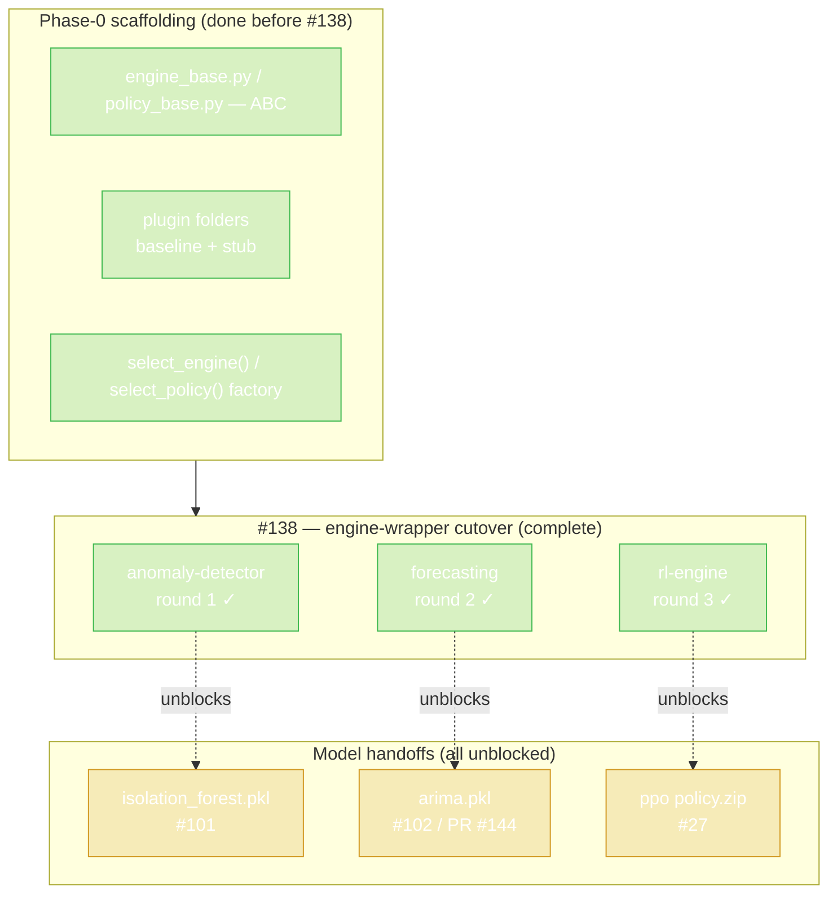
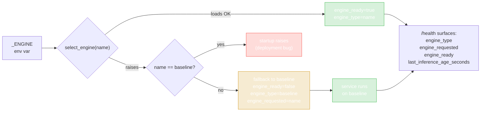
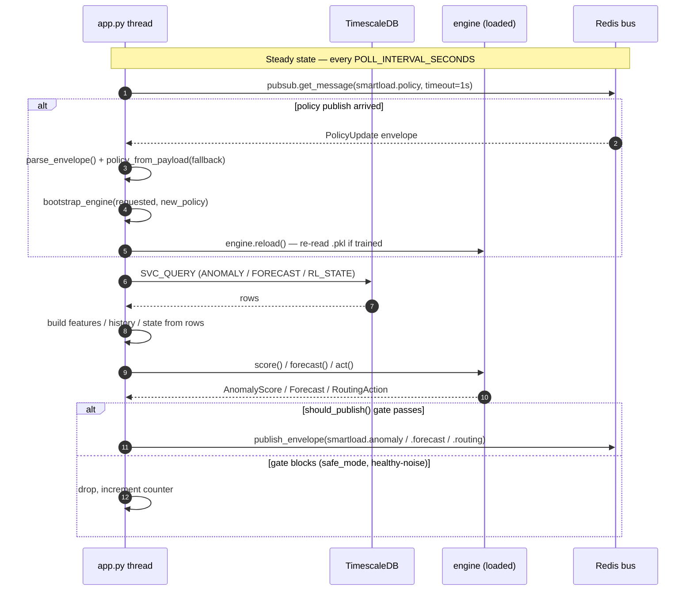
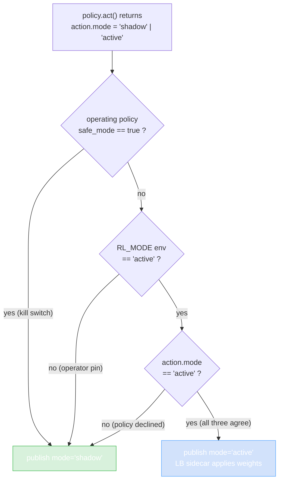

# SmartLoad — Project Walkthrough

A file-by-file tour of every service, every shared module, every infrastructure component, and the Python SDK. Each section explains what the file is, why it exists, and walks through the code with excerpts.

> Scope: `services/*`, `clients/python/*`, `infrastructure/*`. Repo-level files (root `README.md`, `docker-compose.yml`, `tests/`, `examples/`, `scripts/`, `config/`, `docs/`) are referenced where relevant but not exhaustively explained — they are mapped from the root README.

## Table of contents

- [0. How to read this document](#0-how-to-read-this-document)
- [1. System overview](#1-system-overview)
- [2. The shared layer (`services/shared/`)](#2-the-shared-layer-servicesshared)
  - [2.1 `contracts.py` — Redis envelope contracts](#21-contractspy--redis-envelope-contracts)
  - [2.2 `queries.py` — canonical SQL constants](#22-queriespy--canonical-sql-constants)
  - [2.3 `lb_adapters/` — load-balancer plugin contract](#23-lb_adapters--load-balancer-plugin-contract)
- [3. Data plane](#3-data-plane)
  - [3.1 `load-balancer` — NGINX](#31-load-balancer--nginx)
  - [3.2 `lb-otel-shipper` — log tail → OTLP](#32-lb-otel-shipper--log-tail--otlp)
  - [3.3 `telemetry` — OTLP ingest + read API](#33-telemetry--otlp-ingest--read-api)
- [4. Decision plane](#4-decision-plane)
  - [4.1 `anomaly-detector` (plugin-per-engine)](#41-anomaly-detector-plugin-per-engine)
  - [4.2 `forecasting` (plugin-per-engine)](#42-forecasting-plugin-per-engine)
  - [4.3 `rl-engine` (plugin-per-policy)](#43-rl-engine-plugin-per-policy)
  - [4.4 `autoscaler`](#44-autoscaler)
- [5. Control plane + UI](#5-control-plane--ui)
  - [5.1 `policy-manager`](#51-policy-manager)
  - [5.2 `webhook-dispatcher`](#52-webhook-dispatcher)
  - [5.3 `operator-ui/bff` (Flask)](#53-operator-uibff-flask)
  - [5.4 `operator-ui/web` (React + Vite)](#54-operator-uiweb-react--vite)
- [6. Python SDK (`clients/python/`)](#6-python-sdk-clientspython)
- [7. Infrastructure (`infrastructure/`)](#7-infrastructure-infrastructure)

---

## 0. How to read this document

Each service section follows the same shape:

1. **What it is** — one-paragraph purpose statement.
2. **Why it exists** — the role it plays in the SmartLoad pipeline and what would break without it.
3. **Files** — a list of every file in the service.
4. **Walkthrough** — file by file, with code excerpts and explanations. Code blocks are quoted verbatim; commentary follows.

Code excerpts are **always shorter than the actual file** — the prose tells you what was elided. To read every line, open the file at the path listed.

---

## 1. System overview

### What SmartLoad is

SmartLoad is middleware that sits between client traffic and a pool of backend services. It does two things at once:

- **Routes traffic** through NGINX (the data plane).
- **Decides how to route and scale** using telemetry-driven services (the decision plane), with an operator override surface (the control plane).

### The pipeline

```
Client traffic
   │
   ▼
[load-balancer]  ── access.log ──►  [lb-otel-shipper]  ── OTLP ──►  [otel-collector]
                                                                          │
                                                                          ▼
                                                                    [telemetry]  ──► TimescaleDB
                                                                                       │
                              ┌────────────────────────────────────────────────────────┤
                              ▼                                                        ▼
                       [anomaly-detector]                                       [forecasting]
                              │                                                        │
                              │ smartload.anomaly                          smartload.forecast
                              │                                                        │
                              ▼                                                        ▼
                                              [rl-engine]    ◄── policy ──►   [autoscaler]
                                                  │                                    │
                                  smartload.routing                       smartload.scale
                                                  │                                    │
                                                  └────► (load-balancer sidecar) ◄─────┘

                                              [policy-manager]
                                                  │   ▲
                                  smartload.policy   │ POST /api/v1/policy
                                                  ▼   │
                                              [operator-ui]  ◄── operator browser
                                                  │
                                                  └── (webhook-dispatcher → customer URL)
```

### The three planes

- **Data plane** — `load-balancer`, `lb-otel-shipper`, `telemetry`. Carries actual client traffic and the telemetry derived from it.
- **Decision plane** — `anomaly-detector`, `forecasting`, `rl-engine`, `autoscaler`. Reads telemetry, publishes events, takes scaling actions.
- **Control plane** — `policy-manager`, `operator-ui`, `webhook-dispatcher`. Holds the operating policy, audits changes, and exposes them to humans and external integrators.

### Two cross-service contracts

Every interaction between services flows through one of two contract surfaces:

| Surface | Where it lives | Carried by |
|---|---|---|
| HTTP REST (`/api/v1/*`) | `docs/openapi/smartload-v1.yaml` | Operator UI, SDK, external integrators |
| Redis pub/sub | `docs/redis-channels.md` + `services/shared/contracts.py` | Inter-service events |

The shared layer (`services/shared/`) is the in-tree home of both: envelope dataclasses for Redis, SQL constants for TimescaleDB reads. **Read `services/shared/` first — every service depends on it.**

---

## 2. The shared layer (`services/shared/`)

### What it is

A package of cross-service Python modules. Anything imported by more than one service belongs here.

### Why it exists

Without `shared/`, each service would duplicate the Redis envelope format and the SQL strings. That duplication would silently drift — one service expects `score: float`, another expects `score: int`, and the bus breaks on the next deploy. `shared/` is the single source of truth for both surfaces.

### Files

```
services/shared/
├── __init__.py                  # empty package marker
├── README.md                    # high-level rules
├── contracts.py                 # Redis envelopes + pub/sub helpers   (362 lines)
├── queries.py                   # canonical SQL constants             (171 lines)
└── lb_adapters/
    ├── __init__.py              # exports LoadBalancerAdapter, AdapterState
    ├── base.py                  # abstract base class                 (52 lines)
    ├── README.md
    ├── nginx/   {__init__.py, README.md}       # placeholder for the v1 default
    ├── envoy/   {__init__.py, README.md}       # stub, NotImplementedError
    ├── haproxy/ {__init__.py, README.md}       # stub, NotImplementedError
    └── alb/     {__init__.py, README.md}       # stub, NotImplementedError
```

### 2.1 `contracts.py` — Redis envelope contracts

This is the single most important file in the repo. Every cross-service message has its shape defined here.

#### Module docstring and channels

```python
Redis channels:
  smartload.anomaly   ← AnomalyEvent          (published by anomaly-detector)
  smartload.forecast  ← ForecastResult        (published by forecasting)
  smartload.routing   ← RoutingRecommendation (published by rl-engine)
  smartload.policy    ← PolicyUpdate          (published by policy-manager)
  smartload.scale     ← ScalingEvent          (published by autoscaler)
```

Five channels, one publisher each. The publisher owns the channel.

#### Helper functions

```python
def _now_iso() -> str:
    return datetime.now(timezone.utc).isoformat()
```

Every timestamp in the system is RFC 3339 UTC produced by this one helper. Centralising the format eliminates a class of "naive datetime vs aware datetime" bugs.

```python
def _to_dict(obj: Any) -> dict:
    if is_dataclass(obj):
        return asdict(obj)
    if isinstance(obj, dict):
        return obj
    raise TypeError(...)
```

A small coercion helper used by `make_envelope`: payload may be a dataclass or a raw dict, but never anything else.

`json_encode` / `json_decode` are the **legacy flat path** — they take a dataclass and serialise it directly, without wrapping in an envelope. Kept because the existing 33-test integration suite still uses them.

#### The Envelope

```python
ENVELOPE_VERSION = 1

CHANNEL_TTL_SECONDS: dict[str, int | None] = {
    "smartload.anomaly":  30,
    "smartload.routing":  30,
    "smartload.forecast": 180,
    "smartload.scale":    None,   # actions are auditable; never expire
    "smartload.policy":   None,   # policy snapshots never expire
}
```

Each channel has a **staleness TTL**. If a subscriber receives an anomaly event older than 30 seconds it must drop it — the routing decision based on it would be stale. Forecasts get longer (180 s) because they describe the *future*. Scale events and policy snapshots never expire — they're auditable history.

```python
@dataclass
class Envelope:
    event_id:  str
    source:    str
    version:   int
    timestamp: str
    payload:   dict
```

Every message has these five fields. `event_id` enables dedup if a publisher retries. `source` identifies the publisher (kebab-case service name). `version` is the envelope version (`ENVELOPE_VERSION`), bumped only on envelope-semantics changes — additive payload changes do not bump it. `timestamp` drives staleness rejection. `payload` is the channel-specific dataclass body.

```python
def make_envelope(source: str, payload: Any) -> Envelope:
    return Envelope(
        event_id=str(uuid.uuid4()),
        source=source,
        version=ENVELOPE_VERSION,
        timestamp=_now_iso(),
        payload=_to_dict(payload),
    )

def publish_envelope(redis_client, channel: str, source: str, payload: Any) -> str:
    env = make_envelope(source=source, payload=payload)
    redis_client.publish(channel, json.dumps(asdict(env)))
    return env.event_id
```

The publisher API. Returns the `event_id` so the caller can log it for correlation with downstream consumers and the audit trail.

#### Subscriber-side: drop reasons

```python
DROP_REASON_MALFORMED_JSON       = "malformed_json"
DROP_REASON_NOT_AN_ENVELOPE      = "not_an_envelope"
DROP_REASON_NAIVE_TIMESTAMP      = "naive_timestamp"
DROP_REASON_UNPARSEABLE_TIMESTAMP = "unparseable_timestamp"
DROP_REASON_STALE                = "stale"
```

These are stable string constants that subscribers dispatch on to emit Prometheus counters. The rule from SOT §8.3: every silent drop must be observable.

```python
def _envelope_is_stale(env_timestamp: str, ttl_seconds: int | None) -> tuple[bool, str | None]:
    if ttl_seconds is None:
        return False, None
    try:
        ts = datetime.fromisoformat(env_timestamp.replace("Z", "+00:00"))
    except (ValueError, AttributeError):
        return True, DROP_REASON_UNPARSEABLE_TIMESTAMP
    if ts.tzinfo is None:
        return True, DROP_REASON_NAIVE_TIMESTAMP
    age = (datetime.now(timezone.utc) - ts).total_seconds()
    if age > ttl_seconds:
        return True, DROP_REASON_STALE
    return False, None
```

Three defensive checks before computing age:
1. **Unparseable** — the timestamp string is not ISO-8601.
2. **Naive** — it parsed, but lacks timezone info. The author chose to reject these rather than assume UTC; assuming UTC would mask a publisher bug.
3. **Stale** — older than the channel's TTL.

```python
def parse_envelope(raw, channel=None, *, on_drop=None) -> tuple[dict, dict] | None:
    ...
    if not isinstance(data, dict) or "payload" not in data or "timestamp" not in data:
        _drop(DROP_REASON_NOT_AN_ENVELOPE)
        return None
    ...
    payload = data.pop("payload")
    return payload, data
```

Returns `(payload, envelope_meta)` or `None`. The trick: it `pop`s the payload out of `data` so the returned `envelope_meta` carries everything *except* payload — that way callers can correlate by `event_id` / `source` / `version` without re-reading the full body.

The `on_drop` callback is wrapped in `try/except` — observability code must never crash the subscriber. That's a hard rule.

```python
def subscribe_envelope(pubsub, channel, callback, *, timeout=None, on_drop=None) -> None:
    msg = pubsub.get_message(ignore_subscribe_messages=True, timeout=timeout)
    if msg is None or msg.get("type") != "message":
        return
    parsed = parse_envelope(msg.get("data", b""), channel=channel, on_drop=on_drop)
    if parsed is None:
        return
    payload, meta = parsed
    callback(payload, meta)
```

A **single-tick** helper. The caller drives the polling loop — this just pulls one message and dispatches it. That keeps backpressure handling at the call site where it belongs.

#### Payload dataclasses

Five dataclasses, one per channel. Each has required fields that subscribers must rely on and optional fields that publishers may add without breaking compatibility.

```python
@dataclass
class AnomalyEvent:
    backend_id: str
    status: str        # "healthy" | "degraded" | "unhealthy"
    score: float
    timestamp: str = field(default_factory=_now_iso)
    features: dict | None = None        # debug only
    model_version: str | None = None
```

`status` is a tri-state — "degraded" is the warning zone where the LB might down-weight but not exclude. `features` is a debug map (per-feature contributions to the score) that should never be relied on by routing logic.

```python
@dataclass
class ForecastResult:
    horizon_minutes: int
    predicted_rps: float
    confidence_lower: float
    confidence_upper: float
    timestamp: str = field(default_factory=_now_iso)
    model_id: str | None = None
```

Both confidence bounds are required, not optional. A point estimate without a confidence interval can't be acted on by the autoscaler — if the lower bound is below current capacity, no scale-out.

```python
@dataclass
class RoutingRecommendation:
    mode: str                       # "shadow" | "active"
    server_rankings: list[dict]     # [{"backend_id": str, "score": float}, ...]
    timestamp: str = field(default_factory=_now_iso)
    policy_version: int | None = None
```

`mode="shadow"` means the LB logs the recommendation but does not apply it — used during RL training and rollout. `policy_version` is the join key back to the `PolicyUpdate` snapshot the RL agent was reasoning under, so post-hoc analysis can ask "what policy was active when this decision was made?"

```python
@dataclass
class ScalingEvent:
    action: str          # "scale_out" | "scale_in"
    instance_count: int  # count AFTER the action
    reason: str
    timestamp: str = field(default_factory=_now_iso)
    forecast_event_id: str | None = None
```

`instance_count` is the resulting count *after* the action — not the delta. Auditors care about state, not change. `forecast_event_id` lets you trace a scale-out back to the forecast that triggered it.

```python
@dataclass
class PolicyUpdate:
    operating_mode: str
    safe_mode: bool
    min_backends: int
    max_backends: int
    slo_p95_latency_ms: int
    anomaly_latency_multiplier: float
    per_instance_capacity_rps: int
    autoscaler_cooldown_seconds: int
    policy_version: int
    anomaly_response: str = "auto-isolate"
    anomaly_recovery_window_seconds: int = 30
    rl_exploration_rate: float = 0.0
    rl_confidence_threshold: float = 0.6
    changed_fields: list[str] | None = None
    timestamp: str = field(default_factory=_now_iso)
```

This is the **full canonical policy snapshot** — every time policy-manager publishes, it sends *all* fields, not a delta. `policy_version` is monotonic. `changed_fields` tells subscribers what to log without forcing them to diff snapshots themselves.

### 2.2 `queries.py` — canonical SQL constants

Every TimescaleDB read query the AI services run lives here as a constant. Defining them centrally means schema changes touch one file.

#### Parameterisation rule

```
All dynamic values — including time intervals — are passed as bind
parameters, never via Python string formatting.
```

PostgreSQL caches the prepared plan only when the query *text* is stable, so f-string interpolation defeats the cache. Bind parameters keep the plan warm and prevent SQL injection by construction.

#### `ANOMALY_QUERY`

```sql
SELECT
    instance, metric_name,
    AVG(value)    AS avg_value,
    MAX(value)    AS max_value,
    STDDEV(value) AS std_value,
    COUNT(*)      AS sample_count
FROM metrics
WHERE
    time > NOW() - %s::interval
    AND service = %s
    AND metric_name = ANY(%s)
GROUP BY instance, metric_name
ORDER BY instance, metric_name;
```

Three bind parameters: window (text interval like `"60 seconds"`), service name, and a Postgres array of metric names. Aggregates are AVG/MAX/STDDEV per (instance, metric) — the anomaly engines fit on the shape of these aggregates, not raw rows.

The `service` filter is parameterised rather than hardcoded to `'load-balancer'` so the same query can interrogate backend-emitted telemetry once backends start emitting OTLP directly.

#### `FORECAST_QUERY`

```sql
SELECT
    time_bucket('1 minute', time) AS bucket,
    SUM(value)                    AS request_rate
FROM metrics
WHERE time > NOW() - %s::interval AND metric_name = 'request_count'
GROUP BY bucket
ORDER BY bucket ASC;
```

`time_bucket` is TimescaleDB's downsampling primitive. One-minute buckets give ARIMA / Prophet / moving-average enough granularity without overwhelming the model with raw per-request rows.

#### `RL_STATE_QUERY`

```sql
SELECT
    instance,
    AVG(CASE WHEN metric_name = 'request_latency_ms' THEN value END) AS latency,
    SUM(CASE WHEN metric_name = 'request_count'      THEN value END) AS request_count,
    MAX(CASE WHEN metric_name = 'error_rate'         THEN value END) AS error_rate
FROM metrics
WHERE time > NOW() - %s::interval
GROUP BY instance
ORDER BY instance;
```

A pivot: one row per backend with three columns (latency, request_count, error_rate). This is the RL agent's per-step state vector, formatted directly by SQL so Python doesn't have to reshape.

#### `BACKEND_HEALTH_QUERY` (DISTINCT ON pattern)

```sql
SELECT DISTINCT ON (backend_id)
    backend_id, status, score, time
FROM backend_health
WHERE time > NOW() - %s::interval
ORDER BY backend_id, time DESC;
```

`DISTINCT ON (backend_id) ... ORDER BY backend_id, time DESC` returns the most recent row per backend. A standard Postgres pattern that beats `MAX(time) GROUP BY` for this shape.

#### Insert statements

```sql
METRICS_INSERT           — single row into metrics
METRICS_BATCH_INSERT     — VALUES %s for execute_values
BACKEND_HEALTH_INSERT    — one row per health verdict
SCALING_EVENT_INSERT     — one row per scale-out/in
POLICY_CHANGE_INSERT     — one row per changed field per POST
```

The comment on `METRICS_BATCH_INSERT` is the key signal: above ~50 rps, switch to `psycopg2.extras.execute_values` with this template. Single-row inserts at 5000 rps would saturate the network.

#### Fallback query

```sql
OBSERVED_RPS_QUERY:
SELECT COALESCE(SUM(value), 0)::float / 60.0
FROM metrics
WHERE time > NOW() - INTERVAL '60 seconds'
  AND metric_name = 'request_count';
```

This is the **autoscaler's reactive fallback** for when the forecast stream goes stale (publisher down, Redis disconnected). It's a hardcoded 60-second window — large enough to smooth bursty single-second counts, small enough to react within one cooldown cycle.

#### Schema verification

```python
TABLE_EXISTS_QUERY = """
SELECT table_name FROM information_schema.tables
WHERE table_schema = 'public' AND table_name = ANY(%s);
"""
REQUIRED_TABLES = ["metrics", "backend_health", "scaling_events", "policy_changes"]
```

Used by integration tests on startup: hit the DB with `REQUIRED_TABLES`, and if anything's missing, fail loudly rather than 500 on the first user request.

### 2.3 `lb_adapters/` — load-balancer plugin contract

#### Why it exists

If decision-plane code called `nginx -s reload` directly, the stack would be NGINX-only. The adapter pattern decouples *what the decision plane wants* (exclude backend X, set these weights) from *how the load balancer implements it*. New LB targets (Envoy, HAProxy, ALB) drop in as new plugin folders.

#### `base.py` — the contract

```python
@dataclass
class AdapterState:
    upstream_weights: dict[str, int]
    excluded_backends: set[str]
```

The complete view of the LB's current routing config. `excluded_backends` is a set, not a list — order doesn't matter, membership does.

```python
class LoadBalancerAdapter(ABC):
    @abstractmethod
    def set_upstream_weights(self, backend_weights: dict[str, int]) -> None: ...
    @abstractmethod
    def exclude_backend(self, backend_id: str) -> None: ...
    @abstractmethod
    def include_backend(self, backend_id: str) -> None: ...
    @abstractmethod
    def current_state(self) -> AdapterState: ...
```

Four methods, three contracts every implementation must honour:

- **Idempotent** — calling `exclude_backend("b1")` twice is fine.
- **Bounded latency** — return within ~1 s under normal conditions.
- **Fail-safe** — partial failure must roll back; the LB is never in a half-applied state.

These properties are *tested* by `tests/conformance/lb_adapter/` — every adapter runs through the same suite, which is how the codebase guarantees Envoy and HAProxy will be drop-in replacements when they land.

#### NGINX adapter (`nginx/`)

Folder exists, README explains the intent, but `__init__.py` is empty in v1. The current NGINX-reload logic still lives in the load-balancer service and the planned T2.1 sidecar; the refactor that moves it behind this adapter is a deferred issue.

The shape is reserved so the import path `from services.shared.lb_adapters.nginx import NginxAdapter` is already meaningful once code lands.

#### Stub adapters (`envoy/`, `haproxy/`, `alb/`)

All three follow the same pattern:

```python
class EnvoyAdapter(LoadBalancerAdapter):
    def __init__(self, *args, **kwargs):
        raise NotImplementedError(
            "EnvoyAdapter not implemented. Open a feature request if needed."
        )

    def set_upstream_weights(self, backend_weights):  # pragma: no cover
        raise NotImplementedError
    ...
```

Same for HAProxy and ALB. The `# pragma: no cover` tells coverage tooling not to count these — they're contract markers, not real code.

The ALB README adds one detail: "Will likely depend on boto3 / aws-sdk for upstream weight adjustment via the ALB API."

---

## 3. Data plane

### 3.1 `load-balancer` — NGINX

#### What it is

The NGINX container that terminates client traffic at port 8080 and proxies to the `test-backend` pool. The data-plane entry point.

#### Files

```
services/load-balancer/
├── README.md
└── nginx/
    ├── Dockerfile
    └── nginx.conf
```

#### `nginx/Dockerfile`

```dockerfile
FROM nginx:1.25-alpine
COPY nginx.conf /etc/nginx/nginx.conf
EXPOSE 80
```

Three lines. Alpine base for size, custom config file, exposes port 80 (mapped to host 8080 in compose).

#### `nginx/nginx.conf`

Three concerns: log format, log sinks, upstream block.

**Log format.** A custom `smartload_json` format that emits one JSON object per request:

```nginx
log_format smartload_json escape=json
'{'
'"timestamp":"$time_iso8601",'
'"service":"nginx",'
'"client_ip":"$remote_addr",'
'"request":"$request",'
'"request_path":"$uri",'
'"status":$status,'
'"backend":"$upstream_addr",'
'"latency":$request_time,'
'"upstream_latency":"$upstream_response_time"'
'}';
```

`escape=json` is critical — without it, an embedded quote in the URL would break the JSON. The `latency` field is `$request_time` in seconds; the shipper converts to milliseconds.

**Two log sinks.**

```nginx
access_log /dev/stdout            smartload_json;
access_log /nginx-logs/access.log smartload_json;
```

The first goes to stdout for `docker logs`. The second is what `lb-otel-shipper` tails. The path `/nginx-logs/access.log` is *not* `/var/log/nginx/access.log` because the `nginx:alpine` base image symlinks `access.log` → `/dev/stdout`, which the shipper can't seek or tail.

**Static upstream block.**

```nginx
upstream backend_pool {
    server smartload-test-backend-1:8080 max_fails=3 fail_timeout=10s;
    server smartload-test-backend-2:8080 max_fails=3 fail_timeout=10s;
    server smartload-test-backend-3:8080 max_fails=3 fail_timeout=10s;
    server smartload-test-backend-4:8080 max_fails=3 fail_timeout=10s;
    server smartload-test-backend-5:8080 max_fails=3 fail_timeout=10s;
}
```

Five backend slots enumerated explicitly. The comment in the file explains why:

> Open-source NGINX doesn't round-robin across A records when `proxy_pass` uses a variable, and doesn't support the Plus-only `server ... resolve` directive for dynamic upstream membership. Enumerate the docker-compose replicas explicitly so the in-block round-robin actually distributes requests across them.

The autoscaler toggles backends 1..5 between running/stopped at runtime. NGINX keeps all 5 hostnames in its block, and `proxy_next_upstream` retries past whichever ones are currently stopped. The T2.1 sidecar will eventually replace this static block with a regenerated one.

**Server block.**

```nginx
server {
    listen 80;
    location / {
        proxy_pass http://backend_pool;
        proxy_next_upstream error timeout http_502 http_503 http_504;
        proxy_set_header Host $host;
        proxy_set_header X-Real-IP $remote_addr;
    }
}
```

`proxy_next_upstream` is the *graceful failure*: if the chosen backend returns a 5xx or times out, NGINX retries the next backend instead of returning the error to the client. Without this, autoscaler-induced stops would surface as 502s.

### 3.2 `lb-otel-shipper` — log tail → OTLP

#### What it is

A Python sidecar that runs alongside the NGINX container. It tails NGINX's JSON access log on the shared `nginx-logs` volume and emits one OTLP/HTTP-JSON gauge data point per request, per metric, to the OTel Collector.

#### Why "Approach B" (log-based) instead of NGINX-OTel module

The module aggregates upstream of the database (histograms). SmartLoad's anomaly and RL queries compute STDDEV/MAX over rolling windows — those require **per-request rows**, not pre-aggregated histograms. The log shipper preserves per-request fidelity.

#### Files

```
services/lb-otel-shipper/
├── README.md
├── Dockerfile
├── app.py            (260 lines)
└── requirements.txt  (just `requests`)
```

#### `Dockerfile`

```dockerfile
FROM python:3.11-slim
WORKDIR /app
COPY requirements.txt .
RUN pip install --no-cache-dir -r requirements.txt
COPY app.py /app/app.py
ENV NGINX_LOG_PATH=/nginx-logs/access.log
ENV OTEL_COLLECTOR_URL=http://otel-collector:4318/v1/metrics
ENV SERVICE_NAME=load-balancer
CMD ["python", "-u", "app.py"]
```

`-u` for unbuffered stdout so log lines flush immediately. The three env vars provide defaults; compose can override.

#### `app.py` — the tailer

Tunables come from env vars with sane defaults:

```python
POST_TIMEOUT_S  = float(os.environ.get("POST_TIMEOUT_S", "2.0"))
FLUSH_INTERVAL  = float(os.environ.get("FLUSH_INTERVAL_S", "1.0"))
FLUSH_BATCH_MAX = int(os.environ.get("FLUSH_BATCH_MAX", "500"))
REOPEN_BACKOFF  = float(os.environ.get("REOPEN_BACKOFF_S", "1.0"))
```

Flush every second OR every 500 data points, whichever comes first. POST timeout is short (2 s) because the collector is in the same docker network and the shipper must keep up with NGINX's request rate.

**Observability counters.** Internal-only, exposed indirectly via heartbeat log lines:

```python
_lines_parsed      = 0
_lines_skipped     = 0
_batches_sent      = 0
_batches_dropped   = 0
```

Counter increments go through `_bump(field, n=1)` under a `threading.Lock()` — the tailer is single-threaded but the heartbeat thread reads the snapshot.

**Line parsing.**

```python
def line_to_datapoints(line, now_ns) -> list[tuple[str, float, int, str]]:
    try:
        record = json.loads(line)
    except (json.JSONDecodeError, ValueError):
        return []
    latency_s = record.get("latency")
    status    = record.get("status")
    if latency_s is None or status is None:
        return []
    try:
        latency_ms = float(latency_s) * 1000.0
        status_int = int(status)
    except (TypeError, ValueError):
        return []
    backend    = record.get("backend") or "unknown"
    error_rate = 1.0 if status_int >= 500 else 0.0
    return [
        ("request_count",      1.0,        now_ns, backend),
        ("request_latency_ms", latency_ms, now_ns, backend),
        ("error_rate",         error_rate, now_ns, backend),
    ]
```

The three metric names — `request_count`, `request_latency_ms`, `error_rate` — are the **canonical names** that `shared/queries.py:ANOMALY_QUERY` and `RL_STATE_QUERY` filter on. Hardcoded here for a reason: if you rename them you must rename them in the queries.

`backend` is NGINX's `$upstream_addr` — the upstream that actually handled the request. This is the field the anomaly detector keys on to decide *which backend* is misbehaving. Falls back to `"unknown"` when NGINX never reached an upstream.

The first line is the source of truth — `error_rate` is computed by the shipper because NGINX doesn't emit it directly.

**OTLP/HTTP-JSON envelope construction.**

```python
def build_envelope(datapoints):
    by_name: dict[str, list[dict]] = {}
    for name, value, ts_ns, backend in datapoints:
        by_name.setdefault(name, []).append({
            "timeUnixNano": str(ts_ns),
            "asDouble":     value,
            "attributes":   [
                {"key": "instance", "value": {"stringValue": backend}},
            ],
        })
    metrics = [
        {"name": name, "gauge": {"dataPoints": dps}}
        for name, dps in by_name.items()
    ]
    return {
        "resourceMetrics": [{
            "resource": {"attributes": [
                {"key": "service.name",        "value": {"stringValue": SERVICE_NAME}},
                {"key": "service.instance.id", "value": {"stringValue": INSTANCE_ID}},
            ]},
            "scopeMetrics": [{"metrics": metrics}],
        }],
    }
```

Two-level attribute structure: **resource attributes** (`service.name`, `service.instance.id`) are constant per envelope and identify the shipper. The **per-datapoint `instance` attribute** identifies the *backend that handled the request*. This split is what makes the telemetry parser write the backend's identity into `metrics.instance` rather than the shipper's.

**The POST.**

```python
def post_envelope(envelope):
    try:
        resp = requests.post(COLLECTOR_URL, json=envelope, timeout=POST_TIMEOUT_S)
        if resp.status_code >= 400:
            _bump("batches_dropped")
            log.warning("collector returned %s: %s", resp.status_code, resp.text[:200])
            return
        _bump("batches_sent")
    except requests.RequestException as exc:
        _bump("batches_dropped")
        log.warning("collector POST failed: %s", exc)
```

Fire-and-forget. Any error → log + count + return. Never raises into the tail loop. If the collector is down, every batch is dropped and counted, but NGINX keeps serving traffic — backpressure must not reach the data plane.

**The tail loop.**

```python
def _open_at_end(path):
    try:
        fh = open(path, "r", encoding="utf-8", errors="replace")
    except FileNotFoundError:
        return None
    fh.seek(0, os.SEEK_END)
    return fh
```

`errors="replace"` means an undecodable byte becomes U+FFFD instead of crashing — log files can occasionally contain garbage. `seek(0, SEEK_END)` skips historical lines: a restarted shipper does not re-emit yesterday's traffic.

```python
def tail_and_ship(path, stop_event=None):
    fh = None
    while fh is None:
        if stop_event is not None and stop_event.is_set(): return
        fh = _open_at_end(path)
        if fh is None:
            time.sleep(REOPEN_BACKOFF)
    buffer = deque()
    last_flush = time.monotonic()
    while True:
        if stop_event is not None and stop_event.is_set(): break
        line = fh.readline()
        if line:
            ...
            buffer.extend(dps)
        now = time.monotonic()
        should_flush = (
            buffer and (
                len(buffer) >= FLUSH_BATCH_MAX
                or (now - last_flush) >= FLUSH_INTERVAL
            )
        )
        if should_flush:
            batch = list(buffer); buffer.clear(); last_flush = now
            post_envelope(build_envelope(batch))
        if not line:
            time.sleep(0.05)
```

The pattern: read one line, buffer it, flush when the buffer fills or the timer elapses. The `time.sleep(0.05)` when no line is available is a poor-man's poll — keeps CPU low when traffic is idle.

**Entrypoint.**

```python
def main():
    def _heartbeat():
        while True:
            time.sleep(30)
            log.info("stats %s", _stats_snapshot())
    threading.Thread(target=_heartbeat, daemon=True).start()
    tail_and_ship(LOG_PATH)
```

A daemon thread logs counters every 30 s. That's the entire "observability surface" of the shipper — there's deliberately no `/health` endpoint at T1.2 because process-restart on Docker handles liveness, and DB-row arrival in `metrics` is the integration test.

### 3.3 `telemetry` — OTLP ingest + read API

#### What it is

A Flask service that the OTel Collector forwards metrics to. It parses OTLP/HTTP-JSON, validates and shapes each data point, and inserts rows into the `metrics` hypertable. Also exposes a read API.

#### Why it exists

The collector itself can write to many sinks, but TimescaleDB isn't one of them out of the box. Telemetry is a thin shim that owns the **schema contract** for `metrics` — the only service that writes that table. Centralising the writer means schema changes touch one file.

#### Files

```
services/telemetry/
├── README.md
├── Dockerfile
├── app.py            (337 lines)
└── requirements.txt  (flask, psycopg2-binary, redis)
```

#### `Dockerfile`

```dockerfile
FROM python:3.11-slim
WORKDIR /app
# Build context is ./services so we can pull in the canonical shared module.
COPY telemetry/requirements.txt .
RUN pip install --no-cache-dir -r requirements.txt
COPY telemetry/app.py /app/app.py
COPY shared           /app/shared
ENV PORT=8081
ENV SERVICE_NAME=telemetry
EXPOSE 8081
CMD ["python", "app.py"]
```

The crucial line: `COPY shared /app/shared`. The build context is the entire `services/` directory (set in `docker-compose.yml`), so the shared module gets baked into every image that needs it. Without that, the shared envelopes would have to be duplicated per service or vendored via pip.

#### `app.py` — shared module resolution

```python
_HERE = os.path.dirname(os.path.abspath(__file__))
for _cand in (_HERE, os.path.dirname(_HERE)):
    if os.path.isdir(os.path.join(_cand, "shared")):
        sys.path.insert(0, _cand)
        break
from shared.queries import METRICS_INSERT
```

Two layouts to support:
- **Container**: `shared/` lives at `/app/shared`, sibling of `app.py`.
- **Dev / CI**: `shared/` lives at `services/shared`, parent of `services/telemetry/app.py`.

The loop probes both candidates. After this, `from shared.queries import METRICS_INSERT` works the same in both environments.

#### Counters

Same pattern as the shipper: a lock + four module-level globals, manipulated through `_bump`. `rows_dropped_db` vs `rows_dropped_shape` distinguishes "DB unreachable" from "malformed payload" — different ops responses.

#### Health probes

```python
def check_redis():
    try:
        r = redis_lib.from_url(REDIS_URL, socket_connect_timeout=3)
        r.ping()
        return True, None
    except Exception as exc:
        return False, str(exc)
```

Used by `/health` only. Telemetry doesn't actually publish to Redis in T1.1, but the readiness check guards future work where it will.

#### OTLP parsing — value and time extractors

```python
def _datapoint_value(dp):
    if "asDouble" in dp:
        try: return float(dp["asDouble"])
        except (TypeError, ValueError): return None
    if "asInt" in dp:
        try: return float(dp["asInt"])
        except (TypeError, ValueError): return None
    return None

def _datapoint_time(dp):
    raw = dp.get("timeUnixNano") or dp.get("startTimeUnixNano")
    if raw is None: return None
    try:
        ns = int(raw)
        return datetime.fromtimestamp(ns / 1_000_000_000, tz=timezone.utc)
    except (TypeError, ValueError):
        return None
```

OTLP's flexibility: a value can be `asDouble` or `asInt`, a timestamp can be `timeUnixNano` or `startTimeUnixNano`. Both helpers return `None` on any error so the caller can count the row as `rows_dropped_shape`.

#### OTLP parsing — `parse_otlp_to_rows`

```python
def parse_otlp_to_rows(envelope):
    rows = []
    for rm in envelope.get("resourceMetrics", []) or []:
        res_attrs    = rm.get("resource", {}).get("attributes", [])
        service      = _attr(res_attrs, "service.name", "unknown")
        res_instance = _attr(res_attrs, "service.instance.id") or _attr(res_attrs, "host.name")
        for sm in rm.get("scopeMetrics", []) or []:
            for m in sm.get("metrics", []) or []:
                name = m.get("name")
                if not name: continue
                series = m.get("gauge") or m.get("sum")
                if not series:
                    _bump("rows_dropped_shape")   # histogram / summary — dropped on purpose
                    continue
                for dp in series.get("dataPoints", []) or []:
                    val = _datapoint_value(dp)
                    ts  = _datapoint_time(dp)
                    if val is None or ts is None:
                        _bump("rows_dropped_shape"); continue
                    inst = _attr(dp.get("attributes"), "instance") or res_instance or "unknown"
                    rows.append((ts, service, inst, name, val))
    return rows
```

Four-level walk: `resourceMetrics → scopeMetrics → metrics → dataPoints`. Two important policies:

- **Histograms / summaries are dropped**, not parsed. SmartLoad's metric set is gauges + counters only. Counting the drop means a misconfigured emitter shows up in stats rather than silently disappearing.
- **Instance resolution priority**: per-datapoint `instance` attribute > resource `service.instance.id` > resource `host.name` > `"unknown"`. The first one wins because per-request attributes carry the *subject* (which backend served the request), while resource attributes carry the *emitter* (the shipper itself).

#### Ingest endpoint

```python
@app.route("/v1/metrics", methods=["POST"])
def ingest_otlp():
    if request.content_type and "json" not in request.content_type.lower():
        return jsonify({"error": "expected application/json"}), 415
    envelope = request.get_json(silent=True)
    if not isinstance(envelope, dict):
        return jsonify({"error": "malformed OTLP body"}), 400
    rows = parse_otlp_to_rows(envelope)
    if not rows:
        return jsonify({"accepted": 0}), 200
    try:
        conn = psycopg2.connect(TIMESCALEDB_URL, connect_timeout=5)
        try:
            with conn, conn.cursor() as cur:
                psycopg2.extras.execute_batch(cur, METRICS_INSERT, rows, page_size=500)
        finally:
            conn.close()
    except Exception as exc:
        _bump("rows_dropped_db", n=len(rows))
        app.logger.error("[%s] DB write failed: %s", SERVICE_NAME, exc)
        return jsonify({"accepted": 0, "dropped_db": len(rows)}), 200
    _bump("rows_written", n=len(rows))
    _bump("batches_written")
    return jsonify({"accepted": len(rows)}), 200
```

Several deliberate choices:

- **415 vs 400**: wrong content-type is "unsupported media type", parse failure is "bad request".
- **Empty rows returns 200, not 400**: a valid OTLP envelope can carry only histograms (all dropped) — that's not an error.
- **Always 200 on DB failure**: backpressure must not reach the collector. `rows_dropped_db` is bumped so the failure is visible in `/api/v1/stats`.
- **`execute_batch` with `page_size=500`**: ~500 rows per round trip is the sweet spot from psycopg2 docs; raising the page size further hits diminishing returns and TimescaleDB's per-statement parse cost.

#### Read API

```python
_WINDOW_RE    = re.compile(r"^\s*(\d+)\s*([smhd])\s*$")
_WINDOW_UNITS = {"s": "seconds", "m": "minutes", "h": "hours", "d": "days"}

def _window_to_interval(text):
    if not text: return None
    m = _WINDOW_RE.match(text)
    if not m: return None
    n, unit = m.group(1), m.group(2)
    if int(n) <= 0: return None
    return f"{n} {_WINDOW_UNITS[unit]}"
```

Prometheus-style duration syntax (`30s`, `5m`, `1h`, `2d`) translated to Postgres interval text. The regex anchors prevent injection — only digits + a single unit character match.

```python
@app.route("/api/v1/metrics", methods=["GET"])
def read_api():
    ...
    cur.execute(
        """
        SELECT time, service, instance, metric_name, value
        FROM metrics
        WHERE time > NOW() - %s::interval
          AND service = %s
        ORDER BY time DESC
        LIMIT %s
        """,
        (interval, service, READ_API_ROW_LIMIT),
    )
```

Note: this is **not** defined in `shared/queries.py` because it's specific to the read API's shape (DESC + LIMIT). The pattern is the same — fully parameterised, including the interval and limit. `READ_API_ROW_LIMIT` defaults to 10000 — large enough for several minutes of high-traffic data, small enough to bound memory.

```python
except Exception as exc:
    return jsonify({"error": "DBError", "message": str(exc)}), 503
```

This endpoint can 503 on DB failure (unlike ingest, which always 200s). The read API is for human operators and downstream services — they need to know the database is down.

#### Stats and health

```python
@app.route("/api/v1/stats")
def stats():
    with _stats_lock:
        return jsonify({...counters...}), 200

@app.route("/health")
def health():
    redis_ok, redis_err = check_redis()
    db_ok, db_err = check_timescaledb()
    status = "ok" if (redis_ok and db_ok) else "degraded"
    code = 200 if status == "ok" else 503
    return jsonify({"status": status, ...}), code
```

`/health` is the readiness probe for compose's `depends_on: condition: service_healthy`. 200 vs 503 — degraded means Redis or DB are unreachable.

---

## 4. Decision plane

The decision plane reads telemetry from TimescaleDB and emits events on Redis. The engine/policy plugin folders, abstract base classes, factories, and baseline implementations exist for all four services. The `autoscaler` is fully wired in T1.x. The `anomaly-detector` (round 1), `forecasting` (round 2), and `rl-engine` (round 3) are now all wired through their `engine_base` / `policy_base` ABCs and baseline engines behind `<SVC>_RUNLOOP_ENABLED=false` — flip the flag on each to start its run loop. **The #138 engine-wrapper cutover is complete.**

This staging is deliberate. The plugin layer (engines/, policies/) was written *first* so that when each service's run-loop cutover lands, the schema, factory, and conformance tests are already in place — and so a single service can be smoke-tested in isolation before replicating to siblings.

### #138 cutover progress



### Engine bootstrap (per service, identical shape)

At startup, the run loop resolves the engine via a strict bootstrap with fallback. If the requested engine fails to load — missing artifact, bad name, exception in `__init__` — the service falls back to its named baseline and reports `engine_ready=false` on `/health`. The baseline is the safety net; if even *it* fails, startup raises (deployment bug, don't swallow).



### Run-loop cycle (per service, identical shape)

Once bootstrapped, each AI service runs a single thread that interleaves Redis pub/sub message handling and tick-based inference. The pubsub `get_message` uses a 1-second timeout so policy updates land within one second; between messages, the loop runs an inference cycle every `POLL_INTERVAL_SECONDS`.



Same shape across services; only the query name, output dataclass, and channel differ. Implemented today in `services/anomaly-detector/app.py` + `runloop.py` and `services/forecasting/app.py` + `runloop.py`; rl-engine follows next via `policy_base`.

### 4.1 `anomaly-detector` (plugin-per-engine)

#### What it is

Classifies each backend as `healthy` / `degraded` / `unhealthy` from latency + error-rate features. Publishes `AnomalyEvent` envelopes to `smartload.anomaly`. As of #138 round 1, the service runs a real inference loop (behind `ANOMALY_RUNLOOP_ENABLED=true`) using the configured engine; the threshold baseline ships today, and the Isolation Forest plugin scaffold awaits the trained model from #101.

#### Files

```
services/anomaly-detector/
├── README.md
├── Dockerfile
├── app.py                  (Flask + threaded run loop; flag-gated)
├── runloop.py              (pure-Python pieces: bootstrap, policy parse,
│                            row pivot, publish gate — unit-testable)
├── engine_base.py          (abstract base + factory)
├── requirements.txt
└── engines/
    ├── __init__.py
    ├── threshold/
    │   ├── __init__.py
    │   ├── engine.py        (ThresholdEngine, ships in v1)
    │   ├── test_engine.py
    │   └── README.md
    └── isolation_forest/
        ├── __init__.py
        └── README.md        (stub — planned per issue #101)
```

#### `app.py` — Phase 0 health stub

Same boilerplate as `forecasting/app.py` and `rl-engine/app.py`. Three env vars (`TIMESCALEDB_URL`, `REDIS_URL`, `SERVICE_NAME`), two probes (`check_redis`, `check_timescaledb`), one route:

```python
@app.route("/health")
def health():
    redis_ok, redis_err = check_redis()
    db_ok, db_err = check_timescaledb()
    status = "ok" if (redis_ok and db_ok) else "degraded"
    code = 200 if status == "ok" else 503  # SOT §11: 503 on degraded, never 207
    return jsonify({...}), code
```

The 503/207 comment is policy: SmartLoad never returns "multi-status" on health — degraded is a hard NO so load balancers and orchestrators can act unambiguously.

#### `engine_base.py` — the plugin contract

Two dataclasses define the I/O surface for any engine:

```python
@dataclass
class BackendFeatures:
    backend_id: str
    latency_ms: float
    latency_rolling_mean_ms: float
    error_rate: float
    sample_count: int

@dataclass
class AnomalyScore:
    backend_id: str
    status: str  # "healthy" | "degraded" | "unhealthy"
    score: float
```

`BackendFeatures` is the engine's *input* — built by the run loop from the `ANOMALY_QUERY` results. `AnomalyScore` is the *output* — converted to an `AnomalyEvent` envelope and published.

```python
class AnomalyEngine(ABC):
    @abstractmethod
    def score(self, features: BackendFeatures) -> AnomalyScore: ...

    def reload(self) -> None:
        """Optional hook called when policy changes. Default no-op."""

def select_engine(name: str, **kwargs) -> AnomalyEngine:
    if name == "threshold":
        from engines.threshold.engine import ThresholdEngine
        return ThresholdEngine(**kwargs)
    if name == "isolation_forest":
        from engines.isolation_forest.engine import IsolationForestEngine
        return IsolationForestEngine(**kwargs)
    raise ValueError(f"Unknown anomaly engine: {name!r}")
```

Two-method ABC. `score` is mandatory; `reload` is optional with a default no-op — only engines that hold mutable state (cached thresholds from policy) need to override.

The factory does **late imports** inside each branch. That way you don't pay the cost of importing scikit-learn at startup if you're using the threshold engine — and the threshold engine doesn't fail to import on systems missing scikit-learn.

The file is named `engine_base.py` instead of `engine.py` to avoid a name collision with `engines/<plugin>/engine.py` — the per-plugin implementation file is the conventional name.

#### `engines/threshold/engine.py` — the baseline

```python
class ThresholdEngine(AnomalyEngine):
    def __init__(
        self,
        latency_multiplier: float = 3.0,
        error_rate_threshold: float = 0.05,
        min_sample_count: int = 10,
    ):
        ...

    def score(self, features):
        if features.sample_count < self.min_sample_count:
            return AnomalyScore(features.backend_id, "healthy", 0.0)

        if features.error_rate > self.error_rate_threshold:
            return AnomalyScore(
                features.backend_id, "unhealthy",
                min(1.0, features.error_rate / self.error_rate_threshold),
            )

        if features.latency_rolling_mean_ms <= 0:
            return AnomalyScore(features.backend_id, "healthy", 0.0)

        ratio = features.latency_ms / features.latency_rolling_mean_ms
        if ratio > self.latency_multiplier:
            return AnomalyScore(
                features.backend_id, "degraded",
                min(1.0, ratio / (self.latency_multiplier * 2)),
            )

        return AnomalyScore(features.backend_id, "healthy", 0.0)
```

Five branches:

1. **Too few samples** → healthy. Don't classify on noise. `min_sample_count=10` is the minimum signal floor.
2. **Error rate above threshold** → unhealthy. Score is `error_rate / threshold`, capped at 1.0. A 10× error rate gets the maximum score.
3. **Rolling mean is zero** → healthy. Defensive: a backend that has handled zero requests cannot be "degraded by latency".
4. **Current latency exceeds `multiplier × rolling mean`** → degraded. Score scaling is `ratio / (multiplier × 2)`, capped at 1.0 — a backend at 6× the rolling mean (2× the multiplier) hits score 1.0.
5. **Otherwise** → healthy.

The ordering matters: error rate trumps latency. A backend returning 500s is "unhealthy" even if its successful responses are fast.

The sys.path bootstrap at the top of the file:

```python
_SERVICE_ROOT = Path(__file__).resolve().parents[2]
if str(_SERVICE_ROOT) not in sys.path:
    sys.path.insert(0, str(_SERVICE_ROOT))
from engine_base import AnomalyEngine, AnomalyScore, BackendFeatures
```

Walks up two levels from `engines/threshold/engine.py` to `services/anomaly-detector/`, the service root where `engine_base.py` lives. This pattern repeats in every plugin file in every decision-plane service.

#### `engines/threshold/test_engine.py`

Five tests, one per branch:

```python
def test_healthy_when_within_thresholds():        assert score.status == "healthy"
def test_degraded_when_latency_spikes():          assert score.status == "degraded"
def test_unhealthy_when_error_rate_exceeds_threshold():  assert score.status == "unhealthy"
def test_healthy_when_sample_count_too_low():     assert score.status == "healthy"
def test_healthy_when_rolling_mean_zero():        assert score.status == "healthy"
```

A `_features` builder is the only fixture — every test constructs the input it cares about and asserts the status. Branch-coverage in five lines.

#### `engines/isolation_forest/` (stub)

`__init__.py` is empty; `README.md` documents the planned implementation. The factory in `engine_base.py` already references this module — when the implementation lands, no rewiring is needed in `app.py` or the factory.

### 4.2 `forecasting` (plugin-per-engine)

#### What it is

Produces short-horizon (default 5-minute) RPS forecasts for the autoscaler. Publishes `ForecastResult` envelopes to `smartload.forecast`. As of #138 round 2, the service runs a real inference loop (behind `FORECAST_RUNLOOP_ENABLED=true`) using the configured engine; the moving-average baseline ships today, and the ARIMA plugin scaffold awaits the revised model handoff from #102 (see PR #144 review).

#### Files

```
services/forecasting/
├── README.md
├── Dockerfile
├── app.py                  (Flask + threaded run loop; flag-gated)
├── runloop.py              (pure-Python pieces: bootstrap, policy parse,
│                            row → HistoryWindow, publish gate)
├── engine_base.py
├── requirements.txt
└── engines/
    ├── moving_average/
    │   ├── __init__.py
    │   ├── engine.py
    │   ├── test_engine.py
    │   └── README.md
    └── arima/
        ├── __init__.py
        └── README.md       (stub — planned per issue #102)
```

The shape mirrors `anomaly-detector`: same `app.py` + `runloop.py` split, same engine-bootstrap-with-fallback pattern, same `<SVC>_RUNLOOP_ENABLED` opt-in flag. Reading one teaches you the other.

#### `engine_base.py`

```python
@dataclass
class HistoryWindow:
    timestamps: list[str]
    request_rates: list[float]

@dataclass
class Forecast:
    horizon_minutes: int
    predicted_rps: float
    confidence_lower: float
    confidence_upper: float

class ForecastEngine(ABC):
    @abstractmethod
    def forecast(self, history: HistoryWindow) -> Forecast: ...
    def reload(self) -> None: ...

def select_engine(name: str, **kwargs):
    if name == "moving_average":
        from engines.moving_average.engine import MovingAverageEngine
        return MovingAverageEngine(**kwargs)
    if name == "arima":
        from engines.arima.engine import ArimaEngine
        return ArimaEngine(**kwargs)
```

Same pattern as anomaly-detector. `HistoryWindow` carries both timestamps and rates — the model can use timestamps to detect trend/seasonality even if the moving-average baseline ignores them.

#### `engines/moving_average/engine.py`

```python
class MovingAverageEngine(ForecastEngine):
    def __init__(self, horizon_minutes: int = 5, window_samples: int = 60):
        self.horizon_minutes = horizon_minutes
        self.window_samples = window_samples

    def forecast(self, history: HistoryWindow) -> Forecast:
        rates = history.request_rates[-self.window_samples:]
        if not rates:
            return Forecast(self.horizon_minutes, 0.0, 0.0, 0.0)

        mean = sum(rates) / len(rates)
        if len(rates) >= 2:
            var = sum((r - mean) ** 2 for r in rates) / (len(rates) - 1)
            std = var ** 0.5
        else:
            std = 0.0

        return Forecast(
            horizon_minutes=self.horizon_minutes,
            predicted_rps=mean,
            confidence_lower=max(0.0, mean - std),
            confidence_upper=mean + std,
        )
```

`window_samples=60` against the 1-minute-bucketed `FORECAST_QUERY` means the moving average looks at the last 60 minutes of traffic. The variance uses the **sample variance** (`n - 1` denominator), so the confidence band reflects uncertainty about the *true* mean rather than the observed sample.

`max(0.0, mean - std)` clamps the lower bound at zero — RPS can't be negative.

The tests cover:
- constant history → constant prediction with zero-width confidence band
- empty history → zero prediction, no crash
- variance → confidence band widens

### 4.3 `rl-engine` (plugin-per-policy)

#### What it is

Reinforcement-learning routing engine. Publishes `RoutingRecommendation` to `smartload.routing` with `mode="shadow"` (logged only) or `mode="active"` (load balancer applies the weights). As of #138 round 3, the service runs a real inference loop (behind `RL_RUNLOOP_ENABLED=true`) using the configured policy; the random-shadow baseline ships today, and the PPO plugin scaffold awaits the trained `policy.zip` from #27.

#### Why "policies/" instead of "engines/"

In ML usage, "policy" is the RL term for "the function that maps state to action". The terminology shift from anomaly-detector's `engines/` is intentional — readers familiar with RL get the right mental model immediately.

#### Files

```
services/rl-engine/
├── README.md
├── Dockerfile
├── app.py                  (Flask + threaded run loop; flag-gated)
├── runloop.py              (pure-Python pieces: bootstrap, policy parse,
│                            state pivot, mode composition, publish gate)
├── policy_base.py
├── requirements.txt
└── policies/
    ├── random_shadow/
    │   ├── __init__.py
    │   ├── policy.py
    │   ├── test_policy.py
    │   └── README.md
    └── ppo/
        ├── __init__.py
        └── README.md       (stub — planned per issue #27)
```

#### Mode composition — three gates must agree before "active"

The published `mode` on `RoutingRecommendation` is **not** the policy's own output. It's composed by `effective_mode()` so that no single component can escalate routing past `shadow` unilaterally. This is the §8.7 "safety controls" rule, encoded as a function:



Default-shadow is the safe state; the trained policy alone cannot escalate. 26 unit tests at `tests/unit/rl-engine/test_runloop.py` cover every cell of this truth table.

#### `policy_base.py`

```python
@dataclass
class BackendState:
    backend_id: str
    latency_ms: float
    queue_depth: int
    health: str

@dataclass
class Ranking:
    backend_id: str
    score: float

@dataclass
class RoutingAction:
    mode: str
    rankings: list[Ranking]

class RoutingPolicy(ABC):
    @abstractmethod
    def act(self, state: list[BackendState]) -> RoutingAction: ...
    def reload(self) -> None: ...
```

Two named types reflect the RL contract: `state → act → action`. State is a list (one entry per backend), action is a ranking and a mode. The shape is what the planned T2.1 LB sidecar will consume.

#### `policies/random_shadow/policy.py`

```python
class RandomShadowPolicy(RoutingPolicy):
    def __init__(self, seed: int | None = None):
        self._rng = random.Random(seed)

    def act(self, state: list[BackendState]) -> RoutingAction:
        rankings = [
            Ranking(backend_id=b.backend_id, score=self._rng.random())
            for b in state
        ]
        return RoutingAction(mode="shadow", rankings=rankings)
```

Three things:
- Uniform-random score per backend in [0, 1).
- Always `mode="shadow"` — the LB sidecar must ignore these.
- Seeded RNG (`random.Random(seed)`) so tests can assert reproducibility.

The point is **not** to be a good policy. It's to exercise the entire pipeline — state query → policy.act → envelope → Redis → subscriber — *before* a trained model exists. Once PPO ships and `policies/ppo/policy.py` lands, the only difference at the wire level is `mode="active"`.

Tests confirm:
- emits `mode="shadow"`
- one ranking per backend
- scores are in [0, 1]
- seeded runs are reproducible

#### `policies/ppo/` (stub)

The README spells out the mode transition: "When the policy is loaded and `operating_mode=hybrid`, the policy reports `mode=active` instead of `mode=shadow`. The LB sidecar starts honouring the rankings." That sentence is the v1 → v2 contract.

### 4.4 `autoscaler`

#### What it is

The only fully-wired decision-plane service. Subscribes to `smartload.forecast` and `smartload.policy`, makes scale decisions, calls Docker SDK to start/stop test-backend containers, writes audit rows to `scaling_events`, publishes `ScalingEvent` to `smartload.scale`. Also serves `GET /api/v1/audit/scaling` for the audit-log slice (#122).

#### Files

```
services/autoscaler/
├── README.md
├── Dockerfile
├── app.py              (462 lines — Redis + DB I/O + Flask /health)
├── cluster_client.py   (Docker SDK abstraction)
├── decisions.py        (pure scale logic)
└── requirements.txt    (flask, psycopg2-binary, redis, docker, PyYAML)
```

#### `Dockerfile`

```dockerfile
COPY autoscaler/app.py            /app/app.py
COPY autoscaler/cluster_client.py /app/cluster_client.py
COPY autoscaler/decisions.py      /app/decisions.py
COPY shared                       /app/shared
```

Same `shared` pull-in pattern as telemetry. Three source files + `shared`.

#### `decisions.py` — pure logic, fully testable

This file is the **heart of the autoscaler**. Everything here is a pure function: no Redis, no DB, no Docker. Unit-testable from a single `pytest` invocation.

```python
ACTION_SCALE_OUT = "scale_out"
ACTION_SCALE_IN  = "scale_in"
ACTION_NOOP      = "noop"

@dataclass(frozen=True)
class Policy:
    min_backends: int
    max_backends: int
    per_instance_capacity_rps: float
    cooldown_seconds: float
```

`frozen=True` — the policy is treated as a value, never mutated. New policy versions create new `Policy` instances and swap atomically.

```python
def policy_from_payload(payload: dict, fallback: Policy) -> Policy:
    def _int(key, default):
        v = payload.get(key, default)
        try: return int(v)
        except (TypeError, ValueError): return default
    def _float(key, default):
        v = payload.get(key, default)
        try: return float(v)
        except (TypeError, ValueError): return default
    return Policy(
        min_backends=_int("min_backends", fallback.min_backends),
        max_backends=_int("max_backends", fallback.max_backends),
        per_instance_capacity_rps=_float(
            "per_instance_capacity_rps", fallback.per_instance_capacity_rps),
        cooldown_seconds=_float(
            "autoscaler_cooldown_seconds", fallback.cooldown_seconds),
    )
```

Three policies in one function: forward-compatibility (unknown fields ignored), graceful degradation (missing fields fall back to the previous policy), and type safety (malformed values fall back instead of crashing). The fallback semantics matter: a partial publish must not zero out scaling bounds.

```python
@dataclass(frozen=True)
class Decision:
    action: str
    target_count: int
    reason: str
```

`target_count` is the count *after* the action would apply — what `scaling_events.instance_count` will record. `reason` is the audit string.

```python
def decide(*, predicted_rps, current_count, policy, seconds_since_last_action, now_text="forecast") -> Decision:
    capacity = current_count * policy.per_instance_capacity_rps

    if predicted_rps > capacity:
        if current_count >= policy.max_backends:
            return Decision(ACTION_NOOP, current_count, "...at max_backends...")
        if seconds_since_last_action is not None and seconds_since_last_action < policy.cooldown_seconds:
            return Decision(ACTION_NOOP, current_count, "...cooldown active...")
        return Decision(ACTION_SCALE_OUT, current_count + 1, "...")

    shed_capacity = (current_count - 1) * policy.per_instance_capacity_rps
    if predicted_rps < shed_capacity:
        if current_count <= policy.min_backends:
            return Decision(ACTION_NOOP, current_count, "...at min_backends...")
        if seconds_since_last_action is not None and seconds_since_last_action < policy.cooldown_seconds:
            return Decision(ACTION_NOOP, current_count, "...cooldown active...")
        return Decision(ACTION_SCALE_IN, current_count - 1, "...")

    return Decision(ACTION_NOOP, current_count, "...within band...")
```

The decision rule is two asymmetric thresholds:

- **Scale out** when `predicted_rps > current × capacity` — current capacity isn't enough.
- **Scale in** when `predicted_rps < (current − 1) × capacity` — shedding one backend still leaves headroom.

The asymmetry is what prevents oscillation. If you scaled in whenever `predicted_rps < capacity`, you'd scale up and down forever near the boundary. The `(current - 1) × capacity` rule ensures there's a dead band of one full backend's worth of capacity between scale-out and scale-in.

Three reasons for NOOP:
- already at max (scale-out wanted but can't)
- already at min (scale-in wanted but can't)
- within the dead band (no signal to scale either way)

Cooldown is checked **after** the bounds check — a cooldown-blocked decision still reports "wanted to scale" in `reason`, while a bounds-blocked one says "already at min/max". The audit log distinguishes the two.

`now_text` ("forecast" or "reactive") tags the audit string so operators can tell which signal drove a decision. Same `decide` function called from both code paths — single source of truth for the policy logic.

#### `cluster_client.py` — Docker SDK abstraction

```python
class ClusterClient(ABC):
    @abstractmethod
    def get_backend_count(self) -> int: ...
    @abstractmethod
    def scale_out(self) -> str | None: ...
    @abstractmethod
    def scale_in(self) -> str | None: ...
```

Three methods. **Returns `str | None`** — the name of the container that was started/stopped, or `None` if the action couldn't be performed (no stopped container to start, no running container to stop). Callers use the `None` signal to skip the DB write and Redis publish.

This is the abstraction the SOT §8.8 checklist asked for: "Does the Docker abstraction allow swapping to K8s API without rewriting business logic?" Yes — a `KubernetesClusterClient` implementing the same three methods drops in.

```python
class DockerClusterClient(ClusterClient):
    def __init__(self, client: docker.DockerClient | None = None):
        self._client = client or docker.from_env()

    def _backends(self) -> list:
        containers = self._client.containers.list(
            all=True,
            filters={"label": f"{_BACKEND_LABEL_KEY}={_BACKEND_LABEL_VALUE}"},
        )
        return sorted(containers, key=lambda c: _replica_number(c.name))

    def get_backend_count(self) -> int:
        return sum(1 for c in self._backends() if c.status == "running")

    def scale_out(self) -> str | None:
        for container in self._backends():
            if container.status != "running":
                container.start()
                return container.name
        return None

    def scale_in(self) -> str | None:
        running = [c for c in self._backends() if c.status == "running"]
        if not running:
            return None
        target = running[-1]
        target.stop(timeout=5)
        return target.name
```

The scaling model:

- Compose creates 5 test-backend containers at startup, named `smartload-test-backend-1..5`.
- The set stays at 5 forever — the autoscaler only toggles their *running state*.
- `scale_out` starts the lowest-numbered stopped container.
- `scale_in` stops the highest-numbered running container.

The `_NUMBER_RE` regex extracts the trailing replica number; `_replica_number` returns 0 for unparseable names so they sort first and don't displace the numbered replicas.

The "toggle the same N containers" design is why the NGINX upstream block can be static. If the autoscaler created/destroyed containers, NGINX's enumerated upstream list would drift out of sync.

#### `app.py` — the wiring

This is the longest service file (462 lines). It bolts decisions.py to cluster_client.py to Redis to TimescaleDB.

**Module-level state**, guarded by `_state_lock`:

```python
_state_lock              = threading.Lock()
_policy: Policy          = Policy(1, 5, 100.0, 60.0)
_policy_version: int     = 0
_last_action_monotonic: float | None = None
_last_forecast_monotonic: float | None = None
_last_forecast_horizon_min: int        = 5
_actions_total           = 0
...
```

`time.monotonic()` is used for elapsed-time calculations (cooldown, forecast staleness) because it's immune to wall-clock adjustments. Counters for observability.

**`load_policy(path)`** reads `policy.yaml` and constructs a `Policy`. Missing file → SOT defaults (1/5/100/60). Missing fields → defaults per field. Never crashes on boot.

**`observed_rps(db_conn)`** runs `OBSERVED_RPS_QUERY` and returns the last-60-second observed rate. The reactive fallback path.

**`apply_decision(...)`** is the action site:

```python
def apply_decision(decision, cluster, db_conn, redis_client, forecast_event_id) -> None:
    if decision.action == ACTION_NOOP:
        log.info("noop: %s", decision.reason)
        _bump_action(ACTION_NOOP)
        return

    if decision.action == ACTION_SCALE_OUT:
        name = cluster.scale_out()
    else:
        name = cluster.scale_in()

    if name is None:
        log.warning("%s requested but cluster could not actuate", decision.action)
        _bump_action(ACTION_NOOP)
        return

    # scaling_events: autoscaler is the only writer.
    with db_conn.cursor() as cur:
        cur.execute(SCALING_EVENT_INSERT, (
            datetime.now(timezone.utc),
            decision.action, decision.target_count, decision.reason,
        ))
    db_conn.commit()

    event = ScalingEvent(
        action=decision.action,
        instance_count=decision.target_count,
        reason=decision.reason,
        forecast_event_id=forecast_event_id,
    )
    envelope = make_envelope(source=SERVICE_NAME, payload=event)
    redis_client.publish(SCALE_CHANNEL, json.dumps(asdict(envelope)))

    with _state_lock:
        global _last_action_monotonic
        _last_action_monotonic = time.monotonic()
    _bump_action(decision.action)
```

Order is deliberate: Docker first (the actual state change), then DB (audit), then Redis (notify subscribers). If Docker succeeds but DB fails, the DB exception bubbles up — the action happened, but the audit row is missing. SOT §8.8 considers this acceptable for the prototype; production hardening (Outbox pattern) is a future issue.

`forecast_event_id` is what makes the **provenance trail** work. The scaling event carries the originating forecast's `event_id`, so a query can join `scaling_events.scale_event_id` → original forecast.

**`control_loop`** — the main thread:

```python
def control_loop(stop_event=None):
    redis_client = redis_lib.from_url(REDIS_URL)
    pubsub = redis_client.pubsub()
    pubsub.subscribe(FORECAST_CHANNEL, POLICY_CHANNEL)
    db_conn = psycopg2.connect(TIMESCALEDB_URL)
    cluster = DockerClusterClient()

    while True:
        if stop_event and stop_event.is_set(): break

        message = pubsub.get_message(
            ignore_subscribe_messages=True,
            timeout=LOOP_TICK_SECONDS,
        )

        if message is not None and message.get("type") == "message":
            channel = message.get("channel")
            if isinstance(channel, bytes):
                channel = channel.decode()
            if channel == FORECAST_CHANNEL:
                _handle_forecast_message(message["data"], cluster, db_conn, redis_client)
            elif channel == POLICY_CHANNEL:
                _handle_policy_message(message["data"])
            continue

        _maybe_reactive_fallback(cluster, db_conn, redis_client)
```

**One thread, one pubsub, two channels.** Channel dispatched on each message. Between messages, the reactive-fallback check runs every tick. `LOOP_TICK_SECONDS` defaults to 5 — also the timeout on `get_message`.

**`_handle_policy_message`** — anti-rollback:

```python
def _handle_policy_message(raw):
    parsed = parse_envelope(raw, channel=POLICY_CHANNEL)
    if parsed is None: return
    payload, envelope_meta = parsed

    with _state_lock:
        global _policy, _policy_version
        new_policy = policy_from_payload(payload, fallback=_policy)
        new_version = int(payload.get("policy_version", _policy_version))
        if new_version < _policy_version:
            log.warning("ignoring policy update v%d (current v%d) — stale publish",
                        new_version, _policy_version)
            return
        _policy = new_policy
        _policy_version = new_version
```

The **monotonic-version check** rejects backwards publishes. A network-partitioned policy-manager that catches up by re-publishing every snapshot must not rewind the live policy.

**`_maybe_reactive_fallback`** — the safety net:

```python
def _maybe_reactive_fallback(cluster, db_conn, redis_client):
    with _state_lock:
        last_fc = _last_forecast_monotonic
        horizon_minutes = _last_forecast_horizon_min
        seconds_since_action = _seconds_since(_last_action_monotonic)
        policy = _policy

    if last_fc is None:
        return  # No forecast yet — wait, don't react. SOT §8.8

    seconds_since_forecast = time.monotonic() - last_fc
    stale_threshold = 2.0 * horizon_minutes * 60.0
    if seconds_since_forecast < stale_threshold:
        return

    rps = observed_rps(db_conn)
    current_count = cluster.get_backend_count()
    decision = decide(
        predicted_rps=rps,
        current_count=current_count,
        policy=policy,
        seconds_since_last_action=seconds_since_action,
        now_text="reactive",
    )
    apply_decision(decision, cluster, db_conn, redis_client, forecast_event_id=None)
```

Two-and-a-half rules:

1. If no forecast has *ever* arrived (`last_fc is None`), do nothing — boot-time waiting is normal.
2. If the last forecast is fresher than `2 × horizon` minutes, do nothing — the forecast stream is healthy.
3. Otherwise, compute observed RPS and call the same `decide(...)` function as the forecast path. `now_text="reactive"` tags the audit string. `forecast_event_id=None` because there's no originating forecast.

The threshold `2 × horizon` is a heuristic: a forecast with horizon=5 minutes should be republished every minute or so; ten minutes without one means the forecasting service is gone.

**Flask `/health`** in the main thread, control loop in a daemon. The `/health` payload includes the current policy snapshot, policy_version, and the action counters — enough for operator UI to render the autoscaler card with one HTTP call.

**`main()`**:

```python
def main():
    global _policy, _policy_version
    _policy = load_policy(POLICY_PATH)
    try:
        with open(POLICY_PATH) as fh:
            raw = yaml.safe_load(fh) or {}
        _policy_version = int(raw.get("policy_version", 0))
    except FileNotFoundError:
        _policy_version = 0

    t = threading.Thread(target=control_loop, name="autoscaler-control-loop", daemon=True)
    t.start()
    app.run(host="0.0.0.0", port=PORT)
```

`policy_version` is read from disk at boot so the anti-rollback check has a baseline — without it, any stale publish would set the version to N then a subsequent legitimate publish at N+1 would look stale.

---

## 5. Control plane + UI

### 5.1 `policy-manager`

#### What it is

The sole writer of `config/policy.yaml`, sole publisher on `smartload.policy`, and owner of the policy audit trail. The operator's commit point.

#### Files

```
services/policy-manager/
├── README.md
├── Dockerfile
├── app.py            (462 lines — HTTP + write + audit + publish)
├── validation.py     (pure validation rules)
└── requirements.txt  (flask, redis, pyyaml, psycopg2-binary)
```

#### `validation.py` — pure rules

Same pattern as `decisions.py` in autoscaler: pure Python, no Flask/Redis/DB imports, fully unit-testable.

```python
VALID_OPERATING_MODES   = ("classical-only", "hybrid", "rl-only")
VALID_ANOMALY_RESPONSES = ("auto-isolate", "advisory")

@dataclass
class PolicyValidationError(Exception):
    message: str
    field: str | None = None
```

The exception carries a `field` attribute so the HTTP layer can echo the offending key back to the client. Operators get "min_backends must be > 0" plus `"field": "min_backends"` for programmatic handling.

**Per-field rules** are six small helpers:

```python
def _require_bool(name, value):
    if not isinstance(value, bool): raise PolicyValidationError(...)

def _require_positive_int(name, value):
    # bool is a subclass of int in Python, so reject it explicitly.
    if isinstance(value, bool) or not isinstance(value, int): raise ...
    if value <= 0: raise ...

def _require_nonneg_number(name, value): ...
def _require_unit_interval(name, value): ...  # [0, 1]
def _require_enum(name, value, choices): ...
```

The `isinstance(value, bool)` guards are essential — `True` is an `int` in Python (`True == 1`), and without the guard `min_backends: true` would pass.

```python
_FIELD_CHECKS = {
    "operating_mode":     lambda v: _require_enum("operating_mode", v, VALID_OPERATING_MODES),
    "min_backends":       lambda v: _require_positive_int("min_backends", v),
    "max_backends":       lambda v: _require_positive_int("max_backends", v),
    "slo_p95_latency_ms": lambda v: _require_positive_int("slo_p95_latency_ms", v),
    "rl_exploration_rate":    lambda v: _require_unit_interval("rl_exploration_rate", v),
    "rl_confidence_threshold":lambda v: _require_unit_interval("rl_confidence_threshold", v),
    ...
}

def validate_field(name, value):
    check = _FIELD_CHECKS.get(name)
    if check is not None:
        check(value)
```

**Unknown fields are accepted** — the schema is extensible. Operators experimenting with forward-compat fields shouldn't be blocked. Only known fields are shape-checked.

```python
def validate_merged_policy(merged):
    for name, value in merged.items():
        validate_field(name, value)

    min_b = merged.get("min_backends")
    max_b = merged.get("max_backends")
    if isinstance(min_b, int) and isinstance(max_b, int) and min_b > max_b:
        raise PolicyValidationError(
            f"min_backends ({min_b}) must be <= max_backends ({max_b})",
            field="min_backends",
        )
```

The **cross-field invariant** — `min_backends ≤ max_backends` — is checked on the merged result. A POST that only changes `max_backends` still fails if it would leave `min > max`.

```python
def validate_updates(updates, existing):
    if not isinstance(updates, dict):
        raise PolicyValidationError("request body must be a JSON object")
    for name, value in updates.items():
        validate_field(name, value)
    merged = {**existing, **updates}
    validate_merged_policy(merged)
    return merged
```

Two-pass validation: shape-check the updates in isolation (so we 400 fast), then re-validate the merged result for cross-field invariants.

#### `app.py` — HTTP + write + audit + publish

**Atomic YAML write.** This is one of the most interesting files in the repo because of how it handles Docker bind mounts:

```python
def _atomic_write_yaml(path, policy):
    parent = os.path.dirname(os.path.abspath(path)) or "."
    fd, tmp = tempfile.mkstemp(dir=parent, prefix=".policy.", suffix=".yaml.tmp")
    try:
        with os.fdopen(fd, "w", encoding="utf-8") as f:
            yaml.safe_dump(policy, f, default_flow_style=False, sort_keys=True)
        try:
            os.replace(tmp, path)
        except OSError as exc:
            # EBUSY (16) = Linux/Docker bind-mount; EACCES (13) on some
            # platforms. Fall back to a direct overwrite so the bind-mount
            # case still works.
            if exc.errno not in (16, 13):
                raise
            with open(path, "w", encoding="utf-8") as f:
                yaml.safe_dump(policy, f, default_flow_style=False, sort_keys=True)
            try: os.unlink(tmp)
            except OSError: pass
    except Exception:
        try: os.unlink(tmp)
        except OSError: pass
        raise
```

The preferred path: write to a temp file in the same directory, then `os.replace` it onto the canonical path. The rename is atomic on POSIX and Windows.

The catch: Docker single-file bind mounts (which is how compose mounts `./config/policy.yaml` into the container) mount the **inode**, not the directory entry. `os.replace` fails with EBUSY because you can't replace the bind-mounted inode. So the fallback path does a direct overwrite — `yaml.safe_dump` buffers the whole text then writes once, which bounds the partial-read window to a single OS write.

This compromise is documented in the comment as acceptable because policy POSTs are operator-initiated and rare.

**Diff computation.**

```python
def _changed_fields(existing, merged):
    out = {}
    for key, new_val in merged.items():
        if key == "policy_version":
            continue  # bookkeeping field — exclude or every POST looks changed
        old_val = existing.get(key)
        if old_val != new_val:
            out[key] = (old_val, new_val)
    return out
```

`policy_version` is excluded because policy-manager bumps it on every committed change; including it would defeat idempotency (every POST would "change" at least one field).

**Audit write — best effort.**

```python
def _write_audit_rows(db_conn, diff, policy_version, actor):
    try:
        with db_conn.cursor() as cur:
            for field, (old, new) in sorted(diff.items()):
                cur.execute(
                    POLICY_CHANGE_INSERT,
                    (now, policy_version, field,
                     None if old is None else json.dumps(old),
                     json.dumps(new),
                     actor),
                )
        db_conn.commit()
    except Exception:
        log.exception("audit write failed (policy still persisted + published)")
        try: db_conn.rollback()
        except Exception: pass
```

Three policies in this function:

1. **One row per changed field**, sorted by field name for stable output.
2. **JSON-encoded values** so the column can store any field type (string, number, bool, list).
3. **Best-effort**: an audit failure is logged but does not roll back the publish. Audit is observability, not consistency-critical — and the file on disk *is* the source of truth.

**Publish.**

```python
def _publish_policy(redis_client, merged, changed_field_names):
    missing = [k for k in _REQUIRED_FOR_PUBLISH if k not in merged]
    if missing:
        log.error("policy missing required publish fields %s; skipping", missing)
        return None
    update = PolicyUpdate(
        operating_mode=merged["operating_mode"],
        safe_mode=merged["safe_mode"],
        ...
        changed_fields=changed_field_names or None,
    )
    envelope = make_envelope(source=SERVICE_NAME, payload=update)
    redis_client.publish(POLICY_CHANNEL, json.dumps(asdict(envelope)))
    return envelope.event_id
```

`_REQUIRED_FOR_PUBLISH` is the set of fields that must be present for the envelope to be well-formed. If any are missing, the publish is skipped but the YAML write and audit still happen — operators can see + fix the on-disk state, and the next successful POST will republish.

**Routes:**

`GET /api/v1/policy` — returns current policy. 404 if file missing.

`POST /api/v1/policy` — the seven-step commit flow:

```python
@app.route("/api/v1/policy", methods=["POST"])
def update_policy():
    raw = request.get_json(force=True, silent=True)
    if raw is None: return jsonify({"error": "..."}), 400

    existing = load_policy()
    try:
        merged_no_version = validate_updates(raw, existing)
    except PolicyValidationError as exc:
        return jsonify({"error": str(exc), "field": exc.field}), 400

    diff = _changed_fields(existing, merged_no_version)
    if not diff:
        # Idempotent: a POST that matches the on-disk state changes nothing.
        return jsonify({"status": "no-op", "policy": existing, "changed_fields": []}), 200

    new_version = int(existing.get("policy_version", 0)) + 1
    merged = {**merged_no_version, "policy_version": new_version}

    try:
        _atomic_write_yaml(CONFIG_PATH, merged)
    except Exception as exc:
        return jsonify({"error": f"failed to persist policy: {exc}"}), 500

    actor = request.headers.get("X-Actor", "anonymous")
    # Audit write — best-effort
    try:
        db_conn = psycopg2.connect(TIMESCALEDB_URL, connect_timeout=5)
        try: _write_audit_rows(db_conn, diff, new_version, actor)
        finally: db_conn.close()
    except Exception:
        log.exception("audit DB connection failed")
    # Publish — best-effort
    event_id = None
    try:
        r = redis_lib.from_url(REDIS_URL, socket_connect_timeout=3)
        event_id = _publish_policy(r, merged, changed_field_names)
    except Exception:
        log.exception("redis connection failed; publish skipped")

    return jsonify({
        "status": "updated", "policy": merged,
        "changed_fields": changed_field_names,
        "policy_version": new_version, "event_id": event_id,
    }), 200
```

The order: validate → diff → no-op or write → audit → publish. The two best-effort wrappers around audit and publish mean **the YAML write is the source of truth** — if audit and Redis both fail, the operator's commit still landed on disk and subscribers will pick it up on their next poll.

`X-Actor` header records who made the change for the audit log. Defaults to `"anonymous"`.

`GET /api/v1/audit/policy?limit=N` — recent audit rows, newest first.

```python
def _maybe_json(raw):
    if raw is None: return None
    try: return json.loads(raw)
    except (TypeError, ValueError): return raw
```

Audit rows are decoded back to native JSON values before returning. A row stored with `new_value = json.dumps(True)` (the string `"true"`) returns as `true` (the JSON boolean).

`limit` is capped at `_AUDIT_LIMIT_MAX = 1000` so no operator can ask for "all 50,000 rows".

**Startup validation:**

```python
def validate_at_startup():
    policy = load_policy()
    if not policy:
        log.warning("policy file %s is missing or empty — POST to populate", CONFIG_PATH)
        return
    try:
        validate_merged_policy(policy)
        log.info("startup policy validation OK")
    except PolicyValidationError as exc:
        log.error("startup policy validation FAILED: %s (field=%s). "
                  "Service remains up; operator should POST a corrected policy.",
                  exc, exc.field)
```

Important: invalid YAML **does not crash the service**. The service stays up and the operator can fix the policy via the running REST endpoint. Crashing on bad on-disk state would create a chicken-and-egg lockout.

### 5.2 `webhook-dispatcher`

#### Status

**Scaffolded only.** The folder contains just a README. Not in `docker-compose.yml`. Tracked by issue #130.

When implemented, it will:

- Subscribe to `smartload.anomaly`, `smartload.forecast`, `smartload.scale`, `smartload.policy`
- Load registered webhooks from a `webhooks` table (per tenant)
- POST each event to each subscribed URL with an `X-SmartLoad-Signature` (HMAC-SHA256 of the body)
- Retry with exponential backoff (5 attempts, ~10 min)
- Persist final-failure rows for an operator-UI dead-letter view

The README spells out the dependency chain: depends on #129 (multi-tenancy), #132 (API keys), #60 (OpenAPI extension).

### 5.3 `operator-ui/bff` (Flask)

#### What it is

A Flask "backend-for-frontend" that:
- aggregates `/health` from every service for the Home page,
- proxies `/api/ui/policy` and `/api/ui/audit/policy` to policy-manager,
- serves Swagger UI at `/api/docs`,
- serves the React build at `/` in production.

#### Files

```
services/operator-ui/
├── README.md
├── Dockerfile          (multi-stage: node build → python runtime)
├── bff/
│   ├── README.md
│   ├── app.py          (209 lines)
│   └── requirements.txt
└── web/   (React + Vite — see §5.4)
```

#### Multi-stage `Dockerfile`

```dockerfile
# ── stage 1: frontend ──
FROM node:20-alpine AS web-builder
WORKDIR /web
COPY web/package.json web/package-lock.json* ./
RUN npm install --no-audit --no-fund
COPY web/ ./
RUN npm run build

# ── stage 2: runtime ──
FROM python:3.11-slim
WORKDIR /app
COPY bff/requirements.txt /app/requirements.txt
RUN pip install --no-cache-dir -r /app/requirements.txt
COPY bff/ /app/bff/
COPY --from=web-builder /web/dist /app/web/dist
RUN mkdir -p /app/openapi
ENV PORT=8090 WEB_DIST=/app/web/dist OPENAPI_PATH=/app/openapi/smartload-v1.yaml PYTHONUNBUFFERED=1
EXPOSE 8090
CMD ["gunicorn", "-w", "2", "-b", "0.0.0.0:8090", "bff.app:app"]
```

Two stages. Node 20 builds the React app, Python 3.11 runs gunicorn. The final image has no node_modules and no build tools. The OpenAPI spec is *not* baked in — it's mounted at runtime from `./docs/openapi/` so the image doesn't need to rebuild every time the spec changes.

#### `bff/app.py`

**Configuration.**

```python
SERVICE_URLS = {
    "policy-manager":   os.environ.get("POLICY_MANAGER_URL",   "http://policy-manager:8086"),
    "autoscaler":       os.environ.get("AUTOSCALER_URL",       "http://autoscaler:8085"),
    "telemetry":        os.environ.get("TELEMETRY_URL",        "http://telemetry:8081"),
    "anomaly-detector": os.environ.get("ANOMALY_DETECTOR_URL", "http://anomaly-detector:8082"),
    "forecasting":      os.environ.get("FORECASTING_URL",      "http://forecasting:8083"),
    "rl-engine":        os.environ.get("RL_ENGINE_URL",        "http://rl-engine:8084"),
    "load-balancer":    os.environ.get("LOAD_BALANCER_URL",    "http://load-balancer:80"),
}
```

Every upstream URL is overridable from the environment for local development.

**Shared HTTPX client.**

```python
_http = httpx.Client(timeout=httpx.Timeout(5.0, connect=2.0))
```

One connection pool, reused across requests. `connect=2.0` is shorter than the overall 5.0 — a stuck upstream that doesn't even accept TCP will fail fast.

**Swagger UI registration.**

```python
if get_swaggerui_blueprint is not None:
    swagger_bp = get_swaggerui_blueprint(
        "/api/docs", "/api/openapi.yaml",
        config={"app_name": "SmartLoad API"},
    )
    app.register_blueprint(swagger_bp, url_prefix="/api/docs")

@app.route("/api/openapi.yaml")
def serve_openapi():
    if not os.path.isfile(OPENAPI_PATH):
        return jsonify({"error": f"openapi spec not found: {OPENAPI_PATH}"}), 404
    return send_from_directory(os.path.dirname(OPENAPI_PATH),
                               os.path.basename(OPENAPI_PATH),
                               mimetype="application/x-yaml")
```

Swagger UI is served from the registered blueprint at `/api/docs`. The blueprint pulls the spec from `/api/openapi.yaml`, which streams the file from the bind-mounted path. The `try/except` import is so the BFF stays importable in dev environments without `flask-swagger-ui` installed.

**Health aggregation — parallel fan-out.**

```python
def _fetch_health(name, base_url):
    url = f"{base_url.rstrip('/')}/health"
    try:
        r = _http.get(url)
        try: body = r.json()
        except (ValueError, TypeError): body = {"raw": r.text[:200]}
        return name, {
            "status_code": r.status_code,
            "status":      body.get("status", "unknown"),
            "redis":       body.get("redis"),
            "timescaledb": body.get("timescaledb"),
            "extra":       {k: v for k, v in body.items()
                            if k not in {"status", "redis", "timescaledb", "service"}},
        }
    except Exception as exc:
        return name, {"status_code": None, "status": "unreachable", "error": str(exc)}

@app.route("/api/ui/health")
def ui_health():
    with ThreadPoolExecutor(max_workers=len(SERVICE_URLS)) as pool:
        results = list(pool.map(
            lambda kv: _fetch_health(*kv),
            SERVICE_URLS.items(),
        ))
    summary = dict(results)
    any_unhealthy = any(v.get("status") not in {"ok"} for v in summary.values())
    return jsonify({"all_ok": not any_unhealthy, "services": summary})
```

`ThreadPoolExecutor` fans out N HTTP calls in parallel, one per service. The summary includes `all_ok` so the UI can render a single banner without re-scanning.

The `extra` field is everything else from the upstream's `/health` body (excluding standard keys) — that's how the operator UI surfaces per-service signals like `policy_version` (from policy-manager) or `stats` (from autoscaler) without per-service code paths.

**Proxy endpoints.**

```python
@app.route("/api/ui/policy", methods=["GET"])
def ui_policy_get():
    upstream = SERVICE_URLS["policy-manager"]
    try:
        r = _http.get(f"{upstream}/api/v1/policy")
    except Exception as exc:
        return jsonify({"error": f"upstream unreachable: {exc}"}), 502
    return (r.text, r.status_code, {"Content-Type": "application/json"})

@app.route("/api/ui/policy", methods=["POST"])
def ui_policy_post():
    upstream = SERVICE_URLS["policy-manager"]
    body = request.get_data(as_text=True) or "{}"
    headers = {"Content-Type": "application/json"}
    actor = request.headers.get("X-Actor") or "operator-ui"
    headers["X-Actor"] = actor
    try:
        r = _http.post(f"{upstream}/api/v1/policy", content=body, headers=headers)
    except Exception as exc:
        return jsonify({"error": f"upstream unreachable: {exc}"}), 502
    return (r.text, r.status_code, {"Content-Type": "application/json"})
```

Thin proxies that **forward the upstream's response body and status code verbatim**. The BFF inserts `X-Actor` if the caller didn't supply one — so every policy POST through the UI is attributed to `"operator-ui"` in the audit log unless the caller overrides.

Upstream failures return 502 with a JSON error body — distinguishable from a 4xx the upstream itself returned.

**SPA fallback.**

```python
@app.route("/", defaults={"path": ""})
@app.route("/<path:path>")
def serve_spa(path):
    if path and os.path.isfile(os.path.join(WEB_DIST, path)):
        return send_from_directory(WEB_DIST, path)
    index_path = os.path.join(WEB_DIST, "index.html")
    if os.path.isfile(index_path):
        return send_from_directory(WEB_DIST, "index.html")
    return jsonify({"service": SERVICE_NAME, "message": "...web build not found"})
```

Standard SPA fallback: a real file path returns the file, anything else returns `index.html` so client-side routing works. If the build isn't present (e.g. running the BFF without first running `npm run build`), a JSON message points the operator at the missing directory.

### 5.4 `operator-ui/web` (React + Vite)

#### What it is

A React 18 SPA built with Vite + TypeScript. Three pages shipped: Home (service health, slice #1), Policy (read + diff preview + commit + audit, slice #1), and Audit (unified view over both audit streams with kind / actor / action / limit filters, slice #2).

#### Files

```
services/operator-ui/web/
├── README.md
├── package.json
├── tsconfig.json
├── vite.config.ts
└── src/
    ├── main.tsx        # React entry
    ├── App.tsx         # Router + layout (nav: Home / Policy / Audit)
    ├── api.ts          # Typed BFF client (Policy + ScalingAuditRow)
    └── pages/
        ├── Home.tsx
        ├── Policy.tsx
        └── Audit.tsx
```

#### `package.json`

```json
"dependencies": {
  "react": "^18.3.1",
  "react-dom": "^18.3.1",
  "react-router-dom": "^6.26.0",
  "react-diff-viewer-continued": "^3.4.0"
}
```

Four runtime deps. `react-diff-viewer-continued` powers the Policy page's side-by-side diff — the only specialty dep, justified by the central use case of "preview before commit".

#### `vite.config.ts` — dev-mode proxy

```ts
server: {
  port: 5173,
  proxy: {
    "/api/ui":      { target: "http://localhost:8090", changeOrigin: true },
    "/api/docs":    { target: "http://localhost:8090", changeOrigin: true },
    "/api/openapi.yaml": { target: "http://localhost:8090", changeOrigin: true },
  },
}
```

In dev (`npm run dev`), Vite serves the React app on port 5173 and proxies API calls to the Flask BFF on 8090. In production, the BFF serves the built bundle directly — same URLs, no proxy needed.

#### `tsconfig.json`

Strict mode, ES2022, JSX, "Bundler" module resolution — standard modern Vite + React + TypeScript setup. `isolatedModules` is on so each file is type-checked independently (a constraint Vite needs).

#### `main.tsx` — entry

```tsx
ReactDOM.createRoot(document.getElementById("root")!).render(
  <React.StrictMode>
    <BrowserRouter>
      <App />
    </BrowserRouter>
  </React.StrictMode>,
);
```

`!` non-null-asserts the root element. `StrictMode` opts into React's dev-time double-render checks.

#### `App.tsx` — layout + routing

```tsx
export default function App() {
  return (
    <div className="layout">
      <aside className="sidebar">
        <h1>SmartLoad</h1>
        <div className="tagline">Operator UI</div>
        <nav className="nav">
          <NavLink to="/" end>Home</NavLink>
          <NavLink to="/policy">Policy</NavLink>
          <a href="/api/docs" target="_blank" rel="noreferrer">API docs</a>
        </nav>
      </aside>
      <main className="content">
        <Routes>
          <Route path="/" element={<HomePage />} />
          <Route path="/policy" element={<PolicyPage />} />
        </Routes>
      </main>
    </div>
  );
}
```

A two-column layout: sidebar nav, main content. `NavLink` from react-router applies an `active` class automatically on the matching route. The API docs link opens in a new tab — Swagger UI is meant to be referenced alongside the operator's work, not embedded.

#### `api.ts` — typed BFF client

The TypeScript types mirror the Python SDK's response shapes:

```ts
export interface Policy {
  operating_mode: string;
  safe_mode: boolean;
  min_backends: number;
  max_backends: number;
  ...
  [k: string]: unknown;  // unknown fields permitted, same as the server
}

export interface PolicyUpdateResponse {
  status: "updated" | "no-op";
  policy: Policy;
  changed_fields: string[];
  policy_version: number;
  event_id: string | null;
}

export interface AuditRow { ... }
export interface ServiceHealth { ... }
export interface HealthSummary { ... }
```

`[k: string]: unknown` allows extra fields in the policy without TypeScript complaining — matches the server's "unknown fields accepted" policy.

```ts
async function _fetchJson<T>(input: string, init?: RequestInit): Promise<T> {
  const r = await fetch(input, {
    ...init,
    headers: { "Content-Type": "application/json", ...(init?.headers || {}) },
  });
  const text = await r.text();
  let body: any = {};
  try { body = text ? JSON.parse(text) : {}; }
  catch { body = { error: text }; }
  if (!r.ok) {
    const err = new Error(body?.error || `HTTP ${r.status}`);
    (err as any).status = r.status;
    (err as any).field = body?.field;
    throw err;
  }
  return body as T;
}
```

One shared fetch wrapper. Always sets `Content-Type: application/json`. Always parses the body as text first, then JSON — so even non-JSON error responses come out cleanly. On error, the thrown `Error` carries `.status` and `.field` so callers can render field-level validation hints.

```ts
export const api = {
  health: () => _fetchJson<HealthSummary>("/api/ui/health"),
  getPolicy: () => _fetchJson<Policy>("/api/ui/policy"),
  setPolicy: (patch, actor?) => _fetchJson<PolicyUpdateResponse>("/api/ui/policy", {
    method: "POST",
    headers: actor ? { "X-Actor": actor } : undefined,
    body: JSON.stringify(patch),
  }),
  auditPolicy: (limit = 50) => _fetchJson<AuditRow[]>(`/api/ui/audit/policy?limit=${limit}`),
};
```

Four methods, four endpoints. The shape is intentionally close to the Python SDK so a reader of one understands the other.

#### `pages/Home.tsx` — health grid

```tsx
const POLL_MS = 10_000;

useEffect(() => {
  let cancelled = false;
  async function tick() {
    try {
      const r = await api.health();
      if (!cancelled) { setData(r); setError(null); }
    } catch (err: any) {
      if (!cancelled) setError(err.message || "health fetch failed");
    }
  }
  tick();
  const id = setInterval(tick, POLL_MS);
  return () => { cancelled = true; clearInterval(id); };
}, []);
```

Polls every 10 seconds. The `cancelled` flag prevents a late response from clobbering state after the component unmounts. The cleanup function (`return () => ...`) clears the interval and sets the cancel flag.

```tsx
function classFor(svc: ServiceHealth): string {
  if (svc.status === "ok") return "health-pill ok";
  if (svc.status === "degraded") return "health-pill degraded";
  return "health-pill bad";
}
```

Three classes drive the pill colour. Anything that isn't `ok` or `degraded` is treated as `bad` (e.g. `unreachable`).

The render itself is a flat grid: one pill per service, each showing status, status code, redis/timescaledb booleans, and any error string.

#### `pages/Policy.tsx` — read + diff + commit + audit

This is the most substantial page. Four cards: current policy, editor, diff preview, recent audit.

```tsx
const [current, setCurrent] = useState<Policy | null>(null);
const [draft, setDraft] = useState<string>("");
const [audit, setAudit] = useState<AuditRow[]>([]);
const [busy, setBusy] = useState(false);
const [toast, setToast] = useState<{ msg: string; kind: "ok" | "bad" } | null>(null);
```

Five pieces of state. `draft` is the editor's string content — kept as a string so the user can type partially-invalid JSON without losing position.

```tsx
async function loadAll() {
  const [p, a] = await Promise.all([api.getPolicy(), api.auditPolicy(20)]);
  setCurrent(p);
  setAudit(a);
  setDraft((prev) => (prev ? prev : formatJson(p)));
}
```

Loads policy and audit in parallel. The draft is only seeded from the server **on first load** — `setDraft((prev) => prev ? prev : ...)` — so a background refresh doesn't blow away the operator's in-progress edits.

```tsx
const parsedDraft = useMemo(() => {
  try { return { ok: true, value: JSON.parse(draft) as Partial<Policy> }; }
  catch (err: any) { return { ok: false, error: err.message }; }
}, [draft]);
```

The draft is re-parsed on every keystroke (memoised, so only when `draft` changes). The result is either `{ ok: true, value }` or `{ ok: false, error }` — a tagged union.

```tsx
async function commit() {
  if (!parsedDraft.ok) { flash(`draft is not valid JSON: ${parsedDraft.error}`, "bad"); return; }
  setBusy(true);
  try {
    const patch = { ...(parsedDraft.value as Partial<Policy>) } as Record<string, unknown>;
    delete patch.policy_version;  // server bumps it
    const result = await api.setPolicy(patch, "operator-ui");
    flash(
      result.status === "updated"
        ? `updated (v${result.policy_version}; changed ${result.changed_fields.join(", ")})`
        : "no change committed",
      "ok",
    );
    await loadAll();
  } catch (err: any) {
    const fieldHint = err.field ? ` [field: ${err.field}]` : "";
    flash(`commit failed: ${err.message || err}${fieldHint}`, "bad");
  } finally { setBusy(false); }
}
```

Three things to notice:
- `delete patch.policy_version` — the server is the only authority on the version.
- The success toast distinguishes `"updated"` from `"no-op"` (idempotent POST).
- The error toast surfaces the `field` if the server provided one. That's the chain: server raises `PolicyValidationError(field=...)` → policy-manager returns `{ "error": ..., "field": ... }` → `api.ts` throws with `.field` → here renders `[field: ...]`.

```tsx
<ReactDiffViewer
  oldValue={diffOldStr}
  newValue={diffNewStr}
  splitView
  useDarkTheme
  hideLineNumbers={false}
/>
```

Side-by-side diff (`splitView`) between the current policy and the draft. **This is the killer feature** of the Policy page — operators see exactly what they're about to commit before they hit the button.

The audit table is a plain `<table>` rendering the last 20 rows with old/new values as `<code>JSON.stringify(...)</code>` so structured values render as their literal JSON form.

---

## 6. Python SDK (`clients/python/`)

### What it is

The official Python client for SmartLoad's HTTP API + Redis event stream. Slice #1 ships the policy surface fully (read, write, audit, Redis subscribe); other surfaces (metrics, anomaly subscribe, webhooks) are typed stubs that raise `NotImplementedError` with an issue reference.

### Why it lives in the main repo

Quote from the SDK README: *"The SDK is version-locked to the API and the envelopes. Splitting it into a sibling repo (Temporal's pattern) creates drift the moment one side ships a breaking change. We keep both here until traffic forces a split."*

### Files

```
clients/python/
├── README.md
├── pyproject.toml
├── smartload_client/
│   ├── __init__.py
│   ├── client.py            # SmartLoadClient — top-level facade
│   ├── policy.py            # PolicyClient — fully implemented
│   ├── events.py            # EventsClient + PolicySubscription
│   ├── metrics.py           # MetricsClient (stub)
│   ├── webhooks.py          # WebhooksClient (stub)
│   ├── exceptions.py        # SmartLoadError + 3 subclasses
│   └── _envelope.py         # SDK-side envelope parser (mirrors shared/)
├── examples/
│   ├── README.md
│   ├── quickstart.py
│   └── middleware_integration/README.md
└── tests/__init__.py
```

### `pyproject.toml`

```toml
[project]
name = "smartload-client"
version = "0.1.0"
requires-python = ">=3.10"
dependencies = [
  "httpx>=0.27",
  "redis>=5.0",
]
```

Two runtime deps. `httpx>=0.27` for the HTTP client, `redis>=5.0` for pub/sub. **Python 3.10+** is required for PEP 604 union syntax (`str | None`). The wheel is buildable via setuptools — no Poetry or Hatch.

### `_envelope.py` — SDK-side envelope parser

The crucial design decision here is that **the SDK does not import from `services/shared/`**. The SDK is a separately-installable package on PyPI; depending on the monorepo's `services/` tree would mean every SDK install pulls in the whole backend.

So the envelope parser is duplicated:

```python
CHANNEL_POLICY    = "smartload.policy"
CHANNEL_ANOMALY   = "smartload.anomaly"
CHANNEL_FORECAST  = "smartload.forecast"
CHANNEL_ROUTING   = "smartload.routing"
CHANNEL_SCALE     = "smartload.scale"

_CHANNEL_TTL_SECONDS = {
    CHANNEL_ANOMALY:  30,
    CHANNEL_ROUTING:  30,
    CHANNEL_FORECAST: 180,
    CHANNEL_SCALE:    None,
    CHANNEL_POLICY:   None,
}

def parse_envelope(raw, channel=None) -> tuple[dict, dict] | None:
    if isinstance(raw, bytes):
        try: raw = raw.decode()
        except UnicodeDecodeError: return None
    try: data = json.loads(raw)
    except (TypeError, ValueError): return None
    if not isinstance(data, dict) or "payload" not in data or "timestamp" not in data:
        return None

    ttl = _CHANNEL_TTL_SECONDS.get(channel) if channel else None
    if ttl is not None:
        try: ts = datetime.fromisoformat(data["timestamp"].replace("Z", "+00:00"))
        except (ValueError, AttributeError): return None
        if ts.tzinfo is None: return None
        if (datetime.now(timezone.utc) - ts).total_seconds() > ttl: return None

    payload = data.pop("payload")
    return payload, data
```

Same semantics as `services/shared/contracts.py::parse_envelope`. The duplication is intentional and noted: *"The wire shape is stable per SOT §11; if it ever changes, this file and `contracts.py` move together."* A CI test in the conformance suite asserts the two stay in sync.

### `exceptions.py`

```python
class SmartLoadError(Exception): ...

class AuthenticationError(SmartLoadError): ...

class ValidationError(SmartLoadError):
    def __init__(self, message, field=None):
        super().__init__(message)
        self.field = field

class RateLimitError(SmartLoadError):
    def __init__(self, message, retry_after=None):
        super().__init__(message)
        self.retry_after = retry_after
```

Three concrete error types, all inheriting from `SmartLoadError`. The hierarchy means callers can `except SmartLoadError` to catch everything, or pinpoint specific cases (`except RateLimitError as e: time.sleep(e.retry_after)`).

`ValidationError.field` matches the `field` key in policy-manager's 400 responses. Round-trip: server raises `PolicyValidationError(field="min_backends")` → 400 with `{"field": "min_backends"}` → SDK raises `ValidationError(..., field="min_backends")`.

### `client.py` — the top-level facade

```python
class SmartLoadClient:
    def __init__(
        self,
        base_url: str = "http://localhost:8086",
        redis_url: Optional[str] = None,
        api_key: Optional[str] = None,
        tenant_id: Optional[str] = None,
        default_actor: str = "smartload-client",
        timeout: float = 10.0,
        connect_timeout: float = 3.0,
    ):
        self.base_url = base_url.rstrip("/")
        self.redis_url = redis_url or os.environ.get("REDIS_URL", "redis://localhost:6379")
        self.api_key = api_key or os.environ.get("SMARTLOAD_API_KEY")
        self.tenant_id = tenant_id or os.environ.get("SMARTLOAD_TENANT_ID", "default")
        self.default_actor = default_actor
```

Environment-variable fallback for every credential — operators can set `SMARTLOAD_API_KEY` once and have every SDK script pick it up. The `default_actor` is the `X-Actor` header value used on every policy change.

```python
headers = {}
if self.api_key:
    headers["Authorization"] = f"Bearer {self.api_key}"
    headers["X-API-Key"] = self.api_key
if self.tenant_id:
    headers["X-Tenant-Id"] = self.tenant_id

self._http = httpx.Client(
    base_url=self.base_url,
    timeout=httpx.Timeout(timeout, connect=connect_timeout),
    headers=headers,
)
```

Both `Authorization: Bearer` and `X-API-Key` are sent — redundant during the transition while policy-manager still ignores `Authorization` headers. Tenant ID is sent in `X-Tenant-Id`. The httpx client is constructed once with a fixed `base_url` so sub-clients can issue relative paths.

```python
self._redis = None  # lazy

self.policy = PolicyClient(self)
self.metrics = MetricsClient(self)
self.events = EventsClient(self)
```

The Redis client is **lazy** — only constructed when a `subscribe_*` method is called. Means the SDK works fine in HTTP-only scripts even if Redis is unreachable.

```python
def _get_redis(self):
    if self._redis is None:
        import redis as redis_lib  # local import keeps import-time cost low
        self._redis = redis_lib.from_url(self.redis_url, decode_responses=False)
    return self._redis
```

The `import redis` is deferred too, not just the connection — so `import smartload_client` doesn't pay redis-py's import cost unless you actually need Redis.

```python
def __enter__(self): return self
def __exit__(self, exc_type, exc, tb): self.close()

def close(self):
    try: self._http.close()
    except Exception: pass
    if self._redis is not None:
        try: self._redis.close()
        except Exception: pass
        self._redis = None
```

Context manager support. `close()` swallows exceptions because failing in `__exit__` would mask the original exception that triggered cleanup.

**Delegated convenience methods.**

```python
def get_policy(self):  return self.policy.get()
def set_policy(self, patch, *, actor=None):  return self.policy.update(patch, actor=actor)
def audit_policy(self, limit=50):  return self.policy.audit(limit=limit)
def subscribe_policy(self, callback):  return self.events.subscribe_policy(callback)
```

Operators can call `client.get_policy()` directly instead of `client.policy.get()`. Both paths work; the flat one matches the SDK README's quickstart.

**Deferred methods** all raise the same exception:

```python
def subscribe_anomaly(self, callback):
    raise NotImplementedError("Deferred; see issue #127 (full SDK)")
```

Same for `subscribe_forecast`, `subscribe_routing`, `subscribe_scale`, and the metrics surface. The contract is visible; the implementation is not yet built.

### `policy.py` — the fully implemented surface

The HTTP-to-exception mapping function:

```python
def _raise_for_status(r: httpx.Response) -> None:
    if 200 <= r.status_code < 300:
        return
    try: body = r.json()
    except (ValueError, TypeError): body = {}
    message = body.get("error") or body.get("message") or r.text[:200] or f"HTTP {r.status_code}"
    if r.status_code == 400:
        raise ValidationError(message, field=body.get("field"))
    if r.status_code in (401, 403):
        raise AuthenticationError(message)
    if r.status_code == 429:
        retry_after_raw = r.headers.get("Retry-After")
        try: retry_after = int(retry_after_raw) if retry_after_raw else None
        except (TypeError, ValueError): retry_after = None
        raise RateLimitError(message, retry_after=retry_after)
    raise SmartLoadError(f"HTTP {r.status_code}: {message}")
```

Fallback chain for the message: `body.error` → `body.message` → first 200 chars of `r.text` → `"HTTP <code>"`. Whichever the server uses, the caller sees something useful.

```python
class PolicyClient:
    def __init__(self, parent):
        self._parent = parent

    def get(self) -> dict:
        try: r = self._parent._http.get("/api/v1/policy")
        except httpx.RequestError as exc:
            raise SmartLoadError(f"policy GET failed: {exc}") from exc
        _raise_for_status(r)
        return r.json()

    def update(self, patch: dict, *, actor: str | None = None) -> dict:
        headers = {"X-Actor": actor or self._parent.default_actor}
        try:
            r = self._parent._http.post("/api/v1/policy", json=patch, headers=headers)
        except httpx.RequestError as exc:
            raise SmartLoadError(f"policy POST failed: {exc}") from exc
        _raise_for_status(r)
        return r.json()

    def audit(self, limit: int = 50) -> list[dict]:
        try: r = self._parent._http.get("/api/v1/audit/policy", params={"limit": limit})
        except httpx.RequestError as exc:
            raise SmartLoadError(f"policy audit GET failed: {exc}") from exc
        _raise_for_status(r)
        return r.json()
```

Three methods, same pattern: HTTP call wrapped in try/except for connection failures, then status-code mapping, then JSON. **Connection errors come up as `SmartLoadError`** so callers don't have to remember to also `except httpx.RequestError`.

Note `X-Actor` is set unconditionally: per-call `actor=` overrides the client's `default_actor`. If neither is supplied, `default_actor="smartload-client"` is sent.

### `events.py` — the Redis subscription

```python
class PolicySubscription:
    def __init__(self, pubsub, thread, stop_event):
        self._pubsub = pubsub
        self._thread = thread
        self._stop = stop_event

    def close(self):
        self._stop.set()
        if self._thread.is_alive():
            self._thread.join(timeout=2.0)
        try: self._pubsub.close()
        except Exception: pass

    def __enter__(self): return self
    def __exit__(self, exc_type, exc, tb): self.close()
```

A handle to a background subscriber. Context-manager-able. `close()` signals the thread to stop, joins it (with a 2-second timeout so a stuck thread doesn't hang the caller), then closes the pubsub.

```python
class EventsClient:
    def __init__(self, parent):
        self._parent = parent

    def subscribe_policy(self, callback):
        redis_client = self._parent._get_redis()
        pubsub = redis_client.pubsub()
        pubsub.subscribe(CHANNEL_POLICY)

        stop = threading.Event()

        def _run():
            while not stop.is_set():
                try:
                    msg = pubsub.get_message(ignore_subscribe_messages=True, timeout=0.5)
                except Exception:
                    _log.exception("policy pubsub get_message failed; retrying")
                    if stop.wait(timeout=1.0): return
                    continue
                if msg is None or msg.get("type") != "message":
                    continue
                parsed = parse_envelope(msg.get("data", b""), channel=CHANNEL_POLICY)
                if parsed is None: continue
                payload, meta = parsed
                try: callback(payload, meta)
                except Exception:
                    _log.exception("policy subscriber callback raised")

        thread = threading.Thread(target=_run, daemon=True, name="smartload-policy-sub")
        thread.start()
        return PolicySubscription(pubsub, thread, stop)
```

The threading model:

- **Daemon thread.** Process exit doesn't wait for it.
- **0.5-second timeout** on `get_message`. The `stop.is_set()` check at the top of every iteration means `.close()` takes at most 0.5 s to be acknowledged.
- **Retry on get_message failure.** Network blip → log + `stop.wait(timeout=1.0)` → continue. The `wait` doubles as a sleep that wakes early if `close()` is called during the retry pause.
- **Callback exceptions are caught**. A buggy user callback must not kill the subscription thread — log and continue.

This is the entire pub/sub surface in slice #1. The other four `subscribe_*` methods raise `NotImplementedError`.

### `metrics.py` (stub)

```python
class MetricsClient:
    def __init__(self, parent):
        self._parent = parent

    def read(self, service: str, window: str = "5m") -> list[dict]:
        raise NotImplementedError("Pending issue #127")
```

Two lines of real code, one method stub. The signature is the public contract; the body lands in #127.

### `webhooks.py` (stub)

```python
class WebhooksClient:
    def register(self, url: str, events: list[str], secret: str) -> dict: ...
    def list(self) -> list[dict]: ...
    def unregister(self, webhook_id: str) -> None: ...
```

Three method stubs. Pending issue #130 (the webhook-dispatcher service). Same "contract visible, implementation deferred" pattern as elsewhere.

### `__init__.py`

```python
from .client import SmartLoadClient
from .events import (
    CHANNEL_ANOMALY, CHANNEL_FORECAST, CHANNEL_POLICY,
    CHANNEL_ROUTING, CHANNEL_SCALE,
    PolicySubscription,
)
from .exceptions import (
    AuthenticationError, RateLimitError, SmartLoadError, ValidationError,
)

__all__ = [
    "SmartLoadClient", "PolicySubscription",
    "SmartLoadError", "AuthenticationError", "ValidationError", "RateLimitError",
    "CHANNEL_POLICY", "CHANNEL_ANOMALY", "CHANNEL_FORECAST",
    "CHANNEL_ROUTING", "CHANNEL_SCALE",
]

__version__ = "0.1.0"
```

Re-exports the public API. The five channel constants are exposed at top level so users can write `smartload_client.CHANNEL_POLICY` without remembering which submodule defines it.

### `examples/quickstart.py` — the SDK's "hello world"

```python
from smartload_client import SmartLoadClient, SmartLoadError

def main() -> int:
    with SmartLoadClient(base_url="http://localhost:8086") as c:
        try:
            policy = c.get_policy()
        except SmartLoadError as exc:
            print(f"could not read policy: {exc}")
            print("hint: POST a baseline to /api/v1/policy first")
            return 1
    print(f"operating_mode = {policy.get('operating_mode')}")
    print(f"safe_mode      = {policy.get('safe_mode')}")
    print(f"min_backends   = {policy.get('min_backends')}")
    print(f"max_backends   = {policy.get('max_backends')}")
    print(f"policy_version = {policy.get('policy_version')}")
    return 0

if __name__ == "__main__":
    raise SystemExit(main())
```

The 20-line "did this whole thing work" smoke test. Note the **specific error guidance** when the read fails — "POST a baseline" is the right next step if `policy.yaml` is empty, and the SDK surfaces it. CI runs this on every PR that touches the SDK or its examples.

### `examples/middleware_integration/` (scaffold)

A planned full example: external middleware that authenticates with an API key, subscribes to anomaly events, calls `POST /api/v1/isolate` on anomaly fires, and prints a one-line dashboard every 10 seconds. The README spells out what it will demonstrate when issue #137 lands; the implementation depends on #127 (full SDK), #130 (webhooks), and #132 (API keys).

---

## 7. Infrastructure (`infrastructure/`)

### Overview

Six subdirectories. Five hold runtime configuration mounted into vendor containers (TimescaleDB, Redis, Prometheus, OTel Collector, Grafana). One holds a Kubernetes Helm chart that's scaffolded but not yet implemented.

```
infrastructure/
├── timescaledb/init.sql                # auto-loaded on first DB start
├── redis/redis.conf                    # pub/sub config, persistence off
├── prometheus/prometheus.yml           # scrape config
├── otel-collector/otelcol-config.yaml  # OTLP receiver + 3 exporters
├── grafana/
│   ├── provisioning/datasources/datasources.yaml
│   ├── provisioning/dashboards/dashboards.yaml
│   └── dashboards/smartload-overview.json
├── helm/smartload/                     # scaffolded (issue #133)
└── k8s/                                # placeholder for raw manifests
```

### 7.1 `timescaledb/init.sql` — the database schema

Auto-loaded by the TimescaleDB image on first container start because compose mounts it at `/docker-entrypoint-initdb.d/init.sql`. This is the canonical schema for the entire system.

#### Extension

```sql
CREATE EXTENSION IF NOT EXISTS timescaledb;
```

TimescaleDB is a Postgres extension. The extension provides hypertables, continuous aggregates, and retention policies.

#### Four hypertables

**`metrics`** — every request, every metric:

```sql
CREATE TABLE IF NOT EXISTS metrics (
    time         TIMESTAMPTZ      NOT NULL,
    service      TEXT             NOT NULL,
    instance     TEXT             NOT NULL,
    metric_name  TEXT             NOT NULL,
    value        DOUBLE PRECISION NOT NULL
);
SELECT create_hypertable('metrics', 'time', if_not_exists => TRUE);
CREATE INDEX idx_metrics_service_instance ON metrics (service, instance, time DESC);
CREATE INDEX idx_metrics_metric_name      ON metrics (metric_name, time DESC);
```

**Long format** (one row per metric per request, not wide), so adding a new metric is zero-DDL. `service` and `instance` are the two dimensions every query slices by. The `(metric_name, time DESC)` index speeds queries that filter on a specific metric across all instances (the forecast query).

**`backend_health`** — written by anomaly-detector each cycle:

```sql
CREATE TABLE IF NOT EXISTS backend_health (
    time, backend_id, status, score
);
SELECT create_hypertable('backend_health', 'time');
CREATE INDEX idx_backend_health_backend ON backend_health (backend_id, time DESC);
```

The `(backend_id, time DESC)` index supports the `DISTINCT ON (backend_id) ORDER BY time DESC` pattern from `BACKEND_HEALTH_QUERY`.

**`scaling_events`** — autoscaler's audit log:

```sql
CREATE TABLE IF NOT EXISTS scaling_events (
    time, action, instance_count, reason
);
```

No backend_id — scaling is pool-level, not per-backend.

**`policy_changes`** — one row per changed field:

```sql
CREATE TABLE IF NOT EXISTS policy_changes (
    time, policy_version, field, old_value, new_value, actor
);
CREATE INDEX idx_policy_changes_field ON policy_changes (field, time DESC);
```

`old_value` and `new_value` are `TEXT` storing JSON-encoded values, so the column can hold any field type (string, number, bool, list). `actor` is the `X-Actor` header or `"anonymous"`. The schema comment makes the policy explicit: *"Engines do not consult this table — the live state arrives via smartload.policy."*

#### Retention policies

```sql
SELECT add_retention_policy('metrics',         INTERVAL '7 days');
SELECT add_retention_policy('backend_health',  INTERVAL '30 days');
SELECT add_retention_policy('scaling_events',  INTERVAL '90 days');
SELECT add_retention_policy('policy_changes',  INTERVAL '90 days');
```

Storage growth is bounded by class. Raw per-request metrics are the largest volume — they get the shortest retention (7 days). Audit-class data (`scaling_events`, `policy_changes`) gets 90 days because there are few rows and operators need them for incident review.

#### Continuous aggregate: `metrics_1min`

```sql
CREATE MATERIALIZED VIEW metrics_1min
WITH (timescaledb.continuous, timescaledb.materialized_only = true) AS
SELECT
    time_bucket('1 minute', time) AS bucket,
    service, instance, metric_name,
    AVG(value), MAX(value), MIN(value), SUM(value), STDDEV(value), COUNT(*)
FROM metrics
GROUP BY bucket, service, instance, metric_name
WITH NO DATA;
```

One row per (minute, service, instance, metric). Powers Grafana panels without scanning raw chunks every refresh.

Two design decisions called out in comments:

- **`materialized_only = true`** — queries hit only the materialised data, not "materialised + recent raw". That avoids a tail-latency cliff but means the last 2 minutes aren't visible via this view. Engines that need sub-minute resolution (anomaly-detector, RL state) must continue to read raw `metrics`.
- **No P95** — `PERCENTILE_CONT` is rejected by TimescaleDB CAGGs. P95 is computed on raw `metrics` over a bounded window instead. The comment is the *don't try to add this here* note.

```sql
SELECT add_continuous_aggregate_policy(
    'metrics_1min',
    start_offset      => INTERVAL '1 hour',
    end_offset        => INTERVAL '2 minutes',
    schedule_interval => INTERVAL '1 minute'
);
SELECT add_retention_policy('metrics_1min', INTERVAL '30 days');
```

The refresh job runs every minute, materialising the window `[-1h, -2m]`. The 2-minute end offset gives raw chunks time to settle. Aggregate retention is 30 days — longer than the 7-day raw retention, so dashboards can show "the last month" even after raw rows are dropped.

### 7.2 `redis/redis.conf` — pub/sub-only configuration

```conf
save ""             # No RDB snapshots
appendonly no       # No AOF persistence

maxmemory 256mb
maxmemory-policy allkeys-lru

bind 0.0.0.0
port 6379
protected-mode no   # Safe inside Docker network
```

Persistence is disabled because Redis is used **only as a control bus**, not for durable state. If Redis dies, messages are lost — but the durable state lives in Postgres (`policy_changes`, `scaling_events`, `metrics`), and subscribers re-sync from there on reconnect.

`allkeys-lru` is the eviction policy in case memory pressure forces evictions; with pub/sub-only usage this rarely matters because pub/sub doesn't store messages in memory beyond the subscribers' read queues.

`protected-mode no` is safe because the Redis container is only reachable inside the `smartload-net` Docker network — no port mapping to the host except the dev convenience `6379:6379`.

### 7.3 `prometheus/prometheus.yml` — scrape config

```yaml
global:
  scrape_interval: 15s
  evaluation_interval: 15s

scrape_configs:
  - job_name: otel-collector
    static_configs:
      - targets: ["otel-collector:8889"]

  - job_name: telemetry
    metrics_path: /health
    static_configs:
      - targets: ["telemetry:8081"]
  # ... one per SmartLoad service, all hitting /health
```

The `otel-collector:8889` target is the **real** metrics endpoint — the collector's Prometheus exporter exposes everything that flowed through it.

The per-service `/health` jobs are *connectivity checks*, not real metrics scrapes. They predate the OTel pipeline and exist so Prometheus can plot service uptime. When services start exposing their own `/metrics` endpoints (future work), these `metrics_path: /health` entries flip to `metrics_path: /metrics`.

15-second intervals match the OTel Collector's batch flush and TimescaleDB's continuous-aggregate refresh — three things move at the same cadence.

### 7.4 `otel-collector/otelcol-config.yaml` — the OTLP pipeline

```yaml
receivers:
  otlp:
    protocols:
      grpc:
        endpoint: "0.0.0.0:4317"
      http:
        endpoint: "0.0.0.0:4318"
```

Both OTLP protocols enabled. The lb-otel-shipper sidecar uses HTTP/JSON (4318); SDKs from other languages might prefer gRPC (4317).

```yaml
processors:
  batch:
    timeout: 5s
    send_batch_size: 1000
```

A single batch processor: flush every 5 s or every 1000 records. Coarse enough to amortise downstream HTTP overhead, fine enough to keep TimescaleDB writes timely.

```yaml
exporters:
  prometheus:
    endpoint: "0.0.0.0:8889"
    namespace: smartload

  otlphttp/telemetry:
    endpoint: "http://telemetry:8081"
    encoding: json
    compression: none
    metrics_endpoint: "http://telemetry:8081/v1/metrics"
    tls:
      insecure: true

  debug:
    verbosity: basic
```

**Three exporters, three sinks.**

- **`prometheus`** — exposes the collector's accumulated metrics on `:8889` for Prometheus to scrape. Namespaced as `smartload_*` so they don't collide with collector-internal metric names.
- **`otlphttp/telemetry`** — forwards each batch to the telemetry service's `/v1/metrics` endpoint. `encoding: json` and `compression: none` are critical: telemetry's Flask handler expects plain JSON; protobuf or gzipped payloads would return 400. `tls.insecure: true` because in-cluster traffic doesn't use TLS.
- **`debug`** — logs metrics at INFO level for troubleshooting; disable in production.

```yaml
service:
  pipelines:
    metrics:
      receivers: [otlp]
      processors: [batch]
      exporters: [prometheus, otlphttp/telemetry, debug]
```

Single pipeline: OTLP receivers → batch → all three exporters in parallel. If one exporter is slow, the others still receive. If `otlphttp/telemetry` fails, the collector's own retry/backoff applies — but data is preserved in the Prometheus path independently.

### 7.5 `grafana/`

#### `provisioning/datasources/datasources.yaml`

```yaml
deleteDatasources:
  - name: Prometheus
    orgId: 1
  - name: TimescaleDB
    orgId: 1

datasources:
  - name: Prometheus
    uid: prometheus
    type: prometheus
    url: http://prometheus:9090
    isDefault: true

  - name: TimescaleDB
    uid: timescaledb
    type: postgres
    url: timescaledb:5432
    user: postgres
    secureJsonData:
      password: "${TIMESCALEDB_PASSWORD}"
    jsonData:
      database: smartloaddb
      timescaledb: true
      postgresVersion: 1600
```

**`deleteDatasources`** runs on startup before provisioning. Required because pinned UIDs (`prometheus`, `timescaledb`) collide with prior auto-generated UIDs across restarts — without the delete, provisioning fails with "data source not found".

The pinned UIDs matter because dashboard JSON files reference datasources **by UID**, not name. Stable UIDs mean dashboards check in without per-environment editing.

`${TIMESCALEDB_PASSWORD}` is the env var compose forwards to Grafana — read root `docker-compose.yml`, line 81, for why this env-var pass-through exists (without it, every dashboard panel hits a SASL auth error).

#### `provisioning/dashboards/dashboards.yaml`

```yaml
providers:
  - name: SmartLoad
    folder: SmartLoad
    type: file
    updateIntervalSeconds: 30
    options:
      path: /var/lib/grafana/dashboards
```

Tells Grafana: *any JSON file in `/var/lib/grafana/dashboards` is a dashboard, refresh every 30 s.* Compose mounts `./infrastructure/grafana/dashboards` into that path, so edits to the JSON files appear live without restarting Grafana.

#### `dashboards/smartload-overview.json`

316 lines of Grafana panel JSON. Six panels, all querying TimescaleDB:

| Panel | What it shows |
|---|---|
| Request rate (req/s) | `count(*) / interval` from `metrics WHERE metric_name='request_count'` |
| Request latency — p50 / p95 / max | percentile_cont on raw `metrics` |
| Error rate (%) | ratio of error_rate=1 rows to total |
| Total requests (in window) | scalar `count(*)` |
| Active backend instances | `count(distinct instance)` from recent rows |
| Telemetry rows ingested (by metric) | grouped count per `metric_name` |

The dashboard description in the JSON spells out the data flow: *"All panels query the TimescaleDB metrics hypertable, where every HTTP request through the NGINX load balancer is persisted as three rows (request_count, request_latency_ms, error_rate) by the lb-otel-shipper sidecar via the OTel collector."*

The "Active backend instances" panel is why the lb-otel-shipper puts the upstream backend in the per-datapoint `instance` attribute rather than the resource attribute — otherwise this panel would count shipper processes, not backends.

### 7.6 `helm/smartload/` — Kubernetes chart (scaffold)

#### `Chart.yaml`

```yaml
apiVersion: v2
name: smartload
description: SmartLoad — AI-driven load balancing control plane.
type: application
version: 0.1.0
appVersion: "0.1.0"
home: https://github.com/TasneemEltabakh/smartload
```

A standard Helm v3 chart definition. Empty `maintainers: []` — the chart hasn't been published yet.

#### `values.yaml`

```yaml
images:
  policy_manager:   { repository: smartload/policy-manager,   tag: latest }
  autoscaler:       { repository: smartload/autoscaler,       tag: latest }
  ...

timescaledb:
  external: false
  url: ""        # used when external: true
redis:
  external: false
  url: ""

policy:
  operating_mode: hybrid
  safe_mode: false
  min_backends: 1
  max_backends: 5
  slo_p95_latency_ms: 200
  anomaly_latency_multiplier: 3.0
  per_instance_capacity_rps: 100
  autoscaler_cooldown_seconds: 60

ingress:
  enabled: false
  host: smartload.local
  tlsSecretName: ""

serviceMonitor:
  enabled: false
```

The shape of the future install:
- Per-service image override.
- `timescaledb.external` / `redis.external` toggle between embedded StatefulSets and user-managed external instances (the production path).
- Initial policy values, written into a ConfigMap.
- Ingress opt-in (off by default so a `helm install` in a dev cluster doesn't try to create an Ingress against a controller that may not exist).
- `serviceMonitor.enabled` for Prometheus Operator integration.

#### `templates/.gitkeep`

The templates directory is empty — no Deployments, Services, ConfigMaps, or HPAs yet. The README enumerates what's planned (Deployments per service, StatefulSets for DB+Redis, ConfigMap+Secret, HPA example, optional Ingress, optional ServiceMonitor). Tracked by issue #133.

The Helm chart's README also calls out an **explicit non-goal**:

> Anti-pattern explicitly rejected: Operator-pattern (CRD-based) deployment. Helm is the only supported mode in v1. CRDs add operational surface area without adoption gain at this stage.

### 7.7 `k8s/` — raw manifests (placeholder)

Only `.gitkeep`. Planned home for raw manifests that don't fit into Helm (cluster-wide CRDs, namespaces, RBAC). Empty until needed.

---

*End of walkthrough.*

