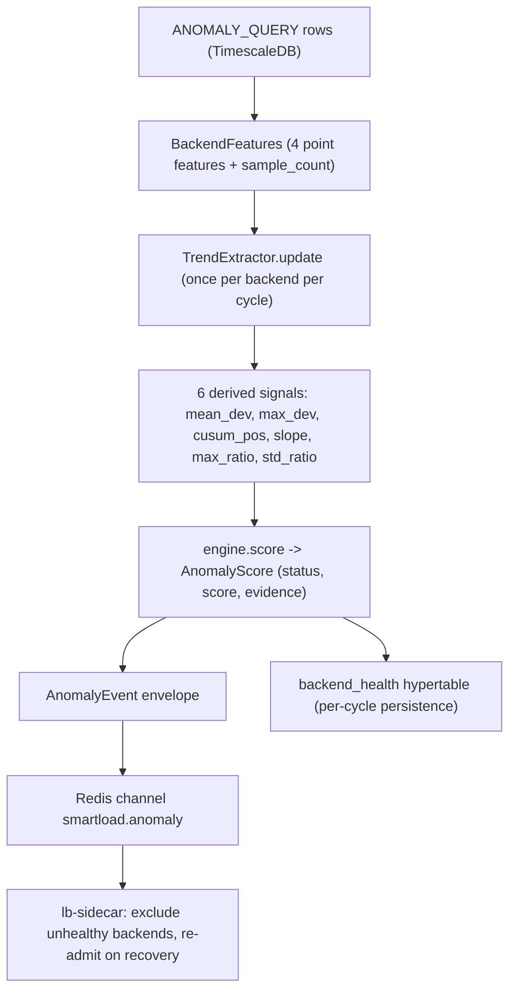
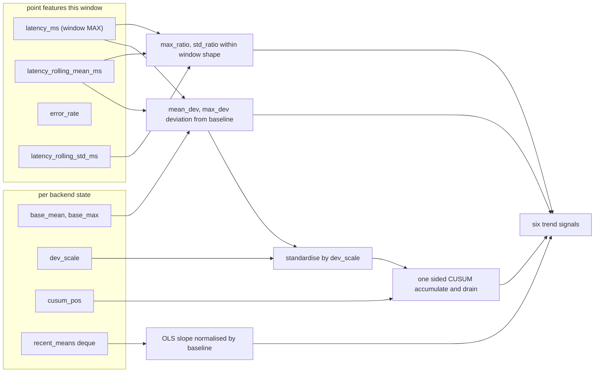
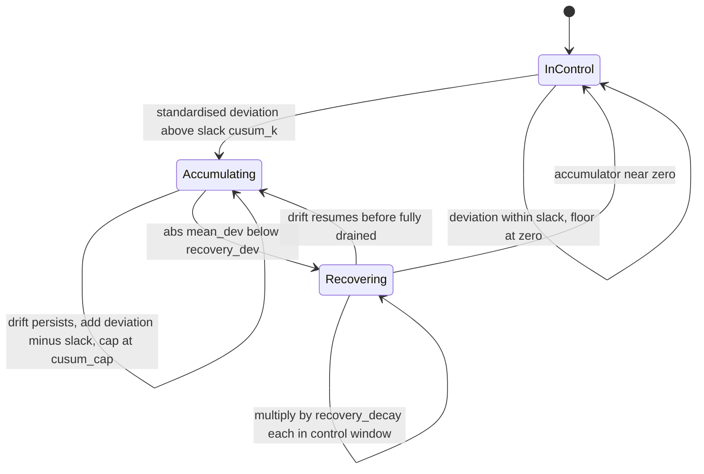
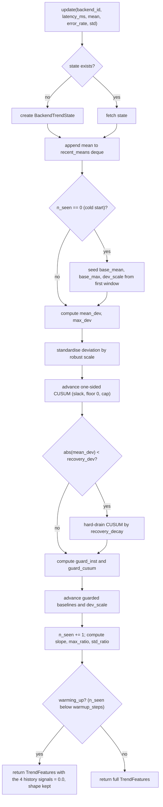
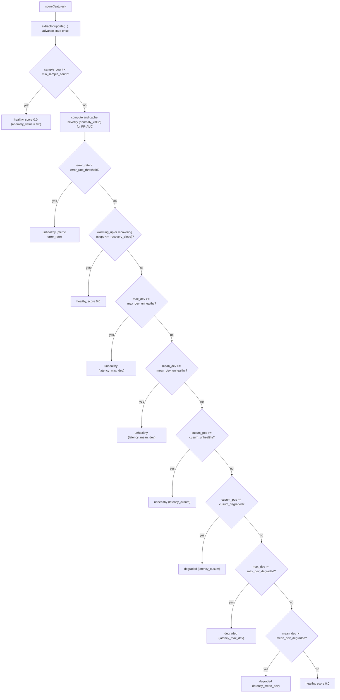
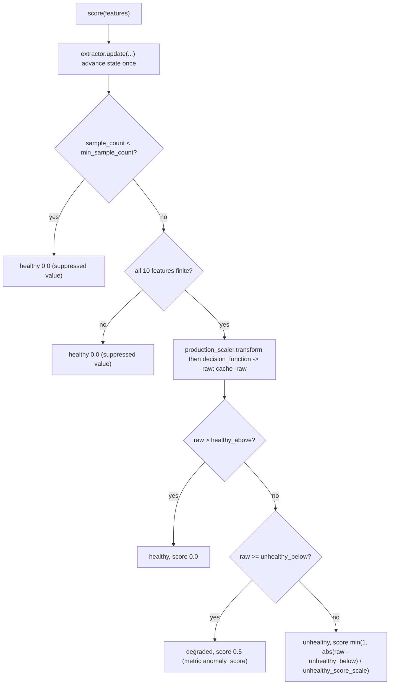
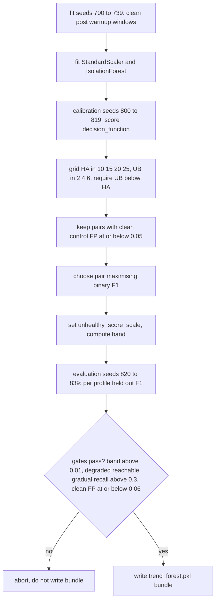
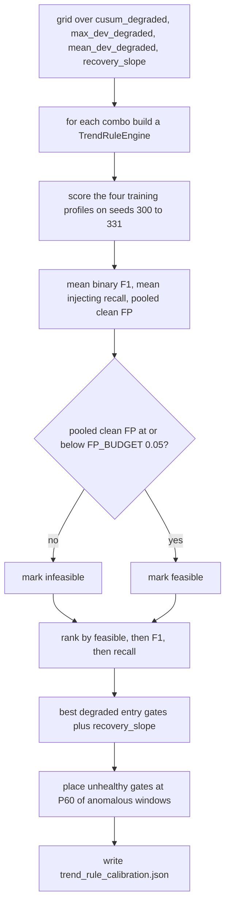

# Module reference: anomaly-detector (trend-aware engines)

This document is the internals reference for the trend-aware part of SmartLoad's
anomaly plane: the two new engines `trend_rule` and `trend_forest`, and the
shared temporal feature extractor in `features/trend.py` that both consume. It is
the source of truth for the corresponding thesis chapter. Every number, formula,
and decision step below is taken from the source files and the benchmark report
listed at the end; nothing is approximated.

The reader is assumed to already know the wider anomaly slice (per-cycle health
scoring, `AnomalyEvent` on `smartload.anomaly`, lb-sidecar exclusion). That
context is summarised here only as far as the trend engines need it.

---

## 1. Overview

### 1.1 What the anomaly plane does

The anomaly plane scores the health of each backend once per poll cycle. The run
loop reads a window of per-request telemetry for every backend out of TimescaleDB
(`ANOMALY_QUERY` in `services/shared/queries.py`), packs it into a
`BackendFeatures` record, and asks the configured engine to classify it as one of
three statuses: `healthy`, `degraded`, or `unhealthy`. The verdict becomes an
`AnomalyEvent` envelope published on the Redis channel `smartload.anomaly`. The
lb-sidecar consumes that channel and removes unhealthy backends from the upstream
pool (and re-admits them when they recover). Operators see the verdicts live and
the verdict is also persisted per cycle to the `backend_health` hypertable.

A status of `degraded` or `unhealthy` carries an optional evidence triple,
`(metric, observed_value, threshold)`, so a verdict can say which signal tripped
and what boundary it crossed without the consumer re-deriving it.

### 1.2 The core problem: gradual degradation

The run loop emits four *point* features per window, each an aggregate over that
window in isolation:

| point feature | definition |
|---|---|
| `latency_ms` | MAX of `request_latency_ms` over the window |
| `latency_rolling_mean_ms` | AVG of `request_latency_ms` over the window |
| `latency_rolling_std_ms` | STDDEV of `request_latency_ms` over the window |
| `error_rate` | AVG of `error_rate` over the window |

These describe one window and carry no history. A backend whose latency drifts
slowly upward (a memory leak, a saturating connection pool, a degrading disk)
looks identical window by window to a backend that is simply, steadily slow. A
gradual ramp scales every per-request latency in the window by the same factor,
so the within-window *shape* (max/mean, std/mean) is preserved and only the
absolute level rises relative to the backend's own normal.

The benchmark report measures exactly this on a gradual trace:

| | clean windows | during ramp |
|---|---|---|
| max / mean ratio | 1.79 | 1.76 |
| std / mean ratio | 0.21 | 0.21 |
| mean latency | 20.4 ms | rises to 44 ms |

Every shipped engine is stateless per window. `threshold` compares MAX to MEAN, a
constant ratio that never trips, so its recall on gradual degradation is 0. The
Isolation Forests were fit on a healthy region spanning roughly 20 to 600 ms with
that same shape, so a backend drifting from 20 ms to 44 ms is still inside the
healthy region, again recall 0. The gap is not model capacity, it is a missing
feature: a slow drift is only anomalous relative to the backend's own established
baseline, and nothing in the point vector carries that baseline.

### 1.3 The two new engines

The fix is feature engineering. `features/trend.py` holds a small amount of
per-backend state across cycles and from the stream of point features derives
six backend-relative temporal signals. Two engines consume them:

- **`trend_rule`** is the interpretable engine: transparent rules over the
  temporal signals, no model artifact. It is now the **deployed compose default**
  (`ANOMALY_ENGINE=trend_rule`, run at `flip_confirmation_cycles=2`): it closes the
  gradual-degradation gap (F1 0.000 → 0.845) with 0.000 clean-control false
  positives, and does not share the Isolation-Forest over-exclusion mode that
  forced the v1.0.7an revert to `threshold`.
- **`trend_forest`** is the trained counterpart: a scikit-learn IsolationForest
  scored over the enriched ten-dimensional vector. It confirms that the feature
  engineering carries over to a learned model.

Both are stateful, both are additive and selectable (nothing was removed), and
both share the same extractor.

---

## 2. File map

| path | role |
|---|---|
| `services/anomaly-detector/engine_base.py` | `AnomalyEngine` ABC, `BackendFeatures` and `AnomalyScore` dataclasses, `select_engine` factory |
| `services/anomaly-detector/features/trend.py` | shared temporal feature extractor: `TrendExtractor`, `TrendConfig`, `TrendFeatures`, `BackendTrendState`, the feature-order constants |
| `services/anomaly-detector/engines/trend_rule/engine.py` | `TrendRuleEngine`: interpretable three-channel rule engine |
| `services/anomaly-detector/engines/trend_rule/README.md` | engine README, including the 8-seed raw result table |
| `services/anomaly-detector/engines/trend_forest/engine.py` | `TrendForestEngine`: trained IsolationForest over the enriched vector |
| `services/anomaly-detector/engines/trend_forest/README.md` | engine README, feature vector, tiering, bundle schema |
| `tools/anomaly-training/train_trend.py` | trains the `trend_forest` bundle: enriched dataset, quantile threshold placement, F1 maximisation under a clean-control FP constraint, seed disjointness |
| `tools/anomaly-training/calibrate_trend.py` | calibrates the `trend_rule` default thresholds |
| `services/anomaly-detector/engines/threshold/engine.py` | baseline rule engine (context) |
| `services/anomaly-detector/engines/isolation_forest/engine.py` | trained point-feature engine (context, and the tiering pattern `trend_forest` mirrors) |
| `experiments/anomaly-detection-bench/REPORT.md` | full benchmark write-up: profiles, per-profile F1/recall/FP, PR-AUC, the gradual gap |

---

## 3. Anomaly plane data flow

The trend engines slot into the existing per-cycle path. The one structural
addition is that the extractor's `update` is the single state-advancing call per
backend per cycle: the engine advances state exactly once and then reads it.



`select_engine(name, **kwargs)` in `engine_base.py` is the factory that returns
the instance at startup; it maps the names `threshold`, `isolation_forest`,
`trend_rule`, and `trend_forest`, and raises `ValueError` for anything else.

---

## 4. The temporal feature extractor (`features/trend.py`)

The extractor turns the four stateless point features into ten enriched features:
the same four passed through, plus six backend-relative temporal signals. Three of
the new signals lean on per-backend state carried across cycles (the guarded
baselines, the deviation scale, the CUSUM accumulator, and the recent-means
history); the two shape ratios need no state at all. The diagram below is the
whole pipeline at a glance; the subsections then take each stage in turn.



### 4.1 Feature order

The module fixes three ordered tuples. The trend block is appended to the point
block to form the enriched vector that `trend_forest` is trained on, so the order
must stay stable or the model is retrained.

```
POINT_FEATURE_ORDER  = (latency_ms, latency_rolling_mean_ms, error_rate, latency_rolling_std_ms)
TREND_FEATURE_ORDER  = (mean_dev, max_dev, cusum_pos, slope, max_ratio, std_ratio)
ENRICHED_FEATURE_ORDER = POINT_FEATURE_ORDER + TREND_FEATURE_ORDER
```

### 4.2 The six derived signals

Throughout, `mean` is `latency_rolling_mean_ms` for the current window and `mx`
is `latency_ms` (the window MAX). `base_mean` and `base_max` are the per-backend
guarded EWMA baselines carried in state. The signals are computed as follows.

| signal | what it measures | how computed |
|---|---|---|
| `mean_dev` | relative deviation of the window mean from the backend's own slow baseline; the headline gradual-degradation signal | `(mean - base_mean) / base_mean` |
| `max_dev` | same for the window MAX; a spike lifts this sharply even when the mean barely moves | `(mx - base_max) / base_max` |
| `cusum_pos` | one-sided CUSUM of the standardised mean deviation; accumulates small persistent shifts so a slow ramp trips it before any one window looks abnormal | running accumulator, see 4.4 |
| `slope` | OLS slope of recent window means, normalised by the baseline, so a dimensionless fraction-of-normal per step; positive is onset, negative is recovery | OLS fit, see 4.3 |
| `max_ratio` | MAX over mean, the within-window shape (high for a spiky window) | `mx / mean` when `mean > 1e-9` else `0.0` |
| `std_ratio` | STD over mean, the within-window dispersion (high for a spiky window) | `latency_rolling_std_ms / mean` when `mean > 1e-9` else `0.0` |

`max_ratio` and `std_ratio` are pure shape and are reported even during warmup;
the four history-dependent signals are suppressed during warmup (4.7).

### 4.3 The OLS slope

`_slope` fits an ordinary-least-squares line over the most recent `slope_window`
window means (the state keeps the last 64 means in a `deque`, the fit uses up to
`slope_window = 10`). With fewer than two points it returns `0.0`. The raw slope
is `sum(x_centred * y_centred) / sum(x_centred^2)`, and it is divided by the
baseline mean (or the local mean if the baseline is not yet established) to make
it a fraction-of-normal per step. A zero or negative `x` variance also returns
`0.0`.

### 4.4 The CUSUM accumulator and recovery drain

The deviation is first standardised by a robust scale: `dev_scale` is an EWMA of
`|mean - base_mean|`, floored at `scale_floor_frac` of the baseline so a perfectly
flat clean stream still has a finite, non-zero scale and does not divide by zero.
The standardised deviation is `(mean - base_mean) / scale`.

The one-sided positive CUSUM then accumulates only upward (latency-increasing)
drift, bleeds off through the slack `cusum_k`, is floored at zero and capped at
`cusum_cap`:

```
cusum_pos = min(cusum_cap, max(0.0, cusum_pos + standardised - cusum_k))
```

Classical CUSUM would drain only at the slack rate of about one unit per step
after the level returns to baseline, which leaves a long false-positive overhang
after an anomaly clears. To avoid that tail, when the current deviation is back
inside `recovery_dev` (the window is clearly back in control) the accumulator is
hard-drained by a multiplicative factor `recovery_decay`:

```
if abs(mean_dev) < recovery_dev:
    cusum_pos *= recovery_decay
```

This makes recovery fast without touching accumulation during a real drift, where
the deviation stays large and the branch is not taken.

The accumulator therefore moves through three regimes per window. In control it
is held near zero, either by the slack subtraction or by the hard-drain. Under a
sustained upward drift it climbs, one slack-reduced increment at a time, until it
crosses the drift gates. Once the level returns inside `recovery_dev` it collapses
geometrically rather than bleeding off slowly.



The cap at `cusum_cap` keeps a single large spike from launching the accumulator
far past the unhealthy gate, and the floor at zero keeps a long quiet stretch from
driving it negative and masking the next real drift. The table below names each
move in the loop body.

| state | trigger | accumulator update |
|---|---|---|
| in control | standardised deviation at or below `cusum_k` | floored at 0 by the `max(0.0, ...)` term |
| accumulating | standardised deviation above `cusum_k` | `+ standardised - cusum_k`, capped at `cusum_cap` |
| recovering | `abs(mean_dev) < recovery_dev` | `*= recovery_decay` (geometric drain) |

### 4.5 The contamination-guarded baseline

A plain EWMA baseline chases a slow ramp: it drags itself up to meet the rising
level, which erases the very deviation being measured and is exactly why a naive
baseline scores a slow ramp at near-zero signal. The extractor damps the baseline
update while an anomaly is in progress. Two guards multiply, each `1` in the
normal regime and falling smoothly toward `0` as the anomaly asserts itself:

- an instantaneous guard on the current deviation:
  `guard_inst = max(0, 1 - max(0, |mean_dev| - guard_dev) / guard_dev)`
- a CUSUM guard that freezes the baseline once persistent drift is detected:
  `guard_cusum = max(0, 1 - max(0, cusum_pos - freeze_cusum) / freeze_cusum)`

The effective learning rate is `baseline_alpha * min(guard_inst, guard_cusum)`,
applied to `base_mean`, `base_max`, and (with `scale_alpha`) to `dev_scale`. The
two guards are summarised below.

| guard | reads | value in normal regime | what it does under anomaly |
|---|---|---|---|
| `guard_inst` | current `abs(mean_dev)` against `guard_dev` | 1 while deviation is at or below `guard_dev` | falls toward 0 as the instantaneous deviation grows, damping the update |
| `guard_cusum` | `cusum_pos` against `freeze_cusum` | 1 while drift is below `freeze_cusum` | falls toward 0 once persistent drift is confirmed, freezing the baseline |

The smaller of the two wins, so either a single sharp window or a confirmed slow
drift is enough to stop the baseline from learning the anomaly. The report records
that with this guard `mean_dev` grows to about 1.1 during a ramp instead of
collapsing to zero.

### 4.6 The per-cycle update



### 4.7 Statefulness, reset, and warmup

State is one `BackendTrendState` per `backend_id`, held in a dict on the
`TrendExtractor`. The contract is that `update` is called once per backend per
cycle, in time order. On a never-seen `backend_id` the state is created lazily and
the cold-start branch seeds the baselines from that first window. `reset` clears
all state (used when an independent evaluation trace begins, equivalent to a
backend coming online fresh); `reset_backend(id)` drops one backend.

Warmup suppression is the cold-start guard. `warming_up` is true until
`warmup_steps` (default 12) windows have been seen for that backend. While true,
the four history-dependent signals (`mean_dev`, `max_dev`, `cusum_pos`, `slope`)
are reported as `0.0`, so a cold start can never manufacture a latency alert. The
baselines and CUSUM still advance underneath during warmup; only the reported
signals are zeroed. The two shape ratios are still reported during warmup because
they need no history.

### 4.8 TrendConfig defaults

The tunables and their calibrated defaults (from `features/trend.py`):

| field | default | role |
|---|---|---|
| `warmup_steps` | 12 | windows observed before the trend signals are trusted |
| `baseline_alpha` | 0.08 | EWMA weight for the slow baseline (about 12-step memory) |
| `guard_dev` | 0.12 | `|mean_dev|` above this starts damping the baseline update |
| `freeze_cusum` | 3.0 | `cusum_pos` above this freezes the baseline (drift suspected) |
| `slope_window` | 10 | windows used for the OLS slope fit |
| `cusum_k` | 0.5 | CUSUM slack in scale units; drift must exceed this to accumulate |
| `cusum_cap` | 25.0 | ceiling on `cusum_pos` so a spike cannot run it away |
| `recovery_dev` | 0.08 | `|mean_dev|` below this means back in control, hard-drain CUSUM |
| `recovery_decay` | 0.40 | multiplicative CUSUM decay per in-control window |
| `scale_alpha` | 0.08 | EWMA weight for the robust deviation scale |
| `scale_floor_frac` | 0.05 | scale floor as a fraction of the baseline (avoids divide-by-zero on flat streams) |

These defaults are calibrated on production-shaped streams at seeds disjoint from
any evaluation set.

---

## 5. `trend_rule` in depth

`TrendRuleEngine` is the interpretable stateful engine. It owns one shared
`TrendExtractor` and evaluates three channels per backend per cycle. The worst
channel wins. A continuous `anomaly_value` in `[0, 1]` is exposed for PR-AUC.

### 5.1 The three channels

| channel | signal | catches |
|---|---|---|
| error | `error_rate` against `error_rate_threshold` | error-burst; always live, no history needed |
| spike | `max_dev` and `mean_dev` against the backend's own baseline | a latency spike, trips on the first window |
| drift | `cusum_pos` | gradual degradation, accumulates a slow ramp until it trips |

### 5.2 Channel gates and the calibrated defaults

Each latency channel has a degraded gate and an unhealthy gate. The error channel
is single-tier and always sets `unhealthy`. The default gate values are the output
of `calibrate_trend.py` (see section 7) and recorded in
`trend_rule_calibration.json`:

| gate | default | tier |
|---|---|---|
| `error_rate_threshold` | 0.05 | unhealthy (error channel) |
| `cusum_degraded` | 2.0 | degraded (drift) |
| `cusum_unhealthy` | 25.0 | unhealthy (drift) |
| `max_dev_degraded` | 0.50 | degraded (spike) |
| `max_dev_unhealthy` | 0.863 | unhealthy (spike) |
| `mean_dev_degraded` | 0.12 | degraded (spike) |
| `mean_dev_unhealthy` | 0.72 | unhealthy (spike) |
| `recovery_slope` | 0.02 | suppressor |
| `min_sample_count` | 10 | data-quality gate |

A point that the code makes explicit: the primary `status != healthy` boundary is
set by the degraded-entry gates plus the recovery slope. The unhealthy gates only
set the tiering and severity; they do not change the binary healthy-versus-not
decision. `latency_multiplier` is accepted for `select_engine` parity with the
other engines but is unused here.

### 5.3 The recovery-slope suppressor

A backend whose latency is steeply falling is recovering, not degrading, so the
engine should not raise or sustain a latency alarm on it. The engine treats the
backend as recovering when `slope <= -recovery_slope`. While recovering, all three
latency gates are skipped (the error channel still fires). This is what clears the
post-injection tail, where a wide window still straddles a just-ended anomaly,
quickly rather than paging on a backend that is visibly getting better.

### 5.4 Decision flow (worst channel wins)



Two ordering details from the code. First, `update` is always called, even on a
low-sample or warming window, so the baseline and CUSUM stay aligned with
wall-clock cycles; only the verdict is gated. Second, the continuous severity is
cached for every window (including healthy ones) before the tier thresholding
collapses healthy verdicts to score `0.0`, so the PR-AUC curve sweeps a real
operating range.

### 5.5 Severity (the continuous anomaly value)

`_severity` returns a bounded value that rises with the strongest channel. Each
channel is normalised by its unhealthy threshold, so `1.0` means at the unhealthy
boundary on at least one channel:

```
severity = max(0,
               error_rate / error_rate_threshold,
               cusum_pos  / cusum_unhealthy,
               max_dev    / max_dev_unhealthy,
               mean_dev   / mean_dev_unhealthy)
```

The result is clamped to `min(1.0, ...)` in `score` and read back by
`last_anomaly_value()` for the benchmark's PR-AUC.

### 5.6 Verdict tiering table

| condition (in order, after the gates above) | status | score | metric |
|---|---|---|---|
| `sample_count < min_sample_count` | healthy | 0.0 | none |
| `error_rate > error_rate_threshold` | unhealthy | severity | `error_rate` |
| warming up or recovering | healthy | 0.0 | none |
| `max_dev >= max_dev_unhealthy` | unhealthy | severity | `latency_max_dev` |
| `mean_dev >= mean_dev_unhealthy` | unhealthy | severity | `latency_mean_dev` |
| `cusum_pos >= cusum_unhealthy` | unhealthy | severity | `latency_cusum` |
| `cusum_pos >= cusum_degraded` | degraded | severity | `latency_cusum` |
| `max_dev >= max_dev_degraded` | degraded | severity | `latency_max_dev` |
| `mean_dev >= mean_dev_degraded` | degraded | severity | `latency_mean_dev` |
| otherwise | healthy | 0.0 | none |

---

## 6. `trend_forest` in depth

`TrendForestEngine` is the trained counterpart: a scikit-learn IsolationForest
scored over the enriched ten-dimensional vector. It is stateful in exactly the
same way as `trend_rule`: it owns one `TrendExtractor`, calls `update` once per
cycle (the single state-advancing call), then reads the derived signals.

### 6.1 The enriched vector and inference path

The engine builds the ten-element vector in `ENRICHED_FEATURE_ORDER`: the four
point features followed by `mean_dev, max_dev, cusum_pos, slope, max_ratio,
std_ratio`. It applies the bundle's `production_scaler` and calls
`model.decision_function`, then negates the raw score for the continuous severity
(higher is more anomalous) used by PR-AUC.



A non-finite vector (a DB hiccup producing NULL/NaN aggregates) is treated as
insufficient data and returns healthy, because `StandardScaler` would otherwise
propagate NaN and `decision_function` would return NaN and fall through to a
spurious unhealthy. This mirrors `IsolationForestEngine`.

### 6.2 Verdict tiering table

| condition | status | score |
|---|---|---|
| `sample_count < min_sample_count` or non-finite vector | healthy | 0.0 |
| `raw > healthy_above` | healthy | 0.0 |
| `unhealthy_below <= raw <= healthy_above` | degraded | 0.5 |
| `raw < unhealthy_below` | unhealthy | `min(1, abs(raw - unhealthy_below) / unhealthy_score_scale)` |

The thresholds default to `healthy_above = 0.05`, `unhealthy_below = -0.05`,
`unhealthy_score_scale = 0.5` if absent from the bundle, but in practice they come
from the calibrated bundle. `latency_multiplier` and `error_rate_threshold` are
accepted for `select_engine` parity but are unused at inference; the decision
boundaries are the bundle's baked-in calibrated thresholds. `min_sample_count`
remains a runtime data-quality gate.

### 6.3 Quantile threshold placement (training)

`train_trend.py` produces the bundle. It is the temporal analogue of the
point-feature pipeline and follows the same structure.

1. Build the enriched dataset by driving every (seed, profile) trace through a
   fresh `TrendExtractor` (reset per trace so its state mirrors an independent
   backend coming online), collecting the ten-element vector, label, profile, and
   warmup flag for each window.
2. Fit a `StandardScaler` and an `IsolationForest` (`n_estimators = 200`,
   `contamination = 0.04`, `random_state = 42`) on the clean operating region:
   label-0, post-warmup windows across all profiles.
3. Place the two thresholds by quantiles of `decision_function` over the clean
   reference (label-0, post-warmup) windows of the calibration set. `healthy_above`
   is the `HA`-th percentile and `unhealthy_below` is the `UB`-th percentile of
   those clean scores.
4. Search a small quantile grid (`HA` in {10, 15, 20, 25}, `UB` in {2, 4, 6},
   requiring `UB < HA`) and choose the pair that maximises binary F1
   (`status != healthy`) on the calibration set, subject to a clean false-positive
   constraint: the operational FP-rate is measured on the `clean-control` profile
   (which injects nothing, so all its post-warmup windows are truly healthy), and
   that rate must be at most `MAX_CLEAN_FPR = 0.05`. The clean-control rate is
   used rather than the wider clean-reference fraction, which is locked to about
   `HA/100` by construction.
5. Set `unhealthy_score_scale` to span from `unhealthy_below` to the most
   anomalous calibration score, floored at 0.05.
6. Evaluate on the held-out evaluation seeds and print a per-profile F1 table.
7. Enforce acceptance gates before writing the bundle: a non-degenerate band
   (`band > 0.01`), a reachable degraded tier, gradual-degradation recall above
   0.3, and clean-control FP-rate at most 0.06. If any gate fails the bundle is
   not written.

The three seed ranges play three separate roles, and the gate at the end is what
lets the trainer refuse to ship a degenerate model.



### 6.4 Bundle contents and load-time validation

The bundle is a dict:

```
{ model, smd_scaler, production_scaler, feature_order, thresholds, metadata }
```

In the enriched feature space the single fitted scaler is the production scaler;
`smd_scaler` is kept only for format compatibility with the point-feature bundles.
`thresholds` holds `healthy_above`, `unhealthy_below`, `unhealthy_score_scale`.
`metadata` records the seeds, chosen quantiles, band width, sklearn/numpy
versions, and held-out metrics.

On load the engine validates the bundle and falls back to the rule engine on
mismatch: it requires a dict with `model` and `production_scaler` keys, and it
requires `feature_order` to equal `ENRICHED_FEATURE_ORDER` exactly. Either failure
raises `ValueError` so bootstrap can fall back to `trend_rule`.

### 6.5 Seed disjointness

`train_trend.py` uses fit seeds `700..739`, calibration seeds `800..819`, and
evaluation seeds `820..839`. These are disjoint from the benchmark evaluation
seeds `1..8` and from the rule-engine calibration seeds `300..331`, so there is
no leakage.

---

## 7. Calibrating `trend_rule` (`calibrate_trend.py`)

The rule engine's defaults are produced by `calibrate_trend.py`, which tunes only
the binary-relevant knobs. Because the benchmark's primary metrics binarise the
three-tier status as `status != healthy`, that boundary depends entirely on the
degraded-entry gates plus the recovery suppressor; the degraded-versus-unhealthy
split changes only the three-tier confusion matrix. So the script grid-searches:

| knob | grid |
|---|---|
| `cusum_degraded` | 2.0, 3.0, 4.0, 5.0 |
| `max_dev_degraded` | 0.30, 0.40, 0.50 |
| `mean_dev_degraded` | 0.12, 0.15, 0.18, 0.22 |
| `recovery_slope` | 0.02, 0.03, 0.04 |

It chooses the combination that maximises mean binary F1 across the four training
profiles on calibration seeds `300..331`, subject to a pooled clean-traffic
false-positive rate at most `FP_BUDGET = 0.05` (mean recall on the injecting
profiles is the tie-breaker). The unhealthy (severity) thresholds, which only
affect tiering, are then placed at the 60th percentile of the corresponding signal
over anomalous post-warmup windows. The result is written to
`trend_rule_calibration.json`. Calibration seeds `300..331` are disjoint from the
benchmark eval seeds `1..8` and from the `trend_forest` seeds `700..839`.

The selection is ranked lexicographically: feasibility first (the pooled clean
false-positive rate must clear the budget), then mean F1, then mean recall on the
injecting profiles as a tie-breaker. The flow is as follows.



---

## 8. Benchmark results

### 8.1 Experimental setup

All cells are mean plus or minus 95% t-confidence interval over 8 seeds (eval
seeds `1..8`), under `sklearn 1.3.2` and `numpy 1.26.4`. The setup has three
properties worth stating:

- **8 seeds.** Each profile is run on eval seeds `1..8`.
- **Disjoint calibration and evaluation seeds.** `trend_rule` is calibrated on
  `300..331`, `trend_forest` fits/calibrates/evaluates on `700..739`/`800..819`/
  `820..839`, and the benchmark scores `1..8`. All disjoint, no leakage.
- **A held-out `partial-failure` profile.** A ramping fraction of slow and
  erroring requests, a bimodal within-window shape that no engine trains or
  calibrates on, used to test generalization. A second held-out profile,
  `flappy-clean` (healthy traffic with wide jitter), tests behaviour on noisy
  telemetry.

### 8.2 Per-profile primary metrics (raw, 8 seeds)

From the benchmark REPORT:

| profile | engine | F1 | recall | FP-rate |
|---|---|---|---|---|
| latency-spike | isolation_forest_retrained | 0.803 ± 0.092 | 0.741 ± 0.117 | 0.029 ± 0.022 |
| latency-spike | trend_rule | 0.959 ± 0.026 | 0.963 ± 0.047 | 0.013 ± 0.003 |
| latency-spike | trend_forest | 0.799 ± 0.030 | 1.000 ± 0.000 | 0.155 ± 0.029 |
| error-burst | isolation_forest_retrained | 0.892 ± 0.012 | 0.956 ± 0.015 | 0.057 ± 0.003 |
| error-burst | trend_rule | 0.892 ± 0.016 | 0.928 ± 0.017 | 0.047 ± 0.005 |
| error-burst | trend_forest | 0.851 ± 0.020 | 0.959 ± 0.025 | 0.091 ± 0.022 |
| gradual-degradation | isolation_forest_retrained | 0.000 ± 0.000 | 0.000 ± 0.000 | 0.000 ± 0.000 |
| gradual-degradation | trend_rule | 0.845 ± 0.012 | 0.791 ± 0.016 | 0.025 ± 0.003 |
| gradual-degradation | trend_forest | 0.743 ± 0.036 | 0.884 ± 0.022 | 0.154 ± 0.034 |
| partial-failure (held-out) | isolation_forest_retrained | 0.882 ± 0.008 | 0.966 ± 0.016 | 0.069 ± 0.000 |
| partial-failure (held-out) | trend_rule | 0.921 ± 0.006 | 1.000 ± 0.000 | 0.052 ± 0.004 |
| partial-failure (held-out) | trend_forest | 0.772 ± 0.039 | 1.000 ± 0.000 | 0.183 ± 0.042 |
| clean-control (FP only) | isolation_forest_retrained | n/a | n/a | 0.000 ± 0.000 |
| clean-control (FP only) | trend_rule | n/a | n/a | 0.000 ± 0.000 |
| clean-control (FP only) | trend_forest | n/a | n/a | 0.046 ± 0.043 |
| flappy-clean (FP only, noisy) | isolation_forest_retrained | n/a | n/a | 0.000 ± 0.000 |
| flappy-clean (FP only, noisy) | threshold | n/a | n/a | 0.980 ± 0.018 |
| flappy-clean (FP only, noisy) | z-score | n/a | n/a | 0.594 ± 0.106 |
| flappy-clean (FP only, noisy) | trend_rule | n/a | n/a | 0.034 ± 0.048 |
| flappy-clean (FP only, noisy) | trend_forest | n/a | n/a | 1.000 ± 0.000 |

The `trend_rule` README reports the same engine's raw per-profile figures
(without confidence intervals): latency-spike F1 0.959 recall 0.963 FP 0.013;
error-burst F1 0.892 recall 0.928 FP 0.047; gradual-degradation F1 0.845 recall
0.791 FP 0.025; partial-failure (held-out) F1 0.921 recall 1.000 FP 0.052;
clean-control FP 0.000; flappy-clean (noisy) FP 0.034.

### 8.3 The headline contribution

The gradual-degradation row is the contribution. The report states it in one
line: `trend_rule` takes gradual-degradation from F1 0.000 to 0.845 (recall
0.791), where the retrained Isolation Forest sits at exactly 0.000 F1 and 0.000
recall. `trend_rule` also beats the retrained Isolation Forest on latency-spike
(0.803 to 0.959), ties it on error-burst (both about 0.892, since error-burst's
only signal is `error_rate` thresholded at 0.05), and generalizes best to the
held-out partial-failure profile (F1 0.921, best of all contenders), while keeping
clean-control false positives at 0.000.

### 8.4 PR-AUC (ungated ranking quality)

| metric | trend_rule | retrained IF | z-score | trend_forest |
|---|---|---|---|---|
| gradual-degradation PR-AUC | 0.700 ± 0.084 | 0.489 | 0.285 | n/a |
| pooled PR-AUC | 0.795 | n/a | n/a | 0.796 |

`trend_rule` has the highest gradual-degradation PR-AUC by far and the best pooled
PR-AUC, tied with `trend_forest` (0.795 versus 0.796).

### 8.5 Stability gate note

The report recommends running `trend_rule` at `flip_confirmation_cycles = 2`. On
the pooled metric, `gate-2` lifts F1 from 0.742 to 0.804 for only plus 1.0 s of
detection latency (2.8 to 3.8 s); `gate-3` over-confirms (F1 0.781, plus 2.0 s).
The gate is a flap filter that absorbs transient single-cycle flips, not a
sensitivity fix.

---

## 9. Caveats and limitations

- **`trend_forest` is more trigger-happy.** On the injecting profiles its FP-rate
  is 0.15 to 0.18 (latency-spike 0.155, gradual-degradation 0.154, partial-failure
  0.183), well above `trend_rule`, and on the noisy `flappy-clean` profile it
  alarms on every window (FP 1.000) because the unsupervised forest reacts to the
  jittery MAX through `max_dev` and has no notion of recovering or of this just
  being noise. `trend_rule` encodes both directly through its slope suppressor and
  bounded CUSUM, so its `flappy-clean` FP is 0.034. For this reason `trend_rule`
  is the recommended default of the two, and the preferred engine on the
  safety-critical isolation path; `trend_forest` ships as a selectable alternative
  and as confirmation that the gap was features, not models.
- **Error-burst is at parity, not a win.** Error-burst's only signal is
  `error_rate`; every engine thresholding it at 0.05 lands at F1 about 0.892.
  `trend_rule` matches that rather than beating it. The win is that it adds the
  gradual, spike, and generalization gains at no cost to the profiles already
  solved.
- **The gradual-degradation gap is the headline contribution.** Lifting
  gradual-degradation from F1 0.000 (recall 0.000) to F1 0.845 (recall 0.791) is
  the result the module exists to deliver; the other profiles are held at or above
  the prior best.
- **Synthetic calibration.** The thresholds are calibrated on synthetic
  production-shaped streams. The report's suggested follow-up before production is
  to validate `trend_rule` against real labelled faults injected into the live
  stack to confirm the calibration transfers, and to add a per-endpoint baseline
  variant for backends with multimodal traffic.
