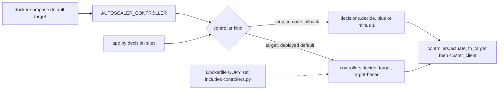
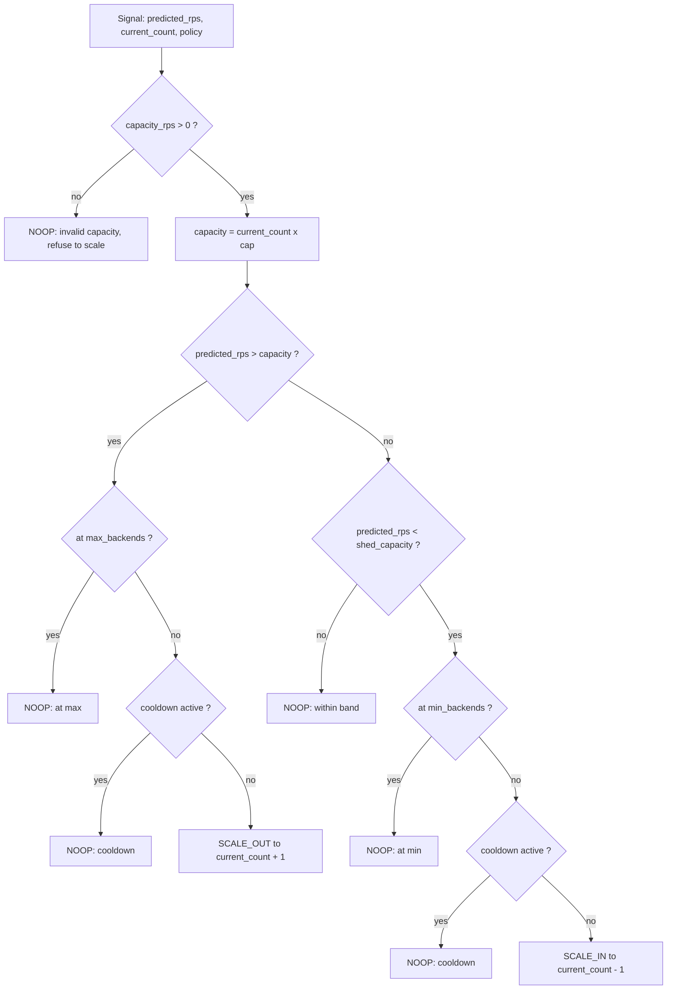
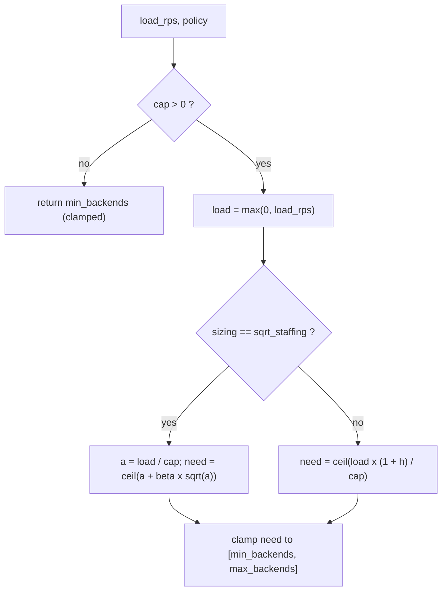
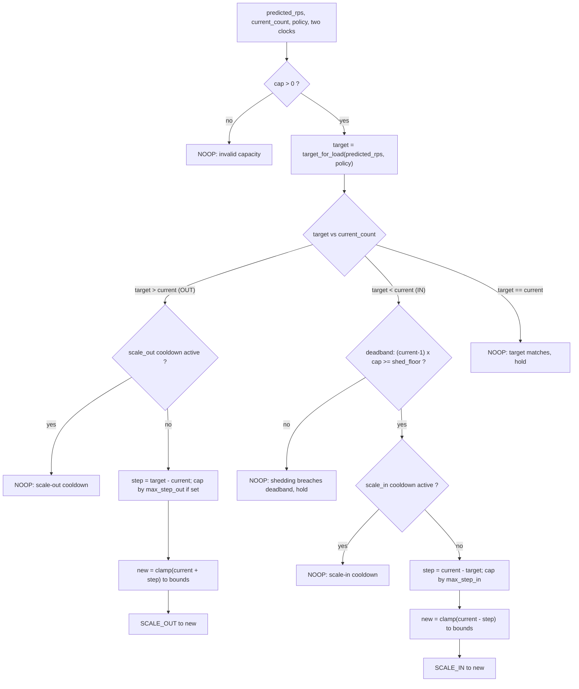

# Autoscaler internals reference

Module: `services/autoscaler`. Subject: the target-based scaling controller
introduced in PR #169 and how it relates to the live decision path.

This is an engineering reference, written to be the source of truth for the
autoscaling chapter. Every formula, number, and step below is taken from the
module source and the benchmark reports under
`experiments/autoscaler-strategy-bench`. Benchmark figures are quoted exactly
as the reports record them.

---

## 1. Overview

The autoscaler sizes the pool of test backends that the load-balancer dispatches
to. On each tick it reads a request-rate signal (a forward forecast when one is
available, a trailing measurement when it is not), compares the implied demand to
the pool's current serving capacity, and emits one of three actions: scale out,
scale in, or hold. Every action is recorded to the audit log with a
human-readable reason, and an operator can override the pool through the manual
path. The decision logic itself is a pure function of its inputs, with no I/O,
no clock, and no Redis access, so it can be unit-tested from a single `pytest`
invocation and replayed inside the strategy benchmark.

### 1.1 The contribution of PR #169

The shipped decision rule (`decisions.decide`) is a bang-bang controller: it
moves the pool by exactly one backend per action, and only when the predicted
load crosses the current capacity boundary. Combined with the warm-up delay and
the cooldown timer, this caps the pool's slew rate at one instance per cooldown
window. PR #169 adds a second, principled decision module
(`controllers.decide_target`) that sizes the pool directly to a target instance
count and jumps multiple steps in a single action. It also separates scale-out
from scale-in cooldown (fast out, slow in) and adds a scale-in deadband to damp
oscillation. The benchmark shows this lifts SLA compliance from the shipped
77.2 % to 98.3 % on the same input signal, and breaks the flash-crowd "spike
ceiling" that pinned even the perfect-foresight oracle at 88.0 %.

### 1.2 Implementation status: wired, and the deployed default

The target-based controller is implemented (`controllers.py`), unit-tested (the
controller decisions plus the app-level wiring), and benchmarked (synthetic,
real-trace, and frontier results below). It is wired into the serving path
behind a controller selector, and it is the controller the stack runs when it is
brought up with the committed Compose file.

There are two distinct defaults, and they differ on purpose. The selector is
read once at boot from `AUTOSCALER_CONTROLLER`:

- the in-code fallback in `app.py` is `step`, so a bare `python app.py` (and the
  integration and end-to-end suites, which import or launch the service without
  setting the variable) exercises the unchanged single-step path;
- the deployed value comes from `docker-compose.yml`, which sets
  `AUTOSCALER_CONTROLLER: ${AUTOSCALER_CONTROLLER:-target}`. With no operator
  override the Compose substitution resolves to `target`, so the running
  container selects the target-based controller.

`.env.example` does not set `AUTOSCALER_CONTROLLER`, so the Compose `:-target`
fallback is what takes effect on a default deployment. An operator who wants the
plus-or-minus-one rule sets `AUTOSCALER_CONTROLLER=step` in the environment.

The benchmark margin behind making `target` the deployed default: 98.3 % SLA on
the moving-average signal and 99.2 % on the forward forecast, against the
plus-or-minus-one rule's roughly 77 %.

The two selector values map onto the two decision modules:

- `step` keeps `decisions.decide`, the plus-or-minus-one rule, at both decision
  sites (the forecast-driven tick and the reactive fallback);
- `target` routes both sites through `controllers.decide_target`, tracking two
  independent scale-out and scale-in cooldown clocks and actuating multi-step
  jumps toward the sized target.

An unrecognised value falls back to `step` rather than crash-looping the service.
The selection is surfaced on `/health` as `"controller": "step"` or `"target"`
and logged once at startup. The Dockerfile copies `controllers.py` into the
image, so the controller source ships in the running container regardless of the
selected mode.



Both decision modules ship in the image and both are reachable at runtime: the
selector chooses between them, and `app.py` imports the wiring helpers from
`controllers` either way. The target-based tuning is exposed as deploy-time
environment variables (`AUTOSCALER_HEADROOM`, `AUTOSCALER_SIZING`,
`AUTOSCALER_QOS_BETA`, `AUTOSCALER_SCALE_OUT_COOLDOWN_SECONDS`,
`AUTOSCALER_SCALE_IN_COOLDOWN_SECONDS`, `AUTOSCALER_MAX_STEP_OUT`,
`AUTOSCALER_MAX_STEP_IN`, `AUTOSCALER_SCALE_IN_DEADBAND`); `min_backends`,
`max_backends`, and `per_instance_capacity_rps` still come from the live policy,
so a runtime policy reload continues to move the bounds for both controllers.

The shipped `decide()` rule is left behaviourally untouched: with `step`
selected, the actuation path applies exactly one instance per action as before.

Actuation has its own default that is separate from the controller choice. With
the committed configuration the autoscaler toggles the backends that Compose
already provisions: `scale_out` prefers starting a stopped pool container and
`scale_in` stops a running one, so the live pool moves within the
Compose-provisioned set. Creating and destroying brand-new containers beyond that
set is the dynamic-pool path, gated behind `AUTOSCALER_PROVISIONING_ENABLED`,
which is off by default and is turned on only for the adaptive benchmark. With
provisioning off, a scale-out that has no stopped container left to start records
no action rather than expanding the pool, and exactly one audit row is written
for the count actually reached.

### 1.3 Deployed policy snapshot

The bounds and capacity the controller scales within are not in the autoscaler's
own configuration: they come from the live operating policy in
`config/policy.yaml`, loaded at boot and refreshed on `smartload.policy`. The
fields the autoscaler reads, with the committed values:

| Policy field | Committed value | Used by the autoscaler as |
|---|---|---|
| `min_backends` | 1 | Lower clamp for both controllers |
| `max_backends` | 3 | Upper clamp for both controllers |
| `per_instance_capacity_rps` | 100 | Divisor in the capacity comparison and both sizing laws |
| `autoscaler_cooldown_seconds` | 60 | The single cooldown clock for `step` |
| `policy_version` | 60 | Monotonic guard against stale reloads |

The committed `max_backends` is 3, so the live pool ceiling is well below the
`max_backends = 10` used in the benchmark harness (section 6). The benchmark
measures the controller's decision quality on a wider pool; the deployed ceiling
is an operating choice, and a runtime policy publish can move it without a
restart because the bounds are read from the live policy on every decision.

---

## 2. File map

| Path | Role | Status |
|---|---|---|
| `services/autoscaler/decisions.py` | Shipped plus-or-minus-one decision rule (`decide`, `Policy`, `policy_from_payload`, `Decision`, action constants) | Live: in-code fallback controller, the `step` path; copied into image |
| `services/autoscaler/app.py` | Service entrypoint; selects the controller via `AUTOSCALER_CONTROLLER` and dispatches at the forecast and reactive sites | Live |
| `services/autoscaler/manual.py` | Operator manual-override path | Live: copied into image |
| `services/autoscaler/cluster_client.py` | Actuation: applies a backend count | Live |
| `services/autoscaler/controllers.py` | Target-based controller (`ControlPolicy`, `target_for_load`, `decide_target`) plus the wiring helpers (`control_policy_from`, `select_decision`, `actuate_to_target`) | Live: imported by app.py, copied into image; the `target` path is the deployed Compose default |
| `tests/unit/autoscaler/test_controllers.py` | Unit tests for the controller decisions | Tests (CI) |
| `tests/unit/autoscaler/test_controller_wiring.py` | Unit tests for the controller selection + actuation glue | Tests (CI) |
| `services/autoscaler/Dockerfile` | Image build; copies decisions/manual/controllers/app + shared | Build |
| `experiments/autoscaler-strategy-bench/REPORT.md` | Full write-up (controllers, sizing laws, oracle, spike ceiling, forecaster integration) | Benchmark |
| `experiments/autoscaler-strategy-bench/results/improved/SUMMARY.md` | Synthetic results (6 profiles x 8 seeds) | Benchmark |
| `experiments/autoscaler-strategy-bench/results/improved_real/SUMMARY_REAL.md` | Real-trace results (3 sources x 8 windows) | Benchmark |
| `experiments/autoscaler-strategy-bench/results/improved_frontier/FRONTIER.md` | SLA-vs-cost frontier sweep | Benchmark |

The controller reuses the shipped action vocabulary (`ACTION_SCALE_OUT`,
`ACTION_SCALE_IN`, `ACTION_NOOP`) and the `Decision` dataclass, importing them
from `decisions`, so audit logs and the app.py dispatch do not need a second set
of constants.

---

## 3. The live path: `decisions.decide`

The shipped rule, per SOT section 8.8, is:

- scale out by one if `predicted_rps > current_count * per_instance_capacity_rps`;
- scale in by one if `predicted_rps < (current_count - 1) * per_instance_capacity_rps`;
- otherwise hold;
- respect `min_backends`, `max_backends`, and a single `cooldown_seconds` timer.

The lower-bound interpretation (scale in only when shedding one backend still
leaves capacity above demand) plus the single cooldown clock are what prevent
oscillation around the boundary in this rule. A non-positive
`per_instance_capacity_rps` is treated as an invalid policy and produces a noop
rather than a divide-by-zero or an unbounded scale.



Here `shed_capacity = (current_count - 1) * per_instance_capacity_rps`, and the
hold band is `[shed_capacity, capacity]`. The `cooldown_seconds` clock is shared
between the two directions: `seconds_since_last_action` of `None` (fresh boot)
means the cooldown does not apply. The structural consequence, that the pool can
move by at most one instance per cooldown window, is the binding constraint the
controller was built to remove.

---

## 4. The target-based controller: `controllers.py`

The controller is two pure functions plus a policy dataclass. `target_for_load`
turns a request rate into a desired instance count under one of two sizing laws.
`decide_target` turns that target into an action, gated by asymmetric cooldowns,
a scale-in deadband, and step caps, and clamped to the pool bounds.

### 4.1 Sizing: `target_for_load`

Let `cap = per_instance_capacity_rps`, `load = max(0, load_rps)`. The function
returns an integer instance count, always clamped to
`[min_backends, max_backends]`.

**Non-positive-capacity fallback.** If `cap <= 0` the function returns
`min_backends` (clamped to the bounds), refusing to size on an invalid capacity.

**Headroom law (default, `sizing = "headroom"`).** A flat fractional safety
margin `headroom` (denoted `h`) on the load:

```
eff  = load * (1 + h)
need = ceil(eff / cap)
```

`h` is the single knob that trades SLA for cost and traces out the Pareto
frontier. For example `h = 0.15` provisions for 115 % of the forecast.

**Square-root-staffing law (`sizing = "sqrt_staffing"`).** The Erlang-C / QED
(quality-and-efficiency-driven) staffing rule, also known as the call-centre
staffing law. Let `a = load / cap` be the offered load in units of one
instance's capacity ("erlangs"), and `qos_beta` (denoted beta) be a
quality-of-service constant:

```
a    = load / cap
raw  = a + beta * sqrt(a)
need = ceil(raw)
```

This spends proportionally more slack at low load (where one backend's
granularity bites hardest) and less at high load, which is the right shape for
absorbing multiplicative demand noise at a fixed service level. As `a` tends to
zero the rule still demands at least one instance via the clamp to `min_backends`.

Both laws are monotonic non-decreasing in `load_rps`, a property the benchmark
and the unit tests rely on.



### 4.2 Decision: `decide_target`

`decide_target` takes the predicted rate, the current count, the policy, and the
two independent elapsed-time clocks `seconds_since_scale_out` and
`seconds_since_scale_in` (each `None` if that direction has never fired). It
returns a `Decision`.

The order of checks is: invalid-capacity guard, then size the target, then branch
on target versus current. Scale-out is gated only by the scale-out cooldown and
then jumps toward the target (capped by `max_step_out`). Scale-in is gated first
by the deadband, then by the scale-in cooldown, and sheds at most `max_step_in`
per action. Both outcomes are clamped to the bounds.



The deadband floor is computed from the predicted rate, not the sized target:

```
shed_floor = predicted_rps * (1 + h + scale_in_deadband)
shed only if  (current_count - 1) * cap >= shed_floor
```

That is, the controller sheds one backend only if the post-shed pool would still
cover the predicted load with the full headroom plus an extra slack band, so
per-step demand noise near a boundary does not whipsaw the pool. The two clocks
are tracked independently, which is what makes "fast out, slow in" work: a recent
scale-in never blocks an urgent scale-out, and vice versa. A clock of `None`
means that direction never fired, so its cooldown does not apply.

### 4.3 `ControlPolicy` parameters

`ControlPolicy` is a superset of `decisions.Policy`: the three sizing/bounds
fields are shared, and the rest are the controller-specific knobs.

| Field | Meaning | Default | Effect |
|---|---|---|---|
| `min_backends` | Lower bound on pool size | (required) | Floor for every clamp |
| `max_backends` | Upper bound on pool size | (required) | Ceiling for every clamp |
| `per_instance_capacity_rps` | One backend's serving capacity (rps) | (required) | Divisor in both sizing laws; if non-positive, controller refuses to scale |
| `headroom` | Fractional safety margin on predicted load (h) | `0.15` | Knob that trades SLA for cost; 0.15 provisions for 115 % of forecast |
| `sizing` | `"headroom"` or `"sqrt_staffing"` | `"headroom"` | Selects the sizing law |
| `qos_beta` | beta in the sqrt-staffing law (ignored otherwise) | `1.0` | Larger beta demands more slack at a given offered load |
| `scale_out_cooldown_s` | Min seconds between consecutive scale-OUT actions | `0.0` | Default zero keeps scale-out immediate (meet the spike now) |
| `scale_in_cooldown_s` | Min seconds between consecutive scale-IN actions | `120.0` | Set larger than out to drain conservatively ("slow in") |
| `max_step_out` | Cap on instances added per action (0 = no cap) | `0` | Zero means jump straight to the target in one action |
| `max_step_in` | Cap on instances removed per action | `1` | Default 1 drains one at a time, the conservative choice |
| `scale_in_deadband` | Extra fractional slack required before shedding | `0.15` | Prevents flapping around the boundary |

### 4.4 Worked examples from the unit tests

These are the exact inputs and asserted outputs from `test_controllers.py`,
using the base policy `min_backends=1, max_backends=50, cap=100,
headroom=0.15, sizing=headroom, scale_out_cooldown_s=0, scale_in_cooldown_s=120,
max_step_out=0, max_step_in=1, scale_in_deadband=0.15` unless an override is
noted.

`target_for_load`:

| Input load | Policy override | Computation | Target |
|---|---|---|---|
| 800 | (base) | ceil(800 x 1.15 / 100) = ceil(9.2) | 10 |
| 10000 | (base) | ceil(10000 x 1.15 / 100) = 115, clamped to max 50 | 50 |
| 10 | `min_backends=3` | ceil(10 x 1.15 / 100) = ceil(0.115) = 1, floored to 3 | 3 |
| 400 | `sizing=sqrt_staffing, beta=1.0` | a=4; ceil(4 + 1 x sqrt(4)) = ceil(6) | 6 |
| 400 | `sizing=sqrt_staffing, beta=2.0` | a=4; ceil(4 + 2 x 2) = ceil(8) | 8 |
| 5000 | `cap=0, min_backends=4` | non-positive capacity fallback | 4 |

`decide_target`:

| Scenario | Inputs | Override | Action | Target count |
|---|---|---|---|---|
| Multi-step jump (unbounded) | pred=800, cur=2, clocks None | `max_step_out=0` | SCALE_OUT | 10 |
| Step cap on the jump | pred=800, cur=2, clocks None | `max_step_out=3` | SCALE_OUT | 5 |
| Scale-out blocked by out-cooldown | pred=800, cur=2, since_out=30 | `scale_out_cooldown_s=60` | NOOP | 2 |
| Recent scale-in does not block out | pred=800, cur=2, since_in=1 | out_cd=60, in_cd=600 | SCALE_OUT | 10 |
| Scale-in blocked by in-cooldown | pred=50, cur=10, since_in=30 | `scale_in_cooldown_s=120` | NOOP | 10 |
| Recent scale-out does not block in | pred=50, cur=10, since_out=1 | out_cd=600, in_cd=120 | SCALE_IN | 9 |
| Scale-in step cap (default 1) | pred=50, cur=10, clocks None | `max_step_in=1, in_cd=0` | SCALE_IN | 9 |
| Scale-in can shed several | pred=50, cur=10, clocks None | `max_step_in=4, in_cd=0` | SCALE_IN | 6 |
| Deadband holds near boundary | pred=250, cur=4, clocks None | `deadband=0.15, in_cd=0` | NOOP | 4 |
| Scale-in clear of deadband | pred=150, cur=4, clocks None | `deadband=0.15, in_cd=0` | SCALE_IN | 3 |
| Clamp to max | pred=100000, cur=2, clocks None | `max_backends=8, max_step_out=0` | SCALE_OUT | 8 |
| Clamp to min | pred=10, cur=5, clocks None | `min_backends=3, max_step_in=100, in_cd=0` | SCALE_IN | 3 |
| Hold (target equals current) | pred=800, cur=10, clocks None | (base) | NOOP | 10 |
| Invalid capacity | pred=5000, cur=4, clocks None | `cap=0` | NOOP | 4 |

The deadband example is the clearest illustration of the hysteresis. At
pred=250, cur=4, the sized target is `ceil(250 x 1.15 / 100) = 3 < 4`, so the
controller wants to shed. But the shed floor is `250 x (1 + 0.15 + 0.15) = 325`
and the post-shed capacity would be `(4 - 1) x 100 = 300 < 325`, so it holds at
4. At pred=150 the same arithmetic gives shed floor `150 x 1.30 = 195`,
post-shed capacity `300 >= 195`, so it sheds one to 3.

---

## 5. Live rule vs target-based controller

| Aspect | Live `decisions.decide` | Target-based `controllers.decide_target` |
|---|---|---|
| Sizing granularity | plus-or-minus-one instance per action | jumps straight to a sized target (capped by `max_step_out`); sheds at most `max_step_in` |
| Sizing model | implicit: act when load crosses current capacity | explicit: `ceil(load x (1+h)/cap)` (headroom) or `ceil(a + beta x sqrt(a))` (sqrt-staffing) |
| Cooldown symmetry | single shared `cooldown_seconds` for both directions | independent `scale_out_cooldown_s` (default 0) and `scale_in_cooldown_s` (default 120): fast out, slow in |
| Anti-oscillation | lower-bound shed rule plus the shared cooldown | scale-in deadband (`shed_floor = pred x (1 + h + deadband)`) plus the slow-in cooldown |
| Slew rate | capped at one instance per cooldown window | unbounded scale-out per action (unless `max_step_out` set) |
| Forecast use | one input rate per tick | one input rate per tick; signal is interchangeable (oracle / MA / reactive / trend / harmonic) |
| Safety margin | none beyond the integer boundary | tunable `headroom` (or `qos_beta`) tracing the Pareto frontier |
| Status | in-code fallback (`AUTOSCALER_CONTROLLER=step`); selected when nothing sets the variable | deployed default via Compose (`AUTOSCALER_CONTROLLER=target`); wired and selectable |

---

## 6. Benchmark results

All benchmark numbers below are quoted exactly from the report and summary files.
The shared experimental setup, taken from the synthetic summary:

- per-instance capacity = 100 rps, `min_backends` = 1, `max_backends` = 10;
- run length = 1800 s (30 min), forecast horizon = 300 s, warm-up w = 20 s,
  cooldown = 60 s, peak demand = 8 x capacity = 800 rps;
- seeds = [1000, 1001, 1002, 1003, 1004, 1005, 1006, 1007] (n = 8);
- six synthetic profiles: steady, diurnal, ramp, spike, sawtooth (the sixth is
  the burst profile reported in REPORT section 5);
- cells are mean plus-or-minus 95 % t-CI;
- the warm-up model and all metrics are identical to the baseline harness;
  baselines S1 through S5 reproduce to the digit.

Strategy labels follow the reports. S-strategies use the shipped `decide()`
rule; C-strategies use `controllers.decide_target`. The signal is named after the
"+" in each C label.

- S1 Predictive-oracle (true future demand, old plus-or-minus-one rule, upper bound)
- S2 Predictive-realistic (moving-average forecast, the shipped headline baseline)
- S3 Reactive (trailing mean)
- S4 Static N=max (SLA-optimal anchor)
- S5 Naive-threshold (utilization-threshold baseline)
- C1 Controller + oracle (new upper bound)
- C2 Controller + MA forecast
- C3 Controller + reactive
- C4 Controller + trend forecast
- C5 Controller + calibrated-noise forecast
- C6 Sqrt-staffing + trend forecast

### 6.1 Synthetic, aggregate (6 profiles x 8 seeds)

| Strategy | SLA% | Over-prov cost | #ScaleActions |
|---|---|---|---|
| S2 Predictive-realistic (MA), baseline | 77.2 ± 2.6 | 534 ± 88 | 14.7 |
| S1 Predictive-oracle (old plus-or-minus-one rule) | 95.5 ± 1.5 | 1017 ± 141 | 14.6 |
| S5 Naive-threshold | 96.4 ± 1.4 | 4182 ± 271 | 6.8 |
| C2 Controller + MA forecast | 98.3 ± 0.4 | 2188 ± 156 | 11.1 |
| C3 Controller + reactive | 98.3 ± 0.4 | 2188 ± 156 | 11.1 |
| C4 Controller + trend forecast | 99.2 ± 0.2 | 2404 ± 119 | 24.5 |
| C5 Controller + calibrated-noise forecast | 99.7 ± 0.2 | 2862 | 42.6 |
| C6 Sqrt-staffing + trend | 99.4 ± 0.2 | 3649 | 38.0 |
| C1 Controller + oracle (new upper bound) | 99.9 ± 0.1 | 2837 ± 116 | 9.6 |

Note: the aggregate SLA for C5 in the SUMMARY table is 99.8 ± 0.1, while
REPORT section 3 lists C5 at 99.7 ± 0.2; both forms appear in the source files
and are reproduced here as written (the table above quotes REPORT section 3).

The headline finding: swapping `decide()` for `decide_target()` on the same
moving-average signal lifts SLA from 77.2 % (S2) to 98.3 % (C2), past the old
rule's perfect-foresight oracle at 95.5 % (S1). With the controller fixed, the
oracle signal (C1) reaches 99.9 %. The binding constraint was the controller's
slew rate, not the forecast.

### 6.2 Synthetic, spike profile (the ceiling break)

Every baseline (including the oracle) was pinned at 88.0 % on the flash-crowd
`spike` profile. The controller breaks it:

| Strategy | spike SLA% |
|---|---|
| S1 oracle (old rule) | 88.0 ± 0.0 |
| S2 predictive (old rule) | 88.0 ± 0.0 |
| C2 controller + MA | 96.4 ± 0.1 |
| C4 controller + trend | 98.5 ± 0.4 |
| C1 controller + oracle | 100.0 ± 0.0 |

Multi-step scaling lets the pool add the +5 instances the flash crowd needs in
one action. The oracle signal then has the lead to place them before the load
lands, reaching 100.0 %. This is the proof that the controller (slew rate), not
the signal, was the spike ceiling.

### 6.3 Synthetic, predictive vs reactive

Under the same controller, the forward trend forecast (C4, 99.2 %) beats the
reactive trailing mean (C3, 98.3 %). The moving-average S2-equals-S3 identity is
broken once a forecaster actually extrapolates. Per profile, REPORT section 3.3
records the predictive win concentrating where lead time matters: spike +2.1,
burst +1.8, diurnal +1.1, sawtooth +1.0 points.

### 6.4 Real traces, aggregate (3 sources x 8 windows)

Real per-minute request traces, each 30-min window upsampled minute-to-second
and peak-normalized so the same pool is graded (only the shape is real). Same
cap = 100, warm-up = 20 s, cooldown = 60 s, seeds n = 8 (each seed a different
real window).

| Strategy | SLA% | Over-prov cost |
|---|---|---|
| S2 predictive (baseline) | 90.9 ± 2.9 | 187 ± 69 |
| S5 naive | 96.6 ± 2.1 | 3190 ± 789 |
| C2 controller + MA | 96.3 ± 2.2 | 2319 ± 276 |
| C4 controller + trend | 97.9 ± 1.2 | 2582 ± 207 |
| C1 controller + oracle | 99.7 ± 0.2 | 2644 ± 203 |

Per-source SLA (C4 trend vs S2 baseline vs C1 oracle):

| Source | C4 trend | S2 baseline | C1 oracle |
|---|---|---|---|
| azure (PRIMARY, diurnal) | 99.9 | 92.1 | 99.9 |
| worldcup (flash crowds) | 99.4 | 96.4 | 99.4 |
| alibaba (bursty PROXY) | 94.3 | 84.2 | 99.7 |

The controller carries to real demand, with the largest gain on the bursty
Alibaba proxy (+10 points over baseline, 84.2 to 94.3) where slew and lead matter
most. It Pareto-dominates the naive reference (97.9 % at 2582 vs 96.6 % at 3190).
The report records an honest caveat: at minute cadence, real flash crowds
(WorldCup) ramp over tens of seconds rather than teleporting like the synthetic
`spike`, so the baseline already copes better there, and the synthetic `spike`
remains the harder, more discriminating stressor.

Real-trace provenance and licenses (shared corpus `/data/smartload-datasets`):
Azure Functions Trace 2019 (CC-BY, PRIMARY demand), FIFA World Cup 1998 access
logs (CC-BY-4.0, flash crowds), Alibaba Cluster Trace 2018 (academic terms, used
as a labelled per-minute proxy of instances-launched/min, not HTTP requests).

### 6.5 SLA-vs-cost frontier

Over-provisioning cost (instance-seconds, lower is better) against SLA% as the
safety margin is swept, each point the mean over 6 profiles x 8 seeds.

Controller + trend (predictive):

| headroom | SLA% | Over-prov cost | #ScaleActions |
|---|---|---|---|
| 0.00 | 97.7 | 1070 | 17.4 |
| 0.05 | 98.9 | 1752 | 20.2 |
| 0.10 | 98.7 | 2032 | 16.8 |
| 0.15 | 99.2 | 2404 | 24.5 |
| 0.20 | 99.4 | 2773 | 16.3 |
| 0.30 | 99.4 | 3094 | 14.8 |
| 0.50 | 99.5 | 3712 | 21.2 |

Controller + reactive (identical to Controller + MA forecast in the frontier
sweep, confirming the S2-equals-S3 identity carries through the controller when
the signal does not extrapolate):

| headroom | SLA% | Over-prov cost | #ScaleActions |
|---|---|---|---|
| 0.00 | 87.3 | 855 | 10.4 |
| 0.05 | 93.4 | 1005 | 11.4 |
| 0.10 | 96.9 | 1311 | 11.2 |
| 0.15 | 98.3 | 2188 | 11.1 |
| 0.20 | 98.7 | 2473 | 11.6 |
| 0.30 | 98.9 | 2822 | 11.5 |
| 0.50 | 99.0 | 3531 | 10.1 |

Matched-cost predictive edge (REPORT section 3.3):

| cost (inst·s) | trend SLA% | reactive SLA% | predictive edge |
|---|---|---|---|
| 1000 | 97.7 | 93.2 | +4.5 |
| 1500 | 98.5 | 97.2 | +1.3 |
| 2500 | 99.3 | 98.7 | +0.6 |

Across the swept range the predictive (trend) controller averages +1.09 SLA
points versus the reactive controller at matched over-provisioning cost. The
forecast advantage is largest in the cost-efficient regime (left of the knee),
which is where a production pool wants to operate. The recommended production
setting from the report is `headroom` approximately 0.10 to 0.15 (the frontier
knee), `scale_out_cooldown = 0`, `scale_in_cooldown = cooldown`, `max_step_in = 1`.

---

## 7. Forecaster integration (REPORT sections 5 and 6)

The controller is forecaster-agnostic: any engine that emits a request-rate
forecast plugs into the signal slot. The central finding, stated from the signal
side, is that **forecast accuracy is not autoscaling utility.** The autoscaler
has an asymmetric loss (under-provisioning breaks the SLA; over-provisioning only
costs money), so a forecaster tuned for symmetric point accuracy can be a worse
scaler signal than a trailing mean.

The `harmonic_residual` forecaster (robust harmonic regression plus AR(1)
residual plus conformal bands) was plugged into the same harness via
`eval_harmonic.py`, changing only the signal. As first integrated it scored
**91.3 %** under the controller, below the trailing-mean MA at **98.3 %**,
collapsing on exactly the profiles that matter (diurnal 78.6, burst 81.1, spike
90.9). Two structural causes were identified and fixed upstream:

1. **Global trend lags curved or rising demand.** A linear trend fit over a long
   window lags the slope. Fix: keep the fit window local so the projected trend
   reflects the recent slope.
2. **Symmetric robustness smooths away flash crowds.** IRLS downweights upward
   spikes as outliers, which is the load the scaler must serve. Fix: asymmetric
   (downward-only) robustness that keeps upward residuals at full weight.

A recorded negative result: sizing to the engine's conformal upper band instead
of the point forecast did not help (95.5 to 95.1 %); the band corrects symmetric
in-sample error, not the structural undershoot.

With both fixes, on the synthetic suite (6 x 8) under the controller:

| Signal under the controller | Aggregate | diurnal | spike | burst |
|---|---|---|---|---|
| MA (trailing mean) | 98.3 | 98.3 | 96.4 | 96.6 |
| Trend (Holt) | 99.2 | 99.4 | 98.5 | 98.4 |
| Harmonic, default config | 91.3 | 78.6 | 90.9 | 81.1 |
| Harmonic, local fit window | 99.1 | 99.5 | 97.8 | 97.9 |
| Harmonic, local + asymmetric robust | 99.2 | 99.5 | 98.0 | 98.2 |
| Oracle (ceiling) | 99.9 | 99.6 | 100.0 | 100.0 |

On real traces (3 x 8): harmonic default 95.4 % rises with both fixes to
**97.3 %** (bursty Alibaba proxy 86.9 to 92.6 %), matching the trend signal
(97.9 %) and approaching the oracle (99.7 %).

Conclusions for the integration:

- The local fit window is the decisive lever (91.3 to 99.1); asymmetric
  robustness adds a smaller increment on spike/burst (to 99.2).
- These gains require scaler-tuned parameters, which are not the accuracy-optimal
  defaults (the default still scores 91.3 %). The autoscaler path must
  instantiate the engine with the scaler preset; the report recommends a named
  "autoscaler profile" on the forecasting service so it cannot be misconfigured
  (the default-vs-tuned gap is about 8 points).
- Net: the scaler-tuned harmonic engine is a validated, interchangeable signal
  (99.2 % synthetic, 97.3 % real), on par with the built-in trend forecaster. The
  controller remains the dominant lever, since even a trailing mean reaches
  98.3 %, so the forecaster's job is the last 1 to 2 points on the
  non-stationary and bursty profiles.

---

## 8. Caveats and limitations

- **Deployed default, but only unit-validated on the live glue (the primary
  caveat).** The Compose file selects `target` by default, so the running
  container scales with `controllers.decide_target`. The in-code fallback is
  still `step`, which is why a bare process launch and the existing integration
  and end-to-end suites continue to exercise the single-step path. The decision
  and actuation glue for `target` (`select_decision`, `control_policy_from`,
  `actuate_to_target`) has unit coverage, but the multi-step path has not yet
  been exercised end-to-end against a running cluster. Everything in section 6
  and 7 was measured on the benchmark harness, not on the live stack. A live
  integration test, forecast-driven multi-step scale-out under provisioning,
  remains the recommended next step to validate the deployed default in place.
- **Oracle gap.** C1 (controller + oracle) is an explicit upper-bound reference
  using true future demand, not a deployable controller. The realistic gap is
  C2/C4 (98.3 / 99.2 % synthetic, 96.3 / 97.9 % real) against the C1 ceiling
  (99.9 / 99.7 %).
- **Real flash crowds ramp.** At minute cadence the real WorldCup flash crowds
  ramp over tens of seconds rather than teleporting like the synthetic `spike`,
  so the baseline copes better on real flash traces; the synthetic `spike` is the
  harder stressor.
- **Sqrt-staffing is not the winner.** The square-root-staffing law (C6) is
  principled and on the frontier, but at matched SLA it costs more than flat
  headroom on these multiplicative-noise profiles because it over-staffs the
  high-load plateaus. It is retained as a principled alternative, not the
  recommended default.
- **Alibaba is a proxy.** The Alibaba source is a labelled per-minute proxy
  (instances-launched per minute), not HTTP request rates; only the shape is
  used and the scale is normalized.
- **Forecaster preset dependency.** The harmonic engine's autoscaling gains
  require its scaler-tuned preset, not the accuracy-optimal default; wiring it in
  with the default would lose roughly 8 points.
- **Source-file SLA discrepancy.** C5's aggregate synthetic SLA appears as
  99.7 ± 0.2 in REPORT section 3 and 99.8 ± 0.1 in the SUMMARY aggregate table.
  Both are reproduced as written; neither was altered.
