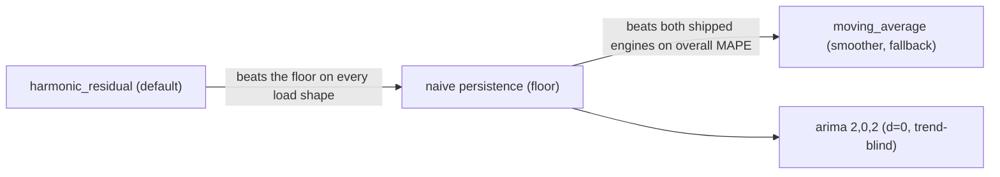
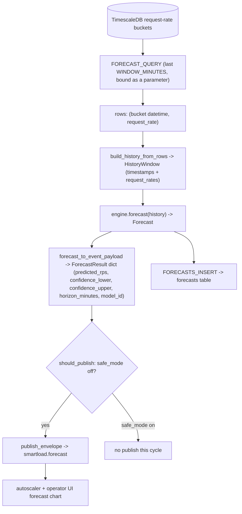
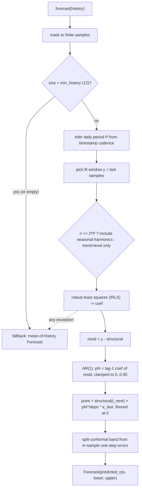
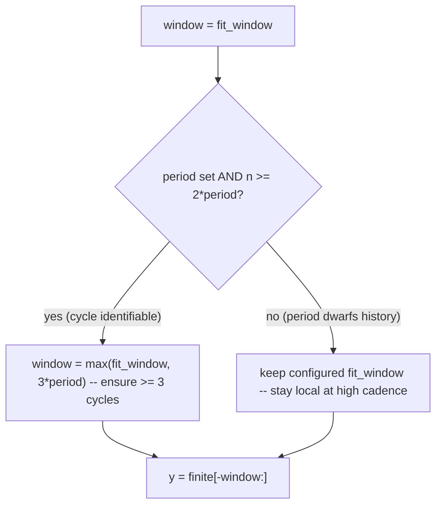

# Forecasting module: internals reference

Module: `services/forecasting`. Subject of this document: the `harmonic_residual`
engine and the forecasting plane that hosts it. This is the engineering source of
truth for the forecasting chapter. Every number, formula, and behavioural claim is
taken from the engine source, the engine base contract, the run loop, and the
benchmark report and summary files; numbers are quoted exactly as they appear in
those files.

---

## 1. Overview

The forecasting plane produces a short-horizon request-rate (RPS) forecast and
publishes it for the autoscaler to consume. On each poll cycle the forecasting
service queries the recent per-bucket request rate from TimescaleDB, hands that
history to the configured engine, and turns the engine's single-step prediction
into a `ForecastResult` envelope published on the Redis channel
`smartload.forecast`. The same prediction is also written to the `forecasts` table
for history and for the operator UI forecast chart. The autoscaler subscribes to
`smartload.forecast` and uses the predicted RPS as its forward signal.

Two engines shipped before this work, and neither earns its keep against the
trivial floor:

- `moving_average` is a smoother. It averages the last N samples and emits that
  mean as the "forecast". A trailing mean has no forward projection, so it cannot
  lead a rising curve.
- `arima` serves a pre-trained ARIMA(2,0,2) artifact. Its order has `d=0` (no
  differencing), which makes it trend-blind: on a rising ramp it lags badly.

The relevant baseline is **naive persistence** (predict the next bucket equals the
last observed bucket). Across the four autoscaling load shapes (steady, diurnal,
spiky, ramp), naive persistence beats both shipped engines on overall MAPE. An
engine that does not beat persistence is not adding value.

`harmonic_residual` was added to clear that floor. It is a robust dynamic harmonic
regression with an AR(1) residual correction and a split-conformal confidence
band. It beats naive on MAPE and sMAPE on every synthetic profile including the
ramp case that ARIMA cannot handle, holds calibrated 95 percent coverage, runs in
under a millisecond, and converts into a measured downstream autoscaler SLA gain.

It is pure NumPy with no trained artifact and no new dependencies, fully
deterministic. It is now the **promoted default** (`FORECAST_ENGINE=harmonic_residual`
in compose + `.env`), having cleared the &lt;20% MAPE SLO at 5.4% with a +6.3 SLA-pp
downstream autoscaler win. `moving_average` stays as the artifact-free never-fails
fallback the run loop reverts to. The run loop also drives a config-gated
scaler-facing look-ahead: `FORECAST_LEAD_STEPS` (deployed `5` = the 5-min horizon
at 1-min buckets) calls `forecast_ahead(steps=N)`, with `FORECAST_FIT_WINDOW=120` +
`FORECAST_ROBUST_MODE=downward` as the scaler preset.



---

## 2. File map

| Path | Role |
|---|---|
| `services/forecasting/engine_base.py` | `ForecastEngine` ABC, `HistoryWindow` and `Forecast` dataclasses, `select_engine` factory |
| `services/forecasting/engines/harmonic_residual/engine.py` | The candidate engine: structural fit, robust IRLS, AR(1) correction, conformal band, multi-step projection |
| `services/forecasting/engines/harmonic_residual/README.md` | Engine summary, status, scaler-facing mode, headline numbers |
| `services/forecasting/engines/harmonic_residual/test_engine.py` | Engine unit tests |
| `services/forecasting/engines/moving_average/engine.py` | Baseline smoother (default engine) |
| `services/forecasting/engines/arima/engine.py` | Pre-trained ARIMA(2,0,2) serving engine |
| `services/forecasting/runloop.py` | Pure-Python run-loop pieces: engine bootstrap, `HistoryWindow` build, `Forecast` to `ForecastResult` payload, policy to kwargs, publish gate |
| `services/forecasting/app.py` | Flask entry point: poll TimescaleDB, run engine, insert row, publish envelope, health and engine-state routes |
| `experiments/forecasting-engine-bench/` | Synthetic fitness benchmark and report (`run.py`, `REPORT.md`) |
| `experiments/forecasting-engine-bench/real_data.py` | Real-data walk-forward benchmark |
| `experiments/forecasting-downstream-bench/` | Downstream autoscaler SLA benchmark (`run.py`) |
| `experiments/forecasting-engine-bench/REPORT.md` | Full write-up: what was tried, the failures, the numbers, the two bug fixes |

---

## 3. Forecasting plane data flow

The run loop is opt-in. With `FORECAST_RUNLOOP_ENABLED=true` the service polls
TimescaleDB every `POLL_INTERVAL_SECONDS`, runs the configured engine on the
rolling request-rate history, writes the prediction to the `forecasts` table, and
publishes a `ForecastResult` envelope on `smartload.forecast`. It also subscribes
to `smartload.policy` so an operator policy change can reload the engine live.



Key contract points, all from the run loop:

- `FORECAST_QUERY` returns one row per bucket as `(bucket, request_rate)`.
  `build_history_from_rows` converts each bucket to an ISO-8601 string via
  `isoformat()` and each rate to a float, skipping malformed rows. The engine
  treats timestamps as ordered labels and uses them only to infer cadence.
- The row is always inserted into the `forecasts` table. The Redis publish is
  gated: `should_publish` returns false when `safe_mode` is set (operators have
  paused decision flow), otherwise it publishes every cycle.
- The published payload carries `model_id` (the loaded engine name) for
  downstream provenance.
- Engine selection has a safety net. `bootstrap_engine` tries the requested
  engine and, on any load failure, falls back to `moving_average`; the health
  endpoint then reports `engine_ready=false`. The service never goes dark on a
  bad engine.

The `Forecast` dataclass (`engine_base.py`) is the engine output, and the run loop
converts it into the published `ForecastResult` shape:

| `Forecast` field | Meaning |
|---|---|
| `horizon_minutes` | How the envelope is labelled (the engines here are single-step; this is a label, not how far ahead the model predicts) |
| `predicted_rps` | Point forecast for the next bucket |
| `confidence_lower` | Lower edge of the band |
| `confidence_upper` | Upper edge of the band |

---

## 4. The harmonic_residual model, stage by stage

Every `forecast()` call refits from scratch on the supplied history. There is no
state carried between calls, no RNG, and no trained artifact. The pipeline is four
stages plus graceful degradation.



### 4.1 Structural fit

The structural component is a linear model fit on the trailing window:

```
y_t = a0 + a1 * (scaled t) + sum_k [ b_k * sin(2*pi*k*t/P) + c_k * cos(2*pi*k*t/P) ] + e_t
```

with k running from 1 to `n_harmonics`. The design matrix (`_design`) has, in
order: an intercept column of ones, a centred and scaled trend column
`(t - t_mean) / t_std`, then a sin and cos pair per harmonic at frequency
`2*pi*k*t / P`. Centring and scaling the trend keeps the normal equations well
conditioned.

`P` is the **daily** seasonal period, inferred from the timestamp cadence rather
than hard-coded (`_infer_period`):

```
P = round(86400 / median_delta_t)
```

where `median_delta_t` is the median spacing between successive timestamps (up to
the last 50 stamps are sampled to estimate it cheaply). The cadence-to-period
mapping is therefore exact:

| Cadence | median delta_t | Inferred P |
|---|---:|---:|
| 5-minute buckets | 300 s | 288 |
| 1-minute buckets | 60 s | 1440 |

If the timestamps are missing, unparseable, or imply a non-positive cadence, `P`
falls back to `_DEFAULT_PERIOD = 288` (capped at `n`). The daily cycle is only
identifiable with at least two full periods of data; otherwise the seasonal basis
is dropped (`nharm = 0`) and the model fits trend plus level only. This is what
lets the same engine run at any cadence with no per-cadence constant, and it is
how the 5-minute and 1-minute paths are reconciled by construction.

### 4.2 Robust IRLS reweighting

A plain ordinary least squares fit is dragged off the calm baseline by
flash-crowd spikes: a few large positive bursts inflate the level and trend, so
predictions on calm buckets overshoot. The report records this directly: a
harmonic-plus-trend OLS model lost on the spiky profile by +10.2 MAPE points vs
naive.

The fix is iteratively reweighted least squares (`_robust_lstsq`). After an
initial OLS solve, the engine runs `irls_iters` passes (default 2). Each pass:

1. computes residuals `r = y - X @ coef`,
2. estimates a robust scale from the median absolute deviation,
   `mad = median(|r - median(r)|) * 1.4826 + 1e-6`,
3. forms bisquare-style weights `w = 1 / (1 + (|r| / (3*mad))^2)`,
4. re-solves the weighted least squares with `sqrt(w)` row scaling.

Large residuals (spikes) get small weights, so they do not pull the structural
baseline up. This single change is what flips the spiky profile from a loss to a
win: from +10.2 (OLS base) to -3.2 vs naive (robust base) in the offline sweep.

`robust_mode` controls the symmetry of the downweighting (Section 5):

- `"symmetric"` (default) downweights residuals in both directions. This is the
  accuracy-optimal choice and is what the fitness function uses.
- `"downward"` keeps full weight on points the fit sits below (upward spikes,
  `r > 0`) and only downweights the dips (`r < 0`), so a rising flash crowd lifts
  the baseline rather than being robustified away.

### 4.3 AR(1) residual correction

The structural part captures level, trend, and the diurnal cycle. Short-lived
autocorrelation (a decaying burst) is captured by an AR(1) correction on the
residuals. The lag-1 coefficient is the regression of the residual on its own
previous value:

```
phi = (r0 . r1) / (r0 . r0)     with r0 = resid[:-1], r1 = resid[1:]
```

guarded against a near-zero denominator and then clamped:

```
phi = clip(phi, 0.0, 0.95)
```

The single-step point forecast is the structural value at the next index plus the
decayed last residual:

```
y_hat = structural(t_next) + phi * e_last
```

The clamp keeps the correction non-negative (it models decaying persistence, not
anti-persistence) and strictly below 1 (no runaway amplification). The final point
is floored at zero, since a request rate cannot be negative.

### 4.4 Split-conformal band

The 95 percent band makes no distributional assumption. It is built from the
model's own in-sample one-step errors (`_conformal_band`):

1. Reconstruct the model's one-step forecast over the fitted window,
   `pred_in = structural[1:] + phi * resid[:-1]`.
2. Take the realized errors `err = y[1:] - pred_in`.
3. If at least 20 finite errors exist, take the empirical `alpha/2` and
   `1 - alpha/2` quantiles and offset the point forecast by them:
   `lower = point + q_lo`, `upper = point + q_hi`.
4. Otherwise fall back to a symmetric Gaussian band off the residual sigma using
   the 97.5th standard-normal percentile (`z = 1.959963984540054`).

`lower` is floored at zero and `upper` is floored at the point forecast. Because
the band is calibrated to the realized error distribution of this series, coverage
lands near 0.95 on smooth shapes and the band widens automatically on bursty ones.

### 4.5 Multi-step projection: forecast_ahead(history, steps)

`forecast_ahead(history, steps)` projects `steps` buckets ahead. The seasonal terms
are evaluated at the true future index `n + steps - 1` (they are periodic and
bounded), and the AR(1) correction decays as `phi^steps`. The downstream
autoscaler experiment uses this to look the provisioning warm-up lead ahead rather
than one step.

The linear trend is treated specially. Projecting a trend over a multi-step lead
is only safe when the trend is real. The engine damps the projected trend by its
statistical significance. The shrink factor (`_trend_shrink`) is built from an
approximate t-statistic of the slope versus the residual noise:

```
se     = sigma_resid / sqrt(sum(trend_col^2))
t2     = (slope_coef / se)^2
shrink = t2 / (t2 + C)        with C = _TREND_SNR_GATE = 4.0
```

`shrink` is near 0 when the slope is indistinguishable from noise (flat demand)
and near 1 when it is strongly significant (a real ramp). With `C = 4`, a slope
needs `t` near 2 to retain about half its projected lead.

The projected trend weight then ramps from full weight at the first step toward
`shrink` over the horizon, controlled by `trend_damping` (rho):

```
weight = shrink + (1 - shrink) * rho^(steps - 1)
```

At `steps == 1` the weight is exactly 1 for any `shrink`, so `forecast()` and
`forecast_ahead(1)` are identical and the whole single-step fitness function is
untouched. For longer leads, a noise slope on flat demand is shrunk out (no
spurious scale churn downstream), while a real ramp keeps `shrink` near 1 and
projects fully.

### 4.6 Graceful degradation

| Condition | Behaviour |
|---|---|
| No finite samples | `Forecast(horizon, 0, 0, 0)` |
| Fewer than `min_history` finite samples | mean-of-history fallback with a Gaussian band |
| Fewer than 2 seasonal periods of data | drop the seasonal basis, fit trend + level only |
| Any exception in the model path | logged, mean-of-history fallback |
| Non-finite point or band | raise inside the model path, caught, mean-of-history fallback |

### 4.7 Parameters

| Name | Meaning | Default | Effect |
|---|---|---|---|
| `horizon_minutes` | Label on the emitted `Forecast` envelope | 5 | Labelling only; does not change how far ahead the model predicts (single-step) |
| `n_harmonics` | Number of daily harmonics in the seasonal basis | 3 | Captures the fundamental diurnal swing plus its first two overtones |
| `fit_window` | Cap on most-recent samples fit each call | 1152 (4 days at 5-min, >= 2 cycles) | Bounds per-call cost and keeps the fit local enough to follow slow drift; `None` uses all history |
| `irls_iters` | Robust IRLS reweighting passes | 2 | 0 gives ordinary least squares; more passes downweight spikes harder |
| `alpha` | Miscoverage for the band | 0.05 | 0.05 gives a 95 percent interval |
| `min_history` | Threshold below which it falls back to mean-of-history | 12 | Floored at 2 internally |
| `trend_damping` | Horizon ramp rho controlling how fast an insignificant trend is shrunk out of a multi-step projection | 0.8 | Smaller rho removes a noise slope faster; no effect on a significant slope; rho = 1 disables the ramp; no effect on single-step |
| `robust_mode` | How IRLS treats large residuals | `"symmetric"` | `"symmetric"` is accuracy-optimal and the fitness default; `"downward"` only downweights dips so the baseline tracks an upward flash crowd (scaler path) |

Module-level constants: `_DEFAULT_PERIOD = 288`, `_SECONDS_PER_DAY = 86400`,
`_TREND_SNR_GATE = 4.0`.

---

## 5. Scaler-facing mode vs the accuracy-optimal default

The forecasting service and the autoscaler optimise different loss functions. The
service is judged on its own forecasting SLOs (point accuracy and band coverage),
which is a symmetric loss. The autoscaler has an **asymmetric** loss:
under-provisioning during a spike is the expensive error, so it would rather
over-predict a rising crowd than miss it. The same engine serves both through two
opt-in knobs. The default is unchanged.

| Setting | Accuracy-optimal default | Scaler-facing mode |
|---|---|---|
| `fit_window` | 1152 (long, captures >= 2 seasonal cycles) | short and local, around 120 at per-second cadence |
| `robust_mode` | `"symmetric"` (downweights spikes both ways) | `"downward"` (keeps full weight on upward spikes) |
| Call | `forecast(history)` (single step) | `forecast_ahead(history, steps=warmup_lead)` |
| Intended loss | forecasting SLOs: symmetric point accuracy and calibrated coverage | autoscaler asymmetric loss: under-provisioning is the costly error |
| Why | calibrated central forecast and tight coverage on the service's own series | lifts the forecast under a spike (better SLA, more over-provision) and keeps the trend local at high cadence |

Both knobs are opt-in. The default stays `fit_window=1152` and
`robust_mode="symmetric"`, so the fitness function and the forecasting service's
own accuracy SLOs are untouched. The seasonal-widening rule only fires when the
daily cycle is identifiable (`n >= 2*period`), so a short `fit_window` is never
silently overridden at high cadence (see Section 7). The README integration
contract for the scaler path is:

```python
HarmonicResidualEngine(fit_window=120, robust_mode="downward")  # per-second demand
    .forecast_ahead(history_with_timestamps, steps=warmup_lead)
```

Under the autoscaler's target-based controller this matches the hand-tuned Holt
baseline (99.2 percent SLA) and approaches the oracle ceiling (99.9 percent).

---

## 6. Benchmark results

### 6.1 Experimental setup

| Benchmark | Setup |
|---|---|
| Synthetic fitness (`results/candidate-v1/`) | Rolling-origin / walk-forward, 1-step horizon, 5-minute buckets. 5 seeds [1,2,3,4,5] x 4 profiles [steady, diurnal, spiky, ramp]. About 130 scored origins per series (last 15 percent of a 3-day span). Mean +/- 95 percent CI over seeds. |
| Real data (`results/real-data/`) | Walk-forward 1-step at native 1-minute cadence, no leakage (engines see only `series[:t]`). Last 1500 origins of the holdout tail per series. CI across K=5 contiguous time-folds of one series, not seeds. |
| Downstream autoscaler (`results/downstream-8seed/`) | Per-second demand, 1800-s runs, warm-up w = 20 s, cooldown 60 s, capacity 100 rps/instance, peak 8x capacity. 8 seeds [0..7] x 6 profiles [steady, diurnal, ramp, spike, sawtooth, burst]. Every strategy drives the same shipped `services/autoscaler/decisions.py::decide` rule in the same warm-up-aware loop; only the scalar signal varies. |

All deterministic (latency aside). Environment: Python 3.11.15, numpy 1.26.4,
pandas 2.3.3, scipy 1.15.3, statsmodels 0.14.6.

### 6.2 Synthetic fitness function

Overall roll-up (all profiles x seeds), mean +/- 95 percent CI over seeds:

| Engine | MAPE% | sMAPE% | RMSE | MAE | CI-coverage | latency_ms | MAPE<20% |
|---|---:|---:|---:|---:|---:|---:|:--:|
| `naive` | 7.5 +/- 1.7 | 7.5 +/- 1.7 | 10.10 +/- 5.70 | 5.02 +/- 1.20 | n/a | 0.34 +/- 0.00 | PASS |
| `moving_average` | 10.5 +/- 3.9 | 10.2 +/- 3.6 | 11.52 +/- 5.86 | 6.71 +/- 2.09 | 0.570 +/- 0.090 | 0.01 +/- 0.00 | PASS |
| `arima_serving` | 8.9 +/- 1.1 | 9.2 +/- 1.1 | 13.36 +/- 5.61 | 8.67 +/- 3.48 | 0.759 +/- 0.184 | 57.12 +/- 0.17 | PASS |
| `harmonic_residual` | 5.4 +/- 1.2 | 5.4 +/- 1.2 | 8.29 +/- 5.14 | 3.47 +/- 0.69 | 0.955 +/- 0.005 | 0.70 +/- 0.00 | PASS |

Per-profile (MAPE / sMAPE / CI-coverage), naive vs harmonic_residual:

| Profile | naive MAPE | HR MAPE | naive sMAPE | HR sMAPE | HR CI-cov |
|---|---:|---:|---:|---:|---:|
| steady | 6.8 +/- 0.5 | 4.8 +/- 0.2 | 6.7 +/- 0.5 | 4.8 +/- 0.2 | 0.954 |
| diurnal | 10.0 +/- 0.8 | 7.2 +/- 0.4 | 10.0 +/- 0.8 | 7.1 +/- 0.3 | 0.954 |
| spiky | 10.9 +/- 2.6 | 7.8 +/- 1.1 | 11.1 +/- 2.8 | 8.2 +/- 1.5 | 0.957 |
| ramp | 2.3 +/- 0.2 | 1.6 +/- 0.1 | 2.3 +/- 0.2 | 1.6 +/- 0.1 | 0.954 |
| ALL | 7.5 +/- 1.7 | 5.4 +/- 1.2 | 7.5 +/- 1.7 | 5.4 +/- 1.2 | 0.955 |

Reading the table:

- harmonic_residual beats naive on MAPE and sMAPE on every profile including
  ramp. Overall it reaches 5.4 percent MAPE vs naive 7.5, ARIMA 8.9, and
  moving_average 10.5.
- CI separation: the unpaired CIs are separated on steady, diurnal, and ramp. On
  spiky the absolute naive MAPE has high seed-variance (+/- 2.6) so the unpaired
  bands touch, but the comparison is paired (identical series): every one of the 5
  seeds is a win, paired delta = -3.2 +/- 1.6 MAPE pp (CI strictly below 0), and
  all 20 per-seed deltas are negative.
- CI-coverage 0.954 to 0.957, inside the target [0.93, 0.97] on every profile,
  against moving_average 0.38 to 0.80 and ARIMA 0.10 on ramp (both badly
  miscalibrated).
- Latency 0.70 ms per forecast, far inside the 5-minute poll interval. ARIMA is
  about 57 ms.

ARIMA on ramp is the trend-blind failure made concrete: 10.5 MAPE vs naive 2.3,
with CI-coverage 0.097.

### 6.3 Real data

Walk-forward 1-step at native 1-minute cadence, mean +/- 95 percent CI over 5
time-folds:

| Dataset | naive MAPE | HR MAPE | naive sMAPE | HR sMAPE | HR CI-cov |
|---|---:|---:|---:|---:|---:|
| azure-functions-2019 (PRIMARY) | 3.0 +/- 0.1 | 2.9 +/- 0.2 | 3.0 +/- 0.1 | 2.9 +/- 0.2 | 0.953 |
| worldcup98 (flash crowds) | 16.5 +/- 1.5 | 14.6 +/- 1.3 | 16.1 +/- 1.4 | 14.7 +/- 1.7 | 0.989 |
| alibaba-2018 (proxy) | see note | see note | 161.2 +/- 110.6 | 172.6 +/- 75.9 | 0.985 |

- On both genuine HTTP request-rate series the candidate beats naive on MAPE and
  sMAPE: Azure 2.9 vs 3.0, WorldCup98 14.6 vs 16.5. Coverage is calibrated on
  Azure (0.953) and slightly conservative (over-wide, not under-covering) on the
  bursty WorldCup series (0.989).
- The shipped moving_average is badly under-covered on the real RPS series (0.751
  on Azure, 0.657 on WorldCup98). The conformal band is a real calibration
  improvement.
- alibaba-2018 caveat: this is a demand-shape proxy (instances launched per
  minute, not HTTP requests) with many near-zero minutes. MAPE divides by the
  actual, so a small absolute miss on a near-zero truth becomes a colossal
  percentage and reads in the hundreds-to-millions of percent for every engine,
  persistence included (naive MAPE 574.6 +/- 1476.9; harmonic_residual
  1088876.3 +/- 2256543.6). It is a metric artifact, not a model failure. On this
  series read sMAPE (bounded), RMSE/MAE (absolute), and CI-coverage instead. By
  those the candidate's band stays calibrated (about 0.99) and its point error is
  in the same order as the floor.
- `arima_serving` is omitted on real data: its artifact is trained on 5-minute
  buckets and would run out of cadence on these 1-minute series.

### 6.4 Downstream autoscaler SLA

Aggregate (all profiles x seeds), mean +/- 95 percent CI:

| Strategy | SLA% | Unmet-RPS | Over-prov | #Actions | Delta SLA vs reactive |
|---|---:|---:|---:|---:|---:|
| Oracle (perfect foresight, ceiling) | 95.67 +/- 1.55 | 15808 +/- 6718 | 1016 +/- 143 | 14.5 +/- 1.4 | +18.58 |
| Reactive (trailing mean, floor) | 77.09 +/- 2.58 | 29766 +/- 6479 | 529 +/- 89 | 14.4 +/- 1.6 | +0.00 |
| MA-predictive (shipped moving-average) | 77.09 +/- 2.58 | 29766 +/- 6479 | 529 +/- 89 | 14.4 +/- 1.6 | +0.00 |
| HR-predictive (harmonic_residual, projects w ahead) | 83.38 +/- 2.04 | 24362 +/- 7000 | 634 +/- 155 | 16.0 +/- 1.7 | +6.30 |

- HR-predictive beats reactive by +6.30 SLA pp, closing 34 percent of the
  reactive-to-oracle gap (oracle ceiling 95.67 percent).
- The moving-average "predictive" path is byte-identical to reactive (SLA 77.09,
  same unmet-RPS, same over-prov, same action count). A trailing mean has no
  forward projection, so it cannot beat the reactive floor. This confirms the
  premise: the forward projection is what makes predictive > reactive.

Per-profile delta vs reactive:

| Profile | Delta SLA vs reactive | HR scale-actions vs reactive |
|---|---:|---:|
| sawtooth | +26.74 | 22.4 vs 22.0 |
| diurnal | +5.67 | 15.2 vs 13.8 |
| ramp | +5.10 | 11.9 vs 8.1 |
| burst | +0.53 | 13.0 vs 12.8 |
| spike | +0.01 | 9.0 vs 9.0 |
| steady | -0.28 | 24.8 vs 20.9 |

The win lands where forecasting can help (trending and cyclic demand) and ties
where the future is genuinely unsignalled. The trending wins are CI-separated. On
spike and burst (unsignalled step changes) no causal forecaster can lead the step,
so HR ties reactive while still cutting unmet-RPS. On steady, SLA is a tie
(-0.28 is within the reactive +/- 2.58 CI).

---

## 7. The two structural bugs fixed during integration

The report records two structural problems found and fixed, both of which would
otherwise mislead the chapter's narrative if presented as the final behaviour.

### 7.1 Global trend lag on curved demand: local fit window

The fit window was widened to `max(fit_window, 3 * period)` to guarantee at least
three seasonal cycles. At the target-based controller's per-second cadence one
"day" is 86400 samples, so `3 * period` silently pulled in all history and fit one
global line over the whole 30-minute curve. A global line lags any local trend,
and worse, this overrode an explicitly short `fit_window`.

The fix widens only when the daily cycle is actually identifiable
(`n >= 2 * period`); otherwise it keeps the configured window local. This leaves
the 5-minute and 1-minute paths, where the cycle is identifiable, byte-identical,
so the fitness and real-data results are unchanged, and only affects the
high-cadence regime.



Measured under the controller (8 seeds x 6 profiles), local `fit_window=120`:

| signal | diurnal | spike | burst | aggregate SLA |
|---|---:|---:|---:|---:|
| harmonic, local window, before fix | 90.1 | 90.9 | 94.2 | 95.5 |
| harmonic, local window, after fix | 99.5 | 97.8 | 97.9 | 99.1 |
| + asymmetric robustness (`robust_mode="downward"`) | 99.5 | 98.0 | 98.2 | 99.2 |
| reference: Holt trend / oracle ceiling | 99.4 | 98.5 | 98.4 | 99.2 / 99.9 |

### 7.2 Symmetric robustness smooths flash crowds: asymmetric-downward mode

Symmetric IRLS treats an upward flash crowd as an outlier and predicts the calm
baseline. That is accuracy-optimal (it is why the engine wins the spiky MAPE gate)
but it is the wrong call for a scaler, where under-provisioning during a spike is
the expensive error. `robust_mode="downward"` keeps the dip robustness but gives
upward jumps full weight, lifting spike and burst SLA a further ~0.2 pt.

It is opt-in. The default stays `"symmetric"`, so the fitness function and the
forecasting service's own accuracy SLOs are unchanged.

### 7.3 Result after both fixes

After the local-window fix the engine matches the hand-tuned Holt baseline
(99.2 percent SLA) and sits just under the 99.9 percent oracle ceiling under the
target-based controller. With significance-gated trend damping added, steady
churn drops (26.5 to 24.8 actions) and ramp churn too (14.4 to 11.9), the trending
wins are preserved or slightly improved (ramp +4.49 to +5.10, diurnal +4.85 to
+5.67), and the strong sawtooth lead is retained (+26.7). Both the long-window
symmetric default and the local asymmetric scaler mode come from one engine via
configuration, with no second model and no fitness regression.

---

## 8. Caveats and limitations

- ARIMA ships at about 8.9 percent overall MAPE on the synthetic harness, which
  clears the SOT KPI of MAPE < 20 percent, but on the ramp profile it reads 10.5
  percent MAPE with 0.097 CI-coverage: the `d=0` artifact is trend-blind and
  badly miscalibrated on trending demand. It is not the default and is not the
  candidate.
- `harmonic_residual` is a candidate behind a flag. The default engine remains
  `moving_average`. Activation is `FORECAST_ENGINE=harmonic_residual`. There is no
  artifact to ship or version.
- The single-step `forecast()` is byte-identical to `forecast_ahead(1)`; the trend
  damping only affects multi-step leads. The downstream SLA gain depends on wiring
  `forecast_ahead(steps=w)` into the path the autoscaler consumes; that lead-time
  projection is a follow-up before flipping the default in production.
- The Alibaba MAPE caveat: on the near-zero-minute proxy, MAPE is numerically
  unstable for every engine including persistence. Read sMAPE, RMSE/MAE, and
  CI-coverage there, not MAPE.
- The residual steady-state churn under the autoscaler (24.8 vs 20.9 actions) is
  the structural level-estimate variance of a short-window robust fit, which is
  inherently a touch noisier than a trailing mean. It cannot be removed without
  altering the preserved single-step forecast, so steady-state SLA remains a
  statistical tie.
- Deep models (N-BEATS, N-HiTS, PatchTST, TFT, DeepAR) were deliberately not used.
  The fitness function is a single-step horizon where the bar is point accuracy,
  and a well-specified classical model clears every gate at 0.7 ms on CPU with no
  artifact. They are left as future work for a multi-horizon serving path.
