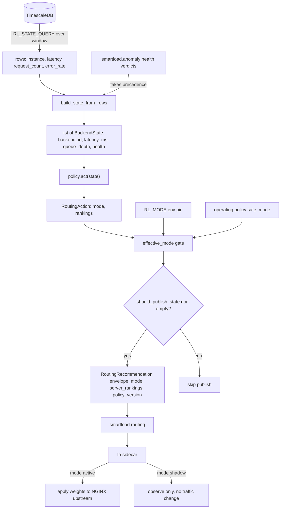
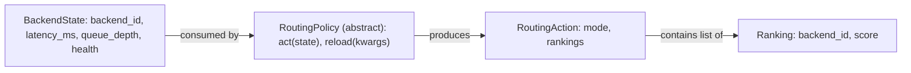
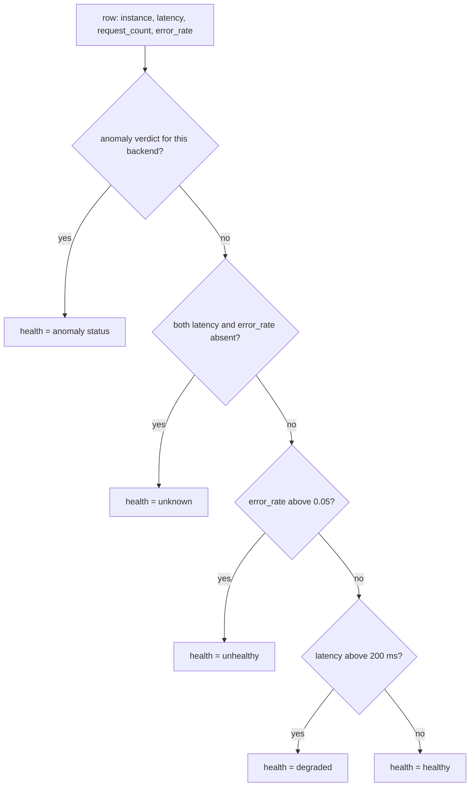
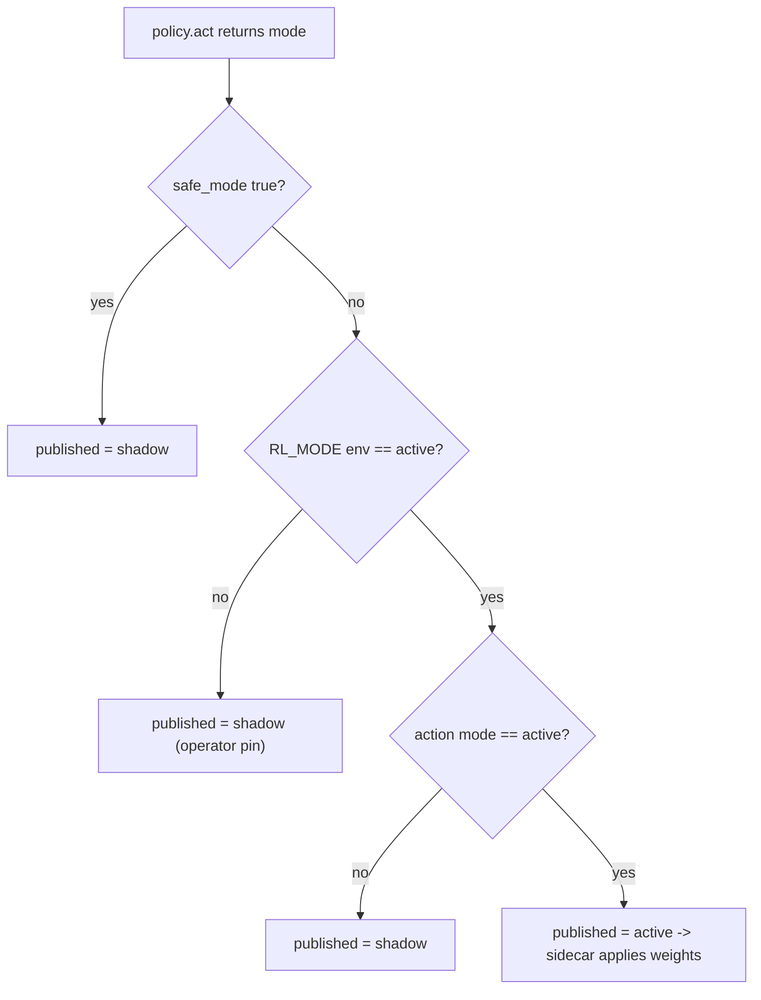
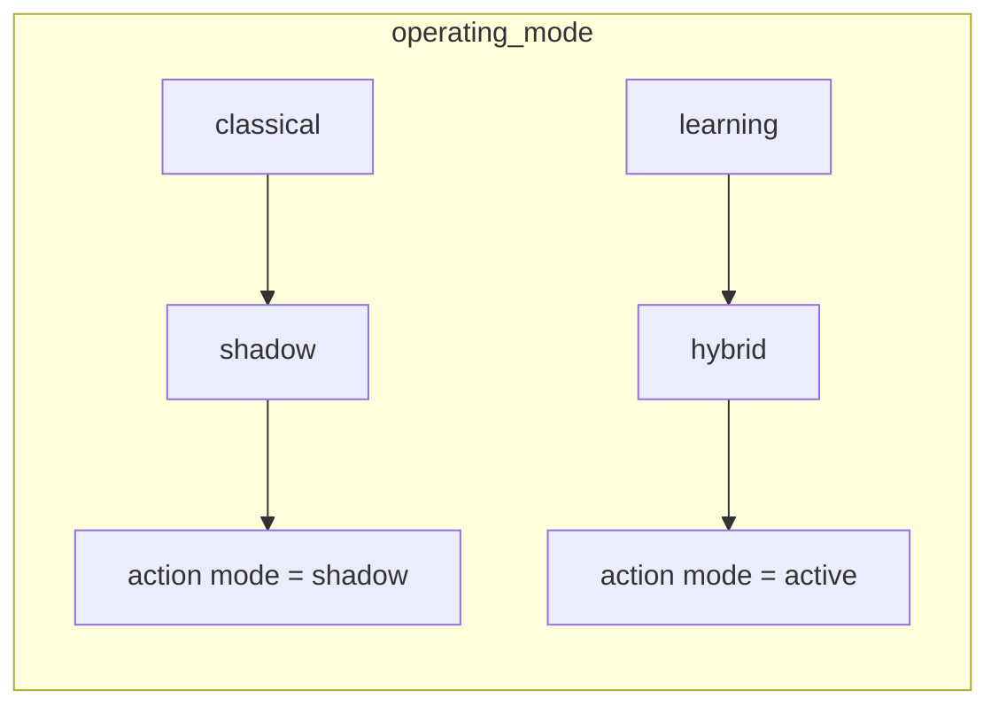
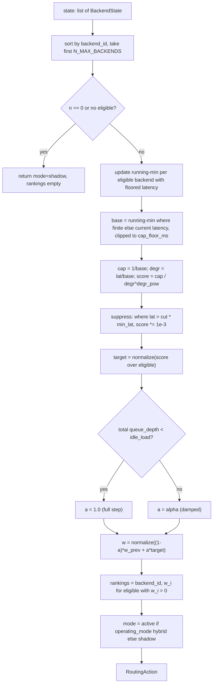
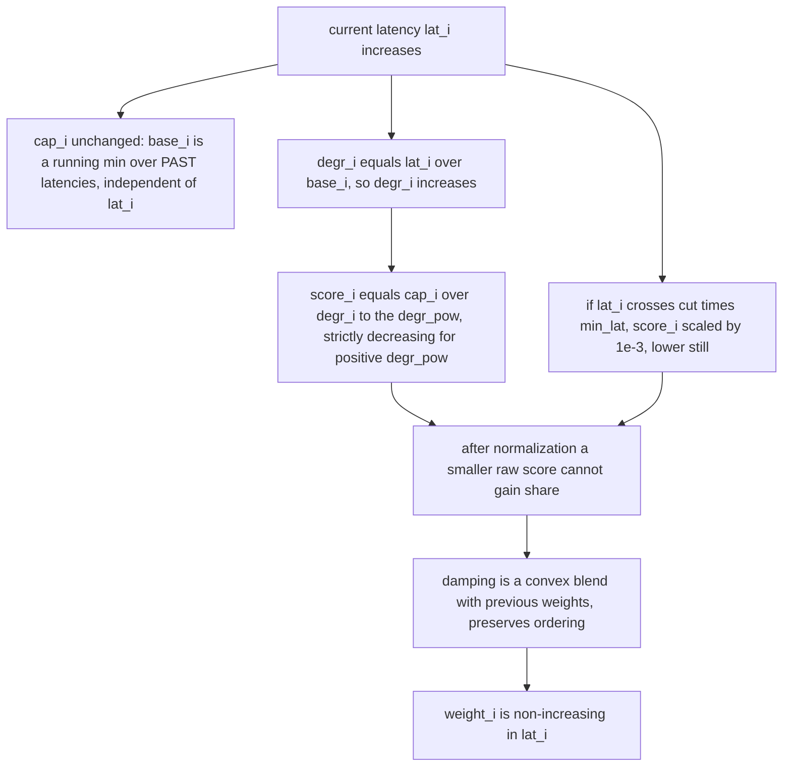
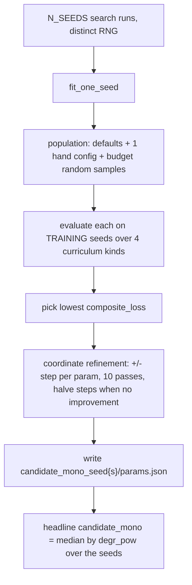
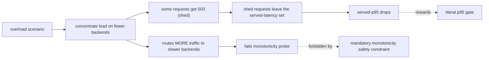

# rl-engine: the routing-policy plane

Internals reference for SmartLoad's `rl-engine` service: the plane that decides how
traffic should be split across backends. This document is the source of truth for
the routing chapter. Every number, formula, and step below is taken from the
service source and from the benchmark report and summary under
`experiments/rl-routing-bench/`.

---

## 1. Overview

`rl-engine` is SmartLoad's routing-policy plane. Each cycle it reads recent
per-backend telemetry from the database, asks a pluggable routing policy to rank
or weight the backends, and publishes a recommendation envelope on the
`smartload.routing` channel. The load-balancer sidecar consumes that envelope and
applies the weights only when the recommendation is `active` and every operator
gate agrees. By default recommendations are observational (`shadow`): the engine
keeps producing routing decisions for explainability and the operator UI without
ever steering live traffic.

The plane exists to separate the routing *decision* from the routing *mechanism*.
The sidecar (NGINX in front of the backends) is the mechanism; it stays simple and
fast. `rl-engine` is the decision layer, where different policies (classical
schedulers, a trained PPO model, and the new monotone capacity-aware router) can be
swapped behind one contract without touching the data path. Because the decision
layer is decoupled and gated, a new policy can run in shadow against production
traffic and be evaluated before it is ever given routing authority.

The per-cycle path is:

```
RL_STATE_QUERY  ->  build_state_from_rows  ->  list[BackendState]
                ->  policy.act(state)      ->  RoutingAction(mode, rankings)
                ->  effective_mode gate    ->  RoutingRecommendation envelope
                ->  smartload.routing      ->  lb-sidecar (applies weights iff active)
```

The policy returns its own intended `mode`, but the published mode is composed from
the policy intent, the `RL_MODE` operator pin, and the operating policy's
`safe_mode` flag (Section 5). Only when all three agree on `active` does the sidecar
apply weights.

### Where the new work sits

The routing-policy plane was substantially extended by PR #172, which added the
latency-monotone capacity-aware router (`candidate_mono`), its non-monotone
benchmark foil (`candidate_maxxer`), the classical baselines used for comparison,
and the monotonicity probe that acts as an acceptance gate. `candidate_mono` is now
the **deployed recommended policy**, served by the `monotone` plugin
(`RL_POLICY=monotone`, config from `models/candidate_mono/params.json`, no pickled
artifact). It beats the PPO bandit and every classical baseline on the closed-loop
sim and the real HTTP stack and passes the monotonicity probe; the trained PPO
(audited as round-robin-equivalent) stays selectable for comparison. The remainder of this
document covers the whole plane, with depth on those additions.

---

## 2. File map

| Path | Role |
|---|---|
| `services/rl-engine/app.py` | Flask entry point: DB poll, Redis pub/sub, threads, `/health`, runs the policy each cycle and publishes to `smartload.routing`. |
| `services/rl-engine/runloop.py` | Pure-Python loop logic: state build from rows, mode composition (`effective_mode`), policy bootstrap with fallback, `RoutingAction` to envelope conversion. Testable without Flask/Redis/DB. |
| `services/rl-engine/policy_base.py` | The policy contract: `RoutingPolicy` ABC, `BackendState`, `Ranking`, `RoutingAction`, health constants, `is_eligible`, `_routing_fallback`, `select_policy` factory. |
| `services/rl-engine/obs_builder.py` | Observation tensor layout, `N_MAX_BACKENDS` (= 5), action mask, `all_masked_fallback`. Imported by serving plugins. |
| `services/rl-engine/routing_templates.py` | Serving-safe template-to-weights map (uniform, inverse-latency, exclude-slowest, concentrate-fastest). Imports only `obs_builder`; used by the PPO plugin's DQN-templates artifact kind. |
| `services/rl-engine/policies/monotone/policy.py` | `MonotonePolicy`: serving plugin for `candidate_mono`. Inlines the monotone router math; imports only `obs_builder` and `policy_base`. |
| `services/rl-engine/policies/monotone/README.md` | Per-plugin notes for the monotone policy. |
| `services/rl-engine/policies/ppo/policy.py` | `PPOPolicy`: serving plugin wrapping the trained PPO/SAC/DQN artifacts. The artifact kind (`discrete_argmax`, `continuous_weights`, `discrete_templates`) is read from `artifact_meta.json`; `candidate_v2` is the continuous-weights kind. |
| `services/rl-engine/policies/random_shadow/policy.py` | `RandomShadowPolicy`: uniform-random scores, always shadow. The bootstrap safety net. |
| `services/rl-engine/policies/round_robin/policy.py` | `RoundRobinPolicy`: classical cyclic scheduler, backend_id pointer. |
| `services/rl-engine/policies/least_connections/policy.py` | `LeastConnectionsPolicy`: classical lowest-load scheduler. |
| `services/rl-engine/training/monotone_router.py` | `MonotoneRouter` and `MonotoneConfig`: the shared router core. Imported by the trainer and the benchmark adapter; the serving plugin keeps an inline copy kept equivalent to it. |
| `services/rl-engine/training/train_monotone.py` | Fits `candidate_mono` by black-box search over the curriculum kinds and writes per-seed `params.json` artifacts. |
| `services/rl-engine/training/train_maxxer.py` | Trains `candidate_maxxer`, the non-monotone SLA-targeted PPO foil. |
| `experiments/rl-routing-bench/REPORT.md` | Full write-up: contenders, scenarios, monotonicity probe, the gate, promotion recommendation. |
| `experiments/rl-routing-bench/results/20260614T045152Z/SUMMARY.md` | The numeric run: per-scenario tables, multi-seed groups, probe results. |
| `experiments/rl-routing-bench/results/20260614T045152Z/probe.json` | Per-policy monotonicity-probe verdicts: pass flag, max weight-rise, sweep and violation counts. |
| `experiments/rl-routing-bench/results/live_stack.json` | Real-HTTP cross-check numbers (the live-stack table in Section 9.7). |

Note: `policy_base.py` is named to avoid collision with the per-plugin
`policies/<plugin>/policy.py` files. Serving plugins import only `obs_builder` and
`policy_base`; they never import from `training/`, so no training code enters the
runtime image.

---

## 3. Per-cycle data flow



Health classification: `RL_STATE_QUERY` returns latency, request_count, and
error_rate but not the canonical health flag. When the anomaly detector has
published a verdict for a backend, that verdict wins. Otherwise `classify_health`
derives health locally with `DEGRADED_LATENCY_MS = 200.0` and
`UNHEALTHY_ERROR_RATE = 0.05`. A backend with no telemetry at all (both latency and
error_rate absent) is classified `unknown`, not healthy, so a silent backend is not
mistaken for a good one.

The policy republish path (`smartload.policy`) feeds `policy_from_payload`, which
builds an `EnginePolicy` and triggers `policy.reload(...)` so runtime knobs
(`operating_mode`, `confidence_threshold`, `exploration_rate`) update in place
without reloading the artifact from disk.

Observation width versus pool cap: `obs_builder.N_MAX_BACKENDS` is 5, the fixed
slot count for the observation and action-mask tensors, and every policy ranks at
most the first five backends in sorted `backend_id` order. The operating policy's
`max_backends`, set to 3 in `config/policy.yaml`, is a separate knob: it caps how
many backends the autoscaler provisions, not the routing tensor width. The two are
independent. A pool kept at or below the autoscaler cap always fits inside the
five-slot observation, so the routing plane is unaffected by the current `max_backends`
value.

---

## 4. The policy contract

All routing logic lives behind one small interface in `policy_base.py`.

### 4.1 Data shapes



- `BackendState` is the per-backend input. `health` is one of `healthy`,
  `degraded`, `unhealthy`, `unknown`.
- `Ranking` carries a `backend_id` and a `score`. For weight-emitting policies the
  scores are normalized routing weights summing to 1; for ordinal classical
  policies they are descending rank scores.
- `RoutingAction` carries the policy's own `mode` (`shadow` or `active`) and the
  ranking list. The run loop converts this into the envelope.

### 4.2 Health and eligibility

Health is assigned in `build_state_from_rows` before any policy sees the state. The
anomaly verdict wins when present; otherwise health is derived locally, with the
no-signal case refusing to classify rather than defaulting to healthy.



Eligibility then filters that health to a routing decision. It is a policy concern,
not a metric concern: the predicate lives once in `policy_base.is_eligible` and
every serving path agrees on it.

```python
ELIGIBLE_HEALTH = frozenset({HEALTH_HEALTHY, HEALTH_DEGRADED})

def is_eligible(health: str) -> bool:
    return health in ELIGIBLE_HEALTH
```

| Health | Eligible | Why |
|---|---|---|
| `healthy` | yes | Serving normally; the default routing target. |
| `degraded` | yes | Slower than its baseline but still serving, so it stays in the pool. |
| `unhealthy` | no | Failing; excluded so traffic is not sent into errors. |
| `unknown` | no | No telemetry in the window; excluded because there is no signal to route on, and a silent backend must not be mistaken for a good one. |

### 4.3 The ABC and the all-unhealthy fallback

`RoutingPolicy.act(state)` is abstract: each policy ranks backends for the next
window. `reload(**kwargs)` defaults to a no-op; stateless policies need no override,
while policies that read policy-derived kwargs override it to update mutable runtime
config in place.

`_routing_fallback(state)` is the canonical all-unhealthy path shared by the
classical policies (round_robin, least_connections). When no eligible backend
exists it emits the canonical warning via `obs_builder.all_masked_fallback`, then
returns uniform-scored shadow rankings so the run loop still has a valid envelope to
publish. The monotone and PPO plugins instead return empty shadow rankings when no
backend is eligible, rather than manufacturing a best-of-the-bad pick.

The policies therefore split into two families on the no-eligible case, and they
also differ in what their `score` means. The table below captures both, so the
envelope a consumer receives is never ambiguous.

| Policy | Score semantics | No eligible backend | Stateful |
|---|---|---|---|
| `random_shadow` | Uniform-random per backend, always shadow. | Ranks every backend in `state` with random scores. | no (seeded RNG) |
| `round_robin` | Descending rank scores, head of rotation first. | `_routing_fallback`: uniform-scored shadow rankings plus a warning. | yes (last served `backend_id`) |
| `least_connections` | Descending rank scores, lowest load first. | `_routing_fallback`: uniform-scored shadow rankings plus a warning. | no |
| `ppo` | Normalized routing weights over eligible backends. | Empty shadow rankings; no best-of-the-bad pick. | yes (loaded artifact) |
| `monotone` | Normalized routing weights over eligible backends. | Empty shadow rankings; no best-of-the-bad pick. | yes (running-min, damped weights) |

### 4.4 The factory

`select_policy(name, **kwargs)` is the single registration point. The registered
policies are:

| Name | Class | Kind |
|---|---|---|
| `random_shadow` | `RandomShadowPolicy` | baseline / safety net (always shadow) |
| `round_robin` | `RoundRobinPolicy` | classical cyclic |
| `least_connections` | `LeastConnectionsPolicy` | classical lowest-load |
| `ppo` | `PPOPolicy` | trained artifact wrapper (discrete-argmax MaskablePPO, continuous-weights PPO, or DQN templates) |
| `monotone` | `MonotonePolicy` | latency-monotone capacity-aware (`candidate_mono`) |

An unknown name raises `ValueError`. Bootstrap (`bootstrap_policy` in `runloop.py`)
tries the requested policy and falls back to `random_shadow` on any load failure, so
a missing or broken artifact never crashes the service; `policy_ready=false` is
reported on `/health` instead.

---

## 5. Mode composition: what makes the load balancer actually apply weights

A policy returning `mode=active` is necessary but not sufficient for the sidecar to
change traffic. The published mode is composed in `effective_mode` from three
inputs, and only one combination yields `active`.



The three gates:

1. `safe_mode` (from the operating policy on `smartload.policy`): when true, the
   published mode is always `shadow`, overriding everything.
2. `RL_MODE` env pin: when it is not `active`, the published mode is `shadow`. This
   is the operator's hard pin.
3. The policy's own `action_mode`: must be `active`.

How a policy reaches `action_mode = active` depends on its `operating_mode` kwarg,
which is set by the operating policy:



`MonotonePolicy` and `PPOPolicy` both map `operating_mode` of `hybrid` or
`learning` to an `active` action mode, and everything else to `shadow`. So an
`active` recommendation requires `operating_mode in {hybrid, learning}` on the
policy *and* `RL_MODE=active` on the env *and* `safe_mode=false`. This keeps RL
output observable at all times while denying it routing authority unless every gate
agrees.

---

## 6. candidate_mono: the production recommendation

`MonotonePolicy` (serving) and `MonotoneRouter` (`training/monotone_router.py`,
shared by trainer and benchmark) implement the same algorithm. The serving plugin
inlines the math so train and serve agree, importing only `obs_builder` and
`policy_base`. The one deliberate difference is the load total that selects the
damping factor: the trainer sums load over all slots, the serving plugin sums
`queue_depth` over the eligible backends only. This shifts the idle-bypass
boundary slightly but does not touch the scoring or the monotonicity property,
which depend on latency alone.

### 6.1 What it computes, in words

Each window, for the eligible backends:

1. Maintain an online capacity estimate per backend as the running minimum of its
   observed latency (floored). This approximates the backend's idle service time and
   uses past latencies only.
2. Score each backend by its capacity divided by how slow it is right now relative
   to its own best.
3. Hard-shed any backend whose current latency is far above the pool minimum.
4. Normalize the scores into a weight vector over eligible backends.
5. Damp the weight vector across windows to remove the oscillation a memoryless
   inverse-latency rule suffers; bypass the damping when the pool is near idle.

### 6.2 The formula

For backend `i`, with current latency `lat_i`:

```
base_i  = running-min latency over PAST windows, floored at cap_floor_ms
cap_i   = 1 / base_i                               (online capacity estimate)
degr_i  = lat_i / base_i                            (current slowness, >= 1)
score_i = cap_i / degr_i ^ degr_pow                 (capacity divided by slowness)
score_i = score_i * 1e-3   if  lat_i > cut * min_lat   (hard-shed clearly-bad backends)

target  = score / sum(score)   over eligible backends (others get 0)
```

Then damp across windows:

```
a       = 1.0       if total observed load < idle_load   (undamped near idle)
a       = alpha     otherwise
w_t     = (1 - a) * w_{t-1} + a * target
w_t     = w_t / sum(w_t)        renormalized over eligible
```

### 6.3 act() flow



The first call (when the running-min equals the current latency on a fresh instance)
reduces the controller to pure inverse-latency, which is trivially monotone. This is
exactly the state the monotonicity probe tests.

### 6.4 Configuration

Config is read from the `monotone_config` block of `params.json` (the same shape
the trainer writes), defaulting to `models/candidate_mono/`. A missing or
unreadable artifact falls back to the built-in defaults: the constructor seeds
`_DEFAULTS` and overlays whatever the artifact supplies, so any field absent from
the file keeps its default.

There are two distinct value sets to keep straight. The *deployed* values are the
ones in the shipped `models/candidate_mono/params.json`, written by the trainer as
the median-by-`degr_pow` seed (Section 7). The *fallback defaults* are the
hard-coded `_DEFAULTS` in `MonotonePolicy` and the dataclass defaults in
`MonotoneConfig`, used only when the artifact cannot be read.

| Param | Meaning | Deployed | Fallback default | Effect |
|---|---|---|---|---|
| `degr_pow` | Exponent on current slowness `degr_i` in the score. | 0.85 | 1.0 | Higher values penalize a slowing backend more sharply, concentrating traffic on faster backends. At 1.0 the score is exactly capacity over slowness. |
| `alpha` | Damping factor under load, in 0..1. | 0.192 | 0.4 | Lower values move the weight vector toward the new target more slowly across windows, damping closed-loop oscillation; higher values react faster. |
| `cut` | Hard-shed threshold as a multiple of the pool minimum latency. | 5.605 | 3.0 | A backend with `lat > cut * min_lat` has its score scaled by 1e-3, effectively removing it until it recovers. |
| `cap_floor_ms` | Floor on the capacity-estimate latency. | 5.0 | 5.0 | Prevents a near-zero observed latency from producing an unbounded capacity estimate. Held fixed during training, so it is identical in both sets. |
| `idle_load` | Total observed load below which damping is bypassed. | 10.986 | 8.0 | When the pool is near idle the damping is skipped (`a = 1.0`) so idle latency stays minimal and the controller does not lag behind a quiet pool. |

The deployed values are the fitted controller, not the fallback defaults: the
artifact's `degr_pow=0.85, alpha=0.192, cut=5.605, cap_floor_ms=5.0,
idle_load=10.986` are what serve in production. The fallback set
(`degr_pow=1.0, alpha=0.4, cut=3.0, cap_floor_ms=5.0, idle_load=8.0`) is the
built-in floor `MonotonePolicy._DEFAULTS` and `MonotoneConfig` agree on, reached
only when the artifact is missing or corrupt. Both sets are monotone by
construction, since monotonicity does not depend on the parameter values
(Section 6.5).

### 6.5 Monotonicity by construction

The property the benchmark verifies: holding history fixed, routing weight for a
backend never increases as its current latency increases.

Why it holds. The argument chains four steps, each of which can only hold or lower
a backend's weight as its current latency rises.



In words: the capacity estimate `base_i`, and therefore `cap_i`, is a running
minimum over past latencies, so it does not depend on the current `lat_i` at all.
The only place `lat_i` enters the score is through `degr_i = lat_i / base_i`, and the
score is `cap_i / degr_i ^ degr_pow`. With `degr_pow > 0`, that is strictly
decreasing in `lat_i`. The hard-shed step can only further reduce the score of a
backend whose latency crosses the cut. After normalization, a backend whose raw
score falls because its latency rose cannot gain a larger share. The damping step
is a convex blend with the previous weights and preserves the ordering of the
target. So weight is non-increasing in current latency. Every one of the five
training seeds passes the probe with a maximum weight-rise of exactly 0.0 (Section
9).

This is the safety property that classical capacity-blind schedulers and the
free-form PPO model do not guarantee: the monotone router cannot route more traffic
to a backend that is getting slower, which is precisely the wrong move for a load
balancer and the brittle behavior a free-form policy can exhibit when a backend
degrades into a region the model never saw.

---

## 7. How candidate_mono is trained

`train_monotone.py` fits `MonotoneConfig` by black-box search and emits per-seed
`params.json` artifacts. There is no neural network: the policy is the five-field
controller config, and training searches the four free fields (`degr_pow`, `alpha`,
`cut`, `idle_load`) with `cap_floor_ms` held fixed at 5.0.

### 7.1 Curriculum and the held-out family

Training uses only the four curriculum kinds, on training seeds:

```
TRAIN_KINDS = ["homogeneous", "heterogeneous", "degrading", "near-idle"]
```

The held-out `dual-degrade` family is never used in training. Its benchmark number
therefore measures true generalisation, not fit. The near-idle kind is constructed
by rejection sampling: `_reset_train` retries up to 400 seeds until the scenario's
mean demand over total capacity is at or below `_IDLE_UTIL_MAX = 0.15`. The other
three kinds are drawn directly with `force_kind`.

### 7.2 Training-seed robustness axis

The whole search is run `N_SEEDS` times (default 5) with different RNG, which
controls both the training-scenario draw and the search population. Each run yields
one fitted `MonotoneConfig`, hence one artifact. Within one run the evaluation uses
`n_train_seeds` scenario seeds (default 24), computed as
`20000 + seed * 137 + i` for `i` from 0 to `n_train_seeds - 1`. This 20000-band is
disjoint from the 30000-34000 eval bands, so training never touches the evaluation
seeds. The benchmark then aggregates the five fitted configs to a mean with 95% CI
across training seeds.



### 7.3 Composite loss

Per kind, `evaluate` runs the `ClosedLoopSimulator` and records served mean latency
across windows, then computes the p95 and the SLA-violation fraction (`served >
SLA_MS = 200.0`). The loss balances both, normalized by per-kind references and a
0.25 SLA reference:

```
loss = mean over kinds of [ 0.5 * (p95 / P95_REF[kind]) + 0.5 * (sla / 0.25) ]
```

with `P95_REF = {homogeneous: 660, heterogeneous: 700, degrading: 1000,
near-idle: 60}`.

### 7.4 Search

The search has two stages. First, a population is evaluated: the dataclass defaults,
one hand-chosen config (`degr_pow=1.0, alpha=0.3, cut=3.0`), and `budget` random
samples (default 30) drawn over `degr_pow` in [0.3, 2.5], `alpha` in [0.2, 0.8],
`cut` in [2.0, 6.0], `idle_load` in [4.0, 16.0] (with `cap_floor_ms` fixed at 5.0).
Second, coordinate refinement runs 10 passes from the best population member: for
each of `degr_pow`, `alpha`, `cut`, `idle_load` it tries a step up and a step down
(initial steps 0.4, 0.15, 0.8, 3.0, each parameter floored at 0.05), keeps any
improvement, and halves all step sizes for the next pass when a pass yields no
improvement. The headline `candidate_mono` is the seed with the median `degr_pow`,
chosen as a robust central pick rather than the single best-loss config. The five
fitted seeds are tightly clustered (`degr_pow` 0.39, 0.65, 0.85, 1.00, 1.36, all
monotone); the median, 0.85, is the deployed seed-3 config.

### 7.5 Train / serve / eval share one implementation

`MonotoneRouter` is pure numpy and is imported by the trainer and the benchmark
adapter. The serving plugin (`policies/monotone/policy.py`) carries an inline copy
kept equivalent to `MonotoneRouter`, importing only `obs_builder` and `policy_base`
and never from `training/`. So the runtime image contains no training code, and the
scoring and damping math used to fit, to benchmark, and to serve is the same, down
to the one idle-bypass detail noted at the start of Section 6.

---

## 8. candidate_maxxer: the benchmark foil

`candidate_maxxer` (`train_maxxer.py`) is a deliberately non-monotone, SLA-targeted
continuous PPO router. Its only job is to maximize the benchmark (chase p95 and SLA%
to beat `candidate_v2`), accepting that it will fail the latency-monotonicity probe.
It is the research half of a ship-both deliverable; `candidate_mono` is the
production recommendation, and `candidate_maxxer` is kept as honest evidence of what
the remaining p95 gap costs.

What makes it non-monotone by design. It is `env_v2` with an SLA-targeted reward:

```
reward = -(served/200) - w_tail * (tail/200) - w_shed * shed_fraction - w_sla * sla_indicator
       with w_tail=0.5, w_shed=1.5, w_sla=3.0, sla = 1 if served_lat > 200 ms else 0
```

The reward adds an explicit SLA-violation indicator and uses a *lower* shed weight
with *no* spread penalty, so the policy is free to do the sacrificial-concentration
routing that lowers served-p95 in overload (concentrate load to force 503s so the
served-mean drops). That is exactly the behavior monotonicity forbids. The action is
a continuous `Box(weights)` head passed through a masked softmax, loadable by the
unchanged serving path and benchmark adapter, with `monotone_by_construction: false`
recorded in its artifact.

Why it is not promoted. It is not promoted for two reasons stated plainly in the
report:

1. It fails the latency-monotonicity probe on all five seeds (max weight-rise 0.009
   to 0.114), so it does not clear the mandatory safety gate.
2. It is seed-brittle: one strong seed leads p95 on the overload scenarios, but the
   five-seed group has 0/5 robust (non-overlapping-CI) wins over `candidate_v2`.

It earns its keep as evidence: its best seed *is* the p95 leader on heterogeneous and
degrading, which is direct evidence that p95 leadership on those overload scenarios
requires non-monotone concentration.

---

## 9. Benchmark results

Source: `experiments/rl-routing-bench/results/20260614T045152Z/SUMMARY.md` and
`experiments/rl-routing-bench/REPORT.md`. All numbers are quoted exactly.

### 9.1 Setup

- Closed-loop causal M/G/c simulator. The agent observes each backend's
  previous-window latency, load, and health; outputs a weight vector; latency is the
  queueing consequence.
- 5 eval seed-bands, 40 episodes, 128 windows per scenario. Cells are mean +/- 95% CI
  across eval bands. SLA threshold is > 200 ms. Ranking is on p95 served latency and
  SLA-violation% (lower is better); reward is diagnostic only and never used to rank.
- Five scenarios: homogeneous, heterogeneous, degrading, near-idle, and the held-out
  `dual-degrade` family that no policy trains on.
- Run tag `20260614T045152Z`, runtime 469.7s. `candidate_v2` reproduced exactly
  (homogeneous 417.4 +/- 22.4 / 14.2 +/- 2.3).
- The new learned models (`candidate_mono`, `candidate_maxxer`) each carry 5 training
  seeds; their group numbers are reported as mean +/- 95% CI across the 5 training
  seeds.

### 9.2 candidate_mono vs candidate_v2, CI across 5 training seeds

| Scenario | p95 mono | p95 v2 | SLA% mono | SLA% v2 | Both-win (non-overlap CI) |
|---|---|---|---|---|---|
| homogeneous | 371.5 +/- 8.1 | 417.4 +/- 22.4 | 5.4 +/- 0.0 | 14.2 +/- 2.3 | YES |
| heterogeneous | 863.9 +/- 40.1 | 626.9 +/- 57.2 | 12.7 +/- 0.7 | 18.4 +/- 1.5 | SLA only |
| degrading | 977.9 +/- 23.8 | 813.8 +/- 48.9 | 17.6 +/- 0.8 | 25.6 +/- 5.8 | SLA only |
| near-idle | 32.8 +/- 0.3 | 32.5 +/- 1.6 | 0.1 | 0.1 | tie |
| held-out dual-degrade | 2670.1 +/- 37.3 | 2743.6 +/- 96.6 | 27.7 +/- 1.5 | 42.8 +/- 2.7 | SLA win; p95 lower (CI overlaps) |

The same comparison framed as the multi-seed gate from the summary (a win needs lower
p95 AND lower SLA% with non-overlapping CIs):

| Scenario | Metric | candidate_v2 | candidate_mono | Win? |
|---|---|---|---|---|
| homogeneous | p95 | 417.4 +/- 22.4 | 371.5 +/- 8.1 | Y |
| homogeneous | SLA% | 14.2 +/- 2.3 | 5.4 +/- 0.0 | Y |
| heterogeneous | p95 | 626.9 +/- 57.2 | 863.9 +/- 40.1 | n |
| heterogeneous | SLA% | 18.4 +/- 1.5 | 12.7 +/- 0.7 | Y |
| degrading | p95 | 813.8 +/- 48.9 | 977.9 +/- 23.8 | n |
| degrading | SLA% | 25.6 +/- 5.8 | 17.6 +/- 0.8 | Y |
| near-idle | p95 | 32.5 +/- 1.6 | 32.8 +/- 0.3 | n |
| near-idle | SLA% | 0.1 +/- 0.0 | 0.1 +/- 0.0 | n |
| held-out dual-degrade | p95 | 2743.6 +/- 96.6 | 2670.1 +/- 37.3 | n |
| held-out dual-degrade | SLA% | 42.8 +/- 2.7 | 27.7 +/- 1.5 | Y |

Reading: `candidate_mono` wins SLA-violation% on 4/5 scenarios (all but the
near-idle tie), often by large relative margins (held-out 27.7% vs 42.8%, roughly a
35% relative reduction). It achieves a both-metric non-overlapping-CI win on
homogeneous. On held-out its p95 is lower in mean (2670 vs 2744) but the CIs overlap.
Both-metric wins under the strict gate total 1/5.

### 9.3 candidate_mono vs the strong classical baselines (adaptive scenarios)

| Scenario (p95 / SLA%) | candidate_mono | p2c | JSQ | LRT | WLC |
|---|---|---|---|---|---|
| heterogeneous | 906 / 13.5 | 1064 / 33.4 | 1128 / 33.1 | 1061 / 38.4 | 1102 / 32.6 |
| degrading | 991 / 18.2 | 1248 / 42.6 | 1302 / 45.3 | 1081 / 39.6 | 2121 / 45.9 |

`candidate_mono` beats power-of-two-choices (p2c), join-shortest-queue (JSQ),
least-response-time (LRT), and weighted-least-connections (WLC) on both p95 and SLA%
on both adaptive scenarios. The count-based JSQ and p2c are capacity-blind and
over-route to slow backends; all four classical baselines pass the monotonicity
probe.

### 9.4 candidate_maxxer, the p95-chasing half

| Scenario | maxxer best-seed p95 | v2 p95 | maxxer group both-win | probe |
|---|---|---|---|---|
| heterogeneous | 543 (leader) | 626.9 | n (group CI wide) | FAIL |
| degrading | 714 (leader) | 813.8 | n | FAIL |

The best maxxer seed leads p95 on both overload scenarios, beating v2, but the
five-seed group has 0/5 non-overlapping wins and every seed fails the probe.

### 9.5 Monotonicity probe (acceptance gate)

| Policy | Probe | Max weight-rise vs latency |
|---|---|---|
| candidate_mono (all 5 seeds) | PASS | 0.0 |
| policy_shipped | PASS | 0.0 |
| candidate_a2c | PASS | 0.000676 |
| candidate_v2 | FAIL | 0.013485 |
| candidate_sac | FAIL | 0.002570 |
| candidate_dqn | FAIL | 0.275798 |
| candidate_maxxer (all 5 seeds) | FAIL | 0.009 to 0.114 |
| join_shortest_queue | PASS | 0.0 |
| power_of_two_choices | PASS | 0.0 |
| least_response_time | PASS | 0.0 |
| weighted_least_connections | PASS | 0.0 |

`candidate_mono` is the only learned, adaptive policy that is monotone. The probe
confirms that `candidate_v2` is non-monotone (max-rise 0.013).

### 9.6 Held-out dual-degrade detail (per training seed)

The held-out family is the generalisation test. The five `candidate_mono` seeds land
in a tight band on the family they never saw:

| Contender | p95 | SLA% |
|---|---|---|
| candidate_mono_seed0 | 2664.1 +/- 128.0 | 27.1 +/- 3.9 |
| candidate_mono_seed1 | 2671.2 +/- 131.9 | 30.7 +/- 3.4 |
| candidate_mono_seed2 | 2623.1 +/- 120.2 | 26.6 +/- 3.9 |
| candidate_mono_seed3 | 2738.9 +/- 216.4 | 27.1 +/- 4.4 |
| candidate_mono_seed4 | 2653.1 +/- 123.7 | 27.2 +/- 4.1 |
| candidate_v2 | 2743.6 +/- 96.6 | 42.8 +/- 2.7 |

Every mono seed has the lowest SLA% in the family and a lower mean p95 than
`candidate_v2`.

### 9.7 Live-stack cross-check (real HTTP, no Docker)

Docker-in-Docker is blocked in the run environment, so the cross-check runs the real
Node `test-backends` (the same M/G/c queue the sim mirrors) as local processes with a
closed-loop HTTP load driver. Setup: 5 real heterogeneous backends, 18 windows of 1s,
about 130 rps (roughly 30% utilisation), sequential runs. `req_p95` is per-request
p95; `SLA%` is windows with mean served latency > 200 ms; `shed%` is the real 503 rate.

| Scenario | Policy | req_p95 (ms) | window_p95 | SLA% | shed% |
|---|---|---|---|---|---|
| heterogeneous | round_robin | 503 | 222 | 33.3 | 0.0 |
| heterogeneous | candidate_mono | 409 | 192 | 5.6 | 0.0 |
| heterogeneous | candidate_v2 | 475 | 231 | 27.8 | 0.0 |
| heterogeneous | candidate_maxxer_seed1 | 501 | 261 | 22.2 | 1.5 |
| degrading | round_robin | 1657 | 851 | 44.4 | 0.0 |
| degrading | candidate_mono | 503 | 386 | 55.6 | 0.0 |
| degrading | candidate_v2 | 584 | 425 | 77.8 | 1.3 |
| degrading | candidate_maxxer_seed1 | 608 | 303 | 83.3 | 0.9 |

On the real stack, `candidate_mono` beats `candidate_v2` on both per-request p95 and
SLA% on both scenarios (heterogeneous 409 vs 475 and 5.6 vs 27.8; degrading 503 vs
584 and 55.6 vs 77.8), and crushes round_robin's tail on degrading (503 vs 1657).
`candidate_mono` sheds 0% on both: it does not rely on the sacrificial 503 shedding
that v2 and maxxer use. The regime nuance: in the sim's heavy synthetic-overload tail
(peak util up to 1.05) v2's concentration wins p95 on the overload scenarios, while at
the live stack's realistic ~30% load (where production actually runs)
`candidate_mono` wins p95 too.

---

## 10. Caveats and limitations

The literal gate. The benchmark's stated gate is "beat v2 on BOTH p95 and SLA on >= 4
of 5 scenarios." No policy in the field clears it: `candidate_mono` reaches 1/5,
`candidate_maxxer` 0/5, and the pre-existing `candidate_sac` 0/5. The reason is
structural and is the report's headline finding: on the overload-heavy heterogeneous
and degrading scenarios, the served-p95 metric *rewards anti-monotone sacrificial
shedding*. A policy can lower its served-mean by concentrating load so some requests
get 503s, which removes them from the served-latency distribution. `candidate_v2`
sits on a strong Pareto frontier built partly on that behavior, and it fails the
monotonicity probe (max-rise 0.013). The (mandatory) monotonicity constraint forbids
exactly the move that wins raw p95 on overload, so a monotone policy cannot match v2's
overload p95 by construction.



What candidate_mono's real win is. The achievable, operationally meaningful win is
not the literal gate. It is the combination of:

- SLA dominance: lower SLA-violation% on 4/5 scenarios, and SLA violation is the
  page-worthy operational metric.
- Monotonicity safety: the only learned policy that is latency-monotone, so it cannot
  route more traffic to a slower backend and cannot exhibit the brittle
  out-of-distribution behavior of v2/dqn when a backend degrades.
- Robustness: the win holds across all 5 training seeds, all of which pass the probe.
- Generalisation: lowest SLA% on the held-out dual-degrade family it never trained on,
  with mean p95 below v2.
- No reliance on shedding: 0% shed on the live stack, where it also wins p95.

How each contender stands, exactly as the report frames it:

| Contender | Standing |
|---|---|
| candidate_mono | Recommended for promotion. Monotone by construction; Pareto-beats v2 on homogeneous; wins SLA% on 4/5; beats all classical baselines on the adaptive scenarios; generalises to held-out. Does not clear the literal 4/5 both-metric gate (1/5). |
| candidate_maxxer | Research only, do not promote. Can lead p95 on overload but only by being non-monotone (probe FAIL on all seeds) and is seed-brittle (0/5 robust wins). Kept as evidence the remaining p95 gap is intrinsically anti-monotone. |
| candidate_v2 | The incumbent best model. Strong p95 on overload, but non-monotone (probe FAIL) and its overload p95 advantage rests partly on sacrificial shedding. |
| candidate_sac / candidate_dqn | Pre-existing learned policies; both non-monotone (probe FAIL). Neither clears the gate. |
| Classical baselines (round_robin, least_connections, p2c, JSQ, LRT, WLC) | All monotone (or excluded from the probe for the simplest two), but capacity-blind count-based schedulers over-route to slow backends on heterogeneous pools and lose to candidate_mono on both metrics there. |

If raw p95 on overload is ever prioritised over monotonicity, the report names
`candidate_maxxer`'s reward plus longer or retuned training as the path, at the
explicit cost of the safety property. As long as monotonicity is mandatory,
`candidate_mono` is the recommended policy to promote as the `continuous`/`monotone`
serving policy.
